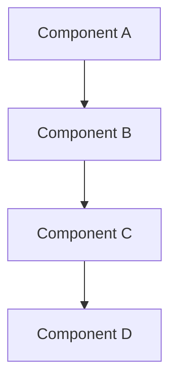
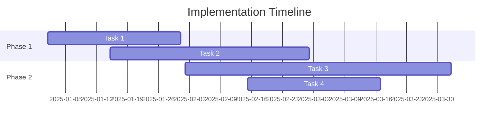

# Case Study

<!--
Template: Educational Content - case_study
Audience: Decision makers, potential users
Reading Time: 10-15 minutes
Generated: 2025-11-02
-->

## Abstract

Brief abstract summarizing the key findings and recommendations.

## Executive Summary

High-level overview of the content and its implications.

## Table of Contents

1. [Introduction](#introduction)
2. [Background](#background)
3. [Research Methodology](#research-methodology)
4. [Findings](#findings)
5. [Analysis](#analysis)
6. [Recommendations](#recommendations)
7. [Conclusion](#conclusion)
8. [References](#references)
9. [Appendices](#appendices)

## Introduction

### Purpose
The purpose of this [white paper/case study/documentation].

### Scope
What topics and areas are covered.

### Objectives
- Objective 1
- Objective 2
- Objective 3

### Target Audience
Decision makers, potential users

## Background

### Context
Background information and context for the topic.

### Current State
Description of the current state of the relevant domain.

### Problem Statement
Clear definition of the problem or research question.

### Significance
Why this research/study is important.

## Research Methodology

### Approach
Description of the research or analysis approach.

### Data Sources
- Source 1
- Source 2
- Source 3

### Analysis Framework
Description of the analytical framework used.

### Limitations
Acknowledgment of any limitations in the research.

## Findings

### Finding 1: [Key Finding]
**Description:** [Detailed description]

**Evidence:**
- Evidence point 1
- Evidence point 2
- Evidence point 3

**Implications:** [What this means]

### Finding 2: [Key Finding]
**Description:** [Detailed description]

**Evidence:**
- Evidence point 1
- Evidence point 2
- Evidence point 3

**Implications:** [What this means]

### Finding 3: [Key Finding]
**Description:** [Detailed description]

**Evidence:**
- Evidence point 1
- Evidence point 2
- Evidence point 3

**Implications:** [What this means]

## Analysis

### Trend Analysis
Analysis of trends and patterns identified.

### Comparative Analysis
Comparison with industry standards or alternatives.

### Risk Analysis
Assessment of risks and opportunities.

### Cost-Benefit Analysis
Where applicable, cost-benefit considerations.

## Case Studies

### Case Study 1: [Name]
**Context:** [Background]

**Implementation:** [How it was implemented]

**Results:** [What was achieved]

**Lessons Learned:** [Key takeaways]

### Case Study 2: [Name]
**Context:** [Background]

**Implementation:** [How it was implemented]

**Results:** [What was achieved]

**Lessons Learned:** [Key takeaways]

## Technical Deep Dive

### Architecture Overview


### Implementation Details
```csharp
// TODO: Add implementation example
public class TechnicalImplementation
{
    // Technical details
}
```

### Performance Considerations
- Consideration 1
- Consideration 2
- Consideration 3

## Recommendations

### Strategic Recommendations
1. **Recommendation 1**
   - Rationale: Why this is recommended
   - Implementation: How to implement
   - Expected Impact: What to expect

2. **Recommendation 2**
   - Rationale: Why this is recommended
   - Implementation: How to implement
   - Expected Impact: What to expect

3. **Recommendation 3**
   - Rationale: Why this is recommended
   - Implementation: How to implement
   - Expected Impact: What to expect

### Tactical Recommendations
1. **Immediate Actions (0-3 months)**
   - Action 1
   - Action 2

2. **Short-term Actions (3-6 months)**
   - Action 1
   - Action 2

3. **Long-term Actions (6+ months)**
   - Action 1
   - Action 2

### Implementation Roadmap



## Best Practices

### Do's
- ✅ Practice 1
- ✅ Practice 2
- ✅ Practice 3

### Don'ts
- ❌ Avoid 1
- ❌ Avoid 2
- ❌ Avoid 3

### Guidelines
- Guideline 1
- Guideline 2
- Guideline 3

## Tools and Resources

### Recommended Tools
- Tool 1: [Link and description]
- Tool 2: [Link and description]
- Tool 3: [Link and description]

### Additional Resources
- Resource 1
- Resource 2
- Resource 3

### Templates and Checklists
- [Implementation Checklist](link)
- [Decision Matrix](link)
- [ROI Calculator](link)

## Conclusion

### Summary
Brief summary of key points.

### Implications
What this means for the industry/organization.

### Future Research
Areas for future investigation.

### Call to Action
What readers should do next.

## References

1. [Reference 1](link)
2. [Reference 2](link)
3. [Reference 3](link)
4. [Reference 4](link)

## Appendices

### Appendix A: Detailed Data
[Detailed data tables or figures]

### Appendix B: Technical Specifications
[Detailed technical information]

### Appendix C: Additional Case Studies
[Additional examples]

### Appendix D: Survey/Questionnaire
[If applicable]

---

**Author:** [Author name]
**Reviewers:** [Reviewer names]
**Publication Date:** [Date]
**Version:** [Version number]

**Keywords:** case study, implementation, results, real world, success
**Categories:** #case #study #educational #research

<!-- Citation Format -->
<!-- For academic use: -->
<!-- [Last Name], [First Name]. "[Title]." TiXL Educational Series, [Date]. Web. -->

<!-- For business use: -->
<!-- TiXL Educational Content: [Title]. [Date]. [URL] -->

<!-- SEO -->
<meta name="description" content="In-depth [research/case study/analysis] on [topic] by TiXL">
<meta name="keywords" content="case study, implementation, results, real world, success">

<!-- Download Options -->
<!-- Add PDF download link -->
<!-- Add ePub download link -->
<!-- Add print-friendly version -->
