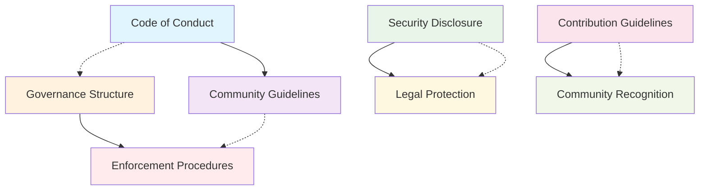

# TiXL Governance Documents Index

Welcome to the comprehensive governance documentation for the TiXL community. This index helps you navigate all essential governance documents that establish our community standards, processes, and protections.

## Quick Navigation

| Document | Purpose | For | Status |
|----------|---------|-----|--------|
| **[Code of Conduct](CODE_OF_CONDUCT.md)** | Community behavior standards | All community members | ✅ Active |
| **[Community Guidelines](COMMUNITY_GUIDELINES.md)** | Detailed community engagement rules | All community members | ✅ Active |
| **[Contribution Guidelines](CONTRIBUTION_GUIDELINES.md)** | Technical contribution process | Developers & contributors | ✅ Active |
| **[Governance Structure](GOVERNANCE_STRUCTURE.md)** | Project governance framework | Maintainers & leaders | ✅ Active |
| **[Security Disclosure Process](SECURITY_DISCLOSURE_PROCESS.md)** | Security vulnerability reporting | All community members | ✅ Active |
| **[Enforcement Procedures](ENFORCEMENT_PROCEDURES.md)** | Violation response and enforcement | Moderators & maintainers | ✅ Active |
| **[Legal Protection](LEGAL_PROTECTION.md)** | Legal protections and liability | All community members | ✅ Active |
| **[Community Recognition](COMMUNITY_RECOGNITION.md)** | Contributor acknowledgment program | All community members | ✅ Active |

## Document Overview

### 🎯 Code of Conduct
**Essential reading for all community members**
- Defines acceptable behavior standards
- Outlines enforcement process
- Provides contact information for violations
- Establishes safe community environment

### 🌟 Community Guidelines
**Comprehensive guide to community participation**
- Communication standards and best practices
- Detailed channel and space guidelines
- Content sharing and creation standards
- Event participation guidelines
- Conflict resolution procedures

### 💻 Contribution Guidelines  
**Technical contribution standards**
- Development environment setup
- Code style and architectural standards
- Pull request process and review
- Testing and quality requirements
- Documentation standards

### 🏛️ Governance Structure
**Project governance and decision-making**
- Roles and responsibilities
- Decision-making processes
- Issue management and escalation
- Release management procedures
- Community communication frameworks

### 🔒 Security Disclosure Process
**Responsible security vulnerability reporting**
- How to report security issues
- Response timeline and procedures
- Coordinated disclosure guidelines
- Security update notifications
- Safe harbor provisions

### ⚖️ Enforcement Procedures
**Violation response and community protection**
- Types of violations and severity levels
- Investigation and decision processes
- Enforcement actions and appeals
- Record keeping and transparency
- Prevention and education programs

### ⚖️ Legal Protection
**Legal considerations and project protections**
- License and copyright information
- Contributor agreements and protections
- Trademark usage guidelines
- Patent and warranty considerations
- Commercial use and liability

### 🏆 Community Recognition
**Contributor acknowledgment and appreciation**
- Recognition types and criteria
- Nomination and selection processes
- Benefits and opportunities
- Special programs and initiatives
- Success metrics and evaluation

## Getting Started with Governance

### For New Community Members
1. **Read First**: [Code of Conduct](CODE_OF_CONDUCT.md)
2. **Understand Community**: [Community Guidelines](COMMUNITY_GUIDELINES.md)
3. **If Contributing**: [Contribution Guidelines](CONTRIBUTION_GUIDELINES.md)
4. **Get Involved**: [Community Recognition](COMMUNITY_RECOGNITION.md)

### For Contributors
1. **Review Standards**: [Contribution Guidelines](CONTRIBUTION_GUIDELINES.md)
2. **Understand Process**: [Governance Structure](GOVERNANCE_STRUCTURE.md)
3. **Legal Awareness**: [Legal Protection](LEGAL_PROTECTION.md)
4. **Security Awareness**: [Security Disclosure Process](SECURITY_DISCLOSURE_PROCESS.md)

### For Maintainers and Leaders
1. **Full Documentation**: All documents
2. **Enforcement Training**: [Enforcement Procedures](ENFORCEMENT_PROCEDURES.md)
3. **Legal Understanding**: [Legal Protection](LEGAL_PROTECTION.md)
4. **Governance Leadership**: [Governance Structure](GOVERNANCE_STRUCTURE.md)

## Key Contact Information

### Primary Contacts
- **Community Questions**: community@tixl-project.org
- **Code of Conduct Issues**: conduct@tixl-project.org
- **Security Issues**: security@tixl-project.org
- **Legal Questions**: legal@tixl-project.org
- **Recognition Program**: recognition@tixl-project.org

### Emergency Contacts
- **Immediate Threats**: Contact any core maintainer directly
- **Critical Security**: security@tixl-project.org (24-hour response)
- **Harassment/Discrimination**: conduct@tixl-project.org (immediate response)

## Document Maintenance

### Review Schedule
- **Quarterly**: Operational effectiveness review
- **Annually**: Comprehensive update and revision
- **As Needed**: Based on community feedback and changing needs

### Version Control
- All documents maintained in Git repository
- Changes tracked with commit history
- Community notification for major updates
- Public feedback process for changes

### Contribution to Governance
- Governance documents themselves can be improved
- Community feedback always welcome
- RFC process applies to governance changes
- Community discussion and approval required

## External Resources

### Legal Resources
- [MIT License Text](https://opensource.org/licenses/MIT)
- [Open Source Legal Guide](https://opensource.guide/legal/)
- [Contributor License Agreements](https://www.clahub.com/)

### Community Management
- [Community Health Toolkit](https://docs.communityhealthtoolkit.org/)
- [Open Source Community Building](https://opensource.guide/building-community/)
- [Moderation Best Practices](https://opensource.guide/moderation/)

### Security Resources
- [Coordinated Vulnerability Disclosure](https://www.cvedetails.com/security-guidelines/)
- [Open Source Security Foundation](https://openssf.org/)
- [Security Disclosure Templates](https://www.bugcrowd.com/resource/what-is-a-bug-bounty/)

## Document Relationships

## Summary Statistics

### Current Governance Coverage
- ✅ **8 Core Documents**: Comprehensive governance coverage
- ✅ **All Major Areas**: Code, community, security, legal, recognition
- ✅ **Multiple Languages**: English primary, translation-friendly
- ✅ **Regular Review**: Established maintenance schedule
- ✅ **Community Feedback**: Open improvement process

### Community Impact
- **Clear Expectations**: Everyone knows what's expected
- **Safe Environment**: Protected from harassment and abuse
- **Fair Process**: Transparent enforcement and appeals
- **Legal Protection**: Understand rights and responsibilities
- **Recognition Culture**: Celebrate and encourage contributions

---

## Need Help?

If you can't find what you're looking for or need clarification on any governance matter:

1. **Check this index** for the right document
2. **Contact community team**: community@tixl-project.org
3. **Ask in Discord**: #community-guidelines channel
4. **Open GitHub discussion**: For community-wide questions

*This governance framework represents our commitment to building and maintaining an excellent open-source community. Thank you for being part of making TiXL better for everyone.*