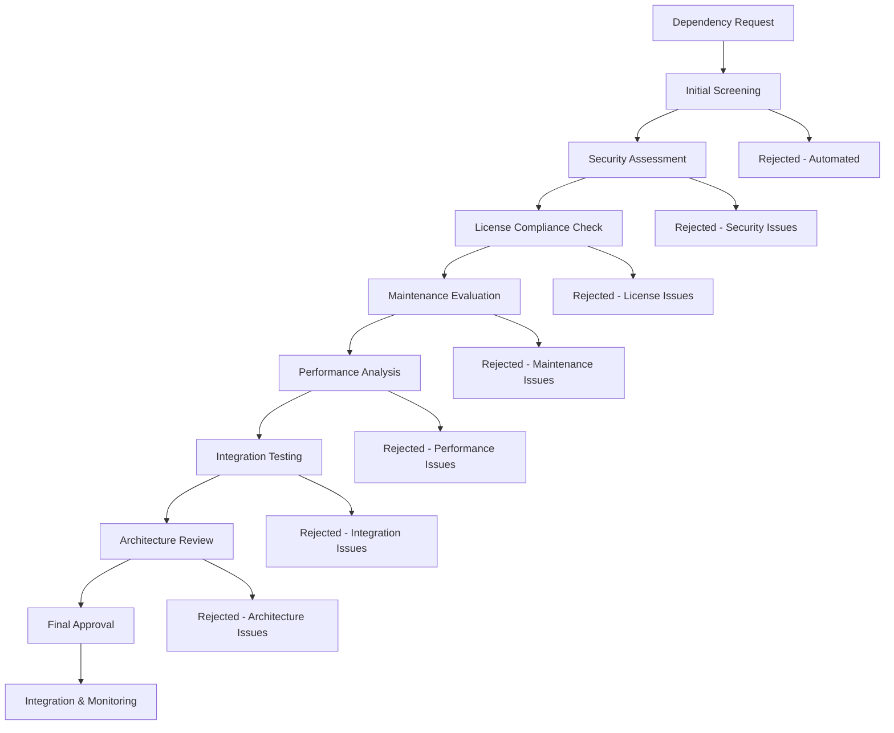

# TiXL Dependency Vetting Process (TIXL-015)

## 📋 Overview

This document defines the comprehensive vetting process for all new third-party dependencies in the TiXL project. The process ensures that new dependencies meet TiXL's security, compliance, maintenance, and quality standards before integration.

## 🎯 Objectives

- **Security First**: Prevent introduction of vulnerable packages
- **License Compliance**: Ensure all dependencies comply with TiXL's licensing policy
- **Quality Assurance**: Verify dependencies meet TiXL's quality standards
- **Maintenance Assurance**: Confirm long-term maintainability of dependencies
- **Supply Chain Security**: Protect against supply chain attacks
- **Performance Impact**: Evaluate performance implications of new dependencies

## 📊 Process Overview



## 🔄 Workflow Stages

### Stage 1: Initial Screening (Automated)
**Duration**: 5 minutes  
**Owner**: Automated System  
**Tool**: `dependency-vetting-screener.ps1`

#### Checklist
- [ ] Package exists on official NuGet repository
- [ ] Package has minimum 100 downloads
- [ ] Package was updated within last 2 years
- [ ] Package has semantic versioning
- [ ] Package size < 50MB (unless justified)
- [ ] No obvious naming conflicts with existing dependencies

#### Automation Criteria
```json
{
  "minimumDownloads": 100,
  "maxAgeMonths": 24,
  "maxPackageSizeMB": 50,
  "requiredSemVer": true,
  "requiredOfficialRepo": true
}
```

### Stage 2: Security Assessment (Automated + Manual Review)
**Duration**: 30 minutes  
**Owner**: Security Team + Automated  
**Tool**: `dependency-security-assessor.ps1`

#### Automated Security Checks
- [ ] CVE database scan (Critical/High vulnerabilities)
- [ ] GitHub Security Advisories check
- [ ] National Vulnerability Database (NVD) scan
- [ ] Known vulnerability pattern matching
- [ ] Package signature verification
- [ ] Dependency chain vulnerability analysis

#### Manual Security Review
- [ ] Review of security track record
- [ ] Assessment of security response time
- [ ] Evaluation of security disclosure process
- [ ] Review of security-focused code changes
- [ ] Analysis of dependency chain security

#### Security Thresholds
```json
{
  "criticalVulnerabilities": 0,
  "highVulnerabilities": 0,
  "mediumVulnerabilities": 2,
  "lowVulnerabilities": 10,
  "maxCVSSScore": 7.0,
  "vulnerabilityAgeLimitDays": 365
}
```

### Stage 3: License Compliance Check (Automated + Legal Review)
**Duration**: 15 minutes  
**Owner**: Legal Team + Automated  
**Tool**: `dependency-license-checker.ps1`

#### Automated License Checks
- [ ] License type identification
- [ ] License compatibility with TiXL's MIT license
- [ ] License policy compliance
- [ ] Attribution requirements analysis
- [ ] License conflict detection

#### License Categories
```json
{
  "approved": ["MIT", "Apache-2.0", "BSD-2-Clause", "BSD-3-Clause", "ISC"],
  "conditional": ["GPL-3.0", "LGPL-3.0", "MPL-2.0"],
  "prohibited": ["AGPL-3.0", "SSPL-1.0", "Proprietary", "Unknown"],
  "reviewRequired": ["EPL-2.0", "CDDL-1.0", "Artistic-2.0"]
}
```

#### Manual License Review
- [ ] Legal team review for conditional licenses
- [ ] Attribution requirement documentation
- [ ] License compatibility assessment
- [ ] Commercial use implications

### Stage 4: Maintenance Status Evaluation (Automated + Manual Analysis)
**Duration**: 20 minutes  
**Owner**: Technical Lead + Automated  
**Tool**: `dependency-maintenance-analyzer.ps1`

#### Automated Maintenance Metrics
- [ ] GitHub repository activity (commits, issues, PRs)
- [ ] Release frequency and consistency
- [ ] Issue response time analysis
- [ ] Contributor activity and diversity
- [ ] Documentation completeness
- [ ] Test coverage metrics

#### Maintenance Scoring Criteria
```json
{
  "metrics": {
    "lastCommitDays": {"weight": 0.2, "maxDays": 180},
    "releaseFrequency": {"weight": 0.2, "minReleasesPerYear": 2},
    "issueResponseTime": {"weight": 0.15, "maxDays": 14},
    "contributorCount": {"weight": 0.1, "minContributors": 2},
    "documentationScore": {"weight": 0.15, "minScore": 0.7},
    "testCoverage": {"weight": 0.2, "minCoverage": 0.6}
  },
  "minimumScore": 70,
  "preferredScore": 85
}
```

#### Manual Maintenance Review
- [ ] Community health assessment
- [ ] Long-term viability evaluation
- [ ] Alternative package analysis
- [ ] Migration path planning

### Stage 5: Performance Analysis (Automated + Manual Assessment)
**Duration**: 45 minutes  
**Owner**: Performance Team + Automated  
**Tool**: `dependency-performance-analyzer.ps1`

#### Automated Performance Checks
- [ ] Package size and dependency tree impact
- [ ] Runtime performance benchmark
- [ ] Memory usage analysis
- [ ] Startup time impact assessment
- [ ] Binary size increase measurement

#### Performance Benchmarks
```json
{
  "metrics": {
    "packageSizeMB": {"max": 10, "warning": 5},
    "dependencyTreeDepth": {"max": 5, "warning": 3},
    "runtimeOverheadMs": {"max": 100, "warning": 50},
    "memoryOverheadMB": {"max": 50, "warning": 20},
    "startupImpactMs": {"max": 200, "warning": 100}
  }
}
```

#### Manual Performance Review
- [ ] Benchmark against alternatives
- [ ] Architecture impact assessment
- [ ] Scalability implications
- [ ] Resource consumption evaluation

### Stage 6: Integration Testing (Automated + Manual Testing)
**Duration**: 2 hours  
**Owner**: QA Team + Automated  
**Tool**: `dependency-integration-tester.ps1`

#### Automated Integration Tests
- [ ] Build integration test
- [ ] Unit test compatibility
- [ ] Cross-platform compatibility (Windows, Linux, macOS)
- [ ] Framework compatibility (.NET 8+, .NET 9+)
- [ ] Regression test suite execution

#### Manual Integration Testing
- [ ] Feature compatibility testing
- [ ] End-to-end workflow testing
- [ ] Developer experience evaluation
- [ ] Documentation validation
- [ ] Migration script testing

### Stage 7: Architecture Review (Manual)
**Duration**: 30 minutes  
**Owner**: Architecture Team  
**Tool**: Architecture Review Checklist

#### Architecture Review Criteria
- [ ] Alignment with TiXL's architectural principles
- [ ] API design consistency
- [ ] Dependency coupling assessment
- [ ] Circular dependency prevention
- [ ] Future extensibility considerations
- [ ] Security architecture alignment
- [ ] Performance architecture compatibility

#### Architecture Review Scorecard
```json
{
  "criteria": {
    "principleAlignment": {"weight": 0.25, "minScore": 3},
    "apiConsistency": {"weight": 0.2, "minScore": 3},
    "couplingLevel": {"weight": 0.2, "maxScore": 2},
    "extensibility": {"weight": 0.15, "minScore": 3},
    "securityAlignment": {"weight": 0.1, "minScore": 3},
    "performanceCompatibility": {"weight": 0.1, "minScore": 3}
  },
  "scoringScale": [1, 2, 3, 4, 5],
  "minimumPassingScore": 3.5
}
```

### Stage 8: Final Approval (Manual)
**Duration**: 15 minutes  
**Owner**: Technical Steering Committee  
**Tool**: Approval Workflow System

#### Approval Decision Matrix
```json
{
  "approvalCriteria": {
    "securityScore": {"min": 95, "weight": 0.3},
    "licenseCompliance": {"required": true, "weight": 0.2},
    "maintenanceScore": {"min": 70, "weight": 0.2},
    "performanceScore": {"min": 80, "weight": 0.15},
    "integrationScore": {"min": 85, "weight": 0.1},
    "architectureScore": {"min": 3.5, "weight": 0.05}
  },
  "finalApprovalRequired": true,
  "vetoPower": ["Security Team", "Architecture Team"]
}
```

#### Approval Workflow
1. **Automated Report Generation**: All scores compiled into comprehensive report
2. **Steering Committee Review**: 5 business days for review
3. **Decision Recording**: Approval/rejection with detailed rationale
4. **Documentation Update**: Approved dependencies added to registry
5. **Communication**: Stakeholder notification of decision

### Stage 9: Integration & Monitoring (Automated + Manual)
**Duration**: Ongoing  
**Owner**: DevOps Team + Automated  
**Tool**: `dependency-monitoring-system.ps1`

#### Integration Process
- [ ] Package addition to TiXL.sln
- [ ] Update of dependency manifest
- [ ] Documentation updates
- [ ] CI/CD pipeline updates
- [ ] Monitoring dashboard integration

#### Ongoing Monitoring
- [ ] Daily security vulnerability scanning
- [ ] Weekly dependency health reports
- [ ] Monthly maintenance status updates
- [ ] Quarterly dependency review
- [ ] Annual comprehensive audit

## 📝 Documentation Templates

### Dependency Request Form
```markdown
# Dependency Request Form

## Basic Information
- **Package Name**: 
- **Version**: 
- **Source**: (NuGet/GitHub/Other)
- **Requested By**: 
- **Request Date**: 
- **Business Justification**: 

## Technical Details
- **Purpose**: 
- **Alternative Considered**: 
- **Usage Scope**: (Core/Optional/Development)
- **Expected Impact**: 
- **Migration Plan**: (if replacing existing)

## Risk Assessment
- **Security Risk Level**: (Low/Medium/High/Critical)
- **License Risk Level**: (Low/Medium/High)
- **Maintenance Risk Level**: (Low/Medium/High)
- **Performance Risk Level**: (Low/Medium/High)

## Sign-offs
- [ ] Requestor
- [ ] Technical Lead
- [ ] Security Team
- [ ] Architecture Team
- [ ] Steering Committee
```

### Vetting Report Template
```markdown
# Dependency Vetting Report

## Executive Summary
- **Package**: 
- **Version**: 
- **Overall Status**: (APPROVED/CONDITIONALLY APPROVED/REJECTED)
- **Risk Score**: /100
- **Recommendation**: 

## Detailed Assessment

### Security Assessment
- **CVE Count**: 
- **CVSS Score**: 
- **Security Rating**: /100
- **Issues Found**: 
- **Mitigations**: 

### License Compliance
- **License Type**: 
- **Compliance Status**: 
- **Attribution Required**: 
- **Legal Review**: 

### Maintenance Analysis
- **Maintenance Score**: /100
- **Last Update**: 
- **Release Frequency**: 
- **Community Health**: 
- **Long-term Viability**: 

### Performance Impact
- **Package Size**: 
- **Performance Rating**: /100
- **Resource Impact**: 
- **Benchmark Results**: 

### Integration Testing
- **Build Status**: 
- **Test Results**: 
- **Compatibility**: 
- **Known Issues**: 

### Architecture Review
- **Architecture Score**: /5
- **Alignment**: 
- **Coupling**: 
- **Extensibility**: 

## Decision
- **Final Decision**: 
- **Approval Conditions**: 
- **Review Date**: 
- **Next Review**: 
```

## 🤖 Automated Tools

### 1. Dependency Vetting Screener
**File**: `docs/scripts/dependency-vetting-screener.ps1`  
**Purpose**: Initial automated screening of dependency requests

### 2. Security Vulnerability Scanner
**File**: `docs/scripts/dependency-security-assessor.ps1`  
**Purpose**: Comprehensive security vulnerability assessment

### 3. License Compliance Checker
**File**: `docs/scripts/dependency-license-checker.ps1`  
**Purpose**: Automated license compatibility analysis

### 4. Maintenance Status Analyzer
**File**: `docs/scripts/dependency-maintenance-analyzer.ps1`  
**Purpose**: Maintenance and community health evaluation

### 5. Performance Impact Analyzer
**File**: `docs/scripts/dependency-performance-analyzer.ps1`  
**Purpose**: Performance impact assessment and benchmarking

### 6. Integration Testing Suite
**File**: `docs/scripts/dependency-integration-tester.ps1`  
**Purpose**: Automated integration testing and compatibility verification

### 7. Dependency Registry Manager
**File**: `docs/scripts/dependency-registry-manager.ps1`  
**Purpose**: Manage approved dependency registry and monitoring

## 📊 Metrics and KPIs

### Process Metrics
- **Average Vetting Time**: Target < 4 hours
- **Approval Rate**: Target 70-80%
- **Security Rejection Rate**: Target >90% of vulnerable packages
- **False Positive Rate**: Target <5%

### Quality Metrics
- **Post-Integration Issues**: Target <2 per quarter
- **Dependency Health Score**: Target >85
- **Security Incident Rate**: Target 0 critical incidents
- **License Compliance Rate**: Target 100%

### Efficiency Metrics
- **Automation Coverage**: Target >80%
- **Manual Review Time**: Target <2 hours per dependency
- **Re-vetting Rate**: Target <5% (due to new issues)
- **Stakeholder Satisfaction**: Target >4.5/5

## 🚨 Emergency Procedures

### Critical Security Vulnerability Discovery
1. **Immediate Action** (0-4 hours)
   - Automated alert to Security Team
   - Dependency isolation if possible
   - Risk assessment and mitigation planning

2. **Short-term Response** (4-24 hours)
   - Emergency steering committee meeting
   - Mitigation implementation or dependency removal
   - Stakeholder communication

3. **Long-term Response** (1-7 days)
   - Process review and improvement
   - Policy updates if necessary
   - Lessons learned documentation

### License Compliance Issues
1. **Detection** (Automated daily scan)
2. **Assessment** (Legal team review)
3. **Mitigation** (License compliance or replacement)
4. **Documentation** (Update processes and policies)

## 📅 Review and Update Schedule

### Regular Reviews
- **Weekly**: Vetting process metrics review
- **Monthly**: Process effectiveness assessment
- **Quarterly**: Policy and criteria update
- **Annually**: Comprehensive process review and major updates

### Continuous Improvement
- **Feedback Collection**: From all stakeholders
- **Process Analytics**: Data-driven improvements
- **Tool Updates**: Regular tool and automation updates
- **Training**: Regular training for review teams

## 🎯 Success Criteria

### Short-term (3 months)
- [ ] All new dependencies go through vetting process
- [ ] Zero critical security incidents from new dependencies
- [ ] 90% automation coverage for screening
- [ ] Average vetting time <4 hours

### Medium-term (6 months)
- [ ] Established dependency health monitoring
- [ ] Proactive update recommendations system
- [ ] Stakeholder satisfaction >4.5/5
- [ ] Process metrics show continuous improvement

### Long-term (12 months)
- [ ] Predictive dependency risk assessment
- [ ] Automated dependency lifecycle management
- [ ] Industry-leading dependency security posture
- [ ] Comprehensive dependency optimization

## 📞 Contact Information

### Process Owners
- **Primary Owner**: Technical Steering Committee
- **Security Review**: Security Team Lead
- **Architecture Review**: Chief Architect
- **Legal Review**: Legal Counsel
- **Process Management**: DevOps Team Lead

### Escalation Contacts
- **Security Issues**: security@tixl.dev
- **Architecture Issues**: architecture@tixl.dev
- **Legal Issues**: legal@tixl.dev
- **Process Issues**: devops@tixl.dev

---

**Document Version**: 1.0  
**Last Updated**: 2025-11-02  
**Next Review**: 2025-02-02  
**Owner**: Technical Steering Committee  
**Classification**: Internal Use  
