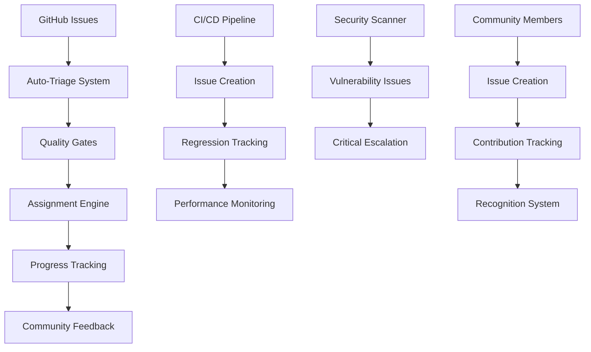

# TiXL Comprehensive Issue Management Guidelines

## Overview

This document provides comprehensive guidelines for the TiXL issue management system, establishing standards for bug tracking, feature requests, and community contributions. The system is built around GitHub Issues and integrates seamlessly with our CI/CD pipeline, architectural governance, and development workflow.

## Table of Contents

1. [System Architecture](#system-architecture)
2. [Issue Lifecycle](#issue-lifecycle)
3. [Quality Standards](#quality-standards)
4. [Community Guidelines](#community-guidelines)
5. [Maintainer Responsibilities](#maintainer-responsibilities)
6. [Automation and Tools](#automation-and-tools)
7. [Best Practices](#best-practices)
8. [Troubleshooting](#troubleshooting)

## System Architecture

### Core Components

### Integration Points

The TiXL issue management system integrates with:

- **GitHub Issues**: Primary issue tracking interface
- **CI/CD Pipeline**: Automated issue creation from failures
- **Security Scanning**: Vulnerability detection and reporting
- **Performance Monitoring**: Regression detection and tracking
- **Community Platforms**: Discord, forums, and social media
- **Documentation**: Knowledge base and troubleshooting guides

## Issue Lifecycle

### Phase 1: Creation and Intake

#### Issue Submission
1. **User Action**: Community member creates issue using appropriate template
2. **Auto-Response**: System acknowledges receipt and provides initial guidance
3. **Auto-Triage**: Automated system classifies issue and applies initial labels
4. **Queue Assignment**: Issue enters triage queue based on priority and complexity

#### Initial Classification
- **Type Detection**: Bug, feature request, documentation, security, performance
- **Module Assignment**: Core, Operators, Gfx, Gui, Editor
- **Priority Estimation**: Critical, High, Medium, Low
- **Complexity Assessment**: Simple, Medium, Complex

### Phase 2: Triage and Assessment

#### Triage Process
1. **Quality Validation**: Ensure issue meets minimum quality standards
2. **Duplicate Detection**: Search for similar existing issues
3. **Information Gap Analysis**: Identify missing details needed for resolution
4. **Technical Assessment**: Evaluate feasibility and scope
5. **Priority Confirmation**: Validate or adjust priority based on impact

#### Triage Outcomes
- **Accept**: Issue accepted for development
- **Request More Info**: Need additional details from reporter
- **Duplicate**: Merge with existing issue or close
- **Invalid**: Not a valid issue or outside scope
- **Escalate**: Requires higher-level decision

### Phase 3: Planning and Assignment

#### Assignment Criteria
- **Module Expertise**: Match assignee to their areas of knowledge
- **Workload Balance**: Consider current assignments and availability
- **Development Priority**: Align with team and project priorities
- **Community Opportunity**: Encourage community contributions

#### Planning Integration
- **Milestone Assignment**: Add to appropriate release milestone
- **Sprint Planning**: Include in development sprint planning
- **Resource Allocation**: Assign development time and resources
- **Timeline Estimation**: Provide realistic completion estimates

### Phase 4: Development and Progress

#### Development Workflow
1. **Issue Assignment**: Developer accepts responsibility
2. **Progress Updates**: Regular status updates using labels
3. **Community Communication**: Maintain dialogue with issue reporter
4. **Code Integration**: Follow standard development workflow
5. **Testing and Validation**: Ensure fix meets requirements

#### Progress Tracking
- **Status Labels**: Track current state (in-progress, needs-review, blocked)
- **Progress Comments**: Regular updates on development status
- **Milestone Updates**: Track progress toward release goals
- **Quality Assurance**: Ensure fixes meet quality standards

### Phase 5: Resolution and Closure

#### Resolution Process
1. **Implementation Complete**: Code changes implemented and tested
2. **Quality Gates**: Pass all required CI/CD quality checks
3. **Community Validation**: Confirm fix addresses the original issue
4. **Documentation Updates**: Update relevant documentation if needed
5. **Issue Closure**: Mark issue as resolved with explanation

#### Closure Validation
- **Fix Verification**: Confirm the issue is actually resolved
- **Regression Testing**: Ensure no new issues introduced
- **Community Feedback**: Verify reporter satisfaction
- **Documentation**: Ensure all relevant docs are updated

### Phase 6: Post-Closure

#### Follow-up Activities
- **Monitoring**: Watch for reoccurrence or related issues
- **Community Communication**: Thank contributor and provide closure details
- **Knowledge Capture**: Document lessons learned
- **Process Improvement**: Identify areas for system enhancement

## Quality Standards

### Issue Report Quality

#### Required Elements for Bug Reports
- **Clear Description**: What is the problem?
- **Reproduction Steps**: How to recreate the issue
- **Expected Behavior**: What should happen instead
- **Environment Details**: OS, TiXL version, hardware, etc.
- **Error Information**: Messages, logs, screenshots

#### Required Elements for Feature Requests
- **Problem Statement**: What problem does this solve?
- **Use Case**: When and how would this be used?
- **Proposed Solution**: What functionality is requested?
- **Alternatives Considered**: Other approaches evaluated
- **Impact Assessment**: Benefits and considerations

#### Quality Indicators
- **Completeness**: All required sections filled
- **Clarity**: Easy to understand the issue
- **Reproducibility**: Clear steps to reproduce or implement
- **Relevance**: Within TiXL scope and architecture
- **Value**: Provides benefit to users or project

### Triage Quality Standards

#### Response Time Targets
- **Critical Issues**: 1-4 hours
- **High Priority**: 4-24 hours
- **Medium Priority**: 1-3 days
- **Low Priority**: 1-2 weeks

#### Classification Accuracy
- **Type Classification**: >95% accuracy
- **Priority Assignment**: >90% accuracy
- **Module Assignment**: >95% accuracy
- **Duplicate Detection**: >85% accuracy

### Resolution Quality

#### Development Standards
- **Code Quality**: Must pass all CI/CD quality gates
- **Testing Coverage**: Adequate tests for all changes
- **Documentation**: Updated docs for user-facing changes
- **Performance**: No regression in performance benchmarks
- **Security**: No security vulnerabilities introduced

#### Communication Standards
- **Regular Updates**: Progress updates every 1-2 weeks
- **Clear Explanations**: Technical details explained clearly
- **Community Engagement**: Respectful and helpful communication
- **Feedback Integration**: Consider community input and suggestions

## Community Guidelines

### For Issue Reporters

#### Before Creating an Issue
1. **Search First**: Check existing issues to avoid duplicates
2. **Check Documentation**: Review relevant documentation and guides
3. **Try Troubleshooting**: Attempt basic troubleshooting steps
4. **Gather Information**: Collect environment details and error information

#### Creating a Good Issue
1. **Choose Appropriate Template**: Use the right template for your issue type
2. **Provide Complete Information**: Fill out all required sections
3. **Include Specific Details**: Be as specific as possible about the issue
4. **Attach Relevant Files**: Include logs, screenshots, or minimal reproduction cases
5. **Follow Up**: Respond to questions and provide additional information as needed

#### Issue Maintenance
1. **Monitor Responses**: Check for updates and respond promptly
2. **Provide Additional Context**: Share new information as it becomes available
3. **Test Solutions**: Verify proposed fixes work as expected
4. **Close When Resolved**: Confirm issue is resolved and mark as closed

### For Contributors

#### Issue Participation
1. **Start Small**: Begin with `good-first-issue` labels
2. **Ask Questions**: Seek clarification if requirements are unclear
3. **Propose Solutions**: Suggest approaches and implementation ideas
4. **Follow Standards**: Adhere to coding standards and contribution guidelines
5. **Communicate Progress**: Keep issue updated with development progress

#### Code Contributions
1. **Fork and Branch**: Create feature branches for issue work
2. **Write Tests**: Include tests for new functionality and bug fixes
3. **Update Documentation**: Keep documentation current with changes
4. **Follow Git Workflow**: Use proper commit messages and branch naming
5. **Submit PRs**: Create pull requests linked to the original issue

### For Maintainers

#### Issue Management
1. **Respond Promptly**: Address new issues within target timeframes
2. **Triage Thoroughly**: Provide comprehensive initial assessment
3. **Assign Appropriately**: Match issues to team members' expertise
4. **Communicate Clearly**: Provide clear guidance and expectations
5. **Monitor Progress**: Track issue progress and provide support

#### Community Leadership
1. **Welcome Newcomers**: Help new community members get started
2. **Encourage Participation**: Recognize and encourage contributions
3. **Provide Guidance**: Offer help and mentorship to contributors
4. **Maintain Standards**: Ensure quality while being supportive
5. **Lead by Example**: Model good issue management practices

## Maintainer Responsibilities

### Triage Team

#### Daily Responsibilities
- Review new issues in triage queue
- Respond to urgent issues (critical/high priority)
- Update issue statuses and priorities
- Assign issues to appropriate team members
- Communicate with issue reporters

#### Weekly Responsibilities
- Analyze triage metrics and trends
- Review stale issues and follow up
- Update triage process documentation
- Train new triage team members
- Plan triage process improvements

#### Monthly Responsibilities
- Generate comprehensive triage reports
- Review and update triage guidelines
- Analyze community feedback
- Plan process improvements
- Coordinate with development team

### Module Experts

#### Technical Responsibilities
- Provide technical assessment for their modules
- Review and approve architectural changes
- Mentor contributors in their area of expertise
- Maintain technical documentation
- Coordinate with other module experts

#### Quality Assurance
- Ensure code changes meet architectural standards
- Review and approve complex changes
- Maintain testing standards for their modules
- Monitor performance and security for their areas
- Coordinate release planning for their modules

### Leadership Team

#### Strategic Responsibilities
- Define project priorities and roadmap
- Resolve conflicts and escalations
- Make architectural decisions
- Coordinate with external stakeholders
- Represent project to the community

#### Process Management
- Maintain issue management standards
- Coordinate between different teams
- Resolve process conflicts
- Plan process improvements
- Ensure quality and consistency

## Automation and Tools

### GitHub Actions Workflows

#### Auto-Triage System
- **Trigger**: New issue created or edited
- **Actions**: Classify issue, apply labels, assign, respond
- **Features**: 
  - Type detection using keyword analysis
  - Module classification based on content
  - Priority estimation using impact assessment
  - Auto-assignment based on expertise
  - Community-friendly responses

#### CI/CD Integration
- **Trigger**: Code changes, scheduled scans, failure detection
- **Actions**: Create issues, link PRs, track regressions
- **Features**:
  - Automated issue creation from CI failures
  - Performance regression detection
  - Security vulnerability reporting
  - Test failure categorization
  - Quality gate status tracking

#### Progress Tracking
- **Trigger**: Scheduled runs, milestone updates, issue state changes
- **Actions**: Generate reports, update metrics, track progress
- **Features**:
  - Weekly issue reports
  - Monthly comprehensive summaries
  - Progress toward goals tracking
  - Performance metrics monitoring
  - Community engagement tracking

### Integration Tools

#### External Integrations
- **Discord Bot**: Issue notifications and status updates
- **Documentation System**: Auto-generated troubleshooting guides
- **Analytics Platform**: Issue metrics and trend analysis
- **Communication Tools**: Team notification and coordination

#### Custom Tools
- **Architectural Validator**: Ensures issue solutions respect boundaries
- **Performance Monitor**: Tracks and reports performance changes
- **Security Scanner**: Automated vulnerability detection
- **Community Engagement**: Tracks and rewards contributions

### Dashboard and Reporting

#### Issue Management Dashboard
- **Real-time Metrics**: Open issues, response times, resolution rates
- **Priority Breakdown**: Issues by priority and expected resolution times
- **Team Workload**: Assignment distribution and capacity planning
- **Community Contributions**: Community member participation tracking

#### Analytics and Insights
- **Trend Analysis**: Issue patterns and project health indicators
- **Predictive Analytics**: Resource planning and bottleneck identification
- **Quality Metrics**: Issue quality and resolution effectiveness
- **Community Engagement**: Participation rates and contributor satisfaction

## Best Practices

### Issue Creation Best Practices

#### For Reporters
1. **Be Specific**: Provide detailed, actionable information
2. **Use Templates**: Choose the appropriate issue template
3. **Include Context**: Explain the background and use case
4. **Attach Evidence**: Include logs, screenshots, or reproduction cases
5. **Follow Up**: Respond to questions and provide updates

#### For Contributors
1. **Understand Scope**: Ensure proposed changes align with project goals
2. **Consider Architecture**: Respect TiXL's modular design principles
3. **Plan Implementation**: Think through approach before starting
4. **Communicate Early**: Discuss complex changes before implementation
5. **Test Thoroughly**: Ensure changes work and don't break existing functionality

### Triage Best Practices

#### Efficiency Guidelines
1. **Batch Processing**: Handle similar issues together
2. **Use Templates**: Standardize responses and processes
3. **Automate Where Possible**: Leverage automation for routine tasks
4. **Track Metrics**: Monitor performance and quality indicators
5. **Continuous Improvement**: Regular process refinement

#### Quality Guidelines
1. **Thorough Assessment**: Don't rush triage decisions
2. **Consider Context**: Factor in project priorities and constraints
3. **Communicate Reasoning**: Explain triage decisions clearly
4. **Escalate Appropriately**: Don't hesitate to escalate complex issues
5. **Learn from Mistakes**: Use errors as learning opportunities

### Resolution Best Practices

#### Development Workflow
1. **Clear Planning**: Understand requirements before implementation
2. **Incremental Progress**: Break large changes into smaller steps
3. **Regular Communication**: Keep stakeholders informed of progress
4. **Quality Focus**: Maintain high standards throughout development
5. **Community Integration**: Involve community in design and testing

#### Code Quality
1. **Follow Standards**: Adhere to TiXL coding conventions
2. **Write Tests**: Include comprehensive test coverage
3. **Document Changes**: Update relevant documentation
4. **Consider Performance**: Monitor and optimize performance impact
5. **Security Conscious**: Consider security implications of changes

### Community Engagement Best Practices

#### Communication Guidelines
1. **Be Welcoming**: Make newcomers feel valued and supported
2. **Be Patient**: Understand different skill levels and backgrounds
3. **Be Constructive**: Provide helpful feedback and guidance
4. **Be Responsive**: Address questions and concerns promptly
5. **Be Appreciative**: Recognize and thank contributions

#### Recognition and Encouragement
1. **Acknowledge Contributions**: Publicly recognize helpful contributions
2. **Provide Growth Opportunities**: Help contributors develop skills
3. **Create Pathways**: Offer clear advancement opportunities
4. **Share Success**: Highlight community achievements
5. **Maintain Standards**: Balance encouragement with quality requirements

## Troubleshooting

### Common Issues and Solutions

#### Triage Issues

**Issue: Misclassified Issues**
- **Symptoms**: Wrong type, priority, or module labels
- **Causes**: Insufficient information, complex issues, automated classification errors
- **Solutions**: 
  - Review and correct labels manually
  - Improve auto-classification rules
  - Provide more context in templates
  - Train triage team on edge cases

**Issue: Duplicate Issues**
- **Symptoms**: Multiple reports of same problem
- **Causes**: Poor search, existing issues not easily found, unclear resolution status
- **Solutions**:
  - Improve search functionality and guidance
  - Better issue linking and cross-referencing
  - Clear closure communication
  - Duplicate detection automation

**Issue: Slow Triage Response**
- **Symptoms**: Issues sitting in triage queue too long
- **Causes**: Insufficient triage resources, complex issues, process bottlenecks
- **Solutions**:
  - Increase triage team capacity
  - Improve triage process efficiency
  - Better workload distribution
  - Automation of routine tasks

#### Community Issues

**Issue: Low Community Participation**
- **Symptoms**: Few community contributions, mostly internal development
- **Causes**: Unclear contribution guidelines, intimidating issue complexity, insufficient recognition
- **Solutions**:
  - Create more `good-first-issue` opportunities
  - Improve contribution documentation
  - Better community engagement and recognition
  - Simplify contribution processes

**Issue: Quality Concerns**
- **Symptoms**: Poor quality issues, incomplete reports, unclear requirements
- **Causes**: Insufficient guidance, unclear templates, lack of feedback
- **Solutions**:
  - Improve issue templates and guidance
  - Provide better examples and tutorials
  - Offer feedback on issue quality
  - Community education and training

#### Process Issues

**Issue: Inconsistent Standards**
- **Symptoms**: Different approaches to similar issues, inconsistent quality
- **Causes**: Unclear guidelines, insufficient training, lack of enforcement
- **Solutions**:
  - Clarify and document standards
  - Provide regular training and updates
  - Implement quality checks and reviews
  - Regular process audits and improvements

**Issue: Tool Integration Problems**
- **Symptoms**: Automation failures, integration errors, data inconsistencies
- **Causes**: System changes, configuration issues, compatibility problems
- **Solutions**:
  - Regular system monitoring and maintenance
  - Comprehensive testing of automation
  - Fallback procedures for failures
  - Regular updates and improvements

### Getting Help

#### For Issues with the Issue Management System
1. **Check Documentation**: Review this guide and related documentation
2. **Ask in Discussions**: Use GitHub Discussions for process questions
3. **Contact Maintainers**: Reach out to triage team or maintainers
4. **Provide Feedback**: Suggest improvements to the process

#### For Technical Issues
1. **Review Error Logs**: Check GitHub Actions logs and system outputs
2. **Test Locally**: Reproduce issues in development environment
3. **Debugging Tools**: Use diagnostic tools and monitoring systems
4. **Community Support**: Ask for help in Discord or forums

#### For Process Questions
1. **Read Guidelines**: Review all documentation thoroughly
2. **Ask Questions**: Don't hesitate to ask for clarification
3. **Share Experiences**: Discuss issues with other community members
4. **Suggest Improvements**: Propose enhancements to the process

---

## Conclusion

The TiXL issue management system is designed to be comprehensive, efficient, and community-focused while maintaining high quality standards. Success depends on:

1. **Community Engagement**: Active participation from all community members
2. **Quality Standards**: Consistent adherence to established guidelines
3. **Continuous Improvement**: Regular review and enhancement of processes
4. **Technology Integration**: Effective use of automation and tooling
5. **Clear Communication**: Transparent and helpful interaction with all stakeholders

By following these guidelines and working together as a community, we can maintain an effective issue management system that supports the continued growth and success of TiXL.

For questions or suggestions about this issue management system, please use GitHub Discussions or contact the maintainers team.

---

**Document Version**: 1.0  
**Last Updated**: 2025-11-02  
**Maintained By**: TiXL Maintainers Team  
**Review Schedule**: Quarterly