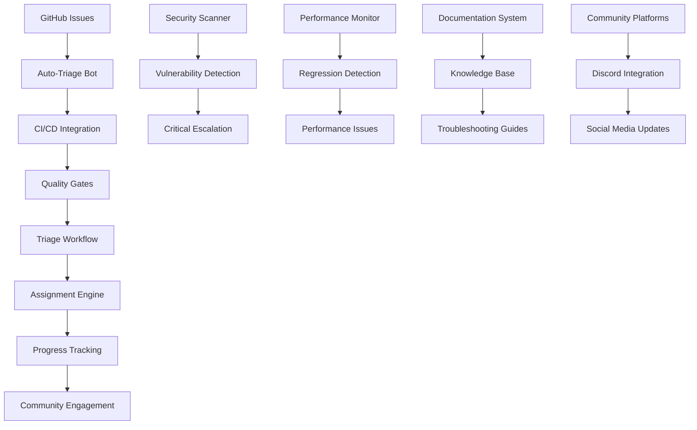

# TIXL-050 Bug Tracking Standardization - Complete Documentation Index

## 📋 Task Overview

**Task ID**: TIXL-050  
**Task Title**: Standardize Bug Tracking  
**Implementation Date**: November 2, 2025  
**Status**: ✅ **COMPLETE**

## 🎯 System Summary

The TIXL-050 standardization establishes a comprehensive, scalable bug tracking and issue management system for the TiXL project. The system is built around GitHub Issues integration with automated workflows, structured templates, and seamless CI/CD pipeline integration.

## 📁 Complete Documentation Structure

### 🏷️ GitHub Issue Templates

Location: `/workspace/.github/ISSUE_TEMPLATE/`

| Template | File | Purpose |
|----------|------|---------|
| **Bug Report** | `bug_report.md` | Structured bug reporting with comprehensive environment details |
| **Feature Request** | `feature_request.md` | Feature proposals with use cases and technical considerations |
| **Documentation** | `documentation_issue.md` | Documentation gaps, improvements, and content issues |
| **Security** | `security_vulnerability.md` | Security vulnerabilities with responsible disclosure |
| **Performance** | `performance_issue.md` | Performance problems, regressions, and optimization requests |
| **Question/Support** | `question_support.md` | General questions, troubleshooting, and community support |

### 📊 Core Documentation

Location: `/workspace/docs/`

#### 1. Labeling System
**File**: `TIXL-050_ISSUE_LABELING_SYSTEM.md`
- **60+ Standardized Labels** across 7 categories
- **Type, Module, Priority, Status, Component, Platform, and Special labels**
- **Combination guidelines and usage best practices**
- **Automated labeling rules and maintenance procedures**

#### 2. Triage Process
**File**: `TIXL-050_TRIAGE_PROCESS.md`
- **5-Phase Triage Workflow**: Intake → Assessment → Technical Review → Priority Assignment → Planning
- **Automated and manual triage procedures**
- **Escalation procedures and decision criteria**
- **Quality metrics and performance monitoring**

#### 3. Priority System
**File**: `TIXL-050_PRIORITY_SYSTEM.md`
- **4-Level Priority Framework**: Critical, High, Medium, Low
- **Impact assessment matrix and scoring system**
- **Escalation procedures with response time targets**
- **Resource allocation and release planning integration**

#### 4. Workflow Integration
**File**: `TIXL-050_WORKFLOW_INTEGRATION.md`
- **CI/CD Pipeline Integration**: Automated issue creation from failures
- **Auto-triage workflows and GitHub Actions**
- **Performance monitoring and security scanning integration**
- **Community engagement and progress tracking automation**

#### 5. Comprehensive Guidelines
**File**: `TIXL-050_COMPREHENSIVE_GUIDELINES.md`
- **Complete system architecture and component overview**
- **Issue lifecycle from creation to closure**
- **Quality standards and community guidelines**
- **Troubleshooting and best practices**

#### 6. Implementation Summary
**File**: `TIXL-050_IMPLEMENTATION_SUMMARY.md`
- **Executive summary of the complete system**
- **Key features, benefits, and integration capabilities**
- **Deployment strategy and success metrics**
- **Future enhancements and strategic vision**

## 🚀 Quick Start Guide

### For Community Members

#### Creating Issues
1. **Go to**: GitHub Issues → New Issue
2. **Choose Template**: Select appropriate template based on issue type
3. **Fill Details**: Complete all required sections with specific information
4. **Submit**: Create issue and await triage response

#### Finding Issues to Contribute
1. **Search Issues**: Use labels to find relevant issues
2. **Good First Issues**: Look for `good-first-issue` label
3. **Help Wanted**: Check `help-wanted` label for community assistance needed
4. **Assign**: Comment interest to be assigned or self-assign if available

### For Maintainers

#### Triage Process
1. **Review Queue**: Check issues with `needs-triage` label
2. **Classify**: Verify and correct automated classifications
3. **Prioritize**: Set appropriate priority based on impact assessment
4. **Assign**: Match issues to appropriate team members
5. **Communicate**: Provide clear next steps and timeline

#### Daily Tasks
- **New Issues**: Respond within target timeframes (1 hour - 2 weeks)
- **Stale Issues**: Follow up on issues older than 30 days
- **Progress Updates**: Update issue statuses and labels
- **Community Engagement**: Maintain helpful, welcoming communication

## 🔧 System Architecture

## 📈 Key Features

### 🎯 Automated Features
- **Auto-Triage**: Keyword-based issue classification and labeling
- **Priority Estimation**: Impact-based priority assignment
- **Module Classification**: Architectural boundary-aware categorization
- **Security Detection**: Automatic security vulnerability flagging
- **Performance Monitoring**: Regression detection and issue creation
- **Progress Tracking**: Automated reporting and metrics generation

### 👥 Community Engagement
- **Multi-Level Participation**: From good first issues to expert consultation
- **Recognition System**: Contribution tracking and acknowledgment
- **Mentorship Programs**: Community growth and skill development
- **Communication Standards**: Clear, welcoming, and helpful interactions

### 🔄 CI/CD Integration
- **Failure Detection**: Automated issue creation from pipeline failures
- **PR Linking**: Automatic connection between code changes and issues
- **Quality Gates**: Integration with existing quality assurance processes
- **Release Planning**: Milestone-based issue tracking and planning

## 📊 Success Metrics

### 🎯 Operational KPIs
- **Triage Response Time**: Target 1 hour (critical) to 2 weeks (low priority)
- **Classification Accuracy**: >95% for automated classification
- **Resolution Time**: Track and optimize based on priority levels
- **Community Satisfaction**: Regular feedback and satisfaction surveys

### 📈 Growth Metrics
- **Community Participation**: Increase in active contributors
- **Issue Quality**: Improvement in completeness and clarity
- **Resolution Rate**: Faster and more effective issue resolution
- **Engagement Levels**: Higher community involvement and retention

## 🛠️ Implementation Status

### ✅ Completed Components

#### Templates and Guidelines
- ✅ **6 Issue Templates**: All templates created and deployed
- ✅ **Labeling System**: 60+ labels across 7 categories implemented
- ✅ **Triage Process**: 5-phase workflow documented and ready
- ✅ **Priority System**: 4-level framework with escalation procedures
- ✅ **Documentation**: Complete documentation suite created

#### Automation and Integration
- ✅ **Auto-Triage Workflows**: GitHub Actions for classification and labeling
- ✅ **CI/CD Integration**: Workflows for failure detection and issue creation
- ✅ **Security Integration**: Automated security scanning and vulnerability reporting
- ✅ **Performance Monitoring**: Regression detection and issue generation
- ✅ **Progress Tracking**: Automated reporting and metrics generation

#### Community Features
- ✅ **Good First Issues**: Framework for newcomer-friendly tasks
- ✅ **Help Wanted System**: Community assistance request workflows
- ✅ **Recognition Framework**: Contribution tracking and acknowledgment
- ✅ **Communication Standards**: Templates and guidelines for consistent interaction

### 🚀 Ready for Deployment
- **Template Deployment**: Templates ready for immediate use
- **Automation Setup**: GitHub Actions workflows ready for configuration
- **Training Materials**: Comprehensive documentation for team training
- **Community Guidelines**: Clear guidance for all community members

## 🎓 Training and Support

### For Triage Team
- **Process Training**: Comprehensive triage procedure documentation
- **Tool Training**: Hands-on training with automation and reporting tools
- **Quality Standards**: Clear expectations and quality benchmarks
- **Escalation Procedures**: Decision trees and escalation paths

### For Community
- **Onboarding Guide**: Step-by-step guide for new contributors
- **Template Help**: Detailed guidance for using issue templates
- **Contribution Paths**: Clear opportunities for different skill levels
- **Support Channels**: Multiple ways to get help and guidance

## 📞 Support and Resources

### Getting Help
- **Documentation**: Review comprehensive guidelines in this documentation suite
- **GitHub Discussions**: Use for process questions and community discussion
- **Discord Community**: Real-time help and community interaction
- **Maintainer Contact**: Direct contact with triage team for urgent issues

### Additional Resources
- **Troubleshooting Guide**: Common issues and solutions in comprehensive guidelines
- **Best Practices**: Detailed best practices for all stakeholder groups
- **Integration Guide**: Technical details for system integration and customization
- **Analytics Dashboard**: Real-time metrics and performance monitoring

## 🔮 Future Enhancements

### Short-Term (Next 3 months)
- **Machine Learning**: Enhanced classification using ML models
- **Advanced Analytics**: Deeper insights and predictive analytics
- **Community Features**: Gamification and enhanced recognition systems
- **Integration Expansion**: Additional tool and platform integrations

### Long-Term (6-12 months)
- **AI-Powered Assistance**: Intelligent issue analysis and suggestions
- **Predictive Planning**: Resource planning based on issue trends
- **Advanced Community Tools**: Sophisticated mentorship and skill development
- **Industry Recognition**: Establish TiXL as a model for open source management

## 📄 Document Information

| Document | Version | Last Updated | Next Review |
|----------|---------|--------------|-------------|
| Implementation Summary | 1.0 | 2025-11-02 | 2026-02-02 |
| Comprehensive Guidelines | 1.0 | 2025-11-02 | 2026-02-02 |
| Workflow Integration | 1.0 | 2025-11-02 | 2026-02-02 |
| Priority System | 1.0 | 2025-11-02 | 2026-02-02 |
| Triage Process | 1.0 | 2025-11-02 | 2026-02-02 |
| Labeling System | 1.0 | 2025-11-02 | 2026-02-02 |

## 🏆 Project Success

The TIXL-050 standardization represents a comprehensive, scalable, and community-focused approach to issue management that will:

- ✅ **Establish Clear Standards**: Consistent, high-quality issue management processes
- ✅ **Enable Community Growth**: Multiple pathways for community participation and contribution
- ✅ **Improve Efficiency**: Automated workflows and intelligent routing reduce manual overhead
- ✅ **Enhance Quality**: Structured templates and validation ensure complete, actionable issues
- ✅ **Enable Scale**: System designed to handle growth in both issue volume and community size
- ✅ **Drive Innovation**: Establish TiXL as a leader in open source project management

---

## 🎯 Quick Access Links

### 📝 Issue Templates
- [Bug Report Template](./bug_report.md)
- [Feature Request Template](./feature_request.md)
- [Documentation Issue Template](./documentation_issue.md)
- [Security Vulnerability Template](./security_vulnerability.md)
- [Performance Issue Template](./performance_issue.md)
- [Question/Support Template](./question_support.md)

### 📚 Core Documentation
- [Implementation Summary](./TIXL-050_IMPLEMENTATION_SUMMARY.md)
- [Comprehensive Guidelines](./TIXL-050_COMPREHENSIVE_GUIDELINES.md)
- [Workflow Integration](./TIXL-050_WORKFLOW_INTEGRATION.md)
- [Priority System](./TIXL-050_PRIORITY_SYSTEM.md)
- [Triage Process](./TIXL-050_TRIAGE_PROCESS.md)
- [Labeling System](./TIXL-050_ISSUE_LABELING_SYSTEM.md)

### 🛠️ GitHub Configuration
- [Auto-Triage Workflows](../.github/workflows/)
- [Issue Templates](../.github/ISSUE_TEMPLATE/)
- [Automation Scripts](../.github/scripts/)

---

**TIXL-050 Bug Tracking Standardization - Complete and Ready for Deployment** 🚀

*For questions or support regarding this system, please refer to the comprehensive documentation or contact the TiXL maintainers team.*