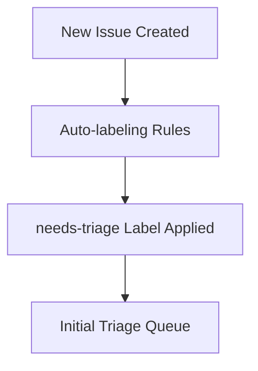

# TiXL Issue Triage Process

## Overview

The TiXL issue triage process ensures that all reported issues, feature requests, and community contributions are systematically reviewed, prioritized, and assigned to appropriate team members. This process maintains high-quality issue management while providing clear communication channels between reporters, contributors, and maintainers.

## Triage Goals

1. **Quality Assurance**: Ensure every issue meets minimum quality standards
2. **Accurate Classification**: Properly categorize issues for efficient routing
3. **Priority Assessment**: Assign appropriate priority based on impact and urgency
4. **Resource Planning**: Balance workload across team members and contributors
5. **Community Engagement**: Provide timely feedback and maintain positive community relations

## Triage Team Structure

### Primary Triagers

**Core Maintainers** (responsible for final triage decisions):
- Lead maintainers with architectural oversight
- Responsible for priority assignment and critical issue handling
- Coordinate with other triagers and make escalation decisions

### Secondary Triagers

**Module Experts** (responsible for module-specific triage):
- Core contributors with deep knowledge of specific modules
- Handle technical assessment for their areas of expertise
- Provide technical guidance for priority and complexity assessment

### Community Triagers

**Experienced Contributors** (assist with initial triage):
- Long-term community members with proven track record
- Handle basic classification and help-wanted issue filtering
- Provide first response for documentation and good-first-issue labels

## Triage Process Workflow

### Phase 1: Initial Intake (0-24 hours)

#### Automatic Labeling


**Automated Actions**:
- Apply `needs-triage` label immediately
- Auto-detect keywords for Type labels (bug, enhancement, etc.)
- Identify mentioned files for Module labels
- Set security flag for potential vulnerabilities

#### Community Response
**Target: Within 4 hours for high-activity issues, 24 hours for all issues**

- Acknowledge receipt of the issue
- Thank reporter for contributing
- Provide initial guidance if issue is unclear
- Set expectations for timeline

**Response Template**:
```
Thanks for reporting this issue to TiXL! 🙏

I've added this to our triage queue and will review it within the next [timeframe]. In the meantime, please check our [documentation/troubleshooting guide] to see if there's already a known solution.

If you have any additional information that might help (screenshots, reproduction steps, etc.), feel free to add it to this issue.

Best regards,
[Triage Team Member]
```

### Phase 2: Quality Assessment (24-48 hours)

#### Issue Validation Checklist

**For Bug Reports**:
- [ ] Clear description of the problem
- [ ] Steps to reproduce provided
- [ ] Environment information complete
- [ ] Issue classification makes sense
- [ ] No duplicates identified
- [ ] Not user error or configuration issue

**For Feature Requests**:
- [ ] Clear description of requested feature
- [ ] Use case and motivation provided
- [ ] Not already implemented or planned
- [ ] Within TiXL's scope and architecture
- [ ] Alternatives considered

**For Documentation Issues**:
- [ ] Specific documentation gaps identified
- [ ] Target documentation section clear
- [ ] Not a general "needs more docs" request

#### Duplicate Detection

**Process**:
1. Search existing issues for similar keywords
2. Check recent commits for related fixes
3. Review similar issues in similar timeframes
4. Cross-reference with community discussions

**If Duplicate Found**:
```
This issue appears to be a duplicate of #[issue-number]. I've added a link to the original issue for reference. Please follow the original issue for updates.

If this issue has additional details not covered in the original, please add them there.
```

#### Information Gap Handling

**If Missing Information**:
```
Thanks for the detailed issue report! To help us investigate this properly, could you please provide:

1. [Specific information requested]
2. [Additional details needed]

Once we have this information, we'll be able to triage this issue more effectively.
```

**Apply `needs-more-info` label and update `needs-triage` status.**

### Phase 3: Technical Assessment (48-72 hours)

#### Module Classification

**Determine Primary Module(s)**:
- Review issue description and affected components
- Check mentioned files and directories
- Consider architectural boundaries
- Identify cross-module implications

**Apply Appropriate Labels**:
- `module:core`, `module:operators`, `module:gfx`, `module:gui`, `module:editor`
- `cross-module` if multiple modules affected
- Component-specific labels for detailed categorization

#### Complexity Assessment

**Simple Issues** (Estimation: < 4 hours):
- Bug fixes with clear root cause
- Documentation improvements
- Simple UI tweaks
- Configuration issues

**Medium Issues** (Estimation: 4-16 hours):
- Feature additions to existing systems
- Performance optimizations with known solutions
- API improvements
- Refactoring in limited scope

**Complex Issues** (Estimation: > 16 hours):
- New major features
- Architectural changes
- Performance issues requiring investigation
- Multi-module integration work

#### Technical Feasibility

**Questions to Consider**:
- Is this within TiXL's architectural constraints?
- Are there blocking dependencies or prerequisites?
- Does this require breaking changes?
- Are there security implications?
- What are the performance implications?

### Phase 4: Priority Assignment (72-96 hours)

#### Priority Criteria Matrix

| Impact | Frequency | Priority | Examples |
|--------|-----------|----------|----------|
| High | High | Critical | Security vulnerability, data loss, widespread crashes |
| High | Medium | High | Major functionality broken for many users |
| Medium | High | High | Common workflow blocked, performance regression |
| High | Low | Medium | Important features for specific use cases |
| Medium | Medium | Medium | Standard bugs and feature requests |
| Low | High | Medium | Annoyances affecting many users |
| Medium | Low | Low | Minor improvements and optimizations |
| Low | Low | Low | Nice-to-have features, cosmetic issues |

#### Priority Guidelines

**Critical Priority**:
- Security vulnerabilities
- Data loss or corruption
- Complete system crashes
- Regression affecting core functionality
- Release blockers

**High Priority**:
- Major functionality broken
- Significant user impact
- Performance regressions
- Important feature requests from multiple users
- Developer workflow blocking issues

**Medium Priority**:
- Standard development backlog
- Moderate user impact
- Feature enhancements
- Performance improvements
- Documentation updates

**Low Priority**:
- Nice-to-have features
- Cosmetic improvements
- Minor optimizations
- Edge case handling
- Future roadmap items

### Phase 5: Assignment and Planning (96+ hours)

#### Assignment Strategy

**Assignment Criteria**:
- Expertise and experience with affected modules
- Current workload and availability
- Interest and specialization areas
- Community contribution opportunities

**Assignment Process**:
1. **Internal Issues**: Assign to core maintainers or module experts
2. **Good First Issues**: Label with `good-first-issue` and assign to triager
3. **Help Wanted**: Label with `help-wanted` for community contribution
4. **Complex Issues**: May remain unassigned pending resource planning

#### Milestone Planning

**For Issues Going into Development**:
- Add to appropriate milestone (release version)
- Ensure milestone capacity is managed
- Consider dependencies between issues
- Balance work across team members

## Special Triage Scenarios

### Security Issues

#### Immediate Response (within 1 hour):
1. **Private Contact**: Email security@tixl.app if not already done
2. **Critical Assessment**: Determine if issue is actually a security vulnerability
3. **Temporary Protection**: Apply `security` and `priority:critical` labels
4. **Restricted Access**: Limit issue visibility if needed

#### Extended Timeline:
- Initial acknowledgment within 1 hour
- Initial assessment within 24 hours
- Public disclosure coordinated with reporter
- Fix timeline depends on severity and complexity

### Regression Issues

#### Identification:
- Issue references functionality that worked in previous version
- Performance degradation from previous releases
- API breaking changes affecting existing code

#### Special Handling:
- Apply `regression` label if applicable
- Consider for backporting to maintenance releases
- Higher priority than similar new issues
- May trigger hotfix release planning

### Duplicate Issues

#### Handling Strategy:
1. **First Response**: Mark as duplicate and link to original
2. **Information Gathering**: Merge valuable additional details from duplicate
3. **Closure**: Close duplicate with clear explanation
4. **Original Enhancement**: Consider improving original issue with duplicate details

### Invalid Issues

#### Common Invalid Categories:
- User error or misconfiguration
- Issues already fixed in latest version
- Questions better suited for discussions/forums
- Feature requests outside TiXL's scope

#### Response:
```
Thanks for taking the time to report this. After investigation, this appears to be related to [user configuration/outside scope/already resolved].

Here are some resources that might help:
- [Relevant documentation link]
- [Discord community link]
- [Known workaround]

If you believe this assessment is incorrect, please provide additional details and we'll reconsider.
```

## Triage Metrics and Reporting

### Key Performance Indicators

#### Response Time Metrics
- **Initial Response**: Average time to first community response
- **Triage Completion**: Average time from issue creation to priority assignment
- **Assignment Time**: Average time to issue assignment or acceptance

#### Quality Metrics
- **Duplicate Rate**: Percentage of issues marked as duplicates
- **Information Gap Rate**: Percentage requiring additional information
- **Invalid Issue Rate**: Percentage of issues marked as invalid
- **Community Satisfaction**: Feedback on triage process

#### Resolution Metrics
- **Time to Resolution**: Average time from assignment to closure
- **First Response Accuracy**: Percentage of issues correctly triaged initially
- **Priority Accuracy**: Correlation between assigned and actual priority

### Monthly Triage Reports

**Report Contents**:
- Total issues triaged and resolved
- Average triage times
- Common issue categories and trends
- Triage team performance metrics
- Process improvement recommendations
- Community feedback and suggestions

## Automation and Tools

### Automated Triage Actions

#### GitHub Actions Workflows
```yaml
# Auto-labeling based on issue content
- keyword: "crash", "error", "bug" → add: "bug"
- keyword: "feature", "enhancement", "improve" → add: "enhancement"
- keyword: "documentation", "docs", "guide" → add: "documentation"
- keyword: "security", "vulnerability", "exploit" → add: "security" + flag for review
```

#### Triage Bot Responses
- Thank you messages for new issues
- Guidance for missing information
- Duplicate detection notifications
- Triage completion notifications

### Triage Dashboard

**Information Displayed**:
- Current triage queue status
- Issues by priority and age
- Triage team workload
- Common issue patterns
- Community response metrics

## Training and Onboarding

### New Triage Team Members

#### Training Process:
1. **Shadowing Phase**: Observe experienced triagers for 2 weeks
2. **Supervised Triage**: Handle simple issues with mentor review
3. **Independent Triage**: Full triage responsibilities with periodic review
4. **Expertise Development**: Focus on specific modules or issue types

#### Training Resources:
- Triage process documentation
- Label usage guidelines
- Common issue patterns and responses
- Escalation procedures
- Community communication templates

### Continuing Education

#### Monthly Sessions:
- Review recent triage decisions and lessons learned
- Discuss challenging issues and edge cases
- Update process based on new patterns
- Share community feedback and suggestions

## Escalation Procedures

### When to Escalate

**Technical Escalation**:
- Issues requiring architectural review
- Security vulnerabilities requiring immediate attention
- Breaking changes with broad impact
- Performance issues affecting multiple users

**Process Escalation**:
- Issues with unclear priority assignment
- Conflicts between team members on issue handling
- Community complaints about triage process
- Resource allocation decisions

### Escalation Chain

1. **Module Expert** → **Core Maintainer** (for technical issues)
2. **Community Triager** → **Module Expert** (for complex issues)
3. **Any Triager** → **Lead Maintainer** (for process issues)

### Escalation Response Times

- **Security Issues**: 1 hour
- **Process Issues**: 24 hours
- **Technical Issues**: 72 hours
- **General Escalations**: 1 week

## Community Interaction Guidelines

### Communication Standards

**Professional Tone**:
- Always thank contributors for their time
- Acknowledge the value of community feedback
- Provide constructive feedback when issues are invalid
- Maintain patience with newcomers

**Clarity and Guidance**:
- Provide clear next steps for reporters
- Link to relevant documentation when appropriate
- Offer alternative solutions when possible
- Set realistic expectations for timelines

### Feedback Loop

**To Contributors**:
- Explain triage decisions when not obvious
- Provide guidance on improving issue reports
- Recognize valuable community contributions
- Encourage continued participation

**From Community**:
- Regular surveys on triage process satisfaction
- Feedback on documentation and communication
- Suggestions for process improvements
- Recognition of excellent issue reports

## Continuous Improvement

### Process Review Cycle

**Monthly Reviews**:
- Analyze triage metrics and trends
- Review challenging decisions and outcomes
- Update documentation and training materials
- Gather community feedback

**Quarterly Major Reviews**:
- Comprehensive process evaluation
- Tool and automation improvements
- Team structure and assignment adjustments
- Strategic planning for process evolution

### Change Management

**Process Updates**:
1. **Proposal**: Document suggested changes with rationale
2. **Discussion**: Gather feedback from triage team and community
3. **Pilot**: Test changes with limited scope
4. **Implementation**: Roll out to full process
5. **Monitoring**: Track impact and effectiveness

---

**The TiXL triage process is designed to be fair, efficient, and community-focused while maintaining high standards for issue quality and resolution.**