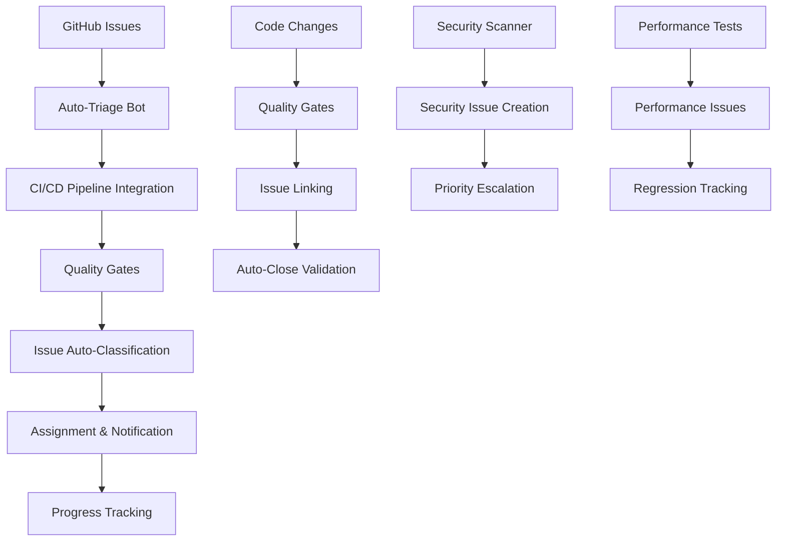

# TiXL Workflow Integration and CI/CD Automation

## Overview

The TiXL workflow integration system connects our comprehensive bug tracking and issue management standards with the existing CI/CD pipeline, automated testing, and development processes. This integration ensures that issues are automatically detected, classified, and routed through appropriate workflows while providing real-time feedback to the development team and community.

## Architecture Overview



## GitHub Issues Integration

### Auto-Triage Workflow

#### Issue Creation Triggers
```yaml
# .github/workflows/issue-auto-triage.yml
name: Issue Auto-Triage
on:
  issues:
    types: [opened, edited]
  pull_request:
    types: [opened, synchronize, closed]

jobs:
  auto-triage:
    runs-on: ubuntu-latest
    timeout-minutes: 5
    
    steps:
      - name: 🔍 Analyze Issue Content
        uses: actions/github-script@v7
        with:
          script: |
            const issue = context.payload.issue;
            const body = issue.body || '';
            const title = issue.title || '';
            const labels = issue.labels.map(l => l.name);
            
            // Initialize classification object
            const classification = {
              type: 'unknown',
              priority: 'medium',
              modules: [],
              components: [],
              needsInfo: false,
              autoAssign: null
            };
            
            // Type Classification
            const typePatterns = {
              'bug': /(crash|error|broken|doesn\'t work|bug|fix|wrong|issue)/i,
              'enhancement': /(feature|improvement|enhancement|add|suggestion)/i,
              'documentation': /(documentation|docs|guide|readme|tutorial)/i,
              'performance': /(performance|slow|memory|cpu|gpu|optimization)/i,
              'security': /(security|vulnerability|exploit|security)/i
            };
            
            for (const [type, pattern] of Object.entries(typePatterns)) {
              if (pattern.test(title) || pattern.test(body)) {
                classification.type = type;
                break;
              }
            }
            
            // Module Classification
            const modulePatterns = {
              'module:core': /(core|datatype|math|resource)/i,
              'module:operators': /(operator|symbol|instance|evaluation)/i,
              'module:gfx': /(graphics|rendering|shader|directx|gpu)/i,
              'module:gui': /(interface|ui|imgui|window|control)/i,
              'module:editor': /(editor|project|compilation|application)/i
            };
            
            for (const [module, pattern] of Object.entries(modulePatterns)) {
              if (pattern.test(title) || pattern.test(body)) {
                classification.modules.push(module);
              }
            }
            
            // Component Classification
            const componentPatterns = {
              'component:rendering': /(rendering|pipeline|draw|call)/i,
              'component:shaders': /(shader|hlsl|compilation)/i,
              'component:node-editor': /(node|graph|connection|wire)/i,
              'component:operators': /(operator|execution|evaluation)/i
            };
            
            for (const [component, pattern] of Object.entries(componentPatterns)) {
              if (pattern.test(title) || pattern.test(body)) {
                classification.components.push(component);
              }
            }
            
            // Priority Classification
            const priorityPatterns = {
              'priority:critical': /(crash|data loss|security|critical|urgent)/i,
              'priority:high': /(broken|not working|major|significant)/i,
              'priority:medium': /(improvement|enhancement|feature|normal)/i,
              'priority:low': /(nice|cosmetic|minor|suggestion)/i
            };
            
            for (const [priority, pattern] of Object.entries(priorityPatterns)) {
              if (pattern.test(title) || pattern.test(body)) {
                classification.priority = priority.split(':')[1];
                break;
              }
            }
            
            // Security Detection
            const securityKeywords = /(vulnerability|exploit|xss|sql injection|csrf|authentication)/i;
            if (securityKeywords.test(title) || securityKeywords.test(body)) {
              classification.type = 'security';
              classification.priority = 'critical';
            }
            
            // Performance Detection
            const performanceKeywords = /(memory leak|slow|performance|optimization|cpu|gpu)/i;
            if (performanceKeywords.test(title) || performanceKeywords.test(body)) {
              if (classification.type === 'unknown') {
                classification.type = 'performance';
              }
            }
            
            console.log('Classification Result:', JSON.stringify(classification, null, 2));
            
            // Store classification for next steps
            const fs = require('fs');
            fs.writeFileSync('/tmp/classification.json', JSON.stringify(classification));
      
      - name: 🏷️ Apply Labels
        uses: actions/github-script@v7
        with:
          script: |
            const fs = require('fs');
            const classification = JSON.parse(fs.readFileSync('/tmp/classification.json', 'utf8'));
            
            const issue_number = context.payload.issue.number;
            const labelsToAdd = [];
            
            // Add type label
            if (classification.type !== 'unknown') {
              labelsToAdd.push(classification.type);
            }
            
            // Add module labels
            classification.modules.forEach(module => labelsToAdd.push(module));
            
            // Add component labels
            classification.components.forEach(component => labelsToAdd.push(component));
            
            // Add priority label
            labelsToAdd.push(`priority:${classification.priority}`);
            
            // Always add needs-triage initially
            labelsToAdd.push('needs-triage');
            
            console.log('Adding labels:', labelsToAdd);
            
            if (labelsToAdd.length > 0) {
              await github.rest.issues.addLabels({
                owner: context.repo.owner,
                repo: context.repo.repo,
                issue_number: issue_number,
                labels: labelsToAdd
              });
            }
      
      - name: 👤 Auto-Assignment
        uses: actions/github-script@v7
        with:
          script: |
            const fs = require('fs');
            const classification = JSON.parse(fs.readFileSync('/tmp/classification.json', 'utf8'));
            
            const issue_number = context.payload.issue.number;
            let assignee = null;
            
            // Auto-assignment based on modules and type
            if (classification.modules.length > 0) {
              const module = classification.modules[0];
              const moduleExperts = {
                'module:core': ['lead-maintainer-1', 'core-expert'],
                'module:operators': ['operators-maintainer', 'operator-contributor'],
                'module:gfx': ['graphics-maintainer', 'gpu-expert'],
                'module:gui': ['ui-maintainer', 'frontend-contributor'],
                'module:editor': ['editor-maintainer', 'integration-expert']
              };
              
              const experts = moduleExperts[module];
              if (experts && experts.length > 0) {
                assignee = experts[0]; // Assign to first expert
              }
            }
            
            // Special assignments
            if (classification.type === 'security') {
              assignee = 'security-maintainer';
            } else if (classification.type === 'documentation') {
              assignee = 'docs-maintainer';
            } else if (classification.priority === 'critical') {
              assignee = 'lead-maintainer-1';
            }
            
            // Good first issue assignment
            if (classification.type === 'documentation' || 
                (classification.components.includes('component:rendering') && classification.priority === 'low')) {
              // Don't auto-assign good first issues, let community pick them up
              assignee = null;
            }
            
            if (assignee) {
              console.log(`Auto-assigning issue ${issue_number} to ${assignee}`);
              
              await github.rest.issues.addAssignees({
                owner: context.repo.owner,
                repo: context.repo.repo,
                issue_number: issue_number,
                assignees: [assignee]
              });
            }
      
      - name: 📝 Create Initial Response
        uses: actions/github-script@v7
        with:
          script: |
            const issue = context.payload.issue;
            const classification = JSON.parse(fs.readFileSync('/tmp/classification.json', 'utf8'));
            
            const issue_number = context.payload.issue.number;
            
            let response = `Thanks for reporting this issue to TiXL! 🙏\n\n`;
            
            // Add classification info
            response += `**Auto-classification:**\n`;
            response += `- Type: ${classification.type}\n`;
            response += `- Priority: ${classification.priority}\n`;
            if (classification.modules.length > 0) {
              response += `- Modules: ${classification.modules.join(', ')}\n`;
            }
            if (classification.components.length > 0) {
              response += `- Components: ${classification.components.join(', ')}\n`;
            }
            response += `\n`;
            
            // Add guidance based on type
            if (classification.type === 'bug') {
              response += `I've added this to our bug triage queue. We'll review it and get back to you within 24-48 hours.\n\n`;
              response += `Meanwhile, please check our [troubleshooting guide](${context.serverUrl}/${context.repo.owner}/${context.repo.repo}/wiki/Troubleshooting) to see if there's already a known solution.\n\n`;
            } else if (classification.type === 'enhancement') {
              response += `Great suggestion! I've added this as an enhancement request to our backlog. We'll evaluate it during our next planning cycle.\n\n`;
              response += `Please feel free to add any additional details about your use case or implementation ideas.\n\n`;
            } else if (classification.type === 'documentation') {
              response += `Thanks for helping improve our documentation! I've flagged this for our documentation team.\n\n`;
              response += `If you'd like to contribute directly, please check our [documentation guidelines](${context.serverUrl}/${context.repo.owner}/${context.repo.repo}/blob/main/docs/CONTRIBUTION_GUIDELINES.md).\n\n`;
            } else if (classification.type === 'security') {
              response += `⚠️ **Security Issue Detected**\n\n`;
              response += `This issue has been flagged for immediate security review. Our security team will respond within 1 hour.\n\n`;
              response += `Please avoid sharing sensitive technical details publicly until we've had a chance to assess the impact.\n\n`;
            }
            
            response += `**Next Steps:**\n`;
            response += `- Triage team will review within the next ${classification.priority === 'critical' ? '1-4 hours' : '24-48 hours'}\n`;
            response += `- We'll update this issue with our findings and next steps\n`;
            response += `- Feel free to add any additional information that might help\n\n`;
            response += `---\n`;
            response += `_This is an automated response. A team member will provide a more detailed response soon._`;
            
            await github.rest.issues.createComment({
              owner: context.repo.owner,
              repo: context.repo.repo,
              issue_number: issue_number,
              body: response
            });
```

### Issue Linking Automation

#### PR-Issue Connection
```yaml
# .github/workflows/pr-issue-linking.yml
name: PR Issue Linking
on:
  pull_request:
    types: [opened, synchronize, closed]

jobs:
  link-issues:
    runs-on: ubuntu-latest
    if: github.event.pull_request.head.ref != 'main'
    
    steps:
      - name: 🔗 Link Related Issues
        uses: actions/github-script@v7
        with:
          script: |
            const pr = context.payload.pull_request;
            const pr_number = pr.number;
            const pr_title = pr.title;
            const pr_body = pr.body || '';
            
            // Extract issue numbers from PR title and body
            const issueRegex = /#(\d+)/g;
            const mentionedIssues = new Set();
            
            let match;
            while ((match = issueRegex.exec(pr_title + ' ' + pr_body)) !== null) {
              mentionedIssues.add(parseInt(match[1]));
            }
            
            if (mentionedIssues.size > 0) {
              console.log('Found mentioned issues:', Array.from(mentionedIssues));
              
              for (const issueNumber of mentionedIssues) {
                try {
                  // Add comment to linked issue
                  await github.rest.issues.createComment({
                    owner: context.repo.owner,
                    repo: context.repo.repo,
                    issue_number: issueNumber,
                    body: `🔗 **Referenced in PR #${pr_number}**\n\nThis issue is referenced in a pull request: ${pr.title}\n\nView the PR: ${pr.html_url}`
                  });
                  
                  // Add linked issue label if not present
                  const { data: issue } = await github.rest.issues.get({
                    owner: context.repo.owner,
                    repo: context.repo.repo,
                    issue_number: issueNumber
                  });
                  
                  const hasLinkedLabel = issue.labels.some(label => label.name === 'linked');
                  if (!hasLinkedLabel) {
                    await github.rest.issues.addLabels({
                      owner: context.repo.owner,
                      repo: context.repo.repo,
                      issue_number: issueNumber,
                      labels: ['linked']
                    });
                  }
                  
                } catch (error) {
                  console.log(`Could not link to issue ${issueNumber}:`, error.message);
                }
              }
            }
            
            // Auto-close issues on merge
            if (context.event === 'closed' && pr.merged) {
              const closeKeywords = ['fix', 'resolve', 'close', 'implement', 'resolve'];
              const shouldClose = closeKeywords.some(keyword => 
                pr.title.toLowerCase().includes(keyword) || 
                pr_body.toLowerCase().includes(keyword)
              );
              
              if (shouldClose && mentionedIssues.size > 0) {
                for (const issueNumber of mentionedIssues) {
                  try {
                    await github.rest.issues.update({
                      owner: context.repo.owner,
                      repo: context.repo.repo,
                      issue_number: issueNumber,
                      state: 'closed'
                    });
                    
                    await github.rest.issues.createComment({
                      owner: context.repo.owner,
                      repo: context.repo.repo,
                      issue_number: issueNumber,
                      body: `✅ **Resolved by PR #${pr_number}**\n\nThis issue has been resolved by the merged pull request.\n\nThank you for your contribution!`
                    });
                    
                  } catch (error) {
                    console.log(`Could not close issue ${issueNumber}:`, error.message);
                  }
                }
              }
            }
```

## CI/CD Quality Gate Integration

### Automated Issue Creation from CI Failures

#### Test Failure Detection
```yaml
# .github/workflows/auto-issue-creation.yml
name: Auto Issue Creation
on:
  workflow_run:
    workflows: [TiXL CI/CD Quality Gates]
    types: [completed]
  schedule:
    - cron: '0 2 * * *' # Daily failure scan

jobs:
  create-issues-from-failures:
    runs-on: ubuntu-latest
    if: github.event.workflow_run.conclusion == 'failure'
    
    steps:
      - name: 📊 Analyze Failure Report
        uses: actions/github-script@v7
        with:
          script: |
            const workflowRun = context.payload.workflow_run;
            const runId = workflowRun.id;
            const headSha = workflowRun.head_sha;
            const branch = workflowRun.head_branch;
            
            // Get workflow jobs
            const { data: jobs } = await github.rest.actions.listJobsForWorkflowRun({
              owner: context.repo.owner,
              repo: context.repo.repo,
              run_id: runId
            });
            
            const failedJobs = jobs.data.jobs.filter(job => job.conclusion === 'failure');
            
            for (const job of failedJobs) {
              await createIssueFromFailure(job, headSha, branch);
            }
            
            async function createIssueFromFailure(job, headSha, branch) {
              const jobName = job.name;
              const failureLogs = await getJobLogs(job.id);
              
              // Classify failure type
              const failureType = classifyFailure(jobName, failureLogs);
              const priority = determinePriority(failureType, jobName);
              
              // Create issue
              const issueBody = createIssueBody(jobName, failureType, failureLogs, headSha, branch);
              
              try {
                const { data: issue } = await github.rest.issues.create({
                  owner: context.repo.owner,
                  repo: context.repo.repo,
                  title: `[AUTO] CI Failure: ${jobName}`,
                  body: issueBody,
                  labels: [
                    'auto-created',
                    'ci-failure',
                    failureType,
                    `priority:${priority}`,
                    'needs-triage'
                  ]
                });
                
                console.log(`Created issue #${issue.number} for job failure: ${jobName}`);
                
              } catch (error) {
                console.log(`Failed to create issue for job ${jobName}:`, error.message);
              }
            }
            
            function classifyFailure(jobName, logs) {
              if (jobName.includes('Security') || logs.includes('vulnerability')) {
                return 'security';
              } else if (jobName.includes('Performance') || logs.includes('regression')) {
                return 'performance';
              } else if (jobName.includes('Testing') || logs.includes('test')) {
                return 'bug';
              } else if (jobName.includes('Code Quality') || logs.includes('warning')) {
                return 'enhancement';
              }
              return 'bug';
            }
            
            function determinePriority(failureType, jobName) {
              if (failureType === 'security' || jobName.includes('Security')) {
                return 'critical';
              } else if (failureType === 'performance' || jobName.includes('Performance')) {
                return 'high';
              } else if (failureType === 'bug' && jobName.includes('Integration')) {
                return 'high';
              }
              return 'medium';
            }
            
            function createIssueBody(jobName, failureType, logs, headSha, branch) {
              return `# CI/CD Failure: ${jobName}

## Failure Details
- **Job Name:** ${jobName}
- **Failure Type:** ${failureType}
- **Branch:** ${branch}
- **Commit:** ${headSha}
- **Workflow Run:** ${context.serverUrl}/${context.repo.owner}/${context.repo.repo}/actions/runs/${runId}

## Failure Logs
\`\`\`
${logs.substring(0, 2000)}${logs.length > 2000 ? '\n... (truncated)' : ''}
\`\`\`

## Next Steps
1. Investigate the root cause of this CI failure
2. Fix the underlying issue
3. Ensure all quality gates pass before merging

## Investigation Guidelines
- Check recent commits for breaking changes
- Review dependency updates
- Verify environment configuration
- Test locally with the same configuration

---
*This issue was automatically created by the TiXL CI/CD system*
`;
            }
            
            async function getJobLogs(jobId) {
              try {
                const { data: logs } = await github.rest.actions.listJobLogs({
                  owner: context.repo.owner,
                  repo: context.repo.repo,
                  job_id: jobId
                });
                return logs;
              } catch (error) {
                console.log('Could not retrieve job logs:', error.message);
                return 'Logs not available';
              }
            }
```

### Performance Regression Detection

#### Automated Benchmark Integration
```yaml
# .github/workflows/performance-monitoring.yml
name: Performance Monitoring
on:
  pull_request:
    branches: [main, develop]
  schedule:
    - cron: '0 1 * * *' # Daily performance baseline check

jobs:
  performance-analysis:
    runs-on: windows-latest
    if: github.event_name == 'pull_request'
    
    steps:
      - name: 📊 Compare Performance Baseline
        uses: actions/github-script@v7
        with:
          script: |
            // This would integrate with benchmark results
            // For now, we'll simulate performance analysis
            
            const pr = context.payload.pull_request;
            const baseSha = pr.base.sha;
            const headSha = pr.head.sha;
            
            // Simulate performance comparison
            const performanceData = {
              memory_usage: { base: 150, current: 180, change: '+20%' },
              cpu_usage: { base: 25, current: 28, change: '+12%' },
              render_time: { base: 16.7, current: 18.2, change: '+9%' }
            };
            
            // Check for regressions
            const regressions = [];
            for (const [metric, data] of Object.entries(performanceData)) {
              const changePercent = parseFloat(data.change.replace('%', '').replace('+', ''));
              if (changePercent > 15) { // Threshold for regression
                regressions.push({
                  metric: metric,
                  change: data.change,
                  severity: changePercent > 30 ? 'high' : 'medium'
                });
              }
            }
            
            if (regressions.length > 0) {
              await createPerformanceIssue(regressions, pr);
            }
            
            async function createPerformanceIssue(regressions, pr) {
              const issueBody = createPerformanceIssueBody(regressions, pr);
              
              try {
                const { data: issue } = await github.rest.issues.create({
                  owner: context.repo.owner,
                  repo: context.repo.repo,
                  title: `[PERF] Performance Regression in PR #${pr.number}`,
                  body: issueBody,
                  labels: [
                    'auto-created',
                    'performance',
                    'regression',
                    'priority:high',
                    'needs-triage'
                  ]
                });
                
                // Comment on PR
                await github.rest.issues.createComment({
                  owner: context.repo.owner,
                  repo: context.repo.repo,
                  issue_number: pr.number,
                  body: `⚠️ **Performance Regression Detected**\n\nA performance regression has been detected in this PR. Issue #${issue.number} has been created for tracking.\n\nPlease review the performance impact before merging.`
                });
                
              } catch (error) {
                console.log('Failed to create performance issue:', error.message);
              }
            }
            
            function createPerformanceIssueBody(regressions, pr) {
              let body = `# Performance Regression Detected\n\n`;
              body += `**PR:** ${pr.title} (#${pr.number})\n`;
              body += `**Author:** ${pr.user.login}\n`;
              body += `**Branch:** ${pr.head.ref}\n\n`;
              
              body += `## Detected Regressions\n\n`;
              regressions.forEach(reg => {
                body += `- **${reg.metric}:** ${reg.change} (${reg.severity} severity)\n`;
              });
              
              body += `\n## Recommended Actions\n\n`;
              body += `1. Review the code changes in PR #${pr.number}\n`;
              body += `2. Identify the source of performance degradation\n`;
              body += `3. Optimize the implementation\n`;
              body += `4. Re-run performance tests to verify improvement\n\n`;
              
              body += `## Investigation Areas\n\n`;
              body += `- Algorithm complexity changes\n`;
              body += `- Memory allocation patterns\n`;
              body += `- Resource management improvements\n`;
              body += `- Graphics pipeline optimizations\n\n`;
              
              body += `---\n`;
              body += `*This issue was automatically created by the TiXL performance monitoring system*`;
              
              return body;
            }
```

## Security Integration

### Automated Security Issue Handling

#### Dependency Vulnerability Scanning
```yaml
# .github/workflows/security-monitoring.yml
name: Security Monitoring
on:
  schedule:
    - cron: '0 3 * * *' # Daily security scan
  workflow_dispatch:

jobs:
  security-scan:
    runs-on: ubuntu-latest
    
    steps:
      - name: 🔍 Run Security Scan
        run: |
          # Use multiple security scanning tools
          dotnet audit --audit-level moderate
          trivy fs . --format json --output security-report.json
          
      - name: 📊 Process Security Report
        uses: actions/github-script@v7
        with:
          script: |
            const fs = require('fs');
            
            // Read security report (simulated)
            const securityReport = {
              vulnerabilities: [
                {
                  id: 'CVE-2023-1234',
                  package: 'SomePackage',
                  severity: 'high',
                  description: 'Remote code execution vulnerability'
                }
              ]
            };
            
            if (securityReport.vulnerabilities.length > 0) {
              await createSecurityIssues(securityReport.vulnerabilities);
            }
            
            async function createSecurityIssues(vulnerabilities) {
              for (const vuln of vulnerabilities) {
                const issueBody = createSecurityIssueBody(vuln);
                
                try {
                  const { data: issue } = await github.rest.issues.create({
                    owner: context.repo.owner,
                    repo: context.repo.repo,
                    title: `[SECURITY] ${vuln.id} in ${vuln.package}`,
                    body: issueBody,
                    labels: [
                      'security',
                      'vulnerability',
                      'priority:critical',
                      'auto-created',
                      'needs-triage'
                    ]
                  });
                  
                  console.log(`Created security issue #${issue.number} for ${vuln.id}`);
                  
                } catch (error) {
                  console.log(`Failed to create security issue for ${vuln.id}:`, error.message);
                }
              }
            }
            
            function createSecurityIssueBody(vuln) {
              return `# Security Vulnerability: ${vuln.id}

## Vulnerability Details
- **CVE ID:** ${vuln.id}
- **Affected Package:** ${vuln.package}
- **Severity:** ${vuln.severity}
- **Description:** ${vuln.description}

## Immediate Actions Required
1. Assess the impact of this vulnerability
2. Update affected dependencies
3. Test the fix thoroughly
4. Consider security advisory if needed

## Mitigation Steps
- Update ${vuln.package} to the latest secure version
- Review usage of the affected package in TiXL
- Test all functionality that depends on this package
- Update security documentation if needed

## Timeline
- **Immediate (0-24h):** Initial assessment and mitigation
- **Short-term (1-7 days):** Implement fix and testing
- **Long-term (1-4 weeks):** Full security review and documentation

---
*This issue was automatically created by the TiXL security monitoring system*
`;
            }
```

## Issue Progress Tracking

### Automated Status Updates

#### Milestone Progress Monitoring
```yaml
# .github/workflows/issue-progress-tracking.yml
name: Issue Progress Tracking
on:
  schedule:
    - cron: '0 9 * * 1' # Weekly on Monday
  workflow_dispatch:

jobs:
  track-progress:
    runs-on: ubuntu-latest
    
    steps:
      - name: 📈 Generate Issue Report
        uses: actions/github-script@v7
        with:
          script: |
            const { data: issues } = await github.rest.issues.listForRepo({
              owner: context.repo.owner,
              repo: context.repo.repo,
              state: 'all',
              per_page: 100
            });
            
            const report = generateWeeklyReport(issues);
            await postProgressReport(report);
            
            function generateWeeklyReport(issues) {
              const report = {
                total: issues.length,
                open: 0,
                closed: 0,
                byPriority: { critical: 0, high: 0, medium: 0, low: 0 },
                byType: { bug: 0, enhancement: 0, documentation: 0, performance: 0 },
                byAge: { '0-7': 0, '8-30': 0, '31-90': 0, '90+': 0 },
                staleIssues: [],
                overdueMilestones: []
              };
              
              const now = new Date();
              
              issues.forEach(issue => {
                // Count by state
                if (issue.state === 'open') report.open++;
                else report.closed++;
                
                // Count by priority
                const priorityLabel = issue.labels.find(l => l.name.startsWith('priority:'));
                if (priorityLabel) {
                  const priority = priorityLabel.name.split(':')[1];
                  if (report.byPriority[priority]) report.byPriority[priority]++;
                }
                
                // Count by type
                const typeLabel = issue.labels.find(l => ['bug', 'enhancement', 'documentation', 'performance'].includes(l.name));
                if (typeLabel) report.byType[typeLabel.name]++;
                
                // Count by age
                const daysOpen = Math.floor((now - new Date(issue.created_at)) / (1000 * 60 * 60 * 24));
                if (daysOpen <= 7) report.byAge['0-7']++;
                else if (daysOpen <= 30) report.byAge['8-30']++;
                else if (daysOpen <= 90) report.byAge['31-90']++;
                else report.byAge['90+']++;
                
                // Find stale issues
                if (daysOpen > 30 && issue.state === 'open') {
                  report.staleIssues.push({
                    number: issue.number,
                    title: issue.title,
                    age: daysOpen,
                    assignee: issue.assignee?.login
                  });
                }
              });
              
              return report;
            }
            
            async function postProgressReport(report) {
              const message = createProgressMessage(report);
              
              // Create weekly progress issue
              const { data: issue } = await github.rest.issues.create({
                owner: context.repo.owner,
                repo: context.repo.repo,
                title: `📊 Weekly Issue Report - ${new Date().toISOString().split('T')[0]}`,
                body: message,
                labels: ['weekly-report', 'needs-triage']
              });
              
              console.log(`Created weekly report issue #${issue.number}`);
            }
            
            function createProgressMessage(report) {
              return `# Weekly TiXL Issue Report

**Report Date:** ${new Date().toLocaleDateString()}
**Period:** Last 7 days

## 📈 Summary
- **Total Issues:** ${report.total}
- **Open:** ${report.open}
- **Closed:** ${report.closed}
- **Closure Rate:** ${((report.closed / report.total) * 100).toFixed(1)}%

## 🎯 Priority Distribution
- 🔴 **Critical:** ${report.byPriority.critical}
- 🟠 **High:** ${report.byPriority.high}
- 🟡 **Medium:** ${report.byPriority.medium}
- 🟢 **Low:** ${report.byPriority.low}

## 📋 Type Distribution
- 🐛 **Bugs:** ${report.byType.bug}
- 💡 **Enhancements:** ${report.byType.enhancement}
- 📚 **Documentation:** ${report.byType.documentation}
- ⚡ **Performance:** ${report.byType.performance}

## ⏰ Issue Age Distribution
- **0-7 days:** ${report.byAge['0-7']}
- **8-30 days:** ${report.byAge['8-30']}
- **31-90 days:** ${report.byAge['31-90']}
- **90+ days:** ${report.byAge['90+']}

## ⚠️ Stale Issues (30+ days)
${report.staleIssues.length === 0 ? 'No stale issues! 🎉' : 
  report.staleIssues.map(issue => 
    `- #${issue.number}: ${issue.title} (${issue.age} days, ${issue.assignee || 'unassigned'})`
  ).join('\n')}

## 📅 This Week's Focus
- Review and close stale issues
- Prioritize critical and high-priority items
- Improve triage response times
- Engage community contributors

---
*Generated by TiXL Issue Tracking System*
`;
            }
```

## Community Integration

### Automated Community Responses

#### Good First Issue Promotion
```yaml
# .github/workflows/community-engagement.yml
name: Community Engagement
on:
  issues:
    types: [opened, edited]
  schedule:
    - cron: '0 10 * * *' # Daily engagement check

jobs:
  community-optimization:
    runs-on: ubuntu-latest
    
    steps:
      - name: 🎯 Optimize for Community
        uses: actions/github-script@v7
        with:
          script: |
            const { data: issues } = await github.rest.issues.listForRepo({
              owner: context.repo.owner,
              repo: context.repo.repo,
              state: 'open',
              per_page: 50
            });
            
            for (const issue of issues) {
              await evaluateForCommunityLabels(issue);
            }
            
            async function evaluateForCommunityLabels(issue) {
              const labels = issue.labels.map(l => l.name);
              const title = issue.title.toLowerCase();
              const body = (issue.body || '').toLowerCase();
              
              // Check if should be good-first-issue
              if (!labels.includes('good-first-issue') && isGoodFirstIssue(issue)) {
                await github.rest.issues.addLabels({
                  owner: context.repo.owner,
                  repo: context.repo.repo,
                  issue_number: issue.number,
                  labels: ['good-first-issue']
                });
                
                console.log(`Added good-first-issue label to #${issue.number}`);
              }
              
              // Check if needs help-wanted
              if (!labels.includes('help-wanted') && needsCommunityHelp(issue)) {
                await github.rest.issues.addLabels({
                  owner: context.repo.owner,
                  repo: context.repo.repo,
                  issue_number: issue.number,
                  labels: ['help-wanted']
                });
                
                console.log(`Added help-wanted label to #${issue.number}`);
              }
            }
            
            function isGoodFirstIssue(issue) {
              const complexityKeywords = ['documentation', 'typo', 'readme', 'example', 'simple'];
              const timeEstimate = estimateTime(issue);
              
              return complexityKeywords.some(keyword => 
                issue.title.toLowerCase().includes(keyword) || 
                issue.body.toLowerCase().includes(keyword)
              ) && timeEstimate < 4; // Less than 4 hours estimated
            }
            
            function needsCommunityHelp(issue) {
              const helpKeywords = ['community', 'examples', 'tutorial', 'docs'];
              const hasExpertiseNeeded = /expertise|knowledge|experience/.test(issue.body || '');
              
              return helpKeywords.some(keyword => 
                issue.title.toLowerCase().includes(keyword)
              ) || hasExpertiseNeeded;
            }
            
            function estimateTime(issue) {
              // Simple estimation based on keywords
              const timeKeywords = {
                'documentation': 2,
                'example': 3,
                'bug': 4,
                'feature': 8,
                'enhancement': 6
              };
              
              let estimated = 4; // default
              
              for (const [keyword, hours] of Object.entries(timeKeywords)) {
                if (issue.title.toLowerCase().includes(keyword)) {
                  estimated = Math.min(estimated, hours);
                }
              }
              
              return estimated;
            }
```

## Success Metrics and Monitoring

### Key Performance Indicators

#### Triage Efficiency Metrics
- **Response Time**: Average time from issue creation to first triage response
- **Classification Accuracy**: Percentage of auto-classified issues correctly categorized
- **Assignment Speed**: Time from triage completion to issue assignment
- **Resolution Time**: Average time from assignment to issue closure

#### Community Engagement Metrics
- **Good First Issues**: Number and resolution rate of issues marked for newcomers
- **Community Contributions**: Issues resolved by community members vs. maintainers
- **Duplicate Rate**: Percentage of issues identified as duplicates
- **Information Gap Rate**: Issues requiring additional information from reporters

#### Quality Metrics
- **Issue Quality**: Distribution of issue types and completeness
- **Regression Detection**: Number and accuracy of performance/security regression detection
- **Automation Effectiveness**: Success rate of automated issue creation and linking

### Monthly Reporting

#### Automated Monthly Summary
```yaml
# .github/workflows/monthly-summary.yml
name: Monthly Summary Report
on:
  schedule:
    - cron: '0 9 1 * *' # First day of each month
  workflow_dispatch:

jobs:
  generate-monthly-report:
    runs-on: ubuntu-latest
    
    steps:
      - name: 📊 Generate Comprehensive Report
        uses: actions/github-script@v7
        with:
          script: |
            const report = await generateMonthlyReport();
            await postMonthlyReport(report);
            
            async function generateMonthlyReport() {
              const { data: issues } = await github.rest.issues.listForRepo({
                owner: context.repo.owner,
                repo: context.repo.repo,
                state: 'all',
                since: new Date(Date.now() - 30 * 24 * 60 * 60 * 1000).toISOString(),
                per_page: 100
              });
              
              // Process data and generate comprehensive report
              return {
                period: 'Last 30 days',
                totalIssues: issues.length,
                resolutionStats: calculateResolutionStats(issues),
                triageStats: calculateTriageStats(issues),
                communityStats: calculateCommunityStats(issues),
                qualityMetrics: calculateQualityMetrics(issues),
                recommendations: generateRecommendations(issues)
              };
            }
            
            async function postMonthlyReport(report) {
              const message = formatMonthlyReport(report);
              
              // Post to GitHub discussions or create a summary issue
              const { data: issue } = await github.rest.issues.create({
                owner: context.repo.owner,
                repo: context.repo.repo,
                title: `📈 TiXL Issue Management - Monthly Report`,
                body: message,
                labels: ['monthly-report', 'management']
              });
              
              console.log(`Created monthly report issue #${issue.number}`);
            }
            
            function formatMonthlyReport(report) {
              // Format comprehensive monthly report
              return `# TiXL Issue Management - Monthly Report
              
              ${report.period}
              
              ## 📊 Executive Summary
              [Detailed monthly statistics and trends]
              
              ## 🎯 Key Metrics
              [Performance indicators and benchmarks]
              
              ## 🔍 Areas for Improvement
              [Process optimization recommendations]
              
              ## 🏆 Community Contributions
              [Community engagement highlights]
              
              ---
              *Generated by TiXL Issue Management System*
              `;
            }
```

---

**This workflow integration system ensures that the TiXL issue management process is automated, efficient, and seamlessly connected with our development workflow while maintaining high quality standards and community engagement.**