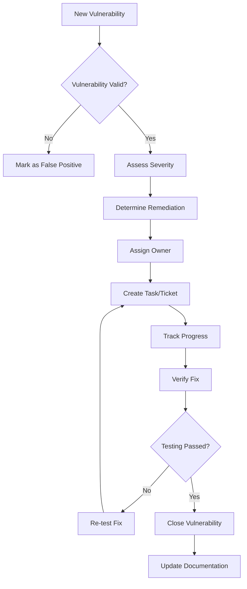

# TiXL SAST and SCA Security Scanning Implementation (TIXL-058)

## Executive Summary

This document outlines the comprehensive implementation of Static Application Security Testing (SAST) and Software Composition Analysis (SCA) security scanning for the TiXL project. The implementation integrates multiple security tools into the CI/CD pipeline with automated quality gates, vulnerability triage, and reporting.

## Table of Contents

1. [Overview](#overview)
2. [Architecture](#architecture)
3. [SAST Tools Integration](#sast-tools-integration)
4. [SCA Tools Integration](#sca-tools-integration)
5. [CI/CD Pipeline Integration](#cicd-pipeline-integration)
6. [Vulnerability Triage](#vulnerability-triage)
7. [Reporting and Dashboards](#reporting-and-dashboards)
8. [Quality Gates](#quality-gates)
9. [Configuration](#configuration)
10. [Operations and Maintenance](#operations-and-maintenance)
11. [Quick Start Guide](#quick-start-guide)

## Overview

### Objectives

- **Comprehensive Security Coverage**: Implement multiple security scanning tools for complete vulnerability detection
- **Automated Quality Gates**: Fail builds on critical security issues
- **Actionable Reporting**: Provide clear, prioritized vulnerability reports
- **Continuous Monitoring**: Regular security scanning with trend analysis
- **Compliance Alignment**: Meet industry security standards and best practices

### Security Scanning Philosophy

1. **Defense in Depth**: Multiple overlapping security tools for comprehensive coverage
2. **Shift Left**: Early detection and prevention of security issues
3. **Automation First**: Minimize manual security review overhead
4. **Risk-Based Prioritization**: Focus on critical and high-severity issues
5. **Continuous Improvement**: Learn from findings and improve security posture

## Architecture

### Security Scanning Architecture

```
┌─────────────────┐    ┌─────────────────┐    ┌─────────────────┐
│   Source Code   │────│  CI/CD Pipeline │────│ Security Gates  │
│   Repository    │    │   (GitHub/AzDO) │    │   (Quality)     │
└─────────────────┘    └─────────────────┘    └─────────────────┘
                                │
                    ┌───────────┴───────────┐
                    │                       │
            ┌───────▼──────┐        ┌──────▼──────┐
            │   SAST       │        │     SCA     │
            │   Tools      │        │   Tools     │
            └──────────────┘        └──────────────┘
                    │                       │
            ┌───────▼──────┐        ┌──────▼──────┐
            │ • CodeQL     │        │ • Grype     │
            │ • Semgrep    │        │ • dotnet-   │
            │ • SonarQube  │        │   retire    │
            │ • Checkov    │        │ • OWASP DC  │
            └──────────────┘        └──────────────┘
                    │                       │
            ┌───────▼──────┐        ┌──────▼──────┐
            │ Vulnerability│        │Vulnerability│
            │ Aggregation  │        │ Aggregation │
            │   & Analysis │        │ & Analysis  │
            └──────────────┘        └──────────────┘
                    │                       │
            ┌───────▼───────────────────────▼──────┐
            │        Security Dashboard &          │
            │       Notification System            │
            └──────────────────────────────────────┘
```

### Key Components

1. **Security Scanner Layer**: Multiple security tools for different vulnerability types
2. **Vulnerability Aggregator**: Consolidates and normalizes findings from all tools
3. **Quality Gate Engine**: Evaluates security findings against policies
4. **Reporting System**: Generates comprehensive security reports and dashboards
5. **Notification System**: Alerts stakeholders of security issues

## SAST Tools Integration

### 1. CodeQL (Primary SAST)

**Purpose**: Semantic analysis for security vulnerabilities in C# code

**Configuration**:
```yaml
# .github/codeql/codeql-config.yml
name: "TiXL Security CodeQL Configuration"
queries:
  - uses: security-extended
  - uses: security-and-quality
  - uses: codeql/cs-all
  - uses: codeql/csharp-all
```

**Custom Rules**:
- Deserialization security patterns
- SQL injection detection
- Cross-site scripting (XSS) patterns
- Cryptographic misuse
- Insecure file operations

**Integration**:
- Runs on every pull request and push
- Upload results to GitHub Security tab
- Configurable severity thresholds

### 2. Semgrep (Secondary SAST)

**Purpose**: Fast, lightweight security scanning with custom rules

**Configuration**:
```yaml
rules:
  - id: insecure-random
    pattern: new Random()
    message: Use cryptographically secure random number generator
    severity: WARNING
    languages: [csharp]
  - id: sql-injection
    pattern: $DB.Execute($QUERY + ...)
    message: Potential SQL injection vulnerability
    severity: ERROR
    languages: [csharp]
```

**Integration**:
- SARIF output for GitHub Security integration
- Custom rules for .NET specific patterns
- Community rule packs integration

### 3. SonarQube/Cloud (SAST & Code Quality)

**Purpose**: Comprehensive code quality and security analysis

**Configuration**:
```xml
<!-- sonar-project.properties -->
sonar.projectKey=tixl-security
sonar.organization=tixl-org
sonar.sources=src
sonar.tests=Tests
sonar.cs.xunit.reportsPaths=**/TestResults/*.xml
sonar.cs.vscoveragexml.reportsPaths=**/*.coveragexml
sonar.qualitygate.wait=true
```

**Security Rules**:
- OWASP Top 10 compliance
- CWE security hotspots
- Vulnerability detection rules
- Security hotspot tracking

## SCA Tools Integration

### 1. Grype (Primary SCA)

**Purpose**: Comprehensive vulnerability scanning for dependencies

**Features**:
- Vulnerability database (OSV, GitHub, NVD)
- SBOM generation (CycloneDX, SPDX, Syft JSON)
- Multiple output formats
- Continuous vulnerability database updates

**Integration**:
```bash
# Generate SBOM and scan for vulnerabilities
syft . -o json > sbom.json
grype . -o json > vulnerabilities.json
grype . -o sarif > grype-results.sarif
```

### 2. dotnet-retire (Specialized SCA)

**Purpose**: Detection of known vulnerable .NET packages

**Features**:
- Microsoft security bulletin integration
- .NET Framework and .NET Core vulnerability database
- Package-specific remediation guidance

**Integration**:
```bash
dotnet tool install --global dotnet-retire
dotnet retire --ignore-urls "https://localhost/**"
```

### 3. OWASP Dependency Check

**Purpose**: Enterprise-grade dependency vulnerability scanning

**Features**:
- Multiple database sources (NVD, OSS Index, Retire.js)
- SARIF output for GitHub integration
- Detailed vulnerability reports
- Suppression management

## CI/CD Pipeline Integration

### GitHub Actions Workflow

**Primary Workflow**: `.github/workflows/tixl-sast-sca-comprehensive.yml`

**Key Features**:
1. **Multi-stage Pipeline**: Separate stages for SAST, SCA, and governance
2. **Parallel Execution**: Tools run in parallel for faster results
3. **Artifact Management**: All results preserved for audit trails
4. **Quality Gates**: Automated pass/fail based on security policies
5. **Notification Integration**: Real-time alerts for critical issues

**Trigger Conditions**:
- Pull requests to main branch
- Push to main/develop branches
- Daily scheduled scans (6 AM UTC)
- Weekly deep scans (Monday 6 PM UTC)
- Manual trigger with configurable parameters

### Azure DevOps Integration

**Pipeline**: `docs/pipelines/enhanced-azure-pipelines.yml`

**Integration Points**:
- Security scanning stages
- Quality gate validation
- Artifact publishing
- Notification workflows
- Compliance reporting

## Vulnerability Triage

### Automated Triage Process

1. **Vulnerability Aggregation**:
   - Collect findings from all security tools
   - Normalize severity levels across tools
   - Remove duplicates and false positives
   - Prioritize by risk and exploitability

2. **Risk Assessment**:
   ```python
   # Risk scoring algorithm
   risk_score = (
       severity_weight * cvss_score * 
       exploitability_factor * 
       asset_criticality
   )
   ```

3. **Triage Classification**:
   - **Critical**: Immediate action required (24 hours)
   - **High**: Address within 72 hours
   - **Medium**: Plan for next sprint
   - **Low**: Monitor and address during maintenance

### Triage Workflow



### False Positive Management

**Criteria for False Positives**:
- Test code exceptions (CWE-999)
- Demo/example code exclusions
- Intentional security test cases
- Environment-specific configurations

**Management Process**:
1. Review findings for false positive indicators
2. Apply suppression rules where appropriate
3. Document suppression rationale
4. Periodic review of suppressions

## Reporting and Dashboards

### Security Dashboard

**Generated Artifacts**:
1. **HTML Dashboard**: Interactive security overview
2. **PDF Report**: Executive summary for stakeholders
3. **JSON Data**: Machine-readable results for integration
4. **Markdown Summary**: Developer-friendly format

**Dashboard Features**:
- Real-time vulnerability counts by severity
- Tool coverage visualization
- Trend analysis over time
- Top priority issues display
- Remediation guidance

### Report Types

1. **Executive Summary**:
   - Overall security posture
   - Key risk metrics
   - Compliance status
   - Recommendations

2. **Technical Report**:
   - Detailed vulnerability findings
   - Code locations and remediation steps
   - Tool-specific recommendations
   - False positive analysis

3. **Compliance Report**:
   - Framework alignment (OWASP, NIST)
   - Audit trail documentation
   - Security debt tracking
   - Remediation timeline

## Quality Gates

### Gate Policies

**Configuration**: `.github/security/policies/gate-policy.json`

**Default Thresholds**:
- Critical: 0 allowed
- High: ≤ 5 allowed
- Medium: ≤ 25 allowed
- Low: ≤ 100 allowed

**Gate Rules**:
1. No critical vulnerabilities
2. Limited high-severity issues
3. No secrets in code
4. All required tools pass
5. Dependency CVE compliance
6. License compatibility

### Quality Gate Evaluation

```python
def evaluate_security_gate(vulnerabilities, policy):
    critical_count = sum(1 for v in vulnerabilities if v.severity == 'critical')
    high_count = sum(1 for v in vulnerabilities if v.severity == 'high')
    
    if critical_count > policy.critical_threshold:
        return FAILED, f"{critical_count} critical vulnerabilities"
    
    if high_count > policy.high_threshold:
        return FAILED, f"{high_count} high severity issues"
    
    return PASSED, "All security gates passed"
```

### Build Integration

**CI/CD Integration**:
- Gates run after all security scans complete
- Failed gates prevent deployment
- Detailed failure reasons provided
- Automatic issue creation for critical failures

## Configuration

### Tool-Specific Configuration

#### CodeQL Configuration
```yaml
# .github/codeql/codeql-config.yml
queries:
  - uses: security-extended
  - uses: security-and-quality
paths:
  - "src/"
  - "Core/"
paths-ignore:
  - "**/Test/"
  - "**/Tests/"
```

#### Semgrep Configuration
```yaml
# .semgrep.yml
rules:
  - id: tixl-security
    pattern: |
      $DB.Execute($INPUT)
    message: Potential SQL injection
    severity: ERROR
    languages: [csharp]
```

#### SonarCloud Configuration
```xml
<!-- sonar-project.properties -->
sonar.projectKey=tixl
sonar.organization=tixl-org
sonar.sources=src
sonar.exclusions=**/Tests/**
sonar.qualitygate.wait=true
```

### Security Policy Configuration

**Severity Mapping**:
```json
{
  "severity_mapping": {
    "codeql": {
      "error": "high",
      "warning": "medium",
      "note": "low"
    },
    "grype": {
      "CRITICAL": "critical",
      "HIGH": "high",
      "MEDIUM": "medium",
      "LOW": "low"
    }
  }
}
```

## Operations and Maintenance

### Daily Operations

1. **Automated Scans**:
   - Pull request security scanning
   - Main branch push scanning
   - Nightly comprehensive scans

2. **Alert Monitoring**:
   - Critical vulnerability notifications
   - Security gate failure alerts
   - Trend analysis updates

### Weekly Maintenance

1. **Metrics Review**:
   - Security debt analysis
   - Trend evaluation
   - Compliance reporting

2. **Tool Updates**:
   - Security tool versions
   - Vulnerability databases
   - Rule set updates

3. **False Positive Review**:
   - Analyze false positive patterns
   - Update suppression rules
   - Validate exclusions

### Monthly Activities

1. **Security Dashboard Review**:
   - Trend analysis
   - Improvement planning
   - Risk assessment updates

2. **Policy Review**:
   - Threshold adjustments
   - New tool integration
   - Process improvements

## Quick Start Guide

### Initial Setup

1. **Enable Security Scanning**:
   ```bash
   # Copy security workflow to repository
   cp .github/workflows/tixl-sast-sca-comprehensive.yml .github/workflows/
   
   # Configure security policies
   cp .github/security/policies/gate-policy.json.example .github/security/policies/gate-policy.json
   ```

2. **Configure Secrets**:
   - `SONAR_TOKEN`: SonarCloud access token
   - `SEMGREP_APP_TOKEN`: Semgrep App token
   - `SECURITY_WEBHOOK_URL`: Webhook for notifications
   - `EMAIL_CONFIG`: Email configuration for alerts

3. **Verify Setup**:
   ```bash
   # Run security scan locally
   python .github/scripts/vulnerability-aggregator.py \
     --input-dir security-results/ \
     --output-dir analysis/ \
     --severity-threshold medium
   ```

### Daily Usage

1. **Review Security Alerts**:
   - Check GitHub Security tab
   - Review security dashboard
   - Address critical findings immediately

2. **Monitor Quality Gates**:
   - Verify pull request security checks
   - Review security gate summaries
   - Track remediation progress

### Troubleshooting

**Common Issues**:

1. **Security Tools Failing**:
   ```bash
   # Check tool availability
   dotnet --version
   java -version
   python --version
   
   # Install missing tools
   dotnet tool install --global dotnet-retire
   ```

2. **False Positives**:
   - Review vulnerability details
   - Add suppression rules
   - Update exclusion patterns

3. **Performance Issues**:
   - Enable parallel tool execution
   - Optimize tool configurations
   - Use caching for repeated scans

## Integration Points

### External Integrations

1. **GitHub Security Tab**:
   - SARIF file uploads
   - Security alert management
   - Advisory database integration

2. **Notification Systems**:
   - Email notifications
   - Slack integration
   - Microsoft Teams integration
   - Webhook notifications

3. **Issue Tracking**:
   - Automatic GitHub issue creation
   - Integration with project management tools
   - SLA tracking for remediation

### Compliance Frameworks

1. **OWASP Top 10**:
   - Coverage mapping
   - Risk assessment alignment
   - Remediation guidance

2. **NIST Cybersecurity Framework**:
   - Identify, Protect, Detect, Respond, Recover
   - Continuous monitoring
   - Incident response integration

3. **SOC 2**:
   - Security controls mapping
   - Audit trail documentation
   - Compliance reporting

## Conclusion

The TiXL SAST and SCA security scanning implementation provides comprehensive security coverage through multiple overlapping tools and automated quality gates. The system is designed to:

- **Prevent** security issues from reaching production
- **Detect** vulnerabilities early in the development process
- **Respond** to security issues with clear remediation guidance
- **Recover** from security incidents with documented processes
- **Improve** security posture through continuous learning

The implementation follows industry best practices for secure software development and provides the foundation for a robust security program that can scale with the project's growth.

### Next Steps

1. **Deploy Implementation**: Activate the security scanning workflow
2. **Configure Notifications**: Set up alerting for security issues
3. **Train Team**: Ensure developers understand security findings
4. **Monitor Progress**: Track security metrics and improvements
5. **Iterate**: Continuously improve based on feedback and results

---

*This implementation follows the principle of "security by design" and provides comprehensive protection for the TiXL project through layered security controls and automated processes.*