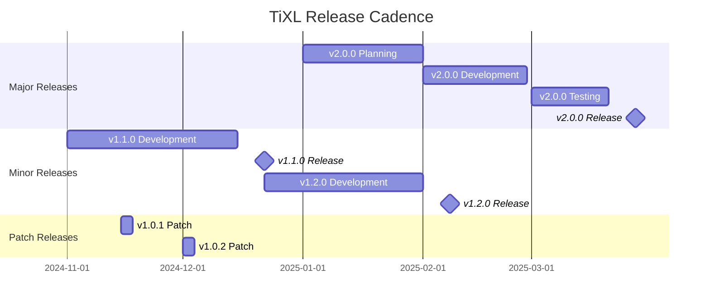
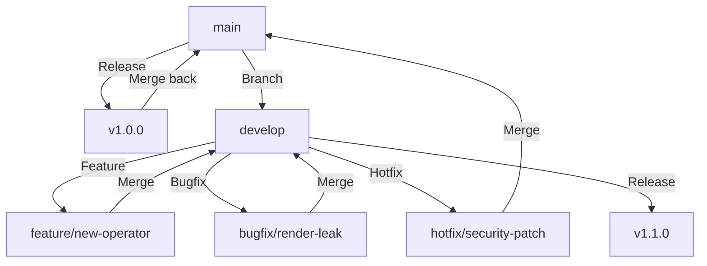
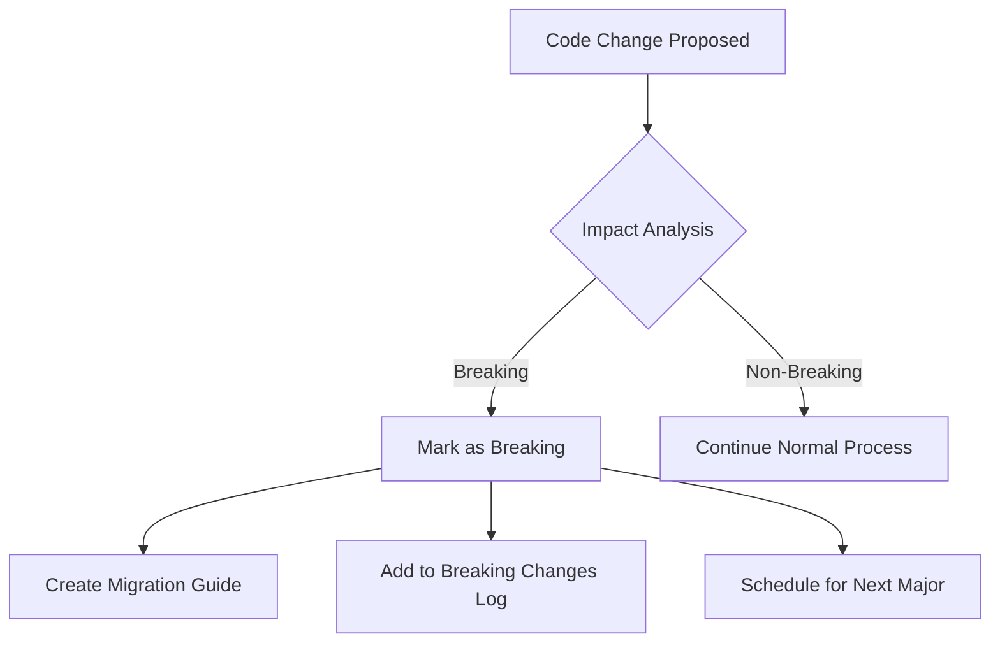
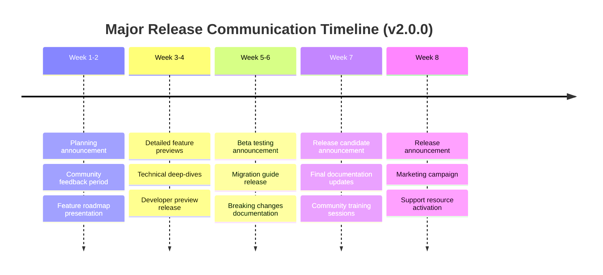
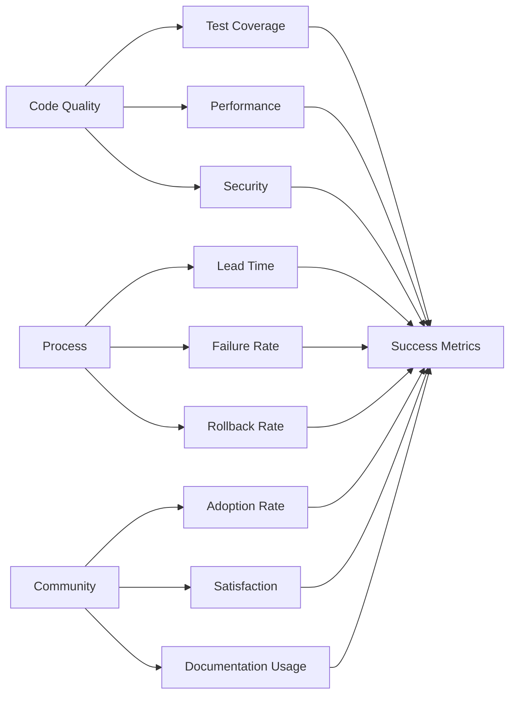

# TiXL Release and Versioning Policy (TIXL-095)

## Executive Summary

This document establishes TiXL's comprehensive release and versioning policy based on Semantic Versioning (SemVer). It provides a clear, predictable system for managing releases across our real-time motion graphics platform, ensuring users can understand changes and plan upgrades effectively.

**Current Version**: 1.0.0.0  
**Effective Date**: November 2, 2024  
**Policy Owner**: TiXL Core Team  
**Review Cycle**: Quarterly  

---

## 🎯 Core Principles

### 1. Semantic Versioning Foundation
TiXL follows **Semantic Versioning 2.0.0** (SemVer) with the format:
```
MAJOR.MINOR.PATCH[-PRERELEASE][+BUILD]
```

**Example**: `2.1.3-beta.2+build.456`

### 2. Version Component Rules

#### MAJOR Version (X.y.z | X >= 1)
- **Increment when**: Making incompatible API changes
- **Responsibilities**: 
  - Complete dependency updates
  - Breaking change migration guides
  - Compatibility matrix updates
  - Community communication 2-4 weeks in advance

#### MINOR Version (x.Y.z | x >= 1)
- **Increment when**: Adding functionality in a backwards-compatible manner
- **Responsibilities**:
  - New features and operators
  - Performance improvements
  - API additions (non-breaking)
  - Documentation updates

#### PATCH Version (x.y.Z | x,y >= 0)
- **Increment when**: Making backwards-compatible bug fixes
- **Responsibilities**:
  - Critical bug fixes
  - Security patches
  - Performance regressions
  - Minor documentation corrections

---

## 🚀 Release Cadence and Planning

### Release Schedule

| Release Type | Frequency | Planning Lead Time | Duration | Target |
|--------------|-----------|-------------------|----------|---------|
| **Major** | 12-18 months | 8 weeks | 2-4 weeks | Q2/Q4 |
| **Minor** | 6-8 weeks | 4 weeks | 1-2 weeks | Bi-weekly |
| **Patch** | As needed | 1 week | 3-5 days | Weekly |
| **Emergency** | As needed | None | 24-48 hours | Critical |

### Release Calendar



### Release Planning Process

#### Quarterly Planning (Major/Minor)
1. **Planning Week**: Feature backlog review and prioritization
2. **Design Review**: Technical design approval for significant features
3. **Release Planning**: Detailed milestone breakdown with dependencies
4. **Communication**: Release schedule announcement to community

#### Bi-weekly Planning (Minor)
1. **Sprint Planning**: Feature selection from roadmap
2. **Capacity Planning**: Team capacity and priority assessment
3. **Risk Assessment**: Technical debt and dependency analysis
4. **Stakeholder Review**: Core team alignment and sign-off

---

## 🔄 Branching Strategy and Workflow

### Branch Hierarchy



### Branch Definitions

#### `main` (Production)
- **Purpose**: Production-ready releases only
- **Protection**: Require PR review, all CI checks must pass
- **Deployment**: Auto-deploy to production on merge
- **Version Tags**: Every merge creates a version tag

#### `develop` (Integration)
- **Purpose**: Integration branch for next release
- **Protection**: Require PR review, CI checks required
- **Merge Strategy**: Squash and merge from feature branches
- **Versioning**: Uses `-dev` pre-release suffix

#### `feature/*` (Feature Branches)
- **Naming**: `feature/add-pbr-operator`, `feature/new-rendering-pipeline`
- **Base Branch**: `develop`
- **Lifecycle**: Created from `develop`, merged back to `develop`
- **Cleanup**: Delete after merge

#### `bugfix/*` (Bug Fixes)
- **Naming**: `bugfix/fix-memory-leak`, `bugfix/performance-optimization`
- **Base Branch**: `develop`
- **Criteria**: Non-critical fixes for current release
- **Testing**: Enhanced test coverage required

#### `hotfix/*` (Critical Fixes)
- **Naming**: `hotfix/security-patch`, `hotfix/data-corruption`
- **Base Branch**: `main`
- **Criteria**: Critical production issues
- **Process**: Direct merge to `main`, then backport to `develop`

### Release Branch Workflow

#### Creating Release Branches
```bash
# Create release branch from develop
git checkout develop
git pull upstream develop
git checkout -b release/v1.2.0

# Update version numbers
./scripts/bump-version.sh minor --release-branch release/v1.2.0

# Create PR to main
git push origin release/v1.2.0
# Create Pull Request: develop -> release/v1.2.0
```

#### Release Branch Management
- **Feature Freeze**: No new features, only fixes
- **Code Review**: Enhanced review requirements (2+ approvals)
- **Testing**: Extended test periods (minimum 5 business days)
- **Documentation**: Complete changelog and migration guides
- **Quality Gates**: All performance benchmarks must pass

---

## 📋 Breaking Changes Management

### Breaking Change Definition

A breaking change occurs when any of the following conditions are met:

1. **API Changes**
   - Removed or renamed public members
   - Changed method signatures or return types
   - Removed public classes or interfaces
   - Changed default parameter values

2. **Behavioral Changes**
   - Changed execution order of operations
   - Modified exception types or messages
   - Updated validation logic that affects return values

3. **Dependency Changes**
   - Updated minimum framework requirements
   - Changed required GPU capabilities
   - Modified file format specifications

### Breaking Change Process

#### 1. Early Detection


#### 2. Communication Timeline
- **12+ weeks**: Announce breaking change intentions
- **8 weeks**: Provide detailed migration guide
- **4 weeks**: Release candidate with warnings
- **2 weeks**: Final warnings and deprecation notices
- **Release**: Breaking change implemented

#### 3. Migration Support
```markdown
## Breaking Changes in v2.0.0

### Renderer API Changes

**Old API:**
```csharp
var renderer = new GraphicsRenderer();
renderer.Initialize(device, width, height);
```

**New API:**
```csharp
var renderer = new GraphicsRenderer();
await renderer.InitializeAsync(device, width, height);
```

**Migration Steps:**
1. Update method calls to async/await pattern
2. Handle new exception types
3. Review initialization timing requirements

**Compatibility:**
- v1.x: Use adapter library
- v2.0+: Native support
```

#### 4. Backward Compatibility Strategy
- **Adapter Libraries**: Provide compatibility shims for 1 major version
- **Deprecation Warnings**: 6-month advance notice via compiler warnings
- **Migration Tools**: Automated migration assistants where possible

---

## 🔙 Backporting Strategy

### Backporting Criteria

#### Patch Version Backports (High Priority)
- **Critical Security Vulnerabilities**: CVSS score >= 7.0
- **Data Corruption Issues**: Any data loss potential
- **Performance Regressions**: >20% performance degradation
- **Production Downtime**: Issues preventing core functionality

#### Minor Version Backports (Medium Priority)
- **Important Bug Fixes**: Affecting large user base
- **Documentation Fixes**: Critical accuracy issues
- **Performance Improvements**: Significant optimization opportunities

#### Backport Limitations
- **No New Features**: Only fixes and improvements
- **Architecture Constraints**: Must respect existing boundaries
- **Test Coverage**: Must maintain existing test coverage
- **Risk Assessment**: Thorough risk analysis required

### Backporting Process

#### 1. Backport Request
```markdown
## Backport Request: v1.0.3

**Issue**: #247 - Memory leak in texture disposal
**Affected Versions**: v1.0.0, v1.0.1, v1.0.2
**Backport Target**: v1.0.3
**Priority**: Critical

**Risk Assessment**:
- Low risk: Isolated fix in Core.Textures
- No API changes
- Existing tests cover the issue

**Testing Required**:
- [ ] Unit tests pass
- [ ] Integration tests pass
- [ ] Performance benchmarks stable
```

#### 2. Approval Process
1. **Core Team Review**: Technical feasibility assessment
2. **Risk Analysis**: Security and stability impact
3. **Resource Planning**: Development and testing capacity
4. **Release Timing**: Coordinate with regular release schedule

#### 3. Implementation
```bash
# Create backport branch
git checkout v1.0.2
git checkout -b backport/memory-leak-fix

# Cherry-pick the fix commit
git cherry-pick <commit-hash>

# Update version
./scripts/bump-version.sh patch --target v1.0.3

# Create backport PR
git push origin backport/memory-leak-fix
```

---

## 📦 Release Process Workflow

### Release Preparation (T-7 days)

#### Quality Gates Checklist
```markdown
## Release v1.2.0 - Quality Gates

### Code Quality
- [ ] All automated tests pass (100% CI green)
- [ ] Code coverage >= 85%
- [ ] No new critical or high-severity code analysis warnings
- [ ] Architectural validation passes
- [ ] Security scan shows no vulnerabilities

### Performance
- [ ] Benchmark suite passes (no regressions >5%)
- [ ] Memory profiling shows no leaks
- [ ] Load testing completed for GUI components
- [ ] Real-time performance validated

### Documentation
- [ ] API documentation updated
- [ ] Migration guide completed
- [ ] Breaking changes documented
- [ ] Release notes drafted
- [ ] Wiki updated

### Community
- [ ] Beta testing feedback incorporated
- [ ] Release announcement prepared
- [ ] Social media content ready
```

#### Pre-Release Testing
1. **Automated Testing**
   - Unit tests: All scenarios
   - Integration tests: Cross-module interaction
   - Performance tests: Benchmark validation
   - Security tests: Vulnerability scanning

2. **Manual Testing**
   - GUI workflow testing
   - Real-time performance validation
   - Cross-platform compatibility
   - Operator functionality verification

3. **Beta Testing**
   - Internal team testing (2-3 days)
   - Community beta group (3-5 days)
   - Feedback integration and validation

### Release Execution (T-0)

#### Automated Release Pipeline
```yaml
# .github/workflows/release.yml
name: Release Pipeline

on:
  push:
    tags:
      - 'v*'

jobs:
  validate:
    runs-on: windows-latest
    steps:
      - name: Checkout code
        uses: actions/checkout@v4
        
      - name: Setup .NET
        uses: actions/setup-dotnet@v4
        with:
          dotnet-version: '9.0.x'
          
      - name: Restore dependencies
        run: dotnet restore
        
      - name: Build
        run: dotnet build --no-restore --configuration Release
        
      - name: Test
        run: dotnet test --no-build --configuration Release
        
      - name: Security scan
        run: dotnet list package --vulnerable
        
      - name: Create packages
        run: dotnet pack --configuration Release
```

#### Manual Release Steps

1. **Finalize Version Numbers**
   ```bash
   # Update all version references
   ./scripts/release/prepare-release.sh v1.2.0
   
   # Verify version consistency
   ./scripts/release/verify-versions.sh v1.2.0
   ```

2. **Generate Release Artifacts**
   ```bash
   # Create NuGet packages
   dotnet pack --configuration Release --output ./artifacts
   
   # Generate symbols packages
   dotnet symbol upload ./artifacts/*.snupkg
   
   # Create platform-specific installers
   ./scripts/build/installers.ps1
   ```

3. **Create Release Documentation**
   ```bash
   # Generate changelog
   ./scripts/release/generate-changelog.sh v1.1.0..v1.2.0
   
   # Create migration guide
   ./scripts/release/migration-guide.sh v1.1.0 v1.2.0
   
   # Update documentation
   ./scripts/release/update-docs.sh v1.2.0
   ```

4. **Release Distribution**
   ```bash
   # Publish to NuGet
   dotnet nuget push ./artifacts/*.nupkg --api-key ${{ secrets.NUGET_API_KEY }}
   
   # Upload to GitHub Releases
   gh release create v1.2.0 ./artifacts/* --notes-file CHANGELOG.md
   
   # Update download pages
   ./scripts/release/update-downloads.sh v1.2.0
   ```

### Post-Release Activities

#### Immediate (T+1 day)
- [ ] Monitor error rates and performance metrics
- [ ] Respond to community feedback
- [ ] Address any critical issues
- [ ] Update monitoring dashboards

#### Short-term (T+7 days)
- [ ] Release blog post and community announcement
- [ ] Social media campaign and community outreach
- [ ] Performance analysis and optimization opportunities
- [ ] User adoption metrics review

#### Long-term (T+30 days)
- [ ] Release retrospective with development team
- [ ] User feedback analysis and feature planning
- [ ] Documentation improvements based on user questions
- [ ] Next release planning initiation

---

## 🤖 Automated Version Management

### Version Bumping Automation

#### Commit-Based Versioning
```yaml
# .github/workflows/version-bump.yml
name: Auto Version Bump

on:
  push:
    branches: [ develop ]

jobs:
  bump-version:
    runs-on: ubuntu-latest
    steps:
      - uses: actions/checkout@v4
        with:
          fetch-depth: 0
          
      - name: Determine version bump
        id: bump
        run: |
          # Analyze commit messages for breaking changes
          if git log --oneline --since='2 weeks ago' | grep -i 'breaking'; then
            echo "type=minor" >> $GITHUB_OUTPUT
          else
            echo "type=patch" >> $GITHUB_OUTPUT
          fi
          
      - name: Update version
        if: steps.bump.outputs.type != ''
        run: |
          ./scripts/bump-version.sh ${{ steps.bump.outputs.type }} --auto
```

#### Version Bumping Script
```bash
#!/usr/bin/env bash
# scripts/bump-version.sh

VERSION_TYPE="$1"
TARGET_VERSION="$2"

# Get current version
CURRENT_VERSION=$(grep -oP '(?<=<Version>)[^<]+' Directory.Build.props)
echo "Current version: $CURRENT_VERSION"

# Parse version components
IFS='.' read -ra VERSION_PARTS <<< "$CURRENT_VERSION"
MAJOR=${VERSION_PARTS[0]}
MINOR=${VERSION_PARTS[1]}
PATCH=${VERSION_PARTS[2]}

# Calculate new version
case $VERSION_TYPE in
    "major")
        MAJOR=$((MAJOR + 1))
        MINOR=0
        PATCH=0
        ;;
    "minor")
        MINOR=$((MINOR + 1))
        PATCH=0
        ;;
    "patch")
        PATCH=$((PATCH + 1))
        ;;
esac

NEW_VERSION="$MAJOR.$MINOR.$PATCH"
echo "New version: $NEW_VERSION"

# Update all version references
sed -i "s/<Version>[^<]*<\/Version>/<Version>$NEW_VERSION<\/Version>/g" Directory.Build.props
sed -i "s/AssemblyVersion[^>]*>[^<]*</AssemblyVersion>$MAJOR.$MINOR.0.0</g" Directory.Build.props
sed -i "s/FileVersion[^>]*>[^<]*</FileVersion>$NEW_VERSION.0</g" Directory.Build.props

# Commit version changes
git add Directory.Build.props
git commit -m "chore: bump version to $NEW_VERSION"
```

### Changelog Generation

#### Automated Changelog Script
```bash
#!/usr/bin/env bash
# scripts/generate-changelog.sh

PREV_TAG="$1"
CURR_TAG="$2"

# Generate changelog content
echo "# Changelog" > CHANGELOG.md
echo "" >> CHANGELOG.md
echo "All notable changes to TiXL will be documented in this file." >> CHANGELOG.md
echo "" >> CHANGELOG.md

# Parse conventional commits
echo "## [$CURR_TAG] - $(date +%Y-%m-%d)" >> CHANGELOG.md
echo "" >> CHANGELOG.md

# Group by commit type
echo "### Added" >> CHANGELOG.md
git log $PREV_TAG..$CURR_TAG --grep="^feat" --pretty=format:"- %s" >> CHANGELOG.md
echo "" >> CHANGELOG.md

echo "### Fixed" >> CHANGELOG.md
git log $PREV_TAG..$CURR_TAG --grep="^fix" --pretty=format:"- %s" >> CHANGELOG.md
echo "" >> CHANGELOG.md

echo "### Changed" >> CHANGELOG.md
git log $PREV_TAG..$CURR_TAG --grep="^chore\|^refactor" --pretty=format:"- %s" >> CHANGELOG.md
echo "" >> CHANGELOG.md

echo "### Breaking Changes" >> CHANGELOG.md
git log $PREV_TAG..$CURR_TAG --grep="BREAKING" --pretty=format:"- %s" >> CHANGELOG.md
echo "" >> CHANGELOG.md
```

#### Conventional Commits Integration
```bash
# Install conventional commits
npm install -g conventional-commits

# Pre-commit hook for commit message validation
#!/bin/sh
# .git/hooks/commit-msg

commit_regex='^(feat|fix|docs|style|refactor|perf|test|chore)(\(.+\))?: .{1,50}'

if ! grep -qE "$commit_regex" "$1"; then
    echo "Invalid commit message format. Use: type(scope): description"
    echo "Types: feat, fix, docs, style, refactor, perf, test, chore"
    exit 1
fi
```

---

## 🔗 Compatibility Matrix

### Framework Compatibility

| TiXL Version | .NET Framework | DirectX | GPU Requirements | Windows Version |
|--------------|----------------|---------|------------------|-----------------|
| **v1.x** | .NET 8.0+ | DirectX 12 | GTX 970+ | Windows 10 1903+ |
| **v2.x** | .NET 9.0+ | DirectX 12 | RTX 2060+ | Windows 10 2004+ |
| **v3.x** | .NET 10.0+ | DirectX 13 | RTX 3070+ | Windows 11 22H2+ |

### API Compatibility Levels

#### Backward Compatibility
- **100%**: Minor and patch versions maintain full backward compatibility
- **90%**: Major versions maintain backward compatibility with adapter libraries
- **Breaking Changes**: Only in major versions with migration paths

#### Forward Compatibility
- **Preview APIs**: Experimental features may change without notice
- **Stable APIs**: Guaranteed compatibility within major version
- **Deprecation**: 6-month notice before API removal

### Dependency Compatibility

#### Core Dependencies
```
TiXL.Core:
├── Microsoft.Extensions.*: Major version sync with TiXL
├── System.Memory: Strict version pinning
└── BenchmarkDotNet: Version compatibility per benchmark suite

TiXL.Operators:
├── TiXL.Core: Always latest minor/patch
├── Newtonsoft.Json: Major version aligned
└── System.ValueTuple: .NET runtime version

TiXL.Editor:
├── TiXL.*: All modules compatible
├── Avalonia: Major version sync
└── CommunityToolkit.Mvvm: Latest stable
```

#### Third-Party Dependencies
```
NuGet Dependencies:
├── SecurityCodeScan: Latest patch within major
├── Microsoft.CodeAnalysis: Version aligned with .NET SDK
├── Coverlet: Latest stable for test coverage
└── FluentAssertions: Version compatibility per test suite
```

### Migration Compatibility

#### Major Version Upgrades
```markdown
## v1.x → v2.0 Migration Path

### Required Changes
1. **Framework Update**
   - Upgrade to .NET 9.0 minimum
   - Update project files to SDK-style

2. **API Migration**
   - Async/await patterns required
   - New initialization sequences
   - Updated event handling

3. **Dependency Updates**
   - Third-party package updates
   - GPU driver requirements
   - System requirements

### Migration Tools
- **Automated Migration Assistant**: Visual Studio extension
- **API Compatibility Checker**: Command-line tool
- **Documentation Portal**: Interactive migration guide
```

---

## 📢 Communication Plan

### Release Communication Timeline

#### Major Releases (8-week timeline)


#### Minor Releases (2-week timeline)
- **Week 1**: Development preview, community testing
- **Week 2**: Release announcement, documentation

#### Patch Releases (3-5 days)
- **Day 1**: Issue identification and fix
- **Day 2-3**: Testing and validation
- **Day 4-5**: Release and communication

### Communication Channels

#### Official Channels
1. **GitHub Releases**: Detailed technical announcements
2. **Project Website**: Release landing pages and download links
3. **Blog Posts**: In-depth technical articles and tutorials
4. **Discord Community**: Real-time announcements and discussions
5. **Social Media**: Twitter/X updates and community engagement
6. **YouTube**: Video demonstrations and feature walkthroughs

#### Communication Templates

##### Major Release Announcement
```markdown
# TiXL v2.0.0 Released: Major Platform Upgrade

## What's New
- **Performance**: 40% improvement in real-time rendering
- **API**: Modern async/await patterns throughout
- **Features**: New PBR material system and enhanced node editor
- **Security**: Comprehensive security audit and hardening

## Breaking Changes
- .NET 9.0 minimum requirement
- Async/await patterns required
- See [Migration Guide v1.x → v2.0](link) for details

## Download
- [GitHub Releases](link)
- [NuGet Packages](link)
- [Docker Images](link)

## Resources
- [Documentation Portal](link)
- [Migration Assistant Tool](link)
- [Community Support](link)

Thank you to our 150+ contributors who made this release possible!
```

##### Security Patch Announcement
```markdown
# TiXL v1.0.3 Security Update

## Security Vulnerability Fixed
- **CVE**: CVE-2024-XXXXX
- **Severity**: High
- **Impact**: Potential memory corruption
- **Status**: Fixed in v1.0.3

## Affected Versions
- v1.0.0, v1.0.1, v1.0.2

## Recommended Action
All users should upgrade to v1.0.3 immediately.

## Technical Details
[Technical advisory will be published after the release]

## Thank You
Special thanks to [Security Researcher] for responsible disclosure.
```

### Community Engagement

#### Pre-Release Activities
1. **Developer Previews**: Early access for community testing
2. **Feature Voting**: Community input on feature prioritization
3. **Feedback Sessions**: Structured feedback collection
4. **Documentation Reviews**: Community-driven documentation improvements

#### Post-Release Activities
1. **Release Parties**: Virtual community events
2. **Feature Showcases**: Video demonstrations and tutorials
3. **Case Studies**: User success stories and use cases
4. **Community Spotlights**: Contributor recognition and interviews

#### Feedback Collection
```bash
# Automated feedback collection script
#!/bin/bash
# scripts/feedback/collect-release-feedback.sh

# Collect GitHub issues and discussions
gh issue list --state all --label "release-feedback" --json title,body,createdAt

# Analyze community feedback
python scripts/feedback/analyze-feedback.py

# Generate feedback report
./scripts/feedback/generate-report.sh
```

---

## 📊 Metrics and Success Criteria

### Release Quality Metrics

#### Code Quality
- **Test Coverage**: Minimum 85% line coverage
- **Code Analysis**: Zero critical violations
- **Performance**: No regression >5% from previous release
- **Security**: Zero known vulnerabilities (medium+ severity)

#### Community Metrics
- **Adoption Rate**: Target 60% adoption within 30 days (minor releases)
- **Issue Volume**: <5% increase in issue reports
- **User Satisfaction**: Survey score >4.0/5.0
- **Documentation Quality**: <2% bounce rate on documentation

#### Release Process Metrics
- **Lead Time**: From merge to release <7 days (minor releases)
- **Failure Rate**: <2% of releases require hotfix
- **Rollback Rate**: <1% of releases require rollback
- **Communication Response**: <24 hours for critical issues

### Success Dashboard


### Quarterly Review Process

#### Review Agenda
1. **Metrics Analysis**: Performance against targets
2. **Community Feedback**: User satisfaction and adoption
3. **Process Improvements**: Release efficiency and quality
4. **Strategic Planning**: Next quarter priorities and targets
5. **Policy Updates**: Version management refinements

#### Review Deliverables
- **Quarterly Report**: Comprehensive metrics and analysis
- **Improvement Plan**: Action items for next quarter
- **Policy Updates**: Minor adjustments to this policy
- **Communication Plan**: Next quarter community engagement

---

## 🎯 Implementation Roadmap

### Phase 1: Foundation (Q4 2024)
- [x] **Policy Creation**: This document and team approval
- [x] **Automation Setup**: Version bumping and changelog generation
- [ ] **Tool Integration**: CI/CD pipeline updates
- [ ] **Documentation**: Migration guides and templates

### Phase 2: Process Implementation (Q1 2025)
- [ ] **Branch Strategy**: Implement GitFlow workflow
- [ ] **Quality Gates**: Automated validation processes
- [ ] **Communication Tools**: Release announcement automation
- [ ] **Community Feedback**: Beta testing program launch

### Phase 3: Optimization (Q2 2025)
- [ ] **Metrics Dashboard**: Real-time release quality monitoring
- [ ] **Migration Tools**: Automated migration assistants
- [ ] **Advanced Analytics**: Predictive release planning
- [ ] **Community Platform**: Enhanced engagement tools

### Phase 4: Continuous Improvement (Ongoing)
- [ ] **Quarterly Reviews**: Regular policy refinement
- [ ] **Industry Alignment**: Stay current with best practices
- [ ] **Community Integration**: Expand feedback mechanisms
- [ ] **Automation Enhancement**: Reduce manual intervention

---

## 📚 References and Resources

### External Standards
- [Semantic Versioning 2.0.0](https://semver.org/)
- [GitFlow Workflow](https://nvie.com/posts/a-successful-git-branching-model/)
- [Conventional Commits](https://www.conventionalcommits.org/)
- [Keep a Changelog](https://keepachangelog.com/)

### Internal Documentation
- [CONTRIBUTING.md](../CONTRIBUTING.md)
- [ARCHITECTURAL_GOVERNANCE.md](ARCHITECTURAL_GOVERNANCE.md)
- [SECURITY_GUIDELINES.md](SECURITY_GUIDELINES.md)
- [TIXL-041_Testing_Suite_Implementation_Summary.md](../TIXL-041_Testing_Suite_Implementation_Summary.md)

### Tools and Automation
- [Release Scripts Repository](https://github.com/tixl/release-tools)
- [Migration Assistant Tool](https://github.com/tixl/migration-assistant)
- [Version Management Dashboard](https://dashboard.tixl.io/version)

### Support and Contact
- **Release Manager**: releases@tixl.io
- **Community Discord**: [#release-announcements](https://discord.gg/YmSyQdeH3S)
- **Technical Questions**: [GitHub Discussions](https://github.com/tixl/tixl/discussions)
- **Security Issues**: security@tixl.io (private)

---

## 📋 Policy Governance

### Review and Update Schedule
- **Quarterly Review**: Policy effectiveness and community feedback
- **Annual Assessment**: Comprehensive policy overhaul if needed
- **Emergency Updates**: Immediate policy changes for critical issues

### Approval Process
- **Core Team Review**: Monthly team meetings
- **Community Input**: Public feedback periods for major changes
- **Board Approval**: Significant policy changes require formal approval

### Change Management
All policy changes must be:
1. **Proposed** with clear justification and impact analysis
2. **Reviewed** by core team and community representatives
3. **Approved** through formal governance process
4. **Communicated** to all stakeholders 30 days before implementation

---

*This document is a living policy that will evolve with TiXL's development and community needs. Questions or suggestions for improvements should be directed to the release management team.*

**Document Version**: 1.0  
**Last Updated**: November 2, 2024  
**Next Review**: February 2, 2025