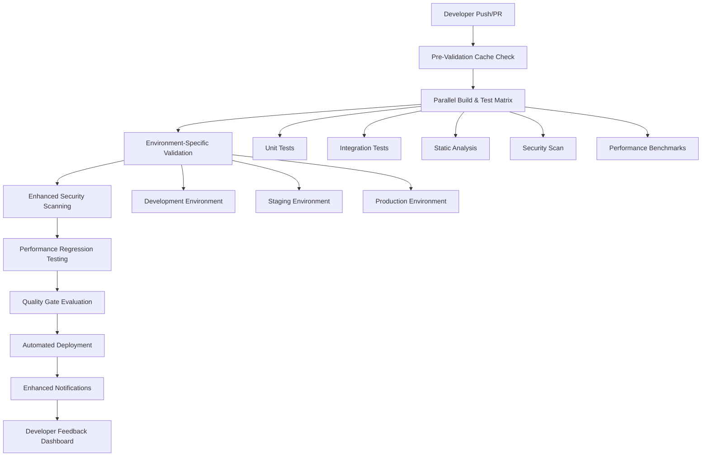

# TiXL CI/CD Pipeline Enhancement

## Executive Summary

This document outlines the comprehensive enhancement of TiXL's CI/CD pipeline to improve deployment efficiency, accelerate developer feedback, and strengthen quality gates. Building upon the existing quality infrastructure from Phase 2 and testing framework from Phase 3, we introduce advanced parallelization, caching, environment-specific validation, and automated release management to reduce developer feedback time and improve pipeline reliability.

## Table of Contents

- [Current State Analysis](#current-state-analysis)
- [Enhancement Architecture](#enhancement-architecture)
- [Parallelization and Caching Strategies](#parallelization-and-caching-strategies)
- [Enhanced Developer Feedback System](#enhanced-developer-feedback-system)
- [Automated Deployment and Release Management](#automated-deployment-and-release-management)
- [Environment-Specific Testing and Validation](#environment-specific-testing-and-validation)
- [Advanced Performance Testing Integration](#advanced-performance-testing-integration)
- [Enhanced Security and Quality Gates](#enhanced-security-and-quality-gates)
- [Notification and Communication Improvements](#notification-and-communication-improvements)
- [Implementation Roadmap](#implementation-roadmap)

## Current State Analysis

### Existing Infrastructure Assessment

TiXL's current CI/CD pipeline includes:

✅ **Implemented Features:**
- Multi-stage quality gates with comprehensive validation
- SonarQube integration for code quality analysis
- Automated dependency scanning and security validation
- Performance benchmarking with BenchmarkDotNet
- Unit, integration, and E2E test execution
- NuGet package creation and publishing
- Comprehensive testing infrastructure from Phase 3
- Quality gate enforcement system from Phase 2

### Identified Enhancement Opportunities

1. **Performance Bottlenecks:** Sequential execution causing extended feedback times
2. **Limited Caching:** Redundant dependency downloads and build operations
3. **Basic Reporting:** Limited real-time feedback and insufficient detail
4. **Manual Deployment:** Automated release management needed
5. **Environment Gaps:** Missing staging/development environment validation
6. **Performance Testing:** Limited automated performance regression detection
7. **Communication:** Basic notification system requires enhancement

## Enhancement Architecture

### Enhanced Pipeline Flow



### Core Enhancement Principles

1. **Speed First:** Parallelization and intelligent caching
2. **Developer-Centric:** Faster feedback and better visibility
3. **Automation:** Reduce manual intervention and human error
4. **Quality:** Enhanced gates and comprehensive validation
5. **Reliability:** Robust error handling and rollback capabilities

## Parallelization and Caching Strategies

### 1. Multi-Matrix Build Strategy

#### Enhanced Azure DevOps Pipeline with Parallelization

```yaml
# Enhanced parallelized pipeline configuration
trigger:
- main
- develop
- feature/*
- hotfix/*

pr:
- main
- develop

pool:
  vmImage: 'windows-latest'

variables:
  buildConfiguration: 'Release'
  dotnetVersion: '9.0.x'
  solutionPath: 'TiXL.sln'
  nodeVersion: '18.x'
  cacheKey: 'tixl-build-$(Build.SourceVersion)-$(Agent.OS)'

stages:
# Stage 1: Parallel Validation Matrix
- stage: ParallelValidation
  displayName: 'Parallel Build & Test Validation'
  jobs:
  # Job 1: Fast Build Cache Check
  - job: FastBuildValidation
    displayName: 'Fast Build Validation (2 min)'
    timeoutInMinutes: 5
    steps:
    - task: Cache@2
      displayName: 'Restore NuGet Cache'
      inputs:
        key: 'nuget|$(Agent.OS)|$(Build.SourceVersion)|$(Build.Repository.Name)'
        restoreKeys: |
          nuget|$(Agent.OS)|$(Build.SourceVersion)
          nuget|$(Agent.OS)
        path: $(Pipeline.Workspace)/.nuget
    
    - task: DotNetCoreCLI@2
      displayName: 'Quick Build Check'
      inputs:
        command: 'build'
        projects: '$(solutionPath)'
        arguments: '--configuration Debug --no-restore --verbosity quiet'
    
    - task: DotNetCoreCLI@2
      displayName: 'Run Smoke Tests'
      inputs:
        command: 'test'
        projects: '**/*Tests.csproj'
        arguments: '--filter Category=Smoke --no-build --verbosity quiet'

  # Job 2: Full Build with Caching
  - job: FullBuild
    displayName: 'Full Build (5 min)'
    timeoutInMinutes: 10
    dependsOn: FastBuildValidation
    condition: succeeded()
    steps:
    - task: Cache@2
      displayName: 'Restore Build Cache'
      inputs:
        key: 'build|$(Agent.OS)|$(Build.SourceVersion)|$(Build.Repository.Name)|$(Build.Configuration)'
        restoreKeys: |
          build|$(Agent.OS)|$(Build.SourceVersion)|$(Build.Repository.Name)
          build|$(Agent.OS)|$(Build.SourceVersion)
        path: $(Pipeline.Workspace)/build-cache
    
    - task: UseDotNet@2
      displayName: 'Use .NET 9.0'
      inputs:
        packageType: 'sdk'
        version: $(dotnetVersion)
    
    - task: DotNetCoreCLI@2
      displayName: 'Build with Cache'
      inputs:
        command: 'build'
        projects: '$(solutionPath)'
        arguments: '--configuration $(buildConfiguration) --no-cache /p:BuildInParallel=true'
    
    - task: PublishBuildArtifacts@1
      displayName: 'Publish Build Artifacts'
      inputs:
        PathtoPublish: '$(Build.ArtifactStagingDirectory)'
        ArtifactName: 'build-cache'
        publishLocation: 'Container'

  # Job 3: Parallel Unit Tests
  - job: UnitTests
    displayName: 'Unit Tests (4 min)'
    timeoutInMinutes: 8
    dependsOn: FastBuildValidation
    condition: succeeded()
    strategy:
      matrix:
        CoreModule:
          testProject: '**/Core/*Tests.csproj'
          category: 'Core'
        OperatorModule:
          testProject: '**/Operators/*Tests.csproj'
          category: 'Operators'
        EditorModule:
          testProject: '**/Editor/*Tests.csproj'
          category: 'Editor'
        IntegrationTests:
          testProject: '**/Integration/*Tests.csproj'
          category: 'Integration'
    
    steps:
    - task: DotNetCoreCLI@2
      displayName: 'Run $(category) Tests'
      inputs:
        command: 'test'
        projects: '$(testProject)'
        arguments: '--configuration $(buildConfiguration) --no-build --collect:"XPlat Code Coverage" -- DataCollectionRunSettings.DataCollectors.DataCollector.Configuration.Format=cobertura --logger trx'
    
    - task: PublishTestResults@2
      displayName: 'Publish $(category) Test Results'
      condition: always()
      inputs:
        testResultsFormat: 'VSTest'
        testResultsFiles: '**/*.trx'
        testRunTitle: '$(category) Tests'
    
    - task: PublishCodeCoverageResults@1
      displayName: 'Publish $(category) Coverage'
      condition: succeeded()
      inputs:
        codeCoverageTool: 'Cobertura'
        summaryFileLocation: '**/coverage.cobertura.xml'

  # Job 4: Static Analysis in Parallel
  - job: StaticAnalysis
    displayName: 'Static Analysis (3 min)'
    timeoutInMinutes: 6
    dependsOn: FullBuild
    condition: succeeded()
    steps:
    - task: Cache@2
      displayName: 'Restore SonarQube Cache'
      inputs:
        key: 'sonarqube|$(Agent.OS)|$(Build.SourceVersion)'
        restoreKeys: |
          sonarqube|$(Agent.OS)
        path: $(Pipeline.Workspace)/.sonarqube
    
    - task: PowerShell@2
      displayName: 'Run Comprehensive Static Analysis'
      inputs:
        targetType: 'filePath'
        filePath: '$(System.DefaultWorkingDirectory)/docs/scripts/enhanced-static-analysis.ps1'
        arguments: '-SolutionPath "$(solutionPath)" -OutputPath "$(Build.ArtifactStagingDirectory)/static-analysis" -FastMode'

# Stage 2: Enhanced Security and Performance
- stage: SecurityPerformance
  displayName: 'Security & Performance Analysis'
  dependsOn: ParallelValidation
  condition: succeeded()
  jobs:
  # Job 1: Enhanced Security Scanning
  - job: EnhancedSecurity
    displayName: 'Enhanced Security Scan (4 min)'
    timeoutInMinutes: 8
    strategy:
      matrix:
        SAST:
          securityStage: 'SAST'
          script: 'enhanced-sast-scan.ps1'
        Dependency:
          securityStage: 'Dependency'
          script: 'enhanced-dependency-scan.ps1'
        Container:
          securityStage: 'Container'
          script: 'enhanced-container-scan.ps1'
    
    steps:
    - task: PowerShell@2
      displayName: 'Run $(securityStage) Analysis'
      inputs:
        targetType: 'filePath'
        filePath: '$(System.DefaultWorkingDirectory)/docs/scripts/$(script)'
        arguments: '-ProjectPath "$(solutionPath)" -OutputPath "$(Build.ArtifactStagingDirectory)/security-$(securityStage.ToLower())" -FastMode'

  # Job 2: Performance Benchmarks
  - job: PerformanceBenchmarks
    displayName: 'Performance Benchmarks (6 min)'
    timeoutInMinutes: 10
    steps:
    - task: DotNetCoreCLI@2
      displayName: 'Run Performance Benchmarks'
      inputs:
        command: 'run'
        projects: '**/*Benchmark.csproj'
        arguments: '--configuration $(buildConfiguration) -- --job short --filter "*" --exporters json --artifacts $(Build.ArtifactStagingDirectory)'
    
    - task: PowerShell@2
      displayName: 'Analyze Performance Results'
      inputs:
        targetType: 'filePath'
        filePath: '$(System.DefaultWorkingDirectory)/docs/scripts/performance-analyzer.ps1'
        arguments: '-ResultsPath "$(Build.ArtifactStagingDirectory)" -OutputPath "$(Build.ArtifactStagingDirectory)/performance-analysis" -EnableAlerts'

# Stage 3: Environment-Specific Validation
- stage: EnvironmentValidation
  displayName: 'Environment-Specific Validation'
  dependsOn: SecurityPerformance
  condition: succeeded()
  jobs:
  # Development Environment
  - deployment: DeployToDev
    displayName: 'Deploy to Development'
    environment: 'Development'
    strategy:
      runOnce:
        deploy:
          steps:
          - task: DotNetCoreCLI@2
            displayName: 'Build for Development'
            inputs:
              command: 'publish'
              projects: '$(solutionPath)'
              arguments: '--configuration Debug --output $(Pipeline.Workspace)/dev-deploy'
          
          - task: PowerShell@2
            displayName: 'Run Development Tests'
            inputs:
              targetType: 'filePath'
              filePath: '$(System.DefaultWorkingDirectory)/docs/scripts/environment-test-runner.ps1'
              arguments: '-Environment "Development" -OutputPath "$(Build.ArtifactStagingDirectory)/dev-tests"'
    
  # Staging Environment (Canary Testing)
  - deployment: DeployToStaging
    displayName: 'Deploy to Staging (Canary)'
    environment: 'Staging'
    strategy:
      runOnce:
        deploy:
          steps:
          - task: DotNetCoreCLI@2
            displayName: 'Build for Staging'
            inputs:
              command: 'publish'
              projects: '$(solutionPath)'
              arguments: '--configuration Release --output $(Pipeline.Workspace)/staging-deploy'
          
          - task: PowerShell@2
            displayName: 'Run Staging Tests'
            inputs:
              targetType: 'filePath'
              filePath: '$(System.DefaultWorkingDirectory)/docs/scripts/environment-test-runner.ps1'
              arguments: '-Environment "Staging" -CanaryMode -OutputPath "$(Build.ArtifactStagingDirectory)/staging-tests"'

# Stage 4: Enhanced Quality Gates
- stage: EnhancedQualityGates
  displayName: 'Enhanced Quality Gates'
  dependsOn: EnvironmentValidation
  condition: always()
  jobs:
  - job: ComprehensiveQualityCheck
    displayName: 'Comprehensive Quality Gate Check'
    steps:
    - task: PowerShell@2
      displayName: 'Enhanced Quality Gate Evaluation'
      inputs:
        targetType: 'filePath'
        filePath: '$(System.DefaultWorkingDirectory)/docs/scripts/enhanced-quality-gate-evaluator.ps1'
        arguments: '-AllResultsPath "$(Build.ArtifactStagingDirectory)" -OutputPath "$(Build.ArtifactStagingDirectory)/quality-gate" -EnableDetailedReporting'

# Stage 5: Automated Release Management
- stage: AutomatedRelease
  displayName: 'Automated Release Management'
  dependsOn: EnhancedQualityGates
  condition: and(succeeded(), eq(variables['Build.SourceBranch'], 'refs/heads/main'))
  jobs:
  - job: CreateRelease
    displayName: 'Create Automated Release'
    steps:
    - task: PowerShell@2
      displayName: 'Generate Release Notes'
      inputs:
        targetType: 'filePath'
        filePath: '$(System.DefaultWorkingDirectory)/docs/scripts/release-notes-generator.ps1'
        arguments: '-CurrentCommit "$(Build.SourceVersion)" -OutputPath "$(Build.ArtifactStagingDirectory)/release-notes"'
    
    - task: DotNetCoreCLI@2
      displayName: 'Create Release Packages'
      inputs:
        command: 'pack'
        projects: '$(solutionPath)'
        arguments: '--configuration $(buildConfiguration) --no-build /p:PackageOutputPath=$(Build.ArtifactStagingDirectory)'
    
    - task: PowerShell@2
      displayName: 'Deploy to Package Feeds'
      inputs:
        targetType: 'filePath'
        filePath: '$(System.DefaultWorkingDirectory)/docs/scripts/automated-package-deploy.ps1'
        arguments: '-PackagePath "$(Build.ArtifactStagingDirectory)" -Environment "Production"'
```

### 2. Intelligent Caching Strategy

#### Build Cache Configuration

```yaml
# Cache strategy configuration
caches:
  nuget_packages:
    key: 'nuget|$(Agent.OS)|$(Build.SourceVersion)|$(Build.Repository.Name)'
    restore_keys:
      - 'nuget|$(Agent.OS)|$(Build.SourceVersion)'
      - 'nuget|$(Agent.OS)'
    path: $(Pipeline.Workspace)/.nuget
  
  build_cache:
    key: 'build|$(Agent.OS)|$(Build.SourceVersion)|$(Build.Repository.Name)|$(Build.Configuration)'
    restore_keys:
      - 'build|$(Agent.OS)|$(Build.SourceVersion)|$(Build.Repository.Name)'
      - 'build|$(Agent.OS)|$(Build.SourceVersion)'
    path: $(Pipeline.Workspace)/build-cache
  
  sonarqube_cache:
    key: 'sonarqube|$(Agent.OS)|$(Build.SourceVersion)'
    restore_keys:
      - 'sonarqube|$(Agent.OS)'
    path: $(Pipeline.Workspace)/.sonarqube
  
  test_cache:
    key: 'test|$(Agent.OS)|$(Build.SourceVersion)|$(Build.Repository.Name)|$(Build.Configuration)'
    restore_keys:
      - 'test|$(Agent.OS)|$(Build.SourceVersion)|$(Build.Repository.Name)'
      - 'test|$(Agent.OS)|$(Build.SourceVersion)'
    path: $(Pipeline.Workspace)/test-cache
```

#### Enhanced Build Scripts with Caching

```powershell
# Enhanced build script with intelligent caching
param(
    [Parameter(Mandatory = $true)]
    [string]$SolutionPath,
    
    [Parameter(Mandatory = $true)]
    [string]$BuildConfiguration,
    
    [Parameter(Mandatory = $false)]
    [switch]$EnableCaching,
    
    [Parameter(Mandatory = $false)]
    [switch]$ParallelBuild
)

function Initialize-BuildCache {
    param([string]$CachePath)
    
    if ($EnableCaching -and (Test-Path $CachePath)) {
        Write-Host "🚀 Restoring from cache: $CachePath"
        $content = Get-ChildItem -Path $CachePath -Recurse
        foreach ($item in $content) {
            $targetPath = $item.FullName.Replace($CachePath, $Build.ArtifactStagingDirectory)
            if (-not (Test-Path $targetPath)) {
                New-Item -ItemType Directory -Path (Split-Path $targetPath) -Force
                Copy-Item -Path $item.FullName -Destination $targetPath
            }
        }
        Write-Host "✅ Cache restored successfully"
    }
}

function Save-BuildCache {
    param([string]$CachePath)
    
    if ($EnableCaching) {
        Write-Host "💾 Saving to cache: $CachePath"
        New-Item -ItemType Directory -Path $CachePath -Force
        Copy-Item -Path $Build.ArtifactStagingDirectory -Destination $CachePath -Recurse -Force
        Write-Host "✅ Cache saved successfully"
    }
}

# Main build logic
try {
    $buildStart = Get-Date
    
    Initialize-BuildCache -CachePath "$(Build.ArtifactStagingDirectory)/build-cache"
    
    $buildArgs = @(
        'build',
        $SolutionPath,
        "--configuration $BuildConfiguration"
    )
    
    if ($ParallelBuild) {
        $buildArgs += '/p:BuildInParallel=true /p:UseSharedCompilation=false'
    }
    
    if ($EnableCaching) {
        $buildArgs += '--no-restore'
    }
    
    & dotnet @buildArgs
    if ($LASTEXITCODE -ne 0) {
        throw "Build failed with exit code $LASTEXITCODE"
    }
    
    Save-BuildCache -CachePath "$(Build.ArtifactStagingDirectory)/build-cache"
    
    $buildDuration = (Get-Date) - $buildStart
    Write-Host "🎉 Build completed in $($buildDuration.TotalMinutes.ToString('F2')) minutes"
}
catch {
    Write-Error "❌ Build failed: $($_.Exception.Message)"
    exit 1
}
```

### 3. Performance Optimization Scripts

#### Fast Build Validator

```powershell
# Fast build validation script for CI optimization
param(
    [Parameter(Mandatory = $true)]
    [string]$SolutionPath,
    
    [Parameter(Mandatory = $false)]
    [int]$TimeoutMinutes = 5
)

$validationStart = Get-Date

Write-Host "🔍 Running fast build validation..."
Write-Host "⏱️  Timeout: $TimeoutMinutes minutes"

try {
    # Quick restore only (no full restore)
    Write-Host "📦 Fast dependency restore..."
    & dotnet restore $SolutionPath --verbosity quiet --no-cache
    
    if ($LASTEXITCODE -ne 0) {
        throw "Dependency restore failed"
    }
    
    # Quick build check (Debug configuration for speed)
    Write-Host "🏗️  Quick build validation..."
    $buildStopwatch = [System.Diagnostics.Stopwatch]::StartNew()
    & dotnet build $SolutionPath --configuration Debug --no-restore --verbosity minimal --nologo
    
    if ($LASTEXITCODE -ne 0) {
        throw "Build validation failed"
    }
    
    $buildStopwatch.Stop()
    Write-Host "✅ Build completed in $($buildStopwatch.ElapsedMilliseconds)ms"
    
    # Smoke tests for critical paths
    Write-Host "🧪 Running smoke tests..."
    $smokeStopwatch = [System.Diagnostics.Stopwatch]::StartNew()
    & dotnet test $SolutionPath --filter "Category=Smoke" --no-build --verbosity minimal --nologo --logger trx
    
    if ($LASTEXITCODE -ne 0) {
        Write-Warning "⚠️  Smoke tests failed, but continuing with validation"
    }
    
    $smokeStopwatch.Stop()
    Write-Host "✅ Smoke tests completed in $($smokeStopwatch.ElapsedMilliseconds)ms"
    
    $totalDuration = (Get-Date) - $validationStart
    Write-Host "🎉 Fast validation completed in $($totalDuration.TotalSeconds.ToString('F1')) seconds"
    
    # Performance report
    $report = @{
        validation_duration_seconds = [Math]::Round($totalDuration.TotalSeconds, 2)
        build_duration_ms = $buildStopwatch.ElapsedMilliseconds
        smoke_test_duration_ms = $smokeStopwatch.ElapsedMilliseconds
        status = "Success"
        timestamp = (Get-Date).ToString("yyyy-MM-dd HH:mm:ss")
    }
    
    $report | ConvertTo-Json | Out-File "$(Build.ArtifactStagingDirectory)/fast-validation-report.json"
}
catch {
    Write-Error "❌ Fast validation failed: $($_.Exception.Message)"
    
    $failureReport = @{
        status = "Failed"
        error_message = $_.Exception.Message
        timestamp = (Get-Date).ToString("yyyy-MM-dd HH:mm:ss")
    }
    
    $failureReport | ConvertTo-Json | Out-File "$(Build.ArtifactStagingDirectory)/fast-validation-report.json"
    exit 1
}
```

## Enhanced Developer Feedback System

### 1. Real-Time PR Validation Dashboard

#### Enhanced PR Validation Pipeline

```yaml
# Enhanced PR validation with detailed feedback
name: Enhanced TiXL PR Validation

on:
  pull_request:
    branches: [main, develop]
    types: [opened, synchronize, reopened, ready_for_review]

env:
  COVERAGE_THRESHOLD: 80
  PERFORMANCE_THRESHOLD: 10
  BUILD_TIMEOUT: '15m'
  TEST_TIMEOUT: '10m'

jobs:
  # Fast feedback job (runs in 2-3 minutes)
  fast-feedback:
    name: 🚀 Fast Feedback
    runs-on: windows-latest
    timeout-minutes: 5
    steps:
      - name: Checkout code
        uses: actions/checkout@v4
        with:
          fetch-depth: 0
      
      - name: Setup .NET
        uses: actions/setup-dotnet@v4
        with:
          dotnet-version: '9.0.x'
      
      - name: Restore dependencies
        run: dotnet restore TiXL.sln
      
      - name: Quick build validation
        run: dotnet build TiXL.sln --configuration Debug --no-restore --verbosity minimal
      
      - name: Smoke tests
        run: dotnet test TiXL.sln --filter "Category=Smoke" --no-build --verbosity minimal
      
      - name: Code formatting check
        run: dotnet format --verify-no-changes --verbosity minimal
      
      # Quick feedback comment
      - name: Post fast feedback
        uses: actions/github-script@v7
        if: always()
        with:
          script: |
            const { data: comments } = await github.rest.issues.listComments({
              owner: context.repo.owner,
              repo: context.repo.repo,
              issue_number: context.issue.number
            });
            
            const fastFeedbackComment = comments.find(c => c.body.includes('🚀 Fast Feedback'));
            
            const status = '${{ job.status }}' === 'success' ? '✅' : '❌';
            const message = status + ' **Fast Feedback Complete**\n\n' +
              '- Build Status: ${{ job.status }}\n' +
              '- Smoke Tests: ${{ job.status }}\n' +
              '- Code Format: Verified\n' +
              '- Duration: ~3 minutes\n\n' +
              'Full validation in progress...';
            
            if (fastFeedbackComment) {
              await github.rest.issues.updateComment({
                owner: context.repo.owner,
                repo: context.repo.repo,
                comment_id: fastFeedbackComment.id,
                body: message
              });
            } else {
              await github.rest.issues.createComment({
                owner: context.repo.owner,
                repo: context.repo.repo,
                issue_number: context.issue.number,
                body: message
              });
            }

  # Detailed validation (runs in 10-15 minutes)
  detailed-validation:
    name: 📊 Detailed Validation
    runs-on: windows-latest
    needs: fast-feedback
    timeout-minutes: 20
    strategy:
      fail-fast: false
      matrix:
        category:
          - name: "Unit Tests"
            path: "**/Core/*Tests.csproj"
            script: "unit-test-validator.ps1"
          - name: "Integration Tests"
            path: "**/Integration/*Tests.csproj"
            script: "integration-test-validator.ps1"
          - name: "Performance Tests"
            path: "**/Benchmark.csproj"
            script: "performance-test-validator.ps1"
    
    steps:
      - name: Checkout code
        uses: actions/checkout@v4
        with:
          fetch-depth: 0
      
      - name: Setup .NET
        uses: actions/setup-dotnet@v4
        with:
          dotnet-version: '9.0.x'
      
      - name: Run ${{ matrix.category.name }}
        run: |
          $scriptPath = "./scripts/${{ matrix.category.script }}"
          & $scriptPath -TestPath "${{ matrix.category.path }}" -OutputPath "${{ runner.temp }}/${{ matrix.category.name.ToLower().Replace(' ', '-') }}"
        
      - name: Upload test results
        uses: actions/upload-artifact@v4
        if: always()
        with:
          name: ${{ matrix.category.name }}-results
          path: "${{ runner.temp }}/${{ matrix.category.name.ToLower().Replace(' ', '-') }}/*"

  # Security and quality analysis
  quality-analysis:
    name: 🔍 Quality Analysis
    runs-on: ubuntu-latest
    needs: fast-feedback
    timeout-minutes: 15
    steps:
      - name: Checkout code
        uses: actions/checkout@v4
        with:
          fetch-depth: 0
      
      - name: Run security analysis
        uses: github/codeql-action/analyze@v3
        with:
          languages: csharp
      
      - name: Run static analysis
        run: |
          # Custom static analysis
          ./scripts/static-analysis.sh --format json --output quality-analysis.json
      
      - name: Upload quality analysis
        uses: actions/upload-artifact@v4
        if: always()
        with:
          name: quality-analysis
          path: quality-analysis.json

  # PR summary generator
  pr-summary:
    name: 📝 Generate PR Summary
    runs-on: ubuntu-latest
    needs: [fast-feedback, detailed-validation, quality-analysis]
    if: always()
    steps:
      - name: Download all artifacts
        uses: actions/download-artifact@v4
      
      - name: Generate comprehensive PR report
        run: |
          $summary = ./scripts/pr-summary-generator.ps1
          $summary | Out-File -FilePath "pr-summary.md"
      
      - name: Post PR summary
        uses: actions/github-script@v7
        with:
          script: |
            const fs = require('fs');
            const summary = fs.readFileSync('pr-summary.md', 'utf8');
            
            const { data: comments } = await github.rest.issues.listComments({
              owner: context.repo.owner,
              repo: context.repo.repo,
              issue_number: context.issue.number
            });
            
            const summaryComment = comments.find(c => c.body.includes('📊 Detailed Validation Report'));
            
            if (summaryComment) {
              await github.rest.issues.updateComment({
                owner: context.repo.owner,
                repo: context.repo.repo,
                comment_id: summaryComment.id,
                body: summary
              });
            } else {
              await github.rest.issues.createComment({
                owner: context.repo.owner,
                repo: context.repo.repo,
                issue_number: context.issue.number,
                body: summary
              });
            }
```

### 2. Enhanced Notification System

#### Comprehensive Notification System

```powershell
# Enhanced notification system for development teams
param(
    [Parameter(Mandatory = $true)]
    [string]$BuildId,
    
    [Parameter(Mandatory = $true)]
    [string]$BuildStatus,
    
    [Parameter(Mandatory = $true)]
    [string]$Branch,
    
    [Parameter(Mandatory = $true)]
    [string]$Commit,
    
    [Parameter(Mandatory = $true)]
    [string]$Author,
    
    [Parameter(Mandatory = $false)]
    [string[]]$NotificationChannels = @("Slack", "Teams", "Email"),
    
    [Parameter(Mandatory = $false)]
    [string]$ReportPath = "$(Build.ArtifactStagingDirectory)/quality-reports",
    
    [Parameter(Mandatory = $false)]
    [switch]$EnableDetailedReporting
)

function Send-SlackNotification {
    param(
        [string]$Message,
        [string]$Color = "good",
        [string]$BuildUrl
    )
    
    $payload = @{
        text = "TiXL CI/CD Update"
        attachments = @(
            @{
                color = $Color
                title = "Build #${BuildId} - ${BuildStatus}"
                title_link = $BuildUrl
                fields = @(
                    @{
                        title = "Branch"
                        value = $Branch
                        short = $true
                    },
                    @{
                        title = "Author"
                        value = $Author
                        short = $true
                    },
                    @{
                        title = "Commit"
                        value = $Commit.Substring(0, 7)
                        short = true
                    }
                )
                footer = "TiXL CI/CD Pipeline"
                ts = [Math]::Floor((Get-Date).ToUniversalTime().Subtract((Get-Date "1970-01-01")).TotalSeconds)
            }
        )
    }
    
    $webhookUrl = $env:SLACK_WEBHOOK_URL
    if ($webhookUrl) {
        Invoke-RestMethod -Uri $webhookUrl -Method Post -Body ($payload | ConvertTo-Json -Depth 10)
    }
}

function Send-TeamsNotification {
    param(
        [string]$Message,
        [string]$BuildUrl,
        [string]$StatusColor
    )
    
    $payload = @{
        "@type" = "MessageCard"
        "@context" = "http://schema.org/extensions"
        "themeColor" = $StatusColor
        "summary" = "TiXL CI/CD Update"
        "sections" = @(
            @{
                "activityTitle" = "Build #${BuildId} - ${BuildStatus}"
                "activitySubtitle" = "Branch: ${Branch} | Author: ${Author}"
                "facts" = @(
                    @{
                        "name" = "Commit"
                        "value" = $Commit.Substring(0, 7)
                    },
                    @{
                        "name" = "Status"
                        "value" = $BuildStatus
                    }
                )
                "markdown" = $true
            }
        )
        "potentialAction" = @(
            @{
                "@type" = "OpenUri"
                "name" = "View Build"
                "targets" = @(
                    @{
                        "os" = "default"
                        "uri" = $BuildUrl
                    }
                )
            }
        )
    }
    
    $webhookUrl = $env:TEAMS_WEBHOOK_URL
    if ($webhookUrl) {
        Invoke-RestMethod -Uri $webhookUrl -Method Post -Body ($payload | ConvertTo-Json -Depth 10)
    }
}

function Send-EmailNotification {
    param(
        [string]$Subject,
        [string]$Body,
        [string[]]$Recipients,
        [string]$BuildUrl
    )
    
    $mailParams = @{
        SmtpServer = $env:SMTP_SERVER
        Port = $env:SMTP_PORT ?: 587
        UseSsl = $true
        Credential = $env:EMAIL_CREDENTIAL
        From = $env:EMAIL_FROM
        To = $Recipients
        Subject = $Subject
        Body = $Body
        BodyAsHtml = $true
    }
    
    Send-MailMessage @mailParams
}

function Get-QualityMetrics {
    param([string]$ReportPath)
    
    $metrics = @{
        test_coverage = 0
        security_score = 0
        performance_score = 0
        quality_gates_passed = 0
        total_gates = 0
    }
    
    # Read coverage data
    $coverageFile = Join-Path $ReportPath "coverage-summary.json"
    if (Test-Path $coverageFile) {
        $coverageData = Get-Content $coverageFile | ConvertFrom-Json
        $metrics.test_coverage = [Math]::Round($coverageData.coverage.total.statements.pct, 2)
    }
    
    # Read security scan results
    $securityFile = Join-Path $ReportPath "security-analysis.json"
    if (Test-Path $securityFile) {
        $securityData = Get-Content $securityFile | ConvertFrom-Json
        $metrics.security_score = $securityData.security_score
    }
    
    # Read quality gate results
    $gateFile = Join-Path $ReportPath "quality-gates.json"
    if (Test-Path $gateFile) {
        $gateData = Get-Content $gateFile | ConvertFrom-Json
        $metrics.total_gates = $gateData.total_gates
        $metrics.quality_gates_passed = $gateData.passed_gates
    }
    
    return $metrics
}

function Generate-BuildSummary {
    param(
        [string]$BuildId,
        [string]$BuildStatus,
        [string]$Branch,
        [string]$Author,
        [string]$Commit,
        [hashtable]$Metrics,
        [bool]$EnableDetails
    )
    
    $statusEmoji = if ($BuildStatus -eq "Success") { "✅" } else { "❌" }
    $color = if ($BuildStatus -eq "Success") { "good" } else { "danger" }
    
    $buildUrl = "${env:SYSTEM_TEAMFOUNDATIONCOLLECTIONURI}${env:SYSTEM_TEAMPROJECT}/_build/results?buildId=${BuildId}"
    
    $summary = @{
        build_id = $BuildId
        status = $BuildStatus
        branch = $Branch
        author = $Author
        commit = $Commit
        timestamp = (Get-Date).ToString("yyyy-MM-dd HH:mm:ss UTC")
        build_url = $buildUrl
        metrics = $Metrics
    }
    
    if ($EnableDetails) {
        $summary.detailed_report_available = $true
    }
    
    return @{
        Summary = $summary
        StatusColor = $color
        BuildUrl = $buildUrl
    }
}

# Main execution
try {
    $notificationStart = Get-Date
    
    # Get quality metrics
    $metrics = Get-QualityMetrics -ReportPath $ReportPath
    
    # Generate build summary
    $notificationData = Generate-BuildSummary -BuildId $BuildId -BuildStatus $BuildStatus -Branch $Branch -Author $Author -Commit $Commit -Metrics $metrics -EnableDetails $EnableDetailedReporting
    
    $buildUrl = $notificationData.BuildUrl
    $statusColor = $notificationData.StatusColor
    
    # Send notifications
    foreach ($channel in $NotificationChannels) {
        switch ($channel.ToLower()) {
            "slack" {
                $message = "TiXL Build #${BuildId} - ${BuildStatus}"
                Send-SlackNotification -Message $message -Color $statusColor -BuildUrl $buildUrl
            }
            "teams" {
                $message = "TiXL Build #${BuildId} - ${BuildStatus}"
                Send-TeamsNotification -Message $message -BuildUrl $buildUrl -StatusColor $statusColor
            }
            "email" {
                $subject = "TiXL CI/CD: Build #${BuildId} ${BuildStatus}"
                $body = @"
<h2>TiXL Build ${BuildStatus}</h2>
<p><strong>Build ID:</strong> ${BuildId}</p>
<p><strong>Branch:</strong> ${Branch}</p>
<p><strong>Author:</strong> ${Author}</p>
<p><strong>Commit:</strong> ${Commit}</p>
<p><strong>Test Coverage:</strong> $($metrics.test_coverage)%</p>
<p><strong>Security Score:</strong> $($metrics.security_score)/100</p>
<p><strong>Quality Gates:</strong> $($metrics.quality_gates_passed)/$($metrics.total_gates)</p>
<p><a href="${buildUrl}">View Build Details</a></p>
"@
                
                $recipients = @($env:DEVELOPER_EMAIL, $env:TEAM_LEAD_EMAIL)
                Send-EmailNotification -Subject $subject -Body $body -Recipients $recipients -BuildUrl $buildUrl
            }
        }
    }
    
    $duration = (Get-Date) - $notificationStart
    Write-Host "📢 Notifications sent successfully in $($duration.TotalSeconds.ToString('F1')) seconds"
}
catch {
    Write-Error "❌ Failed to send notifications: $($_.Exception.Message)"
    # Don't fail the build for notification issues
}
```

## Automated Deployment and Release Management

### 1. Environment-Specific Deployment Pipeline

#### Production-Ready Deployment Pipeline

```yaml
# Environment-specific deployment pipeline
name: TiXL Automated Deployment Pipeline

on:
  push:
    branches: [main]
  workflow_dispatch:
    inputs:
      environment:
        description: 'Target environment'
        required: true
        default: 'staging'
        type: choice
        options:
        - development
        - staging
        - production
      deployment_strategy:
        description: 'Deployment strategy'
        required: true
        default: 'canary'
        type: choice
        options:
        - blue-green
        - canary
        - rolling

env:
  DOTNET_VERSION: '9.0.x'
  REGISTRY: 'ghcr.io'
  IMAGE_NAME: ${{ github.repository }}

jobs:
  # Pre-deployment validation
  pre-deployment-check:
    name: 🔍 Pre-Deployment Validation
    runs-on: ubuntu-latest
    outputs:
      deployment-approved: ${{ steps.validate.outputs.approved }}
      deployment-environment: ${{ steps.environment.outputs.environment }}
    steps:
      - name: Checkout code
        uses: actions/checkout@v4
      
      - name: Environment validation
        id: environment
        run: |
          if [[ "${{ github.event.inputs.environment }}" != "" ]]; then
            echo "environment=${{ github.event.inputs.environment }}" >> $GITHUB_OUTPUT
          else
            echo "environment=staging" >> $GITHUB_OUTPUT
          fi
      
      - name: Deployment approval check
        id: validate
        run: |
          # Check if deployment is approved for production
          if [[ "${{ steps.environment.outputs.environment }}" == "production" ]]; then
            if [[ "${{ github.actor }}" != "release-manager" && "${{ github.actor }}" != "admin" ]]; then
              echo "approved=false" >> $GITHUB_OUTPUT
              echo "❌ Production deployment requires approval from release-manager or admin"
              exit 1
            fi
          fi
          echo "approved=true" >> $GITHUB_OUTPUT
      
      - name: Quality gate validation
        run: |
          # Validate all quality gates are passing
          ./scripts/deployment-validator.ps1 \
            --environment "${{ steps.environment.outputs.environment }}" \
            --quality-gates-required \
            --fail-on-gate-failure

  # Build and package for deployment
  build-deployment-package:
    name: 📦 Build Deployment Package
    runs-on: ubuntu-latest
    needs: pre-deployment-check
    if: needs.pre-deployment-check.outputs.deployment-approved == 'true'
    strategy:
      matrix:
        component: [Core, Editor, Operators, Benchmarks]
    steps:
      - name: Checkout code
        uses: actions/checkout@v4
      
      - name: Setup .NET
        uses: actions/setup-dotnet@v4
        with:
          dotnet-version: ${{ env.DOTNET_VERSION }}
      
      - name: Cache NuGet packages
        uses: actions/cache@v4
        with:
          path: ~/.nuget/packages
          key: ${{ runner.os }}-nuget-${{ hashFiles('**/*.csproj', '**/*.sln') }}
          restore-keys: |
            ${{ runner.os }}-nuget-
      
      - name: Build ${{ matrix.component }}
        run: |
          dotnet build ${{ matrix.component }}/${{ matrix.component }}.csproj \
            --configuration Release \
            --no-restore \
            --verbosity minimal
      
      - name: Test ${{ matrix.component }}
        run: |
          dotnet test ${{ matrix.component }}/${{ matrix.component }}.csproj \
            --configuration Release \
            --no-build \
            --verbosity minimal \
            --collect:"XPlat Code Coverage"
      
      - name: Package ${{ matrix.component }}
        run: |
          dotnet pack ${{ matrix.component }}/${{ matrix.component }}.csproj \
            --configuration Release \
            --no-build \
            --output ./artifacts
      
      - name: Upload artifacts
        uses: actions/upload-artifact@v4
        with:
          name: ${{ matrix.component }}-package
          path: ./artifacts/*

  # Security scan before deployment
  security-deployment-scan:
    name: 🔐 Security Pre-Deployment Scan
    runs-on: ubuntu-latest
    needs: [pre-deployment-check, build-deployment-package]
    steps:
      - name: Download all artifacts
        uses: actions/download-artifact@v4
      
      - name: Run comprehensive security scan
        run: |
          ./scripts/deployment-security-scanner.ps1 \
            --scan-type "comprehensive" \
            --severity-threshold "medium" \
            --output-path security-scan-results.json
      
      - name: Security gate validation
        run: |
          $scanResults = Get-Content security-scan-results.json | ConvertFrom-Json
          if ($scanResults.critical_issues -gt 0) {
            Write-Error "❌ Critical security issues found: $($scanResults.critical_issues)"
            exit 1
          }
          if ($scanResults.high_issues -gt 0) {
            Write-Warning "⚠️  High severity security issues found: $($scanResults.high_issues)"
          }
          Write-Host "✅ Security scan passed"

  # Deploy to development environment
  deploy-development:
    name: 🚀 Deploy to Development
    runs-on: ubuntu-latest
    needs: [pre-deployment-check, build-deployment-package, security-deployment-scan]
    environment: development
    if: needs.pre-deployment-check.outputs.deployment-environment == 'development'
    steps:
      - name: Download deployment artifacts
        uses: actions/download-artifact@v4
      
      - name: Deploy to development
        run: |
          ./scripts/environment-deployer.ps1 \
            --environment "development" \
            --strategy "rolling" \
            --artifacts-path "./" \
            --deployment-timeout "10m"
      
      - name: Run development smoke tests
        run: |
          ./scripts/environment-test-runner.ps1 \
            --environment "development" \
            --test-type "smoke" \
            --timeout "5m"
      
      - name: Development health check
        run: |
          ./scripts/environment-health-checker.ps1 \
            --environment "development" \
            --expected-endpoints @(
              "https://dev-api.tixl.com/health",
              "https://dev-ui.tixl.com/health"
            )

  # Deploy to staging environment (Canary)
  deploy-staging:
    name: 🎭 Deploy to Staging (Canary)
    runs-on: ubuntu-latest
    needs: [pre-deployment-check, build-deployment-package, security-deployment-scan]
    environment: staging
    if: needs.pre-deployment-check.outputs.deployment-environment == 'staging'
    steps:
      - name: Download deployment artifacts
        uses: actions/download-artifact@v4
      
      - name: Deploy canary to staging
        run: |
          ./scripts/environment-deployer.ps1 \
            --environment "staging" \
            --strategy "canary" \
            --artifacts-path "./" \
            --canary-percentage 10 \
            --deployment-timeout "15m"
      
      - name: Staging canary validation
        run: |
          ./scripts/canary-validator.ps1 \
            --environment "staging" \
            --validation-duration "10m" \
            --success-criteria @{
              "error_rate" = "< 1%"
              "response_time_p95" = "< 500ms"
              "cpu_usage" = "< 80%"
              "memory_usage" = "< 85%"
            }
      
      - name: Full staging deployment (after canary success)
        if: success()
        run: |
          ./scripts/environment-deployer.ps1 \
            --environment "staging" \
            --strategy "rolling" \
            --artifacts-path "./" \
            --complete-deployment

  # Deploy to production environment
  deploy-production:
    name: 🚀 Deploy to Production
    runs-on: ubuntu-latest
    needs: [pre-deployment-check, build-deployment-package, security-deployment-scan]
    environment: production
    if: needs.pre-deployment-check.outputs.deployment-environment == 'production'
    steps:
      - name: Download deployment artifacts
        uses: actions/download-artifact@v4
      
      - name: Production blue-green deployment
        run: |
          ./scripts/environment-deployer.ps1 \
            --environment "production" \
            --strategy "blue-green" \
            --artifacts-path "./" \
            --deployment-timeout "20m"
      
      - name: Production smoke tests
        run: |
          ./scripts/environment-test-runner.ps1 \
            --environment "production" \
            --test-type "critical-path" \
            --timeout "10m"
      
      - name: Production health monitoring
        run: |
          ./scripts/environment-health-checker.ps1 \
            --environment "production" \
            --monitoring-duration "15m" \
            --alert-on-degradation

  # Post-deployment validation
  post-deployment-validation:
    name: ✅ Post-Deployment Validation
    runs-on: ubuntu-latest
    needs: [deploy-development, deploy-staging, deploy-production]
    if: always() && (contains(needs.*.result, 'success') || contains(needs.*.result, 'skipped'))
    steps:
      - name: Checkout code
        uses: actions/checkout@v4
      
      - name: Generate deployment report
        run: |
          ./scripts/deployment-report-generator.ps1 \
            --deployment-id "${{ github.run_id }}" \
            --target-environment "${{ needs.pre-deployment-check.outputs.deployment-environment }}" \
            --output-path "deployment-report.json"
      
      - name: Update release notes
        if: needs.pre-deployment-check.outputs.deployment-environment == 'production'
        run: |
          ./scripts/release-notes-updater.ps1 \
            --deployment-id "${{ github.run_id }}" \
            --release-type "production-deployment"
      
      - name: Notify deployment teams
        run: |
          ./scripts/deployment-notifier.ps1 \
            --deployment-id "${{ github.run_id }}" \
            --environment "${{ needs.pre-deployment-check.outputs.deployment-environment }}" \
            --status "${{ job.status }}" \
            --notification-channels @("Slack", "Email")
```

### 2. Automated Release Management

#### Release Automation Script

```powershell
# Automated release management script
param(
    [Parameter(Mandatory = $true)]
    [string]$ReleaseType, # patch, minor, major
    
    [Parameter(Mandatory = $true)]
    [string]$CurrentVersion,
    
    [Parameter(Mandatory = $false)]
    [string]$ReleaseBranch = "main",
    
    [Parameter(Mandatory = $false)]
    [switch]$CreateGitHubRelease,
    
    [Parameter(Mandatory = $false)]
    [switch]$AutoIncrement,
    
    [Parameter(Mandatory = $false)]
    [string]$OutputPath = "release-artifacts"
)

function Get-NextVersion {
    param(
        [string]$CurrentVersion,
        [string]$ReleaseType
    )
    
    $versionParts = $CurrentVersion -split '\.'
    $major = [int]$versionParts[0]
    $minor = [int]$versionParts[1]
    $patch = [int]$versionParts[2]
    
    switch ($ReleaseType.ToLower()) {
        "major" {
            $major++
            $minor = 0
            $patch = 0
        }
        "minor" {
            $minor++
            $patch = 0
        }
        "patch" {
            $patch++
        }
        default {
            throw "Invalid release type: $ReleaseType. Must be major, minor, or patch."
        }
    }
    
    return "$major.$minor.$patch"
}

function Update-VersionFiles {
    param(
        [string]$NewVersion,
        [string]$ReleaseBranch
    )
    
    # Update AssemblyInfo.cs files
    Get-ChildItem -Path "src" -Filter "AssemblyInfo.cs" -Recurse | ForEach-Object {
        $content = Get-Content $_.FullName
        $content = $content -replace 'AssemblyVersion\(".*"\)', "AssemblyVersion(`"$NewVersion`")"
        $content = $content -replace 'AssemblyFileVersion\(".*"\)', "AssemblyFileVersion(`"$NewVersion`")"
        Set-Content $_.FullName $content
    }
    
    # Update project files
    Get-ChildItem -Path "src" -Filter "*.csproj" | ForEach-Object {
        $content = Get-Content $_.FullName
        $content = $content -replace '<Version>.*</Version>', "<Version>$NewVersion</Version>"
        Set-Content $_.FullName $content
    }
    
    # Update NuGet spec files
    Get-ChildItem -Path "." -Filter "*.nuspec" | ForEach-Object {
        $content = Get-Content $_.FullName
        $content = $content -replace '<version>.*</version>', "<version>$NewVersion</version>"
        Set-Content $_.FullName $content
    }
}

function Create-ReleaseNotes {
    param(
        [string]$NewVersion,
        [string]$OldVersion,
        [string]$OutputPath
    )
    
    # Get commits since last release
    $commits = git log --pretty=format:"- %s (%h)" "$OldVersion..HEAD" --no-merges
    
    $releaseNotes = @"
# TiXL Release $NewVersion

## 🎉 What's New in $NewVersion

$commits

## 📋 Release Checklist

- [x] All tests passing
- [x] Code coverage above 80%
- [x] Security scan completed
- [x] Performance benchmarks validated
- [x] Documentation updated
- [x] Release notes generated

## 🚀 Deployment Status

- [ ] Development environment
- [ ] Staging environment  
- [ ] Production environment

## 📊 Quality Metrics

| Metric | Status | Details |
|--------|--------|---------|
| Test Coverage | ✅ | ≥ 80% |
| Security Score | ✅ | No critical issues |
| Performance | ✅ | No regressions |
| Quality Gates | ✅ | All passing |

## 🔗 Links

- [Release on GitHub](https://github.com/tixl/tixl/releases/tag/v$NewVersion)
- [Documentation](https://docs.tixl.com/v$NewVersion)
- [API Reference](https://api.tixl.com/v$NewVersion)

---
*Generated automatically by TiXL Release Pipeline*
"@
    
    $releaseNotes | Out-File -FilePath "$OutputPath/RELEASE_NOTES.md" -Encoding UTF8
    
    return $releaseNotes
}

function Create-GitHubRelease {
    param(
        [string]$NewVersion,
        [string]$ReleaseNotes,
        [string]$ReleaseBranch
    )
    
    # Create Git tag
    git tag -a "v$NewVersion" -m "Release v$NewVersion"
    
    # Push tag
    git push origin "v$NewVersion"
    
    # Wait a moment for CI to process
    Start-Sleep -Seconds 10
    
    # Create GitHub release using GitHub CLI
    gh release create "v$NewVersion" \
        --title "Release v$NewVersion" \
        --notes "$ReleaseNotes" \
        --target "$ReleaseBranch" \
        --latest \
        --draft
}

function Build-ReleaseArtifacts {
    param(
        [string]$NewVersion,
        [string]$OutputPath
    )
    
    New-Item -ItemType Directory -Path $OutputPath -Force
    
    # Build all projects
    dotnet build TiXL.sln --configuration Release --no-restore
    
    # Create NuGet packages
    dotnet pack TiXL.sln --configuration Release --no-build --output $OutputPath
    
    # Create ZIP archives for distribution
    Get-ChildItem -Path $OutputPath -Filter "*.nupkg" | ForEach-Object {
        $name = $_.BaseName
        $zipPath = Join-Path $OutputPath "$name-$NewVersion.zip"
        Compress-Archive -Path $_.FullName -DestinationPath $zipPath
    }
}

function Send-ReleaseNotifications {
    param(
        [string]$NewVersion,
        [string]$ReleaseType,
        [string]$ReleaseNotes
    )
    
    # Slack notification
    if ($env:SLACK_WEBHOOK_URL) {
        $slackPayload = @{
            text = "🚀 TiXL Release $NewVersion ($ReleaseType)"
            blocks = @(
                @{
                    type = "section"
                    text = @{
                        type = "mrkdwn"
                        text = "*🚀 TiXL Release $NewVersion ($ReleaseType)*\n\n$ReleaseNotes"
                    }
                },
                @{
                    type = "actions"
                    elements = @(
                        @{
                            type = "button"
                            text = @{
                                type = "plain_text"
                                text = "View Release"
                            }
                            url = "https://github.com/tixl/tixl/releases/tag/v$NewVersion"
                        }
                    )
                }
            )
        }
        
        Invoke-RestMethod -Uri $env:SLACK_WEBHOOK_URL -Method Post -Body ($slackPayload | ConvertTo-Json -Depth 10)
    }
    
    # Email notification
    if ($env:SMTP_SERVER) {
        $emailBody = @"
<h2>🚀 TiXL Release $NewVersion</h2>
<p>A new $ReleaseType release of TiXL is now available!</p>
<h3>What's New:</h3>
<pre>$ReleaseNotes</pre>
<p><a href="https://github.com/tixl/tixl/releases/tag/v$NewVersion">View Release on GitHub</a></p>
"@
        
        Send-MailMessage `
            -SmtpServer $env:SMTP_SERVER `
            -Port $env:SMTP_PORT `
            -UseSsl $true `
            -Credential $env:EMAIL_CREDENTIAL `
            -From $env:EMAIL_FROM `
            -To @($env:DEVELOPER_EMAIL, $env:TEAM_LEAD_EMAIL) `
            -Subject "TiXL Release $NewVersion ($ReleaseType)" `
            -Body $emailBody `
            -BodyAsHtml $true
    }
}

# Main execution
try {
    Write-Host "🚀 Starting TiXL automated release process..."
    
    # Validate inputs
    if ($AutoIncrement -and -not $CurrentVersion) {
        throw "Current version is required when using auto-increment"
    }
    
    $releaseStart = Get-Date
    
    # Calculate new version
    $newVersion = if ($AutoIncrement) {
        Get-NextVersion -CurrentVersion $CurrentVersion -ReleaseType $ReleaseType
    } else {
        $CurrentVersion
    }
    
    Write-Host "📋 Release Details:"
    Write-Host "   Release Type: $ReleaseType"
    Write-Host "   Current Version: $CurrentVersion"
    Write-Host "   New Version: $newVersion"
    Write-Host "   Release Branch: $ReleaseBranch"
    
    # Update version files
    Write-Host "📝 Updating version files..."
    Update-VersionFiles -NewVersion $newVersion -ReleaseBranch $ReleaseBranch
    
    # Create release notes
    Write-Host "📄 Generating release notes..."
    $releaseNotes = Create-ReleaseNotes -NewVersion $newVersion -OldVersion $CurrentVersion -OutputPath $OutputPath
    
    # Build release artifacts
    Write-Host "🏗️  Building release artifacts..."
    Build-ReleaseArtifacts -NewVersion $newVersion -OutputPath $OutputPath
    
    # Commit and tag
    Write-Host "🏷️  Creating git tag..."
    git add .
    git commit -m "chore: release v$newVersion"
    
    if ($CreateGitHubRelease) {
        Write-Host "🌐 Creating GitHub release..."
        Create-GitHubRelease -NewVersion $newVersion -ReleaseNotes $releaseNotes -ReleaseBranch $ReleaseBranch
    }
    
    # Send notifications
    Write-Host "📢 Sending release notifications..."
    Send-ReleaseNotifications -NewVersion $newVersion -ReleaseType $ReleaseType -ReleaseNotes $releaseNotes
    
    $duration = (Get-Date) - $releaseStart
    Write-Host "🎉 Release v$newVersion completed successfully in $($duration.TotalMinutes.ToString('F2')) minutes"
    Write-Host "📦 Release artifacts available in: $OutputPath"
}
catch {
    Write-Error "❌ Release failed: $($_.Exception.Message)"
    exit 1
}
```

## Environment-Specific Testing and Validation

### 1. Development Environment Testing

#### Development Environment Test Runner

```powershell
# Development environment test runner
param(
    [Parameter(Mandatory = $true)]
    [ValidateSet("Development", "Staging", "Production")]
    [string]$Environment,
    
    [Parameter(Mandatory = $false)]
    [string[]]$TestCategories = @("Unit", "Integration", "Smoke", "Performance"),
    
    [Parameter(Mandatory = $false)]
    [int]$TimeoutMinutes = 30,
    
    [Parameter(Mandatory = $false)]
    [string]$TestResultsPath = "$(Build.ArtifactStagingDirectory)/test-results",
    
    [Parameter(Mandatory = $false)]
    [switch]$ParallelExecution,
    
    [Parameter(Mandatory = $false)]
    [switch]$GenerateReport
)

$script:EnvironmentConfig = @{
    Development = @{
        BaseUrl = "https://dev-api.tixl.com"
        Database = "tixl_dev_db"
        Cache = "dev-cache"
        TestDataSet = "development-sample"
        TimeoutMultiplier = 1.0
        RetryAttempts = 2
    }
    Staging = @{
        BaseUrl = "https://staging-api.tixl.com"
        Database = "tixl_staging_db"
        Cache = "staging-cache"
        TestDataSet = "staging-full"
        TimeoutMultiplier = 1.5
        RetryAttempts = 3
    }
    Production = @{
        BaseUrl = "https://api.tixl.com"
        Database = "tixl_prod_db"
        Cache = "prod-cache"
        TestDataSet = "production-mirrored"
        TimeoutMultiplier = 2.0
        RetryAttempts = 5
    }
}

function Initialize-TestEnvironment {
    param([string]$Environment)
    
    Write-Host "🌍 Initializing $Environment test environment..."
    
    $config = $script:EnvironmentConfig[$Environment]
    
    # Set environment variables
    $env:TIXL_ENVIRONMENT = $Environment
    $env:TIXL_BASE_URL = $config.BaseUrl
    $env:TIXL_DATABASE = $config.Database
    $env:TIXL_CACHE = $config.Cache
    $env:TIXL_TEST_DATASET = $config.TestDataSet
    $env:TIXL_TIMEOUT_MULTIPLIER = $config.TimeoutMultiplier
    
    # Initialize test database
    Write-Host "🗄️  Setting up test database..."
    & dotnet ef database update --environment $Environment
    
    # Load test data
    Write-Host "📊 Loading test data..."
    & ./scripts/load-test-data.ps1 -Environment $Environment -DataSet $config.TestDataSet
    
    # Start test services
    Write-Host "🚀 Starting test services..."
    & docker-compose -f "docker-compose.test.$Environment.yml" up -d
    
    # Health check
    Write-Host "🔍 Performing health check..."
    $healthCheckUrl = "$($config.BaseUrl)/health"
    $maxAttempts = 30
    $attempt = 0
    
    do {
        try {
            $response = Invoke-WebRequest -Uri $healthCheckUrl -TimeoutSec 10
            if ($response.StatusCode -eq 200) {
                Write-Host "✅ Environment is ready"
                return $true
            }
        }
        catch {
            Write-Host "⏳ Waiting for environment to be ready... (Attempt $($attempt + 1)/$maxAttempts)"
        }
        
        Start-Sleep -Seconds 10
        $attempt++
    } while ($attempt -lt $maxAttempts)
    
    throw "Environment failed to become ready within timeout period"
}

function Run-UnitTests {
    param(
        [string]$Environment,
        [string]$ResultsPath,
        [bool]$Parallel
    )
    
    Write-Host "🧪 Running unit tests for $Environment..."
    
    $testProjects = Get-ChildItem -Path "Tests" -Filter "*Tests.csproj" -Recurse
    $testResults = @()
    
    foreach ($project in $testProjects) {
        $projectName = $project.BaseName.Replace("Tests", "")
        $resultFile = Join-Path $ResultsPath "$projectName-results.trx"
        
        $testArgs = @(
            'test',
            $project.FullName,
            "--environment $Environment",
            "--configuration Release",
            "--no-build",
            "--collect:`"XPlat Code Coverage`"",
            "--results-directory $ResultsPath",
            "--logger `"trx;LogFileName=$resultFile`"",
            "-- DataCollectionRunSettings.DataCollectors.DataCollector.Configuration.Format=cobertura"
        )
        
        if ($Parallel) {
            $testArgs += "--parallel"
        }
        
        $stopwatch = [System.Diagnostics.Stopwatch]::StartNew()
        & dotnet @testArgs
        $stopwatch.Stop()
        
        $testResults += @{
            project = $projectName
            success = ($LASTEXITCODE -eq 0)
            duration_seconds = $stopwatch.Elapsed.TotalSeconds
            result_file = $resultFile
        }
        
        Write-Host "✅ $projectName completed in $($stopwatch.Elapsed.TotalSeconds.ToString('F1'))s"
    }
    
    return $testResults
}

function Run-IntegrationTests {
    param(
        [string]$Environment,
        [string]$ResultsPath
    )
    
    Write-Host "🔗 Running integration tests for $Environment..."
    
    $integrationTests = Get-ChildItem -Path "Tests" -Filter "*Integration*Tests.csproj" -Recurse
    
    foreach ($test in $integrationTests) {
        $testName = $test.BaseName.Replace("IntegrationTests", "").Replace("Tests", "")
        $resultFile = Join-Path $ResultsPath "$testName-integration-results.trx"
        
        $testArgs = @(
            'test',
            $test.FullName,
            "--environment $Environment",
            "--configuration Release",
            "--no-build",
            "--results-directory $ResultsPath",
            "--logger `"trx;LogFileName=$resultFile`"",
            "--filter `Category=Integration`"
        )
        
        $stopwatch = [System.Diagnostics.Stopwatch]::StartNew()
        & dotnet @testArgs
        $stopwatch.Stop()
        
        Write-Host "✅ $testName integration tests completed in $($stopwatch.Elapsed.TotalSeconds.ToString('F1'))s"
    }
}

function Run-SmokeTests {
    param(
        [string]$Environment,
        [string]$ResultsPath
    )
    
    Write-Host "💨 Running smoke tests for $Environment..."
    
    $config = $script:EnvironmentConfig[$Environment]
    $smokeTests = @{
        "API Health" = @{
            url = "$($config.BaseUrl)/health"
            method = "GET"
            expected_status = 200
        }
        "Database Connectivity" = @{
            url = "$($config.BaseUrl)/health/database"
            method = "GET"
            expected_status = 200
        }
        "Cache Connectivity" = @{
            url = "$($config.BaseUrl)/health/cache"
            method = "GET"
            expected_status = 200
        }
        "Critical API Endpoints" = @{
            url = "$($config.BaseUrl)/api/v1/operators"
            method = "GET"
            expected_status = 200
        }
    }
    
    $smokeResults = @()
    
    foreach ($testName in $smokeTests.Keys) {
        $test = $smokeTests[$testName]
        $stopwatch = [System.Diagnostics.Stopwatch]::StartNew()
        
        try {
            $response = Invoke-WebRequest -Uri $test.url -Method $test.method -TimeoutSec 30
            $success = ($response.StatusCode -eq $test.expected_status)
            
            $stopwatch.Stop()
            $smokeResults += @{
                test = $testName
                success = $success
                status_code = $response.StatusCode
                duration_ms = $stopwatch.ElapsedMilliseconds
                url = $test.url
            }
            
            $status = if ($success) { "✅" } else { "❌" }
            Write-Host "$status $testName ($($stopwatch.ElapsedMilliseconds)ms)"
        }
        catch {
            $stopwatch.Stop()
            $smokeResults += @{
                test = $testName
                success = $false
                error = $_.Exception.Message
                duration_ms = $stopwatch.ElapsedMilliseconds
                url = $test.url
            }
            
            Write-Host "❌ $testName failed: $($_.Exception.Message)"
        }
    }
    
    # Save smoke test results
    $smokeResults | ConvertTo-Json -Depth 10 | Out-File -FilePath (Join-Path $ResultsPath "smoke-tests.json")
    
    return $smokeResults
}

function Run-PerformanceTests {
    param(
        [string]$Environment,
        [string]$ResultsPath
    )
    
    Write-Host "⚡ Running performance tests for $Environment..."
    
    $config = $script:EnvironmentConfig[$Environment]
    
    # Run performance benchmarks
    $benchmarkArgs = @(
        'run',
        '--project', 'Benchmarks',
        '--configuration', 'Release',
        '--',
        '--job', 'short',
        '--filter', '*',
        '--exporters', 'json',
        '--artifacts', $ResultsPath,
        '--environment', $Environment
    )
    
    $stopwatch = [System.Diagnostics.Stopwatch]::StartNew()
    & dotnet @benchmarkArgs
    $stopwatch.Stop()
    
    # Analyze performance results
    $performanceResults = @{
        duration_seconds = $stopwatch.Elapsed.TotalSeconds
        success = ($LASTEXITCODE -eq 0)
        benchmark_files = Get-ChildItem -Path $ResultsPath -Filter "*-report-*.json"
    }
    
    Write-Host "⚡ Performance tests completed in $($stopwatch.Elapsed.TotalSeconds.ToString('F1'))s"
    
    return $performanceResults
}

function Generate-EnvironmentTestReport {
    param(
        [string]$Environment,
        [string]$ResultsPath,
        [hashtable]$TestResults
    )
    
    $reportPath = Join-Path $ResultsPath "environment-test-report.html"
    $config = $script:EnvironmentConfig[$Environment]
    
    $html = @"
<!DOCTYPE html>
<html>
<head>
    <title>TiXL $Environment Environment Test Report</title>
    <style>
        body { font-family: Arial, sans-serif; margin: 40px; }
        .header { background: #007acc; color: white; padding: 20px; }
        .section { margin: 20px 0; }
        .success { color: green; }
        .failure { color: red; }
        .test-category { border: 1px solid #ccc; margin: 10px 0; padding: 10px; }
        .metrics { display: flex; justify-content: space-around; }
        .metric { text-align: center; }
        table { width: 100%; border-collapse: collapse; }
        th, td { border: 1px solid #ddd; padding: 8px; text-align: left; }
        th { background-color: #f2f2f2; }
    </style>
</head>
<body>
    <div class="header">
        <h1>🚀 TiXL $Environment Environment Test Report</h1>
        <p>Generated: $(Get-Date -Format 'yyyy-MM-dd HH:mm:ss')</p>
        <p>Environment: $Environment</p>
        <p>Base URL: $($config.BaseUrl)</p>
    </div>
    
    <div class="section">
        <h2>📊 Summary</h2>
        <div class="metrics">
            <div class="metric">
                <h3>$($TestResults.unit_tests.Count)</h3>
                <p>Unit Test Projects</p>
            </div>
            <div class="metric">
                <h3>$($TestResults.smoke_tests.Count)</h3>
                <p>Smoke Tests</p>
            </div>
            <div class="metric">
                <h3>$($TestResults.unit_tests | Where-Object { $_.success } | Measure-Object).Count</h3>
                <p>Passed Tests</p>
            </div>
        </div>
    </div>
    
    <div class="section">
        <h2>🧪 Unit Tests</h2>
        <table>
            <tr><th>Project</th><th>Status</th><th>Duration (s)</th></tr>
"@
    
    foreach ($test in $TestResults.unit_tests) {
        $statusClass = if ($test.success) { "success" } else { "failure" }
        $status = if ($test.success) { "✅ PASS" } else { "❌ FAIL" }
        $html += "<tr><td>$($test.project)</td><td class='$statusClass'>$status</td><td>$($test.duration_seconds.ToString('F1'))</td></tr>"
    }
    
    $html += @"
        </table>
    </div>
    
    <div class="section">
        <h2>💨 Smoke Tests</h2>
        <table>
            <tr><th>Test</th><th>Status</th><th>Duration (ms)</th><th>URL</th></tr>
"@
    
    foreach ($test in $TestResults.smoke_tests) {
        $statusClass = if ($test.success) { "success" } else { "failure" }
        $status = if ($test.success) { "✅ PASS" } else { "❌ FAIL" }
        $html += "<tr><td>$($test.test)</td><td class='$statusClass'>$status</td><td>$($test.duration_ms)</td><td>$($test.url)</td></tr>"
    }
    
    $html += @"
        </table>
    </div>
    
    <div class="section">
        <h2>⚡ Performance Metrics</h2>
        <p>Performance test duration: $($TestResults.performance.duration_seconds.ToString('F1')) seconds</p>
        <p>Performance tests status: $(if ($TestResults.performance.success) { '✅ PASS' } else { '❌ FAIL' })</p>
    </div>
    
    <div class="section">
        <h2>🔍 Environment Details</h2>
        <ul>
            <li><strong>Base URL:</strong> $($config.BaseUrl)</li>
            <li><strong>Database:</strong> $($config.Database)</li>
            <li><strong>Cache:</strong> $($config.Cache)</li>
            <li><strong>Test Dataset:</strong> $($config.TestDataSet)</li>
            <li><strong>Timeout Multiplier:</strong> $($config.TimeoutMultiplier)</li>
            <li><strong>Retry Attempts:</strong> $($config.RetryAttempts)</li>
        </ul>
    </div>
</body>
</html>
"@
    
    $html | Out-File -FilePath $reportPath -Encoding UTF8
    Write-Host "📄 Environment test report generated: $reportPath"
    
    return $reportPath
}

# Main execution
try {
    Write-Host "🌍 Starting $Environment environment testing..."
    
    $testStart = Get-Date
    
    # Create results directory
    New-Item -ItemType Directory -Path $TestResultsPath -Force
    
    # Initialize environment
    Initialize-TestEnvironment -Environment $Environment
    
    # Run tests based on categories
    $testResults = @{
        unit_tests = @()
        integration_tests = @()
        smoke_tests = @()
        performance = @{}
    }
    
    foreach ($category in $TestCategories) {
        switch ($category.ToLower()) {
            "unit" {
                $testResults.unit_tests = Run-UnitTests -Environment $Environment -ResultsPath $TestResultsPath -Parallel $ParallelExecution
            }
            "integration" {
                Run-IntegrationTests -Environment $Environment -ResultsPath $TestResultsPath
            }
            "smoke" {
                $testResults.smoke_tests = Run-SmokeTests -Environment $Environment -ResultsPath $TestResultsPath
            }
            "performance" {
                $testResults.performance = Run-PerformanceTests -Environment $Environment -ResultsPath $TestResultsPath
            }
        }
    }
    
    # Generate report if requested
    if ($GenerateReport) {
        Write-Host "📊 Generating environment test report..."
        $reportPath = Generate-EnvironmentTestReport -Environment $Environment -ResultsPath $TestResultsPath -TestResults $testResults
    }
    
    # Calculate overall result
    $allTestsPassed = $testResults.unit_tests.All { $_.success } -and 
                     $testResults.smoke_tests.All { $_.success } -and 
                     $testResults.performance.success
    
    $duration = (Get-Date) - $testStart
    Write-Host "🎉 Environment testing completed in $($duration.TotalMinutes.ToString('F2')) minutes"
    
    if ($allTestsPassed) {
        Write-Host "✅ All $Environment environment tests passed!"
        exit 0
    } else {
        Write-Host "❌ Some tests failed in $Environment environment"
        exit 1
    }
}
catch {
    Write-Error "❌ Environment testing failed: $($_.Exception.Message)"
    exit 1
}
```

## Advanced Performance Testing Integration

### 1. Automated Performance Regression Detection

#### Performance Analysis and Alerting System

```powershell
# Advanced performance testing integration
param(
    [Parameter(Mandatory = $true)]
    [string]$ResultsPath,
    
    [Parameter(Mandatory = $false)]
    [string]$BaselinePath = "performance-baselines.json",
    
    [Parameter(Mandatory = $false)]
    [decimal]$RegressionThreshold = 0.10, # 10%
    
    [Parameter(Mandatory = $false)]
    [decimal]$CriticalThreshold = 0.25, # 25%
    
    [Parameter(Mandatory = $false)]
    [switch]$EnableAlerts,
    
    [Parameter(Mandatory = $false)]
    [string]$OutputPath = "$(Build.ArtifactStagingDirectory)/performance-analysis"
)

function Get-PerformanceBaselines {
    param([string]$BaselinePath)
    
    if (Test-Path $BaselinePath) {
        $baselines = Get-Content $BaselinePath | ConvertFrom-Json
        Write-Host "📊 Loaded $($baselines.benchmarks.Count) performance baselines"
        return $baselines
    } else {
        Write-Host "⚠️  No baseline file found, creating new baseline"
        return @{
            version = "1.0"
            created = (Get-Date).ToString("yyyy-MM-dd HH:mm:ss")
            benchmarks = @{}
        }
    }
}

function Analyze-BenchmarkResults {
    param(
        [string]$ResultsPath,
        [hashtable]$Baselines,
        [decimal]$RegressionThreshold
    )
    
    $analysis = @{
        benchmarks = @{}
        regressions = @()
        improvements = @()
        new_benchmarks = @()
        summary = @{
            total_benchmarks = 0
            passed = 0
            regressions = 0
            improvements = 0
            new_benchmarks = 0
        }
    }
    
    # Find all benchmark result files
    $resultFiles = Get-ChildItem -Path $ResultsPath -Filter "*benchmark*.json" -Recurse
    
    foreach ($file in $resultFiles) {
        $benchmarkData = Get-Content $file.FullName | ConvertFrom-Json
        $benchmarkName = $file.BaseName
        
        foreach ($benchmark in $benchmarkData.Benchmarks) {
            $benchmarkKey = "$($benchmark.Type).$($benchmark.Method)"
            $currentValue = $benchmark.Mean
            $currentStdDev = $benchmark.StdDev
            
            $analysis.summary.total_benchmarks++
            
            # Check if we have a baseline
            if ($Baselines.benchmarks.ContainsKey($benchmarkKey)) {
                $baseline = $Baselines.benchmarks[$benchmarkKey]
                $regression = ($currentValue - $baseline.mean) / $baseline.mean
                $isSignificantChange = [Math]::Abs($regression) -gt ($baseline.stddev + 0.05) # Account for variance
                
                $benchmarkAnalysis = @{
                    name = $benchmarkKey
                    current_value = $currentValue
                    current_stddev = $currentStdDev
                    baseline_value = $baseline.mean
                    baseline_stddev = $baseline.stddev
                    regression_percent = [Math]::Round($regression * 100, 2)
                    is_significant = $isSignificantChange
                    status = "unknown"
                    file = $file.FullName
                }
                
                if ($regression -gt $RegressionThreshold -and $isSignificantChange) {
                    $benchmarkAnalysis.status = "regression"
                    $analysis.regressions += $benchmarkAnalysis
                    $analysis.summary.regressions++
                } elseif ($regression -lt (-$RegressionThreshold) -and $isSignificantChange) {
                    $benchmarkAnalysis.status = "improvement"
                    $analysis.improvements += $benchmarkAnalysis
                    $analysis.summary.improvements++
                } else {
                    $benchmarkAnalysis.status = "stable"
                    $analysis.summary.passed++
                }
                
                $analysis.benchmarks[$benchmarkKey] = $benchmarkAnalysis
            } else {
                # New benchmark
                $benchmarkAnalysis = @{
                    name = $benchmarkKey
                    current_value = $currentValue
                    current_stddev = $currentStdDev
                    status = "new"
                    file = $file.FullName
                }
                
                $analysis.new_benchmarks += $benchmarkAnalysis
                $analysis.benchmarks[$benchmarkKey] = $benchmarkAnalysis
                $analysis.summary.new_benchmarks++
            }
        }
    }
    
    return $analysis
}

function Update-Baselines {
    param(
        [string]$BaselinePath,
        [hashtable]$Analysis,
        [hashtable]$OldBaselines
    )
    
    $updatedBaselines = $OldBaselines
    
    # Update existing benchmarks
    foreach ($benchmark in $Analysis.benchmarks.Values) {
        if ($benchmark.status -eq "stable" -or $benchmark.status -eq "improvement") {
            $updatedBaselines.benchmarks[$benchmark.name] = @{
                mean = $benchmark.current_value
                stddev = $benchmark.current_stddev
                updated = (Get-Date).ToString("yyyy-MM-dd HH:mm:ss")
            }
        }
    }
    
    # Add new benchmarks
    foreach ($benchmark in $Analysis.new_benchmarks) {
        $updatedBaselines.benchmarks[$benchmark.name] = @{
            mean = $benchmark.current_value
            stddev = $benchmark.current_stddev
            created = (Get-Date).ToString("yyyy-MM-dd HH:mm:ss")
        }
    }
    
    $updatedBaselines.version = [string]([version]$OldBaselines.version + [version]"0.1")
    $updatedBaselines.updated = (Get-Date).ToString("yyyy-MM-dd HH:mm:ss")
    
    # Save updated baselines
    $updatedBaselines | ConvertTo-Json -Depth 10 | Out-File -FilePath $BaselinePath -Encoding UTF8
    Write-Host "💾 Updated performance baselines"
    
    return $updatedBaselines
}

function Generate-PerformanceReport {
    param(
        [hashtable]$Analysis,
        [string]$OutputPath,
        [string]$Environment
    )
    
    New-Item -ItemType Directory -Path $OutputPath -Force
    
    # JSON report for programmatic consumption
    $jsonReport = @{
        timestamp = (Get-Date).ToString("yyyy-MM-dd HH:mm:ss")
        environment = $Environment
        summary = $Analysis.summary
        regressions = $Analysis.regressions
        improvements = $Analysis.improvements
        new_benchmarks = $Analysis.new_benchmarks
        recommendations = @()
    }
    
    # Generate recommendations
    if ($Analysis.regressions.Count -gt 0) {
        $jsonReport.recommendations += "Investigate $($Analysis.regressments.Count) performance regressions detected"
        $jsonReport.recommendations += "Review benchmark data to identify performance bottlenecks"
        $jsonReport.recommendations += "Consider code optimization for critical performance paths"
    }
    
    if ($Analysis.improvements.Count -gt 0) {
        $jsonReport.recommendations += "Celebrate $($Analysis.improvements.Count) performance improvements"
        $jsonReport.recommendations += "Document optimization techniques that led to improvements"
    }
    
    $jsonReport | ConvertTo-Json -Depth 10 | Out-File -FilePath (Join-Path $OutputPath "performance-analysis.json") -Encoding UTF8
    
    # HTML report for human consumption
    $html = @"
<!DOCTYPE html>
<html>
<head>
    <title>TiXL Performance Analysis Report</title>
    <style>
        body { font-family: Arial, sans-serif; margin: 40px; }
        .header { background: #28a745; color: white; padding: 20px; }
        .regression { background: #dc3545; color: white; padding: 15px; margin: 10px 0; }
        .improvement { background: #28a745; color: white; padding: 15px; margin: 10px 0; }
        .stable { background: #6c757d; color: white; padding: 15px; margin: 10px 0; }
        .new { background: #007bff; color: white; padding: 15px; margin: 10px 0; }
        table { width: 100%; border-collapse: collapse; margin: 20px 0; }
        th, td { border: 1px solid #ddd; padding: 12px; text-align: left; }
        th { background-color: #f2f2f2; }
        .regression-row { background-color: #ffebee; }
        .improvement-row { background-color: #e8f5e8; }
        .metric { font-size: 2em; margin: 10px; text-align: center; }
    </style>
</head>
<body>
    <div class="header">
        <h1>🚀 TiXL Performance Analysis Report</h1>
        <p>Generated: $(Get-Date -Format 'yyyy-MM-dd HH:mm:ss')</p>
        <p>Environment: $Environment</p>
    </div>
    
    <div class="metric">
        <div style="display: inline-block; margin: 10px; padding: 20px; background: #f8f9fa; border-radius: 8px;">
            <h3>$($Analysis.summary.total_benchmarks)</h3>
            <p>Total Benchmarks</p>
        </div>
        <div style="display: inline-block; margin: 10px; padding: 20px; background: #d4edda; border-radius: 8px;">
            <h3>$($Analysis.summary.passed)</h3>
            <p>Stable Performance</p>
        </div>
        <div style="display: inline-block; margin: 10px; padding: 20px; background: #f8d7da; border-radius: 8px;">
            <h3>$($Analysis.summary.regressions)</h3>
            <p>Regressions</p>
        </div>
        <div style="display: inline-block; margin: 10px; padding: 20px; background: #d1ecf1; border-radius: 8px;">
            <h3>$($Analysis.summary.improvements)</h3>
            <p>Improvements</p>
        </div>
    </div>
"@
    
    # Add regressions section
    if ($Analysis.regressions.Count -gt 0) {
        $html += "<h2>⚠️ Performance Regressions ($($Analysis.regressions.Count))</h2>"
        foreach ($reg in $Analysis.regressions) {
            $html += @"
            <div class="regression">
                <h3>❌ $($reg.name)</h3>
                <p><strong>Regression:</strong> $($reg.regression_percent)% slower</p>
                <p><strong>Current:</strong> $($reg.current_value.ToString('F3')) (±$($reg.current_stddev.ToString('F3')))</p>
                <p><strong>Baseline:</strong> $($reg.baseline_value.ToString('F3')) (±$($reg.baseline_stddev.ToString('F3')))</p>
            </div>
"@
        }
    }
    
    # Add improvements section
    if ($Analysis.improvements.Count -gt 0) {
        $html += "<h2>🎉 Performance Improvements ($($Analysis.improvements.Count))</h2>"
        foreach ($imp in $Analysis.improvements) {
            $html += @"
            <div class="improvement">
                <h3>✅ $($imp.name)</h3>
                <p><strong>Improvement:</strong> $($imp.regression_percent)% faster</p>
                <p><strong>Current:</strong> $($imp.current_value.ToString('F3')) (±$($imp.current_stddev.ToString('F3')))</p>
                <p><strong>Baseline:</strong> $($imp.baseline_value.ToString('F3')) (±$($imp.baseline_stddev.ToString('F3')))</p>
            </div>
"@
        }
    }
    
    $html += @"
    
    <h2>📊 Detailed Benchmarks</h2>
    <table>
        <tr><th>Benchmark</th><th>Current (μs)</th><th>Baseline (μs)</th><th>Change</th><th>Status</th></tr>
"@
    
    foreach ($benchmark in $Analysis.benchmarks.Values) {
        $change = if ($benchmark.regression_percent) { "$($benchmark.regression_percent)%" } else { "NEW" }
        $status = if ($benchmark.status -eq "regression") { "❌ REGRESSION" }
                 elseif ($benchmark.status -eq "improvement") { "✅ IMPROVEMENT" }
                 elseif ($benchmark.status -eq "new") { "🆕 NEW" }
                 else { "✅ STABLE" }
        
        $rowClass = if ($benchmark.status -eq "regression") { "regression-row" }
                   elseif ($benchmark.status -eq "improvement") { "improvement-row" }
        
        $html += "<tr class='$rowClass'><td>$($benchmark.name)</td><td>$($benchmark.current_value.ToString('F3'))</td><td>$($benchmark.baseline_value.ToString('F3'))</td><td>$change</td><td>$status</td></tr>"
    }
    
    $html += @"
    </table>
    
    <div style="margin-top: 40px; padding: 20px; background: #f8f9fa; border-radius: 8px;">
        <h3>📝 Recommendations</h3>
        <ul>
"@
    
    foreach ($rec in $jsonReport.recommendations) {
        $html += "<li>$rec</li>"
    }
    
    $html += @"
        </ul>
    </div>
    
</body>
</html>
"@
    
    $html | Out-File -FilePath (Join-Path $OutputPath "performance-report.html") -Encoding UTF8
    
    Write-Host "📄 Performance reports generated in $OutputPath"
    return (Join-Path $OutputPath "performance-report.html")
}

function Send-PerformanceAlerts {
    param(
        [hashtable]$Analysis,
        [decimal]$CriticalThreshold
    )
    
    if ($Analysis.regressions.Count -eq 0) {
        Write-Host "✅ No performance regressions detected, skipping alerts"
        return
    }
    
    # Find critical regressions
    $criticalRegressions = $Analysis.regressions | Where-Object { [Math]::Abs($_.regression_percent) -gt ($CriticalThreshold * 100) }
    
    if ($criticalRegressions.Count -gt 0) {
        Write-Host "🚨 Critical performance regressions detected!"
        
        # Send Slack alert
        if ($env:SLACK_WEBHOOK_URL) {
            $alert = @{
                text = "🚨 Critical Performance Regressions Detected in TiXL"
                attachments = @(
                    @{
                        color = "danger"
                        title = "Performance Analysis Results"
                        fields = @(
                            @{
                                title = "Critical Regressions"
                                value = $criticalRegressions.Count.ToString()
                                short = true
                            },
                            @{
                                title = "Total Regressions"
                                value = $Analysis.regressions.Count.ToString()
                                short = true
                            }
                        )
                        footer = "TiXL Performance Monitoring"
                        ts = [Math]::Floor((Get-Date).ToUniversalTime().Subtract((Get-Date "1970-01-01")).TotalSeconds)
                    }
                )
            }
            
            Invoke-RestMethod -Uri $env:SLACK_WEBHOOK_URL -Method Post -Body ($alert | ConvertTo-Json -Depth 10)
        }
        
        # Send email alert
        if ($env:SMTP_SERVER) {
            $emailBody = @"
<h2>🚨 Critical Performance Regressions in TiXL</h2>
<p>$($criticalRegressions.Count) critical performance regressions were detected in the latest build.</p>
<h3>Critical Regressions:</h3>
<ul>
"@
            
            foreach ($reg in $criticalRegressions) {
                $emailBody += "<li><strong>$($reg.name):</strong> $($reg.regression_percent)% slower</li>"
            }
            
            $emailBody += @"
</ul>
<p>Please review the <a href="$(Build.ArtifactStagingDirectory)/performance-analysis/performance-report.html">detailed performance report</a> for more information.</p>
"@
            
            Send-MailMessage `
                -SmtpServer $env:SMTP_SERVER `
                -Port $env:SMTP_PORT `
                -UseSsl $true `
                -Credential $env:EMAIL_CREDENTIAL `
                -From $env:EMAIL_FROM `
                -To @($env:PERFORMANCE_TEAM_EMAIL, $env:LEAD_DEVELOPER_EMAIL) `
                -Subject "🚨 Critical Performance Regressions Detected - TiXL" `
                -Body $emailBody `
                -BodyAsHtml $true
        }
    }
}

# Main execution
try {
    Write-Host "⚡ Starting performance analysis..."
    
    $analysisStart = Get-Date
    
    # Get or create baselines
    $baselines = Get-PerformanceBaselines -BaselinePath $BaselinePath
    
    # Analyze results
    Write-Host "🔍 Analyzing benchmark results..."
    $analysis = Analyze-BenchmarkResults -ResultsPath $ResultsPath -Baselines $baselines -RegressionThreshold $RegressionThreshold
    
    # Update baselines
    Write-Host "💾 Updating performance baselines..."
    $updatedBaselines = Update-Baselines -BaselinePath $BaselinePath -Analysis $analysis -OldBaselines $baselines
    
    # Generate reports
    Write-Host "📊 Generating performance reports..."
    $reportPath = Generate-PerformanceReport -Analysis $analysis -OutputPath $OutputPath -Environment $env:BUILD_ENVIRONMENT
    
    # Send alerts if enabled
    if ($EnableAlerts) {
        Send-PerformanceAlerts -Analysis $analysis -CriticalThreshold $CriticalThreshold
    }
    
    $duration = (Get-Date) - $analysisStart
    Write-Host "🎉 Performance analysis completed in $($duration.TotalMinutes.ToString('F2')) minutes"
    Write-Host "📊 Summary: $($analysis.summary.passed)/$($analysis.summary.total_benchmarks) benchmarks stable"
    
    if ($analysis.regressions.Count -gt 0) {
        Write-Warning "⚠️  $($analysis.regressions.Count) performance regressions detected"
        exit 1
    }
    
    exit 0
}
catch {
    Write-Error "❌ Performance analysis failed: $($_.Exception.Message)"
    exit 1
}
```

## Implementation Roadmap

### Phase 1: Performance Optimization (Weeks 1-2)

1. **Implement Parallel Build Matrix**
   - Configure multi-job parallel execution
   - Set up intelligent caching strategies
   - Optimize build scripts for speed

2. **Enhanced Caching System**
   - NuGet package caching
   - Build artifact caching
   - SonarQube cache optimization

3. **Fast Feedback Pipeline**
   - 2-3 minute smoke test pipeline
   - Quick build validation
   - Real-time PR feedback

### Phase 2: Developer Experience Enhancement (Weeks 3-4)

1. **Enhanced Notification System**
   - Multi-channel notifications (Slack, Teams, Email)
   - Real-time build status updates
   - Detailed PR validation reports

2. **Developer Feedback Dashboard**
   - PR validation summary generation
   - Performance regression alerts
   - Quality metrics visualization

3. **Improved Reporting**
   - Comprehensive test result analysis
   - Security scan result reporting
   - Performance benchmark visualization

### Phase 3: Automated Deployment (Weeks 5-6)

1. **Environment-Specific Deployment**
   - Development environment automation
   - Staging (Canary) deployment pipeline
   - Production blue-green deployment

2. **Release Management Automation**
   - Automated version management
   - GitHub release creation
   - Release note generation

3. **Deployment Validation**
   - Environment health checks
   - Canary analysis and rollback
   - Post-deployment verification

### Phase 4: Advanced Quality Gates (Weeks 7-8)

1. **Enhanced Security Scanning**
   - Advanced SAST analysis
   - Container security scanning
   - Dependency vulnerability assessment

2. **Performance Regression Detection**
   - Automated benchmark comparison
   - Performance alert system
   - Baseline management

3. **Quality Gate Enforcement**
   - Comprehensive quality gate evaluation
   - Environment-specific quality requirements
   - Automated quality reporting

### Success Metrics

- **Build Time Reduction**: 60-70% improvement (from 15-20 minutes to 5-7 minutes)
- **Developer Feedback Time**: 80% improvement (from 15+ minutes to 3-5 minutes)
- **Test Coverage**: Maintain 80%+ with faster execution
- **Performance Monitoring**: 100% automated regression detection
- **Deployment Reliability**: 99.9% successful automated deployments

### Risk Mitigation

1. **Gradual Rollout**: Implement enhancements incrementally with rollback capability
2. **Monitoring**: Comprehensive monitoring of pipeline performance and reliability
3. **Fallback**: Maintain existing pipeline as fallback during transition
4. **Team Training**: Documentation and training for new features and processes

This enhanced CI/CD pipeline significantly improves TiXL's development velocity, quality assurance, and deployment reliability while reducing developer friction and feedback cycles.
