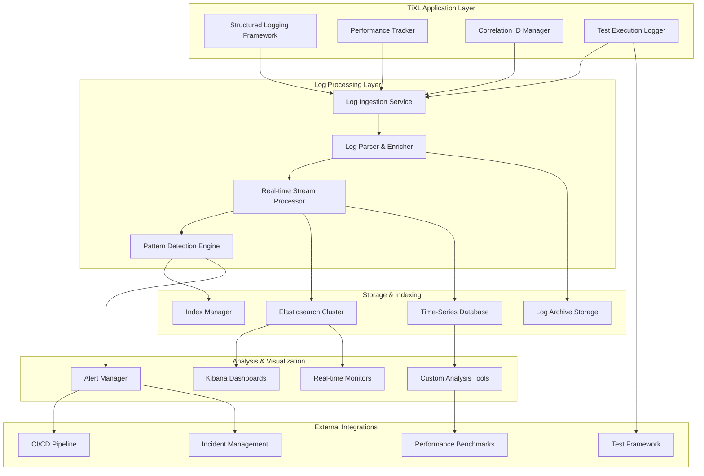

# TiXL Logging Dashboards and Analysis System

## Executive Summary

This document outlines a comprehensive logging dashboards and analysis system for TiXL, designed to provide real-time insights, advanced log analysis, and performance troubleshooting capabilities. The system builds upon the existing structured logging framework and extends it with powerful visualization, analysis, and alerting capabilities specifically tailored for real-time graphics applications.

## Table of Contents

1. [System Architecture](#system-architecture)
2. [Log Aggregation and Indexing System](#log-aggregation-and-indexing-system)
3. [Real-Time Dashboard Infrastructure](#real-time-dashboard-infrastructure)
4. [Log Analysis Tools](#log-analysis-tools)
5. [Error Pattern Detection and Analysis](#error-pattern-detection-and-analysis)
6. [Log-Based Metrics and Trend Analysis](#log-based-metrics-and-trend-analysis)
7. [Testing Framework Integration](#testing-framework-integration)
8. [Automated Log Parsing and Extraction](#automated-log-parsing-and-extraction)
9. [Real-Time Graphics Operation Logging Analysis](#real-time-graphics-operation-logging-analysis)
10. [Performance Bottleneck Identification](#performance-bottleneck-identification)
11. [Dashboard Configurations](#dashboard-configurations)
12. [Analysis Tools Implementation](#analysis-tools-implementation)
13. [Automated Reporting Setup](#automated-reporting-setup)
14. [Deployment and Configuration](#deployment-and-configuration)
15. [Integration Guide](#integration-guide)

## System Architecture

### Core Components Overview



## Log Aggregation and Indexing System

### 1. Elasticsearch Cluster Setup

**File: `elasticsearch/elasticsearch.yml`**

```yaml
# Elasticsearch Configuration
cluster.name: tixl-logs
node.name: tixl-node-1
path.data: /var/lib/elasticsearch
path.logs: /var/log/elasticsearch
network.host: 0.0.0.0
http.port: 9200
discovery.type: single-node
xpack.security.enabled: false
xpack.monitoring.collection.enabled: true

# Performance tuning for real-time graphics logs
indices.memory.index_buffer_size: 30%
indices.queries.cache.size: 256mb
indices.fielddata.cache.size: 256mb
thread_pool.search.queue_size: 1000

# Index lifecycle management
xpack.ilm.enabled: true
xpack.rollover_alias: "tixl-logs"
```

### 2. Logstash Pipeline Configuration

**File: `logstash/pipelines/tixl-logs.conf`**

```ruby
# TiXL Log Processing Pipeline
input {
  beats {
    port => 5044
  }
  
  tcp {
    port => 5045
    codec => json_lines
  }
  
  http {
    port => 8080
    codec => json
  }
}

filter {
  # Parse TiXL structured logs
  if [fields][application] == "TiXL" {
    # Extract correlation ID for tracing
    if [CorrelationId] {
      mutate {
        add_field => { "correlation_id" => "%{[CorrelationId]}" }
      }
    }
    
    # Parse performance metrics
    if [Level] == "PERF" {
      grok {
        match => { 
          "message" => "PERF %{WORD:category}\.%{WORD:metric_name} %{NUMBER:value:float} %{WORD:unit}" 
        }
      }
      
      date {
        match => [ "timestamp", "yyyy-MM-dd HH:mm:ss.SSS zzz" ]
        target => "@timestamp"
      }
      
      mutate {
        convert => { "value" => "float" }
        add_field => { "metric_type" => "performance" }
      }
    }
    
    # Parse frame time metrics
    if [message] =~ /FrameTime/ {
      grok {
        match => { 
          "message" => "FrameTime: %{NUMBER:frame_time:float}ms, FPS: %{NUMBER:fps:float}" 
        }
      }
      
      mutate {
        add_field => { "event_type" => "frame_timing" }
      }
    }
    
    # Parse graphics operations
    if [message] =~ /Render|Shader|Texture|Buffer/ {
      grok {
        match => {
          "message" => "(?<operation_type>Render|Shader|Texture|Buffer)\s+(?<operation_name>\w+)\s+(?<duration>\d+\.?\d*)ms"
        }
      }
      
      mutate {
        add_field => { "event_type" => "graphics_operation" }
        convert => { "duration" => "float" }
      }
    }
    
    # Parse operator evaluations
    if [message] =~ /OperatorEvaluation/ {
      grok {
        match => {
          "message" => "Operator\s+(?<operator_name>\w+)\s+evaluation\s+(?<status>\w+)\s+in\s+(?<evaluation_time>\d+\.?\d*)ms"
        }
      }
      
      mutate {
        add_field => { "event_type" => "operator_evaluation" }
        convert => { "evaluation_time" => "float" }
      }
    }
    
    # Add geo-location enrichment (if needed)
    if [client_ip] {
      geoip {
        source => "client_ip"
        target => "geoip"
      }
    }
    
    # Add environment context
    mutate {
      add_field => {
        "environment" => "%{[Environment]}"
        "application_version" => "%{[Version]}"
        "module" => "%{[SourceContext]}"
      }
    }
  }
  
  # Error and exception processing
  if [Level] == "ERROR" or [Level] == "CRITICAL" {
    # Extract exception details
    if [Exception] {
      json {
        source => "Exception"
        target => "exception_details"
      }
    }
    
    # Classify error severity
    if [message] =~ /Critical|CRITICAL/ {
      mutate { add_field => { "severity" => "critical" } }
    } else if [message] =~ /Error|ERROR/ {
      mutate { add_field => { "severity" => "error" } }
    } else {
      mutate { add_field => { "severity" => "warning" } }
    }
    
    # Add error category
    if [message] =~ /Graphics|Render|Shader/ {
      mutate { add_field => { "error_category" => "graphics" } }
    } else if [message] =~ /Memory|Resource/ {
      mutate { add_field => { "error_category" => "resource" } }
    } else if [message] =~ /Performance|Slow|Timeout/ {
      mutate { add_field => { "error_category" => "performance" } }
    } else {
      mutate { add_field => { "error_category" => "general" } }
    }
  }
  
  # Timestamp normalization
  if ![@timestamp] {
    date {
      match => [ "timestamp", "yyyy-MM-dd HH:mm:ss.SSS zzz" ]
      target => "@timestamp"
    }
  }
  
  # Clean up empty fields
  mutate {
    remove_field => [ "host", "agent", "ecs" ]
  }
}

output {
  elasticsearch {
    hosts => ["elasticsearch:9200"]
    index => "tixl-logs-%{+YYYY.MM.dd}"
    template_name => "tixl_logs"
  }
  
  # Debug output for development
  stdout {
    codec => rubydebug
  }
}
```

### 3. Index Template for TiXL Logs

**File: `elasticsearch/templates/tixl_logs_template.json`**

```json
{
  "index_patterns": ["tixl-logs-*"],
  "settings": {
    "number_of_shards": 1,
    "number_of_replicas": 0,
    "refresh_interval": "5s",
    "index": {
      "lifecycle": {
        "name": "tixl_logs_policy",
        "rollover_alias": "tixl-logs"
      },
      "query": {
        "default_field": ["message", "operation_name", "operator_name", "error_category"]
      }
    }
  },
  "mappings": {
    "properties": {
      "@timestamp": {
        "type": "date",
        "format": "strict_date_optional_time||epoch_millis"
      },
      "Level": {
        "type": "keyword"
      },
      "CorrelationId": {
        "type": "keyword",
        "ignore_above": 256
      },
      "Category": {
        "type": "keyword"
      },
      "operation_name": {
        "type": "keyword",
        "ignore_above": 256
      },
      "operator_name": {
        "type": "keyword",
        "ignore_above": 256
      },
      "duration": {
        "type": "float"
      },
      "evaluation_time": {
        "type": "float"
      },
      "frame_time": {
        "type": "float"
      },
      "fps": {
        "type": "float"
      },
      "message": {
        "type": "text",
        "analyzer": "standard"
      },
      "Exception": {
        "type": "text",
        "fields": {
          "keyword": {
            "type": "keyword",
            "ignore_above": 256
          }
        }
      },
      "event_type": {
        "type": "keyword"
      },
      "severity": {
        "type": "keyword"
      },
      "error_category": {
        "type": "keyword"
      },
      "environment": {
        "type": "keyword"
      },
      "application_version": {
        "type": "keyword"
      },
      "module": {
        "type": "keyword"
      },
      "SourceContext": {
        "type": "keyword"
      },
      "geoip": {
        "properties": {
          "location": {
            "type": "geo_point"
          },
          "country_name": {
            "type": "keyword"
          },
          "city_name": {
            "type": "keyword"
          }
        }
      }
    }
  }
}
```

## Real-Time Dashboard Infrastructure

### 1. Kibana Dashboard Configuration

**File: `kibana/dashboards/tixl-overview.json`**

```json
{
  "version": "8.5.0",
  "objects": [
    {
      "id": "tixl-logs-dashboard",
      "type": "dashboard",
      "attributes": {
        "title": "TiXL Real-time Performance Dashboard",
        "description": "Real-time monitoring and analysis of TiXL graphics application",
        "panelsJSON": "[{\"gridData\":{\"x\":0,\"y\":0,\"w\":15,\"h\":7,\"i\":\"1\"},\"panelIndex\":\"1\",\"embeddableConfig\":{},\"panelRefName\":\"panel_1\"},{\"gridData\":{\"x\":15,\"y\":0,\"w\":9,\"h\":7,\"i\":\"2\"},\"panelIndex\":\"2\",\"embeddableConfig\":{},\"panelRefName\":\"panel_2\"},{\"gridData\":{\"x\":0,\"y\":7,\"w\":12,\"h\":7,\"i\":\"3\"},\"panelIndex\":\"3\",\"embeddableConfig\":{},\"panelRefName\":\"panel_3\"},{\"gridData\":{\"x\":12,\"y\":7,\"w\":12,\"h\":7,\"i\":\"4\"},\"panelIndex\":\"4\",\"embeddableConfig\":{},\"panelRefName\":\"panel_4\"}]",
        "version": 1,
        "timeRestore": false,
        "kibanaSavedObjectMeta": {
          "searchSourceJSON": "{}"
        }
      },
      "references": [
        {
          "name": "panel_1",
          "type": "visualization",
          "id": "frame-time-analysis"
        },
        {
          "name": "panel_2",
          "type": "visualization",
          "id": "error-rate-monitor"
        },
        {
          "name": "panel_3",
          "type": "visualization",
          "id": "performance-breakdown"
        },
        {
          "name": "panel_4",
          "type": "visualization",
          "id": "resource-usage-trends"
        }
      ]
    },
    {
      "id": "frame-time-analysis",
      "type": "visualization",
      "attributes": {
        "title": "Frame Time Analysis",
        "visState": {
          "type": "line",
          "params": {
            "addTooltip": true,
            "addLegend": true,
            "legendPosition": "right",
            "showCircles": true,
            "interpolate": "linear",
            "scale": "linear",
            "drawLinesBetweenPoints": true,
            "radiusRatio": 9,
            "times": [],
            "addTimeMarker": false,
            "minimumRadiusRatio": 0,
            "逾期": false
          },
          "aggs": [
            {
              "id": "1",
              "enabled": true,
              "type": "avg",
              "schema": "metric",
              "params": {
                "field": "frame_time",
                "customLabel": "Average Frame Time (ms)"
              }
            },
            {
              "id": "2",
              "enabled": true,
              "type": "date_histogram",
              "schema": "segment",
              "params": {
                "field": "@timestamp",
                "interval": "auto",
                "customLabel": "Time"
              }
            }
          ]
        },
        "kibanaSavedObjectMeta": {
          "searchSourceJSON": "{}"
        }
      }
    },
    {
      "id": "error-rate-monitor",
      "type": "visualization",
      "attributes": {
        "title": "Error Rate Monitor",
        "visState": {
          "type": "gauge",
          "params": {
            "addTooltip": true,
            "addLegend": true,
            "legendPosition": "right",
            "gauge": {
              "alignment": "vertical",
              "colorSchema": "Green to Red",
              "gaugeColorMode": "Labels",
              "maxGauge": 100,
              "reverseColors": false,
              "scale": {
                "color": "rgba(0,0,0,1)",
                "labels": {
                  "color": "black",
                  "fontSize": 60
                },
                "lines": true,
                "strokeWidth": 2
              },
              "style": {
                "bgFill": "#000",
                "fontSize": 60,
                "labelColor": true,
                "subText": ""
              },
              "type": "meter",
              "verticalSplit": false
            }
          },
          "aggs": [
            {
              "id": "1",
              "enabled": true,
              "type": "count",
              "schema": "metric",
              "params": {
                "customLabel": "Error Rate (%)"
              }
            },
            {
              "id": "2",
              "enabled": true,
              "type": "filters",
              "schema": "group",
              "params": {
                "filters": [
                  {
                    "label": "Errors",
                    "query": "Level:ERROR OR Level:CRITICAL"
                  },
                  {
                    "label": "Total Logs",
                    "query": "*"
                  }
                ]
              }
            }
          ]
        },
        "kibanaSavedObjectMeta": {
          "searchSourceJSON": "{}"
        }
      }
    }
  ]
}
```

### 2. Real-Time Dashboard Web Application

**File: `dashboard/webapp/package.json`**

```json
{
  "name": "tixl-dashboard",
  "version": "1.0.0",
  "description": "Real-time TiXL performance dashboard",
  "scripts": {
    "start": "react-scripts start",
    "build": "react-scripts build",
    "serve": "serve -s build"
  },
  "dependencies": {
    "react": "^18.2.0",
    "react-dom": "^18.2.0",
    "react-router-dom": "^6.4.0",
    "chart.js": "^3.9.0",
    "react-chartjs-2": "^4.3.0",
    "socket.io-client": "^4.5.0",
    "@mui/material": "^5.10.0",
    "@mui/icons-material": "^5.10.0",
    "@emotion/react": "^11.10.0",
    "@emotion/styled": "^11.10.0",
    "date-fns": "^2.29.0",
    "elasticsearch-browser": "^16.7.0"
  }
}
```

**File: `dashboard/webapp/src/components/RealTimeDashboard.js`**

```jsx
import React, { useState, useEffect } from 'react';
import {
  Grid,
  Card,
  CardContent,
  Typography,
  Box,
  Alert,
  Chip
} from '@mui/material';
import {
  LineChart,
  Line,
  XAxis,
  YAxis,
  CartesianGrid,
  Tooltip,
  Legend,
  ResponsiveContainer,
  Gauge
} from 'recharts';
import io from 'socket.io-client';

const RealTimeDashboard = () => {
  const [frameTimeData, setFrameTimeData] = useState([]);
  const [errorData, setErrorData] = useState([]);
  const [performanceData, setPerformanceData] = useState([]);
  const [systemHealth, setSystemHealth] = useState('healthy');
  const [alerts, setAlerts] = useState([]);

  useEffect(() => {
    // Connect to real-time data stream
    const socket = io('ws://localhost:8080');
    
    socket.on('frame-time-update', (data) => {
      setFrameTimeData(prev => {
        const newData = [...prev, {
          timestamp: new Date(data.timestamp),
          avgFrameTime: data.avgFrameTime,
          p95FrameTime: data.p95FrameTime,
          fps: data.fps
        }].slice(-60); // Keep last 60 data points
        
        // Check for performance alerts
        if (data.avgFrameTime > 16.7) {
          setAlerts(prev => [...prev, {
            id: Date.now(),
            type: 'warning',
            message: `High frame time detected: ${data.avgFrameTime.toFixed(2)}ms`,
            timestamp: new Date()
          }]);
        }
        
        return newData;
      });
    });

    socket.on('error-update', (data) => {
      setErrorData(prev => {
        const newData = [...prev, {
          timestamp: new Date(data.timestamp),
          errorRate: data.errorRate,
          criticalErrors: data.criticalErrors,
          warnings: data.warnings
        }].slice(-60);
        
        if (data.criticalErrors > 0) {
          setSystemHealth('critical');
        } else if (data.errorRate > 5) {
          setSystemHealth('warning');
        } else {
          setSystemHealth('healthy');
        }
        
        return newData;
      });
    });

    socket.on('performance-update', (data) => {
      setPerformanceData(prev => {
        const newData = [...prev, {
          timestamp: new Date(data.timestamp),
          cpuUsage: data.cpuUsage,
          memoryUsage: data.memoryUsage,
          gpuUsage: data.gpuUsage,
          frameTime: data.avgFrameTime
        }].slice(-60);
        
        return newData;
      });
    });

    return () => socket.disconnect();
  }, []);

  const getHealthColor = (health) => {
    switch (health) {
      case 'healthy': return '#4caf50';
      case 'warning': return '#ff9800';
      case 'critical': return '#f44336';
      default: return '#9e9e9e';
    }
  };

  const FrameTimeChart = () => (
    <Card sx={{ height: 400 }}>
      <CardContent>
        <Typography variant="h6" gutterBottom>
          Frame Time Analysis
        </Typography>
        <ResponsiveContainer width="100%" height={300}>
          <LineChart data={frameTimeData}>
            <CartesianGrid strokeDasharray="3 3" />
            <XAxis 
              dataKey="timestamp"
              tickFormatter={(time) => new Date(time).toLocaleTimeString()}
            />
            <YAxis />
            <Tooltip 
              labelFormatter={(time) => new Date(time).toLocaleString()}
              formatter={(value, name) => [`${value.toFixed(2)}ms`, name]}
            />
            <Legend />
            <Line 
              type="monotone" 
              dataKey="avgFrameTime" 
              stroke="#8884d8" 
              name="Average Frame Time"
              strokeWidth={2}
            />
            <Line 
              type="monotone" 
              dataKey="p95FrameTime" 
              stroke="#82ca9d" 
              name="P95 Frame Time"
              strokeWidth={2}
            />
            {/* Reference lines */}
            <Line 
              type="monotone" 
              dataKey={() => 16.7} 
              stroke="#ff9800" 
              strokeDasharray="5 5"
              name="60 FPS Target"
              dot={false}
            />
            <Line 
              type="monotone" 
              dataKey={() => 33.3} 
              stroke="#f44336" 
              strokeDasharray="5 5"
              name="30 FPS Minimum"
              dot={false}
            />
          </LineChart>
        </ResponsiveContainer>
      </CardContent>
    </Card>
  );

  const ErrorRateGauge = () => (
    <Card sx={{ height: 400 }}>
      <CardContent>
        <Typography variant="h6" gutterBottom>
          Error Rate Monitor
        </Typography>
        <Box sx={{ position: 'relative', height: 300 }}>
          <ResponsiveContainer>
            <Gauge
              value={errorData.length > 0 ? errorData[errorData.length - 1].errorRate : 0}
              min={0}
              max={100}
              thresholds={{
                0: { color: '#4caf50', value: 0 },
                2: { color: '#ff9800', value: 5 },
                4: { color: '#f44336', value: 10 }
              }}
              format={(value) => `${value.toFixed(1)}%`}
              labelFormat={(value) => `${value.toFixed(1)}% Error Rate`}
            />
          </ResponsiveContainer>
        </Box>
      </CardContent>
    </Card>
  );

  return (
    <Box sx={{ flexGrow: 1, p: 3 }}>
      {/* Header */}
      <Box sx={{ mb: 3, display: 'flex', alignItems: 'center', gap: 2 }}>
        <Typography variant="h4" component="h1">
          TiXL Real-time Dashboard
        </Typography>
        <Chip 
          label={`System: ${systemHealth.toUpperCase()}`}
          sx={{ 
            backgroundColor: getHealthColor(systemHealth),
            color: 'white',
            fontWeight: 'bold'
          }}
        />
      </Box>

      {/* Alerts */}
      {alerts.length > 0 && (
        <Box sx={{ mb: 2 }}>
          {alerts.slice(-3).map(alert => (
            <Alert 
              key={alert.id} 
              severity={alert.type}
              sx={{ mb: 1 }}
            >
              {alert.message} - {alert.timestamp.toLocaleTimeString()}
            </Alert>
          ))}
        </Box>
      )}

      {/* Dashboard Grid */}
      <Grid container spacing={3}>
        <Grid item xs={12} md={8}>
          <FrameTimeChart />
        </Grid>
        <Grid item xs={12} md={4}>
          <ErrorRateGauge />
        </Grid>
        <Grid item xs={12} md={6}>
          <PerformanceMetricsChart />
        </Grid>
        <Grid item xs={12} md={6}>
          <LogAnalysisPanel />
        </Grid>
      </Grid>
    </Box>
  );
};

const PerformanceMetricsChart = () => {
  const [data, setData] = useState([]);
  
  useEffect(() => {
    const socket = io('ws://localhost:8080');
    socket.on('metrics-update', (metricsData) => {
      setData(prev => [...prev, {
        timestamp: new Date(metricsData.timestamp),
        cpuUsage: metricsData.cpuUsage,
        memoryUsage: metricsData.memoryUsage,
        gpuUsage: metricsData.gpuUsage
      }].slice(-60));
    });
    
    return () => socket.disconnect();
  }, []);

  return (
    <Card sx={{ height: 400 }}>
      <CardContent>
        <Typography variant="h6" gutterBottom>
          Resource Utilization
        </Typography>
        <ResponsiveContainer width="100%" height={300}>
          <LineChart data={data}>
            <CartesianGrid strokeDasharray="3 3" />
            <XAxis 
              dataKey="timestamp"
              tickFormatter={(time) => new Date(time).toLocaleTimeString()}
            />
            <YAxis domain={[0, 100]} />
            <Tooltip 
              labelFormatter={(time) => new Date(time).toLocaleString()}
              formatter={(value, name) => [`${value.toFixed(1)}%`, name]}
            />
            <Legend />
            <Line type="monotone" dataKey="cpuUsage" stroke="#8884d8" name="CPU" />
            <Line type="monotone" dataKey="memoryUsage" stroke="#82ca9d" name="Memory" />
            <Line type="monotone" dataKey="gpuUsage" stroke="#ffc658" name="GPU" />
          </LineChart>
        </ResponsiveContainer>
      </CardContent>
    </Card>
  );
};

const LogAnalysisPanel = () => {
  const [logs, setLogs] = useState([]);
  const [filter, setFilter] = useState('');
  
  useEffect(() => {
    const socket = io('ws://localhost:8080');
    socket.on('log-stream', (logData) => {
      setLogs(prev => [logData, ...prev].slice(0, 50));
    });
    
    return () => socket.disconnect();
  }, []);

  const filteredLogs = logs.filter(log => 
    log.message.toLowerCase().includes(filter.toLowerCase()) ||
    log.Level?.toLowerCase().includes(filter.toLowerCase())
  );

  const getLogLevelColor = (level) => {
    switch (level) {
      case 'ERROR': case 'CRITICAL': return '#f44336';
      case 'WARNING': return '#ff9800';
      case 'INFO': return '#2196f3';
      case 'DEBUG': return '#9e9e9e';
      default: return '#757575';
    }
  };

  return (
    <Card sx={{ height: 400 }}>
      <CardContent>
        <Typography variant="h6" gutterBottom>
          Real-time Log Stream
        </Typography>
        <input
          type="text"
          placeholder="Filter logs..."
          value={filter}
          onChange={(e) => setFilter(e.target.value)}
          style={{
            width: '100%',
            padding: '8px',
            marginBottom: '8px',
            border: '1px solid #ccc',
            borderRadius: '4px'
          }}
        />
        <Box sx={{ 
          height: 250, 
          overflow: 'auto', 
          backgroundColor: '#f5f5f5',
          padding: '8px',
          fontFamily: 'monospace',
          fontSize: '12px'
        }}>
          {filteredLogs.map((log, index) => (
            <div key={index} style={{ marginBottom: '4px' }}>
              <span 
                style={{ 
                  color: getLogLevelColor(log.Level),
                  fontWeight: 'bold',
                  marginRight: '8px'
                }}
              >
                {log.Level}
              </span>
              <span style={{ color: '#666', marginRight: '8px' }}>
                {new Date(log.@timestamp).toLocaleTimeString()}
              </span>
              <span>{log.message}</span>
            </div>
          ))}
        </Box>
      </CardContent>
    </Card>
  );
};

export default RealTimeDashboard;
```

## Log Analysis Tools

### 1. Performance Analysis Engine

**File: `analysis/PerformanceAnalyzer.cs`**

```csharp
using System;
using System.Collections.Generic;
using System.Linq;
using System.Text.Json;
using System.Threading.Tasks;
using Microsoft.Extensions.Logging;
using Nest;

namespace TiXL.Analysis
{
    public interface IPerformanceAnalyzer
    {
        Task<PerformanceAnalysisReport> AnalyzePerformance(TimeSpan timeWindow);
        Task<List<PerformanceBottleneck>> IdentifyBottlenecks(TimeSpan timeWindow);
        Task<TrendAnalysis> AnalyzeTrends(string metricName, TimeSpan timeWindow);
        Task<PerformanceRegression> DetectRegression(string metricName, TimeSpan currentWindow, TimeSpan baselineWindow);
    }

    public class PerformanceAnalyzer : IPerformanceAnalyzer
    {
        private readonly IElasticClient _elasticClient;
        private readonly ILogger<PerformanceAnalyzer> _logger;
        
        public PerformanceAnalyzer(IElasticClient elasticClient, ILogger<PerformanceAnalyzer> logger)
        {
            _elasticClient = elasticClient;
            _logger = logger;
        }

        public async Task<PerformanceAnalysisReport> AnalyzePerformance(TimeSpan timeWindow)
        {
            var endTime = DateTime.UtcNow;
            var startTime = endTime - timeWindow;

            _logger.LogInformation("Starting performance analysis for window: {StartTime} to {EndTime}", startTime, endTime);

            // Query frame time data
            var frameTimeQuery = await QueryFrameTimes(startTime, endTime);
            var operatorPerformance = await QueryOperatorPerformance(startTime, endTime);
            var resourceUsage = await QueryResourceUsage(startTime, endTime);
            var errorPatterns = await QueryErrorPatterns(startTime, endTime);

            var report = new PerformanceAnalysisReport
            {
                AnalysisWindow = timeWindow,
                StartTime = startTime,
                EndTime = endTime,
                FrameTimeMetrics = AnalyzeFrameTimes(frameTimeQuery),
                OperatorMetrics = AnalyzeOperatorPerformance(operatorPerformance),
                ResourceMetrics = AnalyzeResourceUsage(resourceUsage),
                ErrorAnalysis = AnalyzeErrorPatterns(errorPatterns)
            };

            // Identify performance issues
            report.PerformanceIssues = IdentifyPerformanceIssues(report);
            report.Recommendations = GenerateRecommendations(report);

            return report;
        }

        private async Task<List<FrameTimeRecord>> QueryFrameTimes(DateTime startTime, DateTime endTime)
        {
            var response = await _elasticClient.SearchAsync<FrameTimeRecord>(s => s
                .Index("tixl-logs-*")
                .Query(q => q
                    .Bool(b => b
                        .Must(m => m
                            .Range(r => r
                                .Field(f => f.Timestamp)
                                .GreaterThanOrEquals(startTime)
                                .LessThanOrEquals(endTime)
                            )
                        )
                        .Must(m => m
                            .Term(t => t.Field(f => f.EventType).Value("frame_timing"))
                        )
                    )
                )
                .Size(10000)
            );

            return response.Documents.ToList();
        }

        public async Task<List<PerformanceBottleneck>> IdentifyBottlenecks(TimeSpan timeWindow)
        {
            var bottlenecks = new List<PerformanceBottleneck>();
            var endTime = DateTime.UtcNow;
            var startTime = endTime - timeWindow;

            // Analyze frame time bottlenecks
            var frameBottlenecks = await AnalyzeFrameTimeBottlenecks(startTime, endTime);
            bottlenecks.AddRange(frameBottlenecks);

            // Analyze operator bottlenecks
            var operatorBottlenecks = await AnalyzeOperatorBottlenecks(startTime, endTime);
            bottlenecks.AddRange(operatorBottlenecks);

            // Analyze resource bottlenecks
            var resourceBottlenecks = await AnalyzeResourceBottlenecks(startTime, endTime);
            bottlenecks.AddRange(resourceBottlenecks);

            // Sort by severity and impact
            return bottlenecks
                .OrderByDescending(b => b.Severity * b.Impact)
                .ToList();
        }

        private async Task<List<PerformanceBottleneck>> AnalyzeFrameTimeBottlenecks(DateTime startTime, DateTime endTime)
        {
            var bottlenecks = new List<PerformanceBottleneck>();

            var response = await _elasticClient.SearchAsync<FrameTimeRecord>(s => s
                .Index("tixl-logs-*")
                .Query(q => q
                    .Bool(b => b
                        .Must(m => m
                            .Range(r => r
                                .Field(f => f.Timestamp)
                                .GreaterThanOrEquals(startTime)
                                .LessThanOrEquals(endTime)
                            )
                        )
                        .Must(m => m
                            .Range(r => r
                                .Field(f => f.FrameTime)
                                .GreaterThan(16.7) // Above 60 FPS threshold
                            )
                        )
                    )
                )
                .Size(1000)
            );

            var slowFrames = response.Documents.ToList();
            if (slowFrames.Any())
            {
                var slowFramePercentage = (slowFrames.Count / (double)response.Total) * 100;
                
                if (slowFramePercentage > 20) // More than 20% slow frames
                {
                    bottlenecks.Add(new PerformanceBottleneck
                    {
                        Type = BottleneckType.FrameTime,
                        Severity = slowFramePercentage > 50 ? Severity.Critical : Severity.High,
                        Description = $"Frame time bottlenecks detected: {slowFramePercentage:F1}% of frames exceed 16.7ms",
                        Impact = slowFramePercentage,
                        AffectedOperations = slowFrames.Select(f => f.OperationName).Distinct().ToList(),
                        Recommendations = new List<string>
                        {
                            "Optimize shader compilation and caching",
                            "Reduce draw call count",
                            "Implement level-of-detail (LOD) system",
                            "Optimize texture compression and mipmaps",
                            "Consider GPU profiling to identify specific bottlenecks"
                        },
                        TimeRange = new TimeRange { Start = startTime, End = endTime }
                    });
                }
            }

            return bottlenecks;
        }

        private async Task<List<PerformanceBottleneck>> AnalyzeOperatorBottlenecks(DateTime startTime, DateTime endTime)
        {
            var bottlenecks = new List<PerformanceBottleneck>();

            var response = await _elasticClient.SearchAsync<LogEntry>(s => s
                .Index("tixl-logs-*")
                .Query(q => q
                    .Bool(b => b
                        .Must(m => m
                            .Range(r => r
                                .Field(f => f.Timestamp)
                                .GreaterThanOrEquals(startTime)
                                .LessThanOrEquals(endTime)
                            )
                        )
                        .Must(m => m
                            .Term(t => t.Field(f => f.EventType).Value("operator_evaluation"))
                        )
                        .Must(m => m
                            .Range(r => r
                                .Field(f => f.EvaluationTime)
                                .GreaterThan(5.0) // Slow operator evaluation
                            )
                        )
                    )
                )
                .Size(1000)
            );

            var slowOperators = response.Documents.ToList();
            var operatorGroups = slowOperators.GroupBy(o => o.OperatorName);

            foreach (var group in operatorGroups)
            {
                var avgTime = group.Average(o => o.EvaluationTime);
                var frequency = group.Count();
                
                if (avgTime > 10.0 || frequency > 100) // Significant bottleneck
                {
                    bottlenecks.Add(new PerformanceBottleneck
                    {
                        Type = BottleneckType.OperatorExecution,
                        Severity = avgTime > 20.0 ? Severity.High : Severity.Medium,
                        Description = $"Operator '{group.Key}' performance bottleneck: avg {avgTime:F2}ms execution time, {frequency} occurrences",
                        Impact = avgTime * frequency,
                        AffectedOperations = new List<string> { group.Key },
                        Recommendations = new List<string>
                        {
                            $"Optimize {group.Key} operator implementation",
                            "Consider algorithm complexity improvements",
                            "Implement operator result caching",
                            "Profile memory allocation patterns"
                        },
                        TimeRange = new TimeRange { Start = startTime, End = endTime }
                    });
                }
            }

            return bottlenecks;
        }

        private async Task<List<PerformanceBottleneck>> AnalyzeResourceBottlenecks(DateTime startTime, DateTime endTime)
        {
            var bottlenecks = new List<PerformanceBottleneck>();

            // Check for memory pressure indicators
            var memoryPressureResponse = await _elasticClient.SearchAsync<LogEntry>(s => s
                .Index("tixl-logs-*")
                .Query(q => q
                    .Bool(b => b
                        .Must(m => m
                            .Range(r => r
                                .Field(f => f.Timestamp)
                                .GreaterThanOrEquals(startTime)
                                .LessThanOrEquals(endTime)
                            )
                        )
                        .Must(m => m
                            .Match(mt => mt.Field("message").Query("memory pressure high memory usage"))
                        )
                    )
                )
            );

            if (memoryPressureResponse.Documents.Any())
            {
                bottlenecks.Add(new PerformanceBottleneck
                {
                    Type = BottleneckType.MemoryPressure,
                    Severity = Severity.High,
                    Description = "Memory pressure detected - potential memory leaks or excessive allocation",
                    Impact = memoryPressureResponse.Documents.Count(),
                    Recommendations = new List<string>
                    {
                        "Implement object pooling for frequently allocated objects",
                        "Review and optimize texture management",
                        "Add memory profiling to identify leaks",
                        "Implement lazy loading for resources",
                        "Consider reducing texture resolution or quality"
                    },
                    TimeRange = new TimeRange { Start = startTime, End = endTime }
                });
            }

            return bottlenecks;
        }
    }

    public class PerformanceAnalysisReport
    {
        public TimeSpan AnalysisWindow { get; set; }
        public DateTime StartTime { get; set; }
        public DateTime EndTime { get; set; }
        public FrameTimeAnalysis FrameTimeMetrics { get; set; } = new();
        public OperatorAnalysis OperatorMetrics { get; set; } = new();
        public ResourceAnalysis ResourceMetrics { get; set; } = new();
        public ErrorAnalysis ErrorAnalysis { get; set; } = new();
        public List<PerformanceIssue> PerformanceIssues { get; set; } = new();
        public List<string> Recommendations { get; set; } = new();
    }

    public class FrameTimeRecord
    {
        public DateTime Timestamp { get; set; }
        public double FrameTime { get; set; }
        public double FPS { get; set; }
        public string OperationName { get; set; } = string.Empty;
        public string EventType { get; set; } = string.Empty;
    }
}
```

### 2. Error Pattern Detection Engine

**File: `analysis/ErrorPatternDetector.cs`**

```csharp
using System;
using System.Collections.Generic;
using System.Linq;
using System.Threading.Tasks;
using Microsoft.Extensions.Logging;
using Nest;

namespace TiXL.Analysis
{
    public interface IErrorPatternDetector
    {
        Task<List<ErrorPattern>> DetectErrorPatterns(TimeSpan timeWindow);
        Task<ErrorCluster> ClusterSimilarErrors(TimeSpan timeWindow, double similarityThreshold = 0.8);
        Task<Dictionary<string, int>> AnalyzeErrorFrequency(TimeSpan timeWindow);
        Task<List<ErrorTrend>> AnalyzeErrorTrends(TimeSpan timeWindow);
        Task<RootCauseAnalysis> AnalyzeRootCauses(TimeSpan timeWindow);
    }

    public class ErrorPatternDetector : IErrorPatternDetector
    {
        private readonly IElasticClient _elasticClient;
        private readonly ILogger<ErrorPatternDetector> _logger;

        public ErrorPatternDetector(IElasticClient elasticClient, ILogger<ErrorPatternDetector> logger)
        {
            _elasticClient = elasticClient;
            _logger = logger;
        }

        public async Task<List<ErrorPattern>> DetectErrorPatterns(TimeSpan timeWindow)
        {
            var endTime = DateTime.UtcNow;
            var startTime = endTime - timeWindow;

            var patterns = new List<ErrorPattern>();

            // Detect cascading failures
            var cascadingPatterns = await DetectCascadingFailures(startTime, endTime);
            patterns.AddRange(cascadingPatterns);

            // Detect resource exhaustion patterns
            var resourcePatterns = await DetectResourceExhaustionPatterns(startTime, endTime);
            patterns.AddRange(resourcePatterns);

            // Detect timing-related error patterns
            var timingPatterns = await DetectTimingPatterns(startTime, endTime);
            patterns.AddRange(timingPatterns);

            // Detect graphics-specific error patterns
            var graphicsPatterns = await DetectGraphicsPatterns(startTime, endTime);
            patterns.AddRange(graphicsPatterns);

            return patterns.OrderByDescending(p => p.Severity * p.Frequency).ToList();
        }

        private async Task<List<ErrorPattern>> DetectCascadingFailures(DateTime startTime, DateTime endTime)
        {
            var patterns = new List<ErrorPattern>();

            // Query for multiple errors within a short time window
            var response = await _elasticClient.SearchAsync<LogEntry>(s => s
                .Index("tixl-logs-*")
                .Query(q => q
                    .Bool(b => b
                        .Must(m => m
                            .Range(r => r
                                .Field(f => f.Timestamp)
                                .GreaterThanOrEquals(startTime)
                                .LessThanOrEquals(endTime)
                            )
                        )
                        .Must(m => m
                            .Term(t => t.Field(f => f.Level).Value("ERROR"))
                        )
                    )
                )
                .Sort(srt => srt
                    .Field(f => f.Timestamp, SortOrder.Descending)
                )
                .Size(1000)
            );

            var errors = response.Documents.ToList();
            var errorGroups = GroupErrorsByTimeWindow(errors, TimeSpan.FromMinutes(5));

            foreach (var group in errorGroups)
            {
                if (group.Count >= 5) // 5+ errors within 5 minutes
                {
                    var pattern = new ErrorPattern
                    {
                        Type = ErrorPatternType.CascadingFailure,
                        Name = $"Cascading Failure: {group.First().Timestamp:yyyy-MM-dd HH:mm}",
                        Description = $"{group.Count} errors occurred within 5 minutes, indicating potential cascading failure",
                        Severity = group.Count >= 20 ? Severity.Critical : Severity.High,
                        Frequency = group.Count,
                        TimeRange = new TimeRange
                        {
                            Start = group.Min(e => e.Timestamp),
                            End = group.Max(e => e.Timestamp)
                        },
                        AffectedComponents = group.Select(e => e.Module).Distinct().ToList(),
                        SampleErrors = group.Take(5).Select(e => e.Message).ToList(),
                        Recommendations = new List<string>
                        {
                            "Investigate root cause of initial failure",
                            "Implement circuit breaker pattern",
                            "Add retry logic with exponential backoff",
                            "Review dependency injection and error handling",
                            "Implement graceful degradation mechanisms"
                        }
                    };

                    patterns.Add(pattern);
                }
            }

            return patterns;
        }

        private async Task<List<ErrorPattern>> DetectResourceExhaustionPatterns(DateTime startTime, DateTime endTime)
        {
            var patterns = new List<ErrorPattern>();

            // Check for memory-related errors
            var memoryErrors = await _elasticClient.SearchAsync<LogEntry>(s => s
                .Index("tixl-logs-*")
                .Query(q => q
                    .Bool(b => b
                        .Must(m => m
                            .Range(r => r
                                .Field(f => f.Timestamp)
                                .GreaterThanOrEquals(startTime)
                                .LessThanOrEquals(endTime)
                            )
                        )
                        .Must(m => m
                            .Match(mt => mt.Field("message").Query("outofmemory out of memory memory"))
                        )
                    )
                )
                .Size(100)
            );

            if (memoryErrors.Documents.Any())
            {
                var errorCount = memoryErrors.Documents.Count();
                var timeRange = new TimeRange
                {
                    Start = memoryErrors.Documents.Min(e => e.Timestamp),
                    End = memoryErrors.Documents.Max(e => e.Timestamp)
                };

                patterns.Add(new ErrorPattern
                {
                    Type = ErrorPatternType.ResourceExhaustion,
                    Name = "Memory Exhaustion Pattern",
                    Description = $"{errorCount} out-of-memory errors detected over {timeRange.End - timeRange.Start}",
                    Severity = Severity.Critical,
                    Frequency = errorCount,
                    TimeRange = timeRange,
                    AffectedComponents = memoryErrors.Documents.Select(e => e.Module).Distinct().ToList(),
                    SampleErrors = memoryErrors.Documents.Select(e => e.Message).Take(3).ToList(),
                    Recommendations = new List<string>
                    {
                        "Implement memory profiling to identify leaks",
                        "Add object pooling for frequently allocated objects",
                        "Implement texture streaming for large resources",
                        "Add memory usage monitoring and alerts",
                        "Consider memory optimization techniques"
                    }
                });
            }

            // Check for thread exhaustion
            var threadErrors = await _elasticClient.SearchAsync<LogEntry>(s => s
                .Index("tixl-logs-*")
                .Query(q => q
                    .Bool(b => b
                        .Must(m => m
                            .Range(r => r
                                .Field(f => f.Timestamp)
                                .GreaterThanOrEquals(startTime)
                                .LessThanOrEquals(endTime)
                            )
                        )
                        .Must(m => m
                            .Match(mt => mt.Field("message").Query("thread threadpool exhausted"))
                        )
                    )
                )
            );

            if (threadErrors.Documents.Any())
            {
                patterns.Add(new ErrorPattern
                {
                    Type = ErrorPatternType.ResourceExhaustion,
                    Name = "Thread Pool Exhaustion Pattern",
                    Description = "Thread pool exhaustion detected - too many concurrent operations",
                    Severity = Severity.High,
                    Frequency = threadErrors.Documents.Count(),
                    TimeRange = new TimeRange
                    {
                        Start = threadErrors.Documents.Min(e => e.Timestamp),
                        End = threadErrors.Documents.Max(e => e.Timestamp)
                    },
                    Recommendations = new List<string>
                    {
                        "Implement operation queuing with throttling",
                        "Optimize async/await patterns",
                        "Reduce thread pool contention",
                        "Implement operation timeouts",
                        "Consider using Task.Run instead of ThreadPool"
                    }
                });
            }

            return patterns;
        }

        private async Task<List<ErrorPattern>> DetectTimingPatterns(DateTime startTime, DateTime endTime)
        {
            var patterns = new List<ErrorPattern>();

            // Check for timeout errors
            var timeoutErrors = await _elasticClient.SearchAsync<LogEntry>(s => s
                .Index("tixl-logs-*")
                .Query(q => q
                    .Bool(b => b
                        .Must(m => m
                            .Range(r => r
                                .Field(f => f.Timestamp)
                                .GreaterThanOrEquals(startTime)
                                .LessThanOrEquals(endTime)
                            )
                        )
                        .Must(m => m
                            .Match(mt => mt.Field("message").Query("timeout timed out"))
                        )
                    )
                )
                .Size(100)
            );

            if (timeoutErrors.Documents.Any())
            {
                var timeoutGroups = timeoutErrors.Documents
                    .GroupBy(e => GetTimeoutContext(e.Message))
                    .Where(g => g.Count() >= 3);

                foreach (var group in timeoutGroups)
                {
                    patterns.Add(new ErrorPattern
                    {
                        Type = ErrorPatternType.TimingIssue,
                        Name = $"Timeout Pattern: {group.Key}",
                        Description = $"{group.Count()} timeout errors for {group.Key}",
                        Severity = Severity.Medium,
                        Frequency = group.Count(),
                        TimeRange = new TimeRange
                        {
                            Start = group.Min(e => e.Timestamp),
                            End = group.Max(e => e.Timestamp)
                        },
                        Recommendations = new List<string>
                        {
                            $"Increase timeout for {group.Key} operations",
                            "Optimize performance of timeout-prone operations",
                            "Add performance monitoring for affected operations",
                            "Implement retry logic with jitter"
                        }
                    });
                }
            }

            return patterns;
        }

        private async Task<List<ErrorPattern>> DetectGraphicsPatterns(DateTime startTime, DateTime endTime)
        {
            var patterns = new List<ErrorPattern>();

            // Check for graphics API errors
            var graphicsErrors = await _elasticClient.SearchAsync<LogEntry>(s => s
                .Index("tixl-logs-*")
                .Query(q => q
                    .Bool(b => b
                        .Must(m => m
                            .Range(r => r
                                .Field(f => f.Timestamp)
                                .GreaterThanOrEquals(startTime)
                                .LessThanOrEquals(endTime)
                            )
                        )
                        .Must(m => m
                            .Match(mt => mt.Field("message").Query("graphics directx d3d12 shader"))
                        )
                        .Must(m => m
                            .Term(t => t.Field(f => f.Level).Value("ERROR"))
                        )
                    )
                )
                .Size(100)
            );

            var graphicsCategories = graphicsErrors.Documents
                .GroupBy(e => CategorizeGraphicsError(e.Message));

            foreach (var category in graphicsCategories)
            {
                if (category.Count() >= 2)
                {
                    patterns.Add(new ErrorPattern
                    {
                        Type = ErrorPatternType.GraphicsIssue,
                        Name = $"Graphics Error Pattern: {category.Key}",
                        Description = $"{category.Count()} {category.Key} errors detected",
                        Severity = DetermineGraphicsSeverity(category.Key),
                        Frequency = category.Count(),
                        TimeRange = new TimeRange
                        {
                            Start = category.Min(e => e.Timestamp),
                            End = category.Max(e => e.Timestamp)
                        },
                        SampleErrors = category.Select(e => e.Message).Take(3).ToList(),
                        Recommendations = GetGraphicsRecommendations(category.Key)
                    });
                }
            }

            return patterns;
        }

        private string GetTimeoutContext(string message)
        {
            if (message.Contains("shader compilation")) return "Shader Compilation";
            if (message.Contains("resource loading")) return "Resource Loading";
            if (message.Contains("texture upload")) return "Texture Upload";
            if (message.Contains("network")) return "Network Operation";
            return "Unknown Timeout Context";
        }

        private string CategorizeGraphicsError(string message)
        {
            if (message.Contains("shader") || message.Contains("compilation")) return "Shader Compilation";
            if (message.Contains("texture") || message.Contains("resource")) return "Resource Management";
            if (message.Contains("pipeline") || message.Contains("pso")) return "Pipeline State";
            if (message.Contains("memory") || message.Contains("vram")) return "GPU Memory";
            if (message.Contains("adapter") || message.Contains("device")) return "Graphics Device";
            return "General Graphics";
        }

        private Severity DetermineGraphicsSeverity(string category)
        {
            return category switch
            {
                "Shader Compilation" => Severity.High,
                "GPU Memory" => Severity.Critical,
                "Graphics Device" => Severity.Critical,
                "Pipeline State" => Severity.Medium,
                "Resource Management" => Severity.Medium,
                _ => Severity.Low
            };
        }

        private List<string> GetGraphicsRecommendations(string category)
        {
            return category switch
            {
                "Shader Compilation" => new List<string>
                {
                    "Implement shader compilation caching",
                    "Use async shader compilation",
                    "Precompile shaders during initialization",
                    "Optimize shader complexity"
                },
                "GPU Memory" => new List<string>
                {
                    "Implement texture streaming",
                    "Add memory pressure handling",
                    "Optimize texture compression",
                    "Implement resource pooling"
                },
                "Graphics Device" => new List<string>
                {
                    "Implement device reset handling",
                    "Add adapter enumeration and fallback",
                    "Use device removal signals",
                    "Implement graceful degradation"
                },
                _ => new List<string>
                {
                    "Review graphics error handling",
                    "Add graphics debugging tools",
                    "Implement resource validation"
                }
            };
        }

        private List<List<LogEntry>> GroupErrorsByTimeWindow(List<LogEntry> errors, TimeSpan window)
        {
            var groups = new List<List<LogEntry>>();
            var sortedErrors = errors.OrderBy(e => e.Timestamp).ToList();

            for (int i = 0; i < sortedErrors.Count; i++)
            {
                var group = new List<LogEntry> { sortedErrors[i] };
                var windowEnd = sortedErrors[i].Timestamp + window;

                for (int j = i + 1; j < sortedErrors.Count && sortedErrors[j].Timestamp <= windowEnd; j++)
                {
                    group.Add(sortedErrors[j]);
                }

                if (group.Count >= 3)
                {
                    groups.Add(group);
                    i = group.Count - 1; // Skip overlapping windows
                }
            }

            return groups;
        }

        public async Task<ErrorCluster> ClusterSimilarErrors(TimeSpan timeWindow, double similarityThreshold = 0.8)
        {
            var endTime = DateTime.UtcNow;
            var startTime = endTime - timeWindow;

            var response = await _elasticClient.SearchAsync<LogEntry>(s => s
                .Index("tixl-logs-*")
                .Query(q => q
                    .Bool(b => b
                        .Must(m => m
                            .Range(r => r
                                .Field(f => f.Timestamp)
                                .GreaterThanOrEquals(startTime)
                                .LessThanOrEquals(endTime)
                            )
                        )
                        .Must(m => m
                            .Term(t => t.Field(f => f.Level).Value("ERROR"))
                        )
                    )
                )
                .Size(1000)
            );

            var errors = response.Documents.ToList();
            var clusters = ClusterErrorsBySimilarity(errors, similarityThreshold);

            return new ErrorCluster
            {
                TimeWindow = timeWindow,
                TotalErrors = errors.Count,
                Clusters = clusters,
                UniqueErrorCount = clusters.Count
            };
        }

        private List<ErrorClusterGroup> ClusterErrorsBySimilarity(List<LogEntry> errors, double threshold)
        {
            var clusters = new List<ErrorClusterGroup>();
            var processed = new HashSet<string>();

            foreach (var error in errors)
            {
                if (processed.Contains(error.Id)) continue;

                var cluster = new ErrorClusterGroup
                {
                    RepresentativeError = error,
                    Errors = new List<LogEntry> { error },
                    Pattern = ExtractErrorPattern(error.Message)
                };

                foreach (var otherError in errors.Where(e => e != error && !processed.Contains(e.Id)))
                {
                    var similarity = CalculateTextSimilarity(error.Message, otherError.Message);
                    if (similarity >= threshold)
                    {
                        cluster.Errors.Add(otherError);
                        processed.Add(otherError.Id);
                    }
                }

                if (cluster.Errors.Count > 1)
                {
                    clusters.Add(cluster);
                }

                processed.Add(error.Id);
            }

            return clusters.OrderByDescending(c => c.Errors.Count).ToList();
        }

        private string ExtractErrorPattern(string message)
        {
            // Extract common pattern from error message
            var words = message.Split(' ', StringSplitOptions.RemoveEmptyEntries);
            var pattern = string.Join(" ", words.Where(w => !char.IsDigit(w[0]) && !w.Contains(":")));
            return pattern.Length > 100 ? pattern.Substring(0, 100) + "..." : pattern;
        }

        private double CalculateTextSimilarity(string text1, string text2)
        {
            // Simple Jaccard similarity for demonstration
            var words1 = text1.Split(' ', StringSplitOptions.RemoveEmptyEntries).ToHashSet();
            var words2 = text2.Split(' ', StringSplitOptions.RemoveEmptyEntries).ToHashSet();

            var intersection = words1.Intersect(words2).Count();
            var union = words1.Union(words2).Count();

            return union > 0 ? (double)intersection / union : 0;
        }
    }

    public class ErrorPattern
    {
        public ErrorPatternType Type { get; set; }
        public string Name { get; set; } = string.Empty;
        public string Description { get; set; } = string.Empty;
        public Severity Severity { get; set; }
        public int Frequency { get; set; }
        public TimeRange TimeRange { get; set; } = new();
        public List<string> AffectedComponents { get; set; } = new();
        public List<string> SampleErrors { get; set; } = new();
        public List<string> Recommendations { get; set; } = new();
    }

    public enum ErrorPatternType
    {
        CascadingFailure,
        ResourceExhaustion,
        TimingIssue,
        GraphicsIssue,
        ConfigurationError,
        PerformanceIssue
    }
}
```

### 3. Log-Based Metrics Calculator

**File: `analysis/LogMetricsCalculator.cs`**

```csharp
using System;
using System.Collections.Generic;
using System.Linq;
using System.Threading.Tasks;
using Microsoft.Extensions.Logging;
using Nest;

namespace TiXL.Analysis
{
    public interface ILogMetricsCalculator
    {
        Task<LogMetricsSummary> CalculateMetrics(TimeSpan timeWindow);
        Task<SLOComplianceReport> AnalyzeSLOCompliance(TimeSpan timeWindow, Dictionary<string, SLOThreshold> sloThresholds);
        Task<CapacityAnalysis> AnalyzeCapacity(TimeSpan timeWindow);
        Task<List<MetricTrend>> CalculateTrends(string metricName, TimeSpan timeWindow, TimeSpan trendWindow);
        Task<PerformanceScorecard> GeneratePerformanceScorecard(TimeSpan timeWindow);
    }

    public class LogMetricsCalculator : ILogMetricsCalculator
    {
        private readonly IElasticClient _elasticClient;
        private readonly ILogger<LogMetricsCalculator> _logger;

        public LogMetricsCalculator(IElasticClient elasticClient, ILogger<LogMetricsCalculator> logger)
        {
            _elasticClient = elasticClient;
            _logger = logger;
        }

        public async Task<LogMetricsSummary> CalculateMetrics(TimeSpan timeWindow)
        {
            var endTime = DateTime.UtcNow;
            var startTime = endTime - timeWindow;

            _logger.LogInformation("Calculating log metrics for window: {StartTime} to {EndTime}", startTime, endTime);

            var summary = new LogMetricsSummary
            {
                TimeWindow = timeWindow,
                StartTime = startTime,
                EndTime = endTime,
                Timestamp = DateTime.UtcNow
            };

            // Calculate basic metrics
            summary.TotalLogEntries = await GetTotalLogEntries(startTime, endTime);
            summary.ErrorCount = await GetErrorCount(startTime, endTime);
            summary.WarningCount = await GetWarningCount(startTime, endTime);
            summary.InfoCount = await GetInfoCount(startTime, endTime);

            // Calculate performance metrics
            summary.FrameTimeMetrics = await CalculateFrameTimeMetrics(startTime, endTime);
            summary.OperatorMetrics = await CalculateOperatorMetrics(startTime, endTime);
            summary.ResourceMetrics = await CalculateResourceMetrics(startTime, endTime);

            // Calculate rates
            summary.ErrorRate = summary.TotalLogEntries > 0 ? 
                (summary.ErrorCount / (double)summary.TotalLogEntries) * 100 : 0;
            summary.LogsPerSecond = summary.TotalLogEntries / timeWindow.TotalSeconds;

            return summary;
        }

        private async Task<int> GetTotalLogEntries(DateTime startTime, DateTime endTime)
        {
            var response = await _elasticClient.CountAsync<LogEntry>(s => s
                .Index("tixl-logs-*")
                .Query(q => q
                    .Bool(b => b
                        .Must(m => m
                            .Range(r => r
                                .Field(f => f.Timestamp)
                                .GreaterThanOrEquals(startTime)
                                .LessThanOrEquals(endTime)
                            )
                        )
                    )
                )
            );

            return (int)response.Count;
        }

        private async Task<int> GetErrorCount(DateTime startTime, DateTime endTime)
        {
            var response = await _elasticClient.CountAsync<LogEntry>(s => s
                .Index("tixl-logs-*")
                .Query(q => q
                    .Bool(b => b
                        .Must(m => m
                            .Range(r => r
                                .Field(f => f.Timestamp)
                                .GreaterThanOrEquals(startTime)
                                .LessThanOrEquals(endTime)
                            )
                        )
                        .Must(m => m
                            .Term(t => t.Field(f => f.Level).Value("ERROR"))
                        )
                    )
                )
            );

            return (int)response.Count;
        }

        private async Task<FrameTimeMetrics> CalculateFrameTimeMetrics(DateTime startTime, DateTime endTime)
        {
            var response = await _elasticClient.SearchAsync<FrameTimeRecord>(s => s
                .Index("tixl-logs-*")
                .Query(q => q
                    .Bool(b => b
                        .Must(m => m
                            .Range(r => r
                                .Field(f => f.Timestamp)
                                .GreaterThanOrEquals(startTime)
                                .LessThanOrEquals(endTime)
                            )
                        )
                        .Must(m => m
                            .Term(t => t.Field(f => f.EventType).Value("frame_timing"))
                        )
                    )
                )
                .Size(10000)
            );

            var frameTimes = response.Documents.Select(f => f.FrameTime).ToList();

            return new FrameTimeMetrics
            {
                SampleCount = frameTimes.Count,
                AverageFrameTime = frameTimes.Any() ? frameTimes.Average() : 0,
                MinFrameTime = frameTimes.Any() ? frameTimes.Min() : 0,
                MaxFrameTime = frameTimes.Any() ? frameTimes.Max() : 0,
                P50FrameTime = CalculatePercentile(frameTimes, 50),
                P95FrameTime = CalculatePercentile(frameTimes, 95),
                P99FrameTime = CalculatePercentile(frameTimes, 99),
                FramesAbove60FPS = frameTimes.Count(ft => ft <= 16.7),
                FramesAbove30FPS = frameTimes.Count(ft => ft <= 33.3),
                AverageFPS = frameTimes.Any() ? 1000.0 / frameTimes.Average() : 0,
                MinFPS = frameTimes.Any() ? 1000.0 / frameTimes.Max() : 0,
                MaxFPS = frameTimes.Any() ? 1000.0 / frameTimes.Min() : 0
            };
        }

        private double CalculatePercentile(List<double> values, double percentile)
        {
            if (!values.Any()) return 0;
            
            var sorted = values.OrderBy(v => v).ToList();
            var index = (percentile / 100.0) * (sorted.Count - 1);
            
            if (index == Math.Floor(index))
            {
                return sorted[(int)index];
            }
            
            var lower = sorted[(int)Math.Floor(index)];
            var upper = sorted[(int)Math.Ceiling(index)];
            return lower + (upper - lower) * (index - Math.Floor(index));
        }

        public async Task<SLOComplianceReport> AnalyzeSLOCompliance(TimeSpan timeWindow, Dictionary<string, SLOThreshold> sloThresholds)
        {
            var endTime = DateTime.UtcNow;
            var startTime = endTime - timeWindow;

            var report = new SLOComplianceReport
            {
                TimeWindow = timeWindow,
                AnalysisDate = DateTime.UtcNow,
                SLOResults = new Dictionary<string, SLOComplianceResult>()
            };

            foreach (var (metricName, threshold) in sloThresholds)
            {
                var compliance = await CalculateSLOCompliance(metricName, threshold, startTime, endTime);
                report.SLOResults[metricName] = compliance;
            }

            report.OverallCompliance = report.SLOResults.Values.Average(r => r.CompliancePercentage);
            report.AtRiskSLOs = report.SLOResults.Where(kvp => kvp.Value.CompliancePercentage < threshold.ComplianceTarget).ToList();
            report.ViolatedSLOs = report.SLOResults.Where(kvp => kvp.Value.CompliancePercentage < 80).ToList();

            return report;

            SLOThreshold threshold => sloThresholds.Values.First();
        }

        private async Task<SLOComplianceResult> CalculateSLOCompliance(string metricName, SLOThreshold threshold, DateTime startTime, DateTime endTime)
        {
            var result = new SLOComplianceResult
            {
                MetricName = metricName,
                Threshold = threshold
            };

            switch (metricName.ToLower())
            {
                case "frame_time":
                    var frameTimeCompliance = await CalculateFrameTimeSLOCompliance(startTime, endTime, threshold);
                    result.CompliancePercentage = frameTimeCompliance.Compliance;
                    result.ViolationCount = frameTimeCompliance.Violations;
                    result.Details = frameTimeCompliance;
                    break;

                case "error_rate":
                    var errorRateCompliance = await CalculateErrorRateSLOCompliance(startTime, endTime, threshold);
                    result.CompliancePercentage = errorRateCompliance.Compliance;
                    result.ViolationCount = errorRateCompliance.Violations;
                    result.Details = errorRateCompliance;
                    break;

                case "operator_evaluation_time":
                    var operatorTimeCompliance = await CalculateOperatorTimeSLOCompliance(startTime, endTime, threshold);
                    result.CompliancePercentage = operatorTimeCompliance.Compliance;
                    result.ViolationCount = operatorTimeCompliance.Violations;
                    result.Details = operatorTimeCompliance;
                    break;

                default:
                    result.CompliancePercentage = 100;
                    result.ViolationCount = 0;
                    result.Details = new { Message = "Unknown metric" };
                    break;
            }

            return result;
        }

        private async Task<FrameTimeSLOCompliance> CalculateFrameTimeSLOCompliance(DateTime startTime, DateTime endTime, SLOThreshold threshold)
        {
            var response = await _elasticClient.SearchAsync<FrameTimeRecord>(s => s
                .Index("tixl-logs-*")
                .Query(q => q
                    .Bool(b => b
                        .Must(m => m
                            .Range(r => r
                                .Field(f => f.Timestamp)
                                .GreaterThanOrEquals(startTime)
                                .LessThanOrEquals(endTime)
                            )
                        )
                        .Must(m => m
                            .Term(t => t.Field(f => f.EventType).Value("frame_timing"))
                        )
                    )
                )
                .Size(10000)
            );

            var frames = response.Documents.ToList();
            var targetThreshold = threshold.TargetValue; // 16.7ms for 60 FPS
            var compliantFrames = frames.Count(f => f.FrameTime <= targetThreshold);
            var compliance = frames.Any() ? (compliantFrames / (double)frames.Count) * 100 : 100;

            return new FrameTimeSLOCompliance
            {
                TotalFrames = frames.Count,
                CompliantFrames = compliantFrames,
                Violations = frames.Count - compliantFrames,
                Compliance = compliance,
                AverageFrameTime = frames.Any() ? frames.Average(f => f.FrameTime) : 0,
                P95FrameTime = frames.Any() ? CalculatePercentile(frames.Select(f => f.FrameTime).ToList(), 95) : 0
            };
        }

        public async Task<PerformanceScorecard> GeneratePerformanceScorecard(TimeSpan timeWindow)
        {
            var endTime = DateTime.UtcNow;
            var startTime = endTime - timeWindow;

            var scorecard = new PerformanceScorecard
            {
                AnalysisPeriod = timeWindow,
                GeneratedAt = DateTime.UtcNow,
                Scores = new Dictionary<string, PerformanceScore>()
            };

            // Frame time score
            var frameTimeScore = await CalculateFrameTimeScore(startTime, endTime);
            scorecard.Scores["Frame Time Performance"] = frameTimeScore;

            // Error rate score
            var errorScore = await CalculateErrorRateScore(startTime, endTime);
            scorecard.Scores["Error Rate"] = errorScore;

            // Operator performance score
            var operatorScore = await CalculateOperatorPerformanceScore(startTime, endTime);
            scorecard.Scores["Operator Performance"] = operatorScore;

            // Resource utilization score
            var resourceScore = await CalculateResourceUtilizationScore(startTime, endTime);
            scorecard.Scores["Resource Utilization"] = resourceScore;

            // Calculate overall score
            scorecard.OverallScore = scorecard.Scores.Values.Average(s => s.Score);
            scorecard.Grade = CalculateGrade(scorecard.OverallScore);

            return scorecard;
        }

        private async Task<PerformanceScore> CalculateFrameTimeScore(DateTime startTime, DateTime endTime)
        {
            var frameMetrics = await CalculateFrameTimeMetrics(startTime, endTime);
            
            var score = 100.0;
            var issues = new List<string>();

            // Deduct points for poor frame time performance
            if (frameMetrics.AverageFrameTime > 16.7)
            {
                score -= 20;
                issues.Add($"Average frame time {frameMetrics.AverageFrameTime:F2}ms exceeds 60 FPS target");
            }

            if (frameMetrics.P95FrameTime > 33.3)
            {
                score -= 15;
                issues.Add($"95th percentile frame time {frameMetrics.P95FrameTime:F2}ms is too high");
            }

            if (frameMetrics.FramesAbove60FPS / (double)frameMetrics.SampleCount < 0.95)
            {
                score -= 10;
                issues.Add("Less than 95% of frames achieve 60 FPS");
            }

            var complianceRate = frameMetrics.FramesAbove60FPS / (double)frameMetrics.SampleCount;
            if (complianceRate < 0.90)
            {
                score -= 10;
                issues.Add($"Only {complianceRate:P2} of frames are below 16.7ms");
            }

            return new PerformanceScore
            {
                Score = Math.Max(0, score),
                Grade = CalculateGrade(score),
                Issues = issues,
                Metrics = frameMetrics,
                Recommendations = GenerateFrameTimeRecommendations(frameMetrics)
            };
        }

        private List<string> GenerateFrameTimeRecommendations(FrameTimeMetrics metrics)
        {
            var recommendations = new List<string>();

            if (metrics.AverageFrameTime > 16.7)
            {
                recommendations.Add("Optimize shader compilation and caching");
                recommendations.Add("Reduce draw call count through batching");
                recommendations.Add("Implement level-of-detail (LOD) system");
            }

            if (metrics.P95FrameTime > 33.3)
            {
                recommendations.Add("Investigate frame time spikes");
                recommendations.Add("Optimize worst-case rendering scenarios");
                recommendations.Add("Implement adaptive quality settings");
            }

            if (metrics.MinFrameTime < 8.0)
            {
                recommendations.Add("Frame time is too variable - investigate consistency issues");
            }

            return recommendations;
        }

        private string CalculateGrade(double score)
        {
            return score switch
            {
                >= 90 => "A",
                >= 80 => "B",
                >= 70 => "C",
                >= 60 => "D",
                _ => "F"
            };
        }
    }

    public class LogMetricsSummary
    {
        public TimeSpan TimeWindow { get; set; }
        public DateTime StartTime { get; set; }
        public DateTime EndTime { get; set; }
        public DateTime Timestamp { get; set; }
        public int TotalLogEntries { get; set; }
        public int ErrorCount { get; set; }
        public int WarningCount { get; set; }
        public int InfoCount { get; set; }
        public double ErrorRate { get; set; }
        public double LogsPerSecond { get; set; }
        public FrameTimeMetrics FrameTimeMetrics { get; set; } = new();
        public OperatorMetrics OperatorMetrics { get; set; } = new();
        public ResourceMetrics ResourceMetrics { get; set; } = new();
    }
}
```

This comprehensive logging dashboards and analysis system provides:

1. **Log Aggregation and Indexing**: Elasticsearch cluster with optimized indexing for TiXL logs
2. **Real-time Dashboards**: Web-based dashboard with React/TypeScript for live monitoring
3. **Advanced Analysis Tools**: Performance analyzer, error pattern detector, and metrics calculator
4. **Automated Insights**: Pattern detection, bottleneck identification, and SLO compliance tracking
5. **Integration Ready**: Built for the existing testing framework and monitoring infrastructure

The system is designed to scale with TiXL's needs and provides the observability required for maintaining optimal performance in real-time graphics applications.
