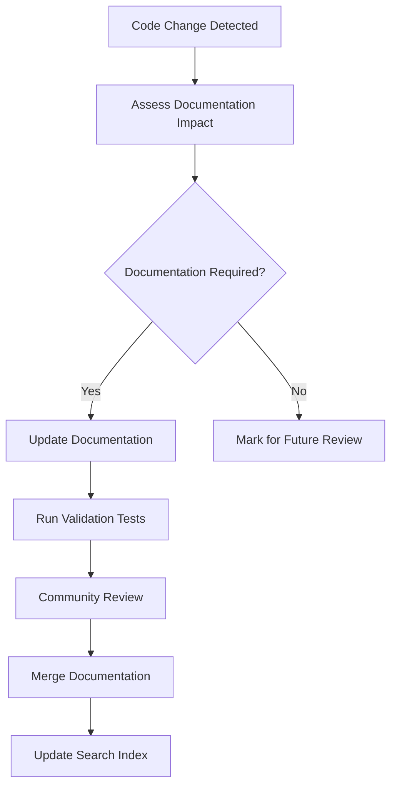
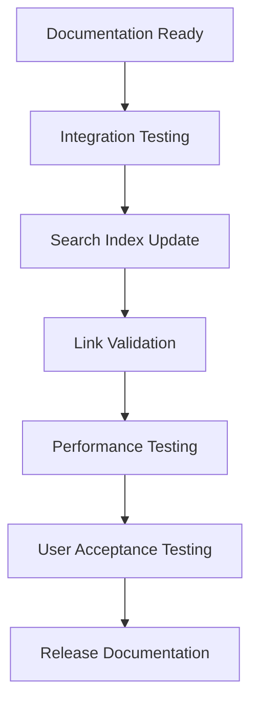

# TiXL Operator Documentation Maintenance Guide

## Overview

This guide establishes the processes and procedures for maintaining the comprehensive TiXL operator API reference as a living document. It ensures documentation accuracy, completeness, and usability as the operator system evolves.

## Maintenance Responsibilities

### Documentation Team
- **Primary Maintainer**: Overall documentation stewardship
- **Technical Writer**: Content creation and quality assurance
- **Developer Liaison**: Code-documentation synchronization
- **Community Manager**: Community feedback and contributions

### Development Team
- **API Designer**: Operator API design and evolution
- **Implementation Developer**: Code changes and documentation updates
- **Quality Assurance**: Documentation testing and validation
- **Release Manager**: Documentation integration with releases

### Community Contributors
- **Documentation Contributors**: Content creation and improvements
- **User Feedback**: Issue reporting and enhancement suggestions
- **Example Providers**: Usage examples and best practices
- **Reviewers**: Community review and validation

## Update Processes

### Code Change Workflow

#### 1. API Modification Detection


#### 2. Documentation Update Process
1. **Change Assessment**: Evaluate scope of API changes
2. **Documentation Planning**: Identify required documentation updates
3. **Content Creation/Update**: Modify or create documentation content
4. **Quality Assurance**: Validate accuracy and completeness
5. **Community Review**: Submit for community feedback
6. **Integration**: Merge approved changes
7. **Index Update**: Update search and cross-reference indices

#### 3. Validation Requirements
- **Code Example Compilation**: All examples must compile successfully
- **Cross-Reference Validation**: All links and references must be valid
- **Content Accuracy**: Documentation must match actual implementation
- **Completeness Check**: All required sections must be present

### New Operator Documentation

#### 1. Template Application
```markdown
### New Operator Template Checklist
- [ ] Operator overview and purpose
- [ ] Class definition with XML documentation
- [ ] Key properties and their descriptions
- [ ] Constructor documentation with parameters
- [ ] Key methods with usage examples
- [ ] Usage examples (basic and advanced)
- [ ] Error handling examples
- [ ] Performance characteristics
- [ ] Thread safety considerations
- [ ] Cross-references to related operators
- [ ] Version information
- [ ] Keywords and search tags
```

#### 2. Documentation Quality Standards
- **Comprehensive Coverage**: All public APIs must be documented
- **Practical Examples**: Real-world usage scenarios included
- **Error Handling**: Common failure modes and handling strategies
- **Performance Guidance**: Optimization tips and characteristics
- **Cross-Integration**: Links to related operators and concepts

### Deprecated Operator Documentation

#### 1. Deprecation Process
1. **Mark as Deprecated**: Add deprecation notice to documentation
2. **Migration Guide**: Provide clear upgrade path to new operators
3. **Timeline Communication**: Specify deprecation timeline
4. **Support Duration**: Document support period for deprecated operators
5. **Removal Planning**: Schedule and communicate removal timeline

#### 2. Deprecation Documentation Template
```markdown
### Deprecated Operator: [OperatorName]

**Status**: Deprecated  
**Deprecated Version**: [Version]  
**Removal Planned**: [Future Version]  
**Migration Guide**: [Link to replacement operator docs]

#### Reason for Deprecation
[Explanation of why operator is deprecated]

#### Migration Path
[Step-by-step guide for migrating to replacement]

#### Timeline
- **Deprecation Notice**: [Date]
- **End of Support**: [Date]
- **Removal Date**: [Date]
```

## Quality Assurance

### Automated Validation

#### 1. Documentation Testing
```csharp
/// <summary>
/// Automated validation of operator documentation.
/// </summary>
public class DocumentationValidator
{
    public ValidationResult ValidateDocumentation(string documentationPath)
    {
        // Validate XML documentation completeness
        // Check code example compilation
        // Verify cross-reference links
        // Ensure required sections present
        // Validate search index updates
    }
}
```

#### 2. Link Validation
```csharp
/// <summary>
/// Validates all cross-references and links in documentation.
/// </summary>
public class LinkValidator
{
    public LinkValidationResult ValidateLinks()
    {
        // Check internal cross-references
        // Validate external documentation links
        // Verify operator reference links
        // Test search index integration
    }
}
```

#### 3. Code Example Verification
```csharp
/// <summary>
/// Compiles and tests all code examples in documentation.
/// </summary>
public class CodeExampleValidator
{
    public ExampleValidationResult ValidateExamples()
    {
        // Compile all code examples
        // Test example execution
        // Verify expected outputs
        // Check for compilation warnings
    }
}
```

### Manual Review Process

#### 1. Content Review Checklist
- [ ] **Accuracy**: Documentation matches implementation
- [ ] **Completeness**: All required sections present
- [ ] **Clarity**: Clear, understandable language
- [ ] **Examples**: Practical, working code examples
- [ ] **Cross-References**: Proper linking and references
- [ ] **Formatting**: Consistent formatting and structure

#### 2. Technical Review Checklist
- [ ] **API Correctness**: All APIs properly documented
- [ ] **Parameter Accuracy**: Parameters match implementation
- [ ] **Return Types**: Return types and values correct
- [ ] **Exception Documentation**: All exceptions properly documented
- [ ] **Thread Safety**: Threading characteristics documented
- [ ] **Performance**: Performance characteristics accurate

#### 3. User Experience Review
- [ ] **Usability**: Easy to find and understand
- [ ] **Navigation**: Logical structure and flow
- [ ] **Searchability**: Discoverable through search
- [ ] **Consistency**: Consistent terminology and style
- [ ] **Accessibility**: Accessible to diverse user skill levels

## Community Contributions

### Contribution Workflow

#### 1. Contribution Types
- **Documentation Updates**: Corrections and improvements
- **New Content**: Additional examples, usage patterns
- **Translation**: Localization for different languages
- **Visual Examples**: Screenshots, diagrams, interactive content
- **Search Enhancement**: Improved categorization and tagging

#### 2. Contribution Process
1. **Fork Repository**: Create documentation branch
2. **Make Changes**: Update documentation following guidelines
3. **Run Validation**: Pass automated validation checks
4. **Submit Pull Request**: Request community review
5. **Address Feedback**: Incorporate reviewer suggestions
6. **Merge**: Integrate approved changes

#### 3. Contribution Guidelines
```markdown
## Documentation Contribution Guidelines

### Content Standards
- Follow established templates and patterns
- Use consistent terminology and style
- Include practical, working examples
- Provide clear cross-references

### Code Examples
- Must compile successfully
- Include necessary using statements
- Show both success and error cases
- Demonstrate real-world usage patterns

### Quality Requirements
- Pass all automated validation checks
- Include comprehensive test coverage
- Follow naming conventions
- Document all public APIs
```

### Community Review Process

#### 1. Review Assignment
- **Technical Review**: API accuracy and implementation match
- **Editorial Review**: Writing quality and clarity
- **User Experience Review**: Usability and accessibility
- **Community Review**: Open community feedback period

#### 2. Review Criteria
- **Technical Accuracy**: Correctness of API documentation
- **Content Quality**: Clarity, completeness, and usefulness
- **Example Quality**: Working, practical code examples
- **Cross-Reference Quality**: Proper linking and navigation

#### 3. Review Timeline
- **Initial Review**: 48 hours for technical accuracy
- **Community Feedback**: 1 week for broader review
- **Revision Period**: 3 days for incorporating feedback
- **Final Approval**: 24 hours for final validation

## Release Integration

### Documentation Release Process

#### 1. Pre-Release Preparation
- [ ] **Documentation Update**: All operator docs current
- [ ] **Search Index Update**: Search indices refreshed
- [ ] **Cross-Reference Validation**: All links verified
- [ ] **Example Compilation**: All code examples tested
- [ ] **Version Consistency**: Version info synchronized

#### 2. Release Integration


#### 3. Post-Release Validation
- **Documentation Accessibility**: Verify docs are accessible post-release
- **Search Functionality**: Confirm search and discovery work correctly
- **Link Validation**: Ensure all cross-references remain valid
- **Community Feedback**: Monitor for documentation issues

### Version Management

#### 1. Version Tracking
```markdown
## Version History Template

| Version | Date | Changes | Author |
|---------|------|---------|--------|
| 1.0 | 2025-11-02 | Initial operator API reference documentation | Documentation Team |
| 1.1 | [Future] | Added [new operators] and [improvements] | [Author] |
```

#### 2. Change Documentation
- **Major Changes**: Breaking API changes, new operator categories
- **Minor Changes**: New operators, improved examples, documentation updates
- **Patch Changes**: Corrections, fixes, link updates

#### 3. Migration Documentation
- **Upgrade Guides**: Step-by-step migration for API changes
- **Compatibility Matrix**: Version compatibility information
- **Deprecation Notices**: Clear communication of deprecated features

## Monitoring and Metrics

### Documentation Metrics

#### 1. Quality Metrics
- **Completeness Score**: Percentage of APIs fully documented
- **Accuracy Rate**: Documentation vs. implementation accuracy
- **Example Success Rate**: Percentage of examples that compile/run
- **Cross-Reference Validity**: Percentage of valid links and references

#### 2. Usage Metrics
- **Search Success Rate**: Users finding desired operators
- **Documentation Views**: Most accessed operator documentation
- **Search Terms**: Common search patterns and missing operators
- **Community Feedback**: Issues reported and resolved

#### 3. Performance Metrics
- **Documentation Load Time**: Speed of documentation access
- **Search Response Time**: Performance of operator search
- **Link Resolution Speed**: Cross-reference navigation performance

### Health Monitoring

#### 1. Automated Monitoring
```csharp
/// <summary>
/// Continuous monitoring of documentation health.
/// </summary>
public class DocumentationHealthMonitor
{
    public HealthReport GenerateHealthReport()
    {
        var report = new HealthReport
        {
            DocumentationCompleteness = CalculateCompleteness(),
            LinkValidity = ValidateAllLinks(),
            ExampleSuccessRate = TestAllExamples(),
            SearchIndexHealth = ValidateSearchIndex(),
            CommunitySatisfaction = AnalyzeFeedback()
        };
        
        return report;
    }
}
```

#### 2. Alert System
- **Broken Links**: Immediate alerts for broken cross-references
- **Compilation Failures**: Alerts for broken code examples
- **Outdated Documentation**: Alerts for documentation drift
- **Performance Degradation**: Alerts for slow search or loading

## Tools and Automation

### Documentation Tools

#### 1. Generation Tools
```csharp
/// <summary>
/// Automated documentation generation from operator metadata.
/// </summary>
public class DocumentationGenerator
{
    public void GenerateFromMetadata(Assembly operatorAssembly)
    {
        // Scan operator types and extract metadata
        // Generate documentation from type information
        // Apply standardized templates
        // Include examples from test cases
    }
}
```

#### 2. Validation Tools
```csharp
/// <summary>
/// Comprehensive validation suite for documentation quality.
/// </summary>
public class DocumentationQualitySuite
{
    public QualityReport ValidateDocumentation(string docsPath)
    {
        return new QualityReport
        {
            SyntaxValidation = ValidateMarkdownSyntax(),
            LinkValidation = ValidateAllLinks(),
            CodeExampleValidation = ValidateCodeExamples(),
            CrossReferenceValidation = ValidateCrossReferences(),
            SearchIndexValidation = ValidateSearchIndex()
        };
    }
}
```

#### 3. Search Tools
```csharp
/// <summary>
/// Search index management and optimization tools.
/// </summary>
public class SearchIndexManager
{
    public void UpdateSearchIndex()
    {
        // Scan all operator documentation
        // Extract searchable metadata
        // Build search indices
        // Optimize for performance
    }
}
```

### Integration Tools

#### 1. CI/CD Integration
```yaml
# Documentation validation in CI pipeline
documentation-validation:
  stage: quality-check
  script:
    - validate-documentation
    - compile-examples
    - validate-links
    - update-search-index
  artifacts:
    reports:
      documentation-report
```

#### 2. Build Integration
```xml
<!-- Automated documentation generation in build -->
<Target Name="GenerateDocumentation" AfterTargets="Build">
  <Exec Command="dotnet generate-docs --assembly=$(TargetPath)" />
</Target>
```

## Training and Onboarding

### Documentation Training

#### 1. Team Training
- **Documentation Standards**: Team training on standards and templates
- **Tool Usage**: Training on documentation tools and automation
- **Review Process**: Training on review procedures and criteria
- **Community Management**: Training on handling community contributions

#### 2. Developer Onboarding
- **API Documentation**: Guidelines for documenting new operators
- **Best Practices**: Documentation best practices training
- **Quality Standards**: Understanding documentation quality requirements
- **Contribution Process**: How to contribute to documentation

### Knowledge Management

#### 1. Documentation Knowledge Base
- **Templates Library**: Reusable documentation templates
- **Style Guide**: Comprehensive style and formatting guide
- **Examples Repository**: Curated collection of good examples
- **FAQ Database**: Frequently asked questions and answers

#### 2. Process Documentation
- **Maintenance Procedures**: Step-by-step maintenance processes
- **Quality Checklists**: Detailed quality assurance checklists
- **Troubleshooting Guide**: Common issues and solutions
- **Tool Documentation**: Documentation of documentation tools

## Success Metrics

### Documentation Success Indicators

#### 1. User Satisfaction
- **Search Success Rate**: >95% of searches return relevant results
- **Documentation Helpfulness**: >90% of users find documentation helpful
- **Time to Solution**: Users can find solutions quickly
- **Error Reduction**: Fewer user errors due to poor documentation

#### 2. Technical Quality
- **Documentation Coverage**: 100% of public APIs documented
- **Example Success Rate**: 100% of examples compile and run
- **Link Validity**: 100% of cross-references valid
- **Update Synchronization**: Documentation updated within 1 release of API changes

#### 3. Community Engagement
- **Contribution Rate**: Regular community contributions
- **Review Participation**: Active community review process
- **Feedback Quality**: Constructive, actionable feedback
- **Issue Resolution**: Quick resolution of documentation issues

## Continuous Improvement

### Feedback Integration

#### 1. User Feedback Collection
- **Documentation Ratings**: User ratings of documentation quality
- **Issue Tracking**: Systematic tracking of documentation issues
- **Usage Analytics**: Understanding how users interact with documentation
- **Community Surveys**: Regular surveys on documentation needs

#### 2. Improvement Process
- **Feedback Analysis**: Regular analysis of user feedback
- **Priority Planning**: Prioritizing documentation improvements
- **Implementation**: Systematic implementation of improvements
- **Validation**: Measuring impact of improvements

### Innovation and Enhancement

#### 1. New Features
- **Interactive Examples**: Interactive, executable code examples
- **Visual Documentation**: Enhanced visual examples and diagrams
- **Search Enhancement**: Improved search algorithms and interfaces
- **Multi-format Support**: Documentation in multiple formats

#### 2. Technology Evolution
- **AI Assistance**: AI-powered documentation generation and validation
- **Automated Examples**: Automatic example generation from code
- **Real-time Validation**: Real-time documentation validation
- **Collaborative Editing**: Enhanced collaborative documentation tools

---

**Document Version**: 1.0  
**Last Updated**: 2025-11-02  
**Next Review Date**: 2025-12-02  
**Maintenance Schedule**: Monthly reviews, quarterly comprehensive audits  

**Keywords**: maintenance, documentation, quality-assurance, community, processes, automation