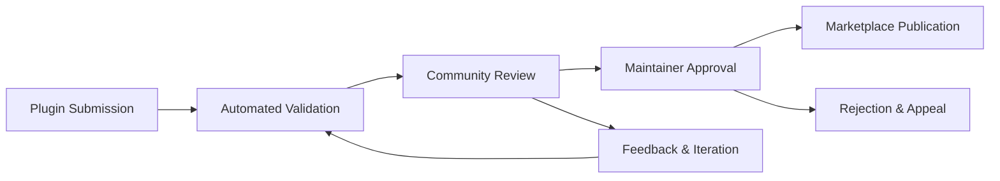
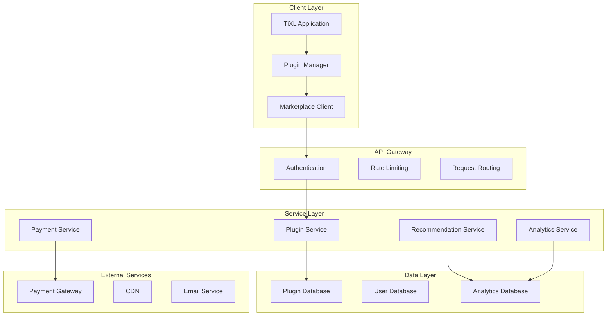

# TiXL Plugin Ecosystem Infrastructure: Comprehensive Development Guide

## Executive Summary

This document outlines the comprehensive plugin ecosystem infrastructure for TiXL (Tooll 3), designed to support 20+ curated plugins and community-driven development. The infrastructure encompasses marketplace development, SDK frameworks, quality assurance automation, discovery systems, monetization models, compatibility management, and community processes. This ecosystem will position TiXL as a leading extensible platform for real-time motion graphics, competing with commercial solutions while maintaining its open-source advantages.

## Table of Contents

1. [Plugin Marketplace Architecture](#1-plugin-marketplace-architecture)
2. [Development SDK and Documentation](#2-development-sdk-and-documentation)
3. [Quality Assurance and Validation](#3-quality-assurance-and-validation)
4. [Discovery and Recommendation Systems](#4-discovery-and-recommendation-systems)
5. [Monetization and Revenue Sharing](#5-monetization-and-revenue-sharing)
6. [Compatibility and Versioning Management](#6-compatibility-and-versioning-management)
7. [Community Contribution and Curation](#7-community-contribution-and-curation)
8. [Implementation Roadmap](#8-implementation-roadmap)
9. [Technical Architecture](#9-technical-architecture)
10. [Business Models](#10-business-models)

---

## 1. Plugin Marketplace Architecture

### 1.1 Marketplace Platform Specifications

The TiXL Plugin Marketplace serves as the central hub for plugin discovery, installation, and management. The platform supports both free and commercial plugins with comprehensive categorization and search capabilities.

#### Core Features
- **Plugin Discovery**: Browse by category, tags, ratings, and popularity
- **Rating and Review System**: 5-star ratings with detailed user reviews
- **Installation Management**: One-click installation with dependency resolution
- **Version Compatibility**: Automatic compatibility checking with TiXL versions
- **Community Features**: Comments, discussions, and plugin recommendations

#### Marketplace Categories

| Category | Subcategories | Target Audience |
|----------|---------------|-----------------|
| **Audio & Music** | Audio Analysis, VST Bridge, MIDI Processing, Beat Detection | Musicians, VJs, Live Performers |
| **Visual Effects** | Shader Effects, Particle Systems, Post-Processing, Transitions | Visual Artists, Content Creators |
| **Input/Output** | Hardware Integration, Protocol Support, Device Drivers | Technical Artists, Installations |
| **Workflow Tools** | Automation, Batch Processing, Import/Export, Templates | Production Teams, Studios |
| **Experimental** | Research Projects, Beta Features, Community Experiments | Developers, Early Adopters |

#### Technical Architecture

```json
{
  "marketplace_api": {
    "base_url": "https://plugins.tixl.app/api/v1",
    "endpoints": {
      "plugins": "/plugins",
      "categories": "/categories", 
      "search": "/search",
      "install": "/install",
      "reviews": "/reviews",
      "analytics": "/analytics"
    },
    "authentication": {
      "method": "OAuth 2.0",
      "providers": ["GitHub", "Discord", "Email"]
    }
  },
  "plugin_metadata": {
    "required_fields": ["id", "name", "version", "description", "author", "category"],
    "optional_fields": ["price", "license", "tags", "dependencies", "screenshots"]
  }
}
```

### 1.2 Plugin Installation System

#### Automated Installation Process
1. **Dependency Resolution**: Check for required TiXL version and dependencies
2. **Compatibility Validation**: Verify plugin compatibility with user's setup
3. **Secure Download**: HTTPS download with integrity verification
4. **Installation**: Automated installation with backup creation
5. **Activation**: Plugin registration and initialization

#### Installation States
```csharp
public enum PluginInstallationState
{
    NotInstalled,
    Downloading,
    Installing, 
    Installed,
    Updating,
    Failed,
    Disabled,
    Compatible,
    Incompatible
}
```

#### Plugin Package Format
```
TiXLPlugin.zip
├── plugin.json          # Plugin metadata
├── plugin.dll          # Main plugin assembly
├── dependencies.json    # Dependency specifications
├── assets/             # Icons, screenshots, samples
├── documentation/      # Plugin documentation
└── samples/            # Example projects
```

### 1.3 Rating and Review System

#### Rating Algorithm
```csharp
public class PluginRating
{
    public double AverageRating { get; set; }
    public int TotalReviews { get; set; }
    public Dictionary<int, int> RatingDistribution { get; set; } // 1-5 stars
    public double WeightedScore { get; set; } // Bayesian average
    public DateTime LastUpdated { get; set; }
}
```

#### Review Moderation
- Automated spam detection using ML models
- Community moderation with reputation scores
- Maintainer review for commercial plugins
- Appeal process for disputed reviews

---

## 2. Development SDK and Documentation

### 2.1 TiXL Plugin SDK Architecture

The TiXL Plugin SDK provides comprehensive tools for developing, testing, and distributing plugins. The SDK supports C# development with templates, debugging tools, and extensive documentation.

#### SDK Components

| Component | Purpose | Features |
|-----------|---------|----------|
| **Plugin Templates** | Quick project initialization | Basic Operator, Audio Plugin, I/O Handler, Custom UI |
| **API Libraries** | Core plugin functionality | Operator API, UI API, I/O API, Graphics API |
| **Development Tools** | Plugin development support | Debugger, Profiler, Hot Reload, Testing Framework |
| **Documentation** | Developer guidance | API Reference, Tutorials, Best Practices, Examples |

#### Plugin Template Structure

```csharp
// Basic Operator Plugin Template
namespace TiXL.Plugins.MyOperator
{
    [Operator("MyCustomOperator")]
    public class MyCustomOperator : BaseOperator
    {
        [Input("Input Value")]
        public Property<float> InputValue { get; set; }
        
        [Output("Output Value")]
        public Property<float> OutputValue { get; set; }
        
        public override void Evaluate()
        {
            OutputValue.Value = InputValue.Value * 2.0f;
        }
    }
}
```

#### SDK Installation
```bash
# Install TiXL Plugin SDK
dotnet tool install -g TiXL.Plugin.SDK

# Create new plugin project
tixl plugin create MyPlugin --template basic-operator

# Build and test plugin
tixl plugin build MyPlugin
tixl plugin test MyPlugin
```

### 2.2 API Documentation

#### Core Plugin APIs

##### Operator API
```csharp
namespace TiXL.Plugins.API
{
    /// <summary>
    /// Base class for all TiXL operators
    /// </summary>
    public abstract class BaseOperator
    {
        /// <summary>
        /// Called when the operator is evaluated
        /// </summary>
        public abstract void Evaluate();
        
        /// <summary>
        /// Operator metadata and configuration
        /// </summary>
        public OperatorInfo Info { get; set; }
        
        /// <summary>
        /// Thread-safe evaluation context
        /// </summary>
        public EvaluationContext Context { get; set; }
    }
}
```

##### UI API
```csharp
namespace TiXL.Plugins.UI
{
    /// <summary>
    /// Custom UI controls for plugins
    /// </summary>
    public class PluginControl : UserControl
    {
        /// <summary>
        /// Bind to operator properties
        /// </summary>
        public void BindProperty<T>(Property<T> property, Control control);
        
        /// <summary>
        /// Add custom drawing
        /// </summary>
        protected override void OnRender(RenderContext context);
    }
}
```

### 2.3 Plugin Development Examples

#### Example 1: Audio Visualizer Plugin
```csharp
[Operator("AudioVisualizer")]
public class AudioVisualizerOperator : BaseOperator
{
    [Input("Audio Source")]
    public Property<AudioSource> AudioSource { get; set; }
    
    [Input("Visualization Type")]
    public Property<VisualizationType> VisualizationType { get; set; }
    
    [Output("Visualization Data")]
    public Property<float[]> VisualizationData { get; set; }
    
    public override void Evaluate()
    {
        var audio = AudioSource.Value;
        var type = VisualizationType.Value;
        
        switch (type)
        {
            case VisualizationType.Spectrum:
                VisualizationData.Value = audio.GetSpectrumData();
                break;
            case VisualizationType.Waveform:
                VisualizationData.Value = audio.GetWaveformData();
                break;
        }
    }
}
```

#### Example 2: Custom I/O Handler
```csharp
[IOHandler("WebSocket")]
public class WebSocketIOHandler : BaseIOHandler
{
    private WebSocketServer _server;
    
    public override async Task StartAsync()
    {
        _server = new WebSocketServer("ws://localhost:8080");
        _server.OnMessage += HandleMessage;
        await _server.StartAsync();
    }
    
    public override async Task SendAsync(object data)
    {
        var json = JsonSerializer.Serialize(data);
        await _server.BroadcastAsync(json);
    }
}
```

---

## 3. Quality Assurance and Validation

### 3.1 Plugin Validation Framework

The Plugin Validation Framework ensures all plugins meet quality standards before publication. It includes automated testing, security scanning, and performance analysis.

#### Validation Pipeline

```yaml
validation_pipeline:
  stages:
    - name: "Static Analysis"
      tools: ["Roslyn Analyzers", "SonarQube", "Security Scanner"]
      
    - name: "Unit Testing" 
      framework: "xUnit"
      coverage_threshold: 80
      
    - name: "Integration Testing"
      environment: "TiXL Test Instance"
      test_projects: ["Basic Functionality", "UI Interaction", "I/O Testing"]
      
    - name: "Performance Testing"
      metrics: ["Execution Time", "Memory Usage", "GPU Utilization"]
      
    - name: "Security Scanning"
      checks: ["Dependency Vulnerabilities", "Code Analysis", "Runtime Security"]
      
    - name: "Compatibility Testing"
      tixl_versions: ["Latest Stable", "Latest Preview", "Previous Major"]
```

#### Plugin Quality Checklist

| Category | Checks | Automated |
|----------|--------|-----------|
| **Code Quality** | Style, complexity, documentation | ✅ |
| **Functionality** | Basic operations, edge cases | ✅ |
| **Performance** | Execution time, memory usage | ✅ |
| **Security** | Vulnerabilities, permissions | ✅ |
| **Compatibility** | TiXL versions, dependencies | ✅ |
| **UI/UX** | Responsiveness, accessibility | ✅ |
| **Documentation** | README, API docs, examples | ✅ |

### 3.2 Automated Testing Framework

#### Plugin Test Suite
```csharp
public class PluginTestSuite : IDisposable
{
    private TiXLTestEnvironment _environment;
    
    [SetUp]
    public void Setup()
    {
        _environment = new TiXLTestEnvironment();
        _environment.Initialize();
    }
    
    [Test]
    public void Plugin_Loads_Successfully()
    {
        var plugin = _environment.LoadPlugin("TestPlugin");
        Assert.That(plugin, Is.Not.Null);
        Assert.That(plugin.Status, Is.EqualTo(PluginStatus.Loaded));
    }
    
    [Test]
    public void Operator_Evaluates_Correctly()
    {
        var operator = _environment.CreateOperator<TestOperator>();
        operator.Input.Value = 42f;
        operator.Evaluate();
        Assert.That(operator.Output.Value, Is.EqualTo(84f));
    }
}
```

### 3.3 Security and Safety Validation

#### Security Scanner Integration
```csharp
public class PluginSecurityScanner
{
    public SecurityReport Scan(PluginPackage package)
    {
        var report = new SecurityReport();
        
        // Check for malicious patterns
        report.AddCheck("Malware Detection", ScanForMalware(package));
        
        // Verify digital signatures
        report.AddCheck("Digital Signature", VerifySignature(package));
        
        // Analyze permissions
        report.AddCheck("Permission Analysis", AnalyzePermissions(package));
        
        // Check dependencies
        report.AddCheck("Dependency Security", ScanDependencies(package));
        
        return report;
    }
}
```

#### Runtime Safety Checks
- Sandbox execution for untrusted plugins
- Resource usage monitoring and limits
- API call validation and filtering
- Memory and CPU usage quotas

---

## 4. Discovery and Recommendation Systems

### 4.1 Plugin Discovery Engine

The Plugin Discovery Engine helps users find relevant plugins through intelligent search, filtering, and recommendation algorithms.

#### Search Algorithm
```csharp
public class PluginSearchEngine
{
    public SearchResults Search(SearchQuery query)
    {
        var results = _pluginRepository.Query()
            .FilterByCategory(query.Category)
            .FilterByCompatibility(query.TiXLVersion)
            .FilterByPrice(query.PriceRange)
            .RankByRelevance(query.Keywords)
            .RankByRating(query.MinRating)
            .ToResults();
            
        return ApplyPersonalization(results, query.User);
    }
}
```

#### Search Filters
- **Category**: Audio, Visual Effects, I/O, Workflow, Experimental
- **Compatibility**: TiXL version, OS, hardware requirements
- **Price**: Free, Paid, Freemium, Subscription
- **Rating**: Minimum rating, review count
- **Tags**: Custom tags for fine-grained filtering
- **Author**: Verified authors, community favorites

### 4.2 Recommendation System

#### Collaborative Filtering
```csharp
public class RecommendationEngine
{
    public List<Plugin> GetRecommendations(User user, int count = 10)
    {
        var similarUsers = FindSimilarUsers(user);
        var recommendedPlugins = GetPopularAmongSimilar(similarUsers);
        
        // Combine with content-based filtering
        var userPreferences = ExtractPreferences(user);
        var contentBased = GetByPreferences(userPreferences);
        
        return CombineRecommendations(recommendedPlugins, contentBased)
            .Take(count)
            .ToList();
    }
}
```

#### Trending Algorithm
```csharp
public class TrendingCalculator
{
    public double CalculateTrendingScore(Plugin plugin, TimeSpan timeWindow)
    {
        var recentActivity = GetActivityInWindow(plugin, timeWindow);
        var basePopularity = plugin.TotalDownloads / 1000.0;
        var velocity = recentActivity.DownloadRate;
        var quality = plugin.Rating.AverageRating / 5.0;
        
        return (basePopularity * 0.4) + (velocity * 0.4) + (quality * 0.2);
    }
}
```

### 4.3 Discovery Analytics

#### Analytics Dashboard
- **Search Queries**: Most popular searches, zero-result queries
- **User Behavior**: Click-through rates, conversion rates
- **Plugin Performance**: Download trends, rating evolution
- **Category Analysis**: Growth by category, cross-category trends

---

## 5. Monetization and Revenue Sharing

### 5.1 Revenue Models

#### Plugin Monetization Options

| Model | Description | Revenue Share |
|-------|-------------|---------------|
| **One-time Purchase** | Pay once, own forever | 70% creator / 30% TiXL |
| **Subscription** | Monthly/yearly recurring | 80% creator / 20% TiXL |
| **Freemium** | Basic free, premium paid | 75% creator / 25% TiXL |
| **Donation** | Optional tips to creators | 90% creator / 10% TiXL |
| **Enterprise** | Commercial licenses | 60% creator / 40% TiXL |

#### Payment Processing
```csharp
public class PluginPaymentProcessor
{
    public async Task<PaymentResult> ProcessPayment(PaymentRequest request)
    {
        // Validate payment method
        var validation = await ValidatePaymentMethod(request.PaymentMethod);
        if (!validation.IsValid)
            return PaymentResult.Failed(validation.Error);
            
        // Process payment
        var payment = await _paymentGateway.Charge(request.Amount, request.Currency);
        
        // Distribute revenue
        var distribution = CalculateRevenueShare(request.Plugin, payment.Amount);
        await DistributeRevenue(distribution);
        
        // Grant access
        await GrantPluginAccess(request.User, request.Plugin);
        
        return PaymentResult.Success(payment);
    }
}
```

### 5.2 Creator Dashboard

#### Analytics and Reporting
```csharp
public class CreatorDashboard
{
    public CreatorStats GetStats(Creator creator, DateRange range)
    {
        return new CreatorStats
        {
            TotalRevenue = CalculateTotalRevenue(creator, range),
            DownloadCount = GetDownloadCount(creator.Plugins, range),
            ActiveUsers = GetActiveUsers(creator.Plugins, range),
            RatingsBreakdown = GetRatingsBreakdown(creator.Plugins, range),
            RevenueTrends = CalculateRevenueTrends(creator, range),
            TopPlugins = GetTopPlugins(creator, range)
        };
    }
}
```

#### Revenue Analytics
- **Real-time Revenue**: Live sales tracking
- **Geographic Distribution**: Sales by region
- **User Demographics**: Buyer profile analysis
- **Conversion Funnel**: From discovery to purchase

### 5.3 Enterprise Licensing

#### Enterprise Plugin Framework
```csharp
public class EnterprisePluginLicense : PluginLicense
{
    public int MaxUsers { get; set; }
    public bool IncludesSourceCode { get; set; }
    public TimeSpan SupportDuration { get; set; }
    public string DeploymentEnvironment { get; set; }
    
    public override bool IsValid()
    {
        return base.IsValid() && 
               MaxUsers > 0 && 
               SupportDuration > TimeSpan.Zero;
    }
}
```

---

## 6. Compatibility and Versioning Management

### 6.1 Version Compatibility Framework

#### Semantic Versioning for Plugins
```
Plugin Version Format: MAJOR.MINOR.PATCH
- MAJOR: Breaking changes, incompatible API changes
- MINOR: New features, backward compatible
- PATCH: Bug fixes, performance improvements
```

#### Compatibility Matrix
```csharp
public class CompatibilityMatrix
{
    public bool IsCompatible(Plugin plugin, TiXLVersion version)
    {
        var requiredVersion = plugin.MinimumTiXLVersion;
        var testedVersions = plugin.TestedTiXLVersions;
        
        return version >= requiredVersion && 
               testedVersions.Contains(version);
    }
}
```

### 6.2 API Versioning

#### API Deprecation Policy
```csharp
[ApiVersion("1.0", Deprecated = true, Sunset = "2025-12-31")]
[ApiVersion("2.0")]
public class OperatorApiController : ApiController
{
    [HttpGet]
    public IHttpActionResult GetOperators()
    {
        // v2.0 implementation
    }
}
```

### 6.3 Migration Tools

#### Automated Migration Assistant
```csharp
public class MigrationAssistant
{
    public MigrationPlan CreateMigrationPlan(Plugin oldPlugin, Plugin newPlugin)
    {
        var breakingChanges = AnalyzeBreakingChanges(oldPlugin, newPlugin);
        var migrationSteps = new List<MigrationStep>();
        
        foreach (var change in breakingChanges)
        {
            migrationSteps.Add(new MigrationStep
            {
                Description = change.Description,
                Action = change.SuggestedAction,
                Manual = change.RequiresManualIntervention
            });
        }
        
        return new MigrationPlan(migrationSteps);
    }
}
```

---

## 7. Community Contribution and Curation

### 7.1 Community Plugin Curation Process

#### Curation Workflow


#### Curation Guidelines
- **Quality Standards**: Code quality, documentation, testing
- **Uniqueness**: Original functionality, no duplicates
- **Community Value**: Solves real problems, enhances workflows
- **Maintenance**: Active support, regular updates
- **License Compliance**: Open source compatible licenses

### 7.2 Community Review System

#### Reviewer Roles
| Role | Responsibilities | Requirements |
|------|------------------|--------------|
| **Community Reviewer** | Basic quality review, testing | Active community member |
| **Technical Reviewer** | Code review, security analysis | Developer background |
| **Maintainer** | Final approval, long-term support | TiXL team member |

#### Review Checklist
```csharp
public class PluginReviewChecklist
{
    public ReviewCriteria CodeQuality { get; set; }
    public ReviewCriteria Functionality { get; set; }
    public ReviewCriteria Documentation { get; set; }
    public ReviewCriteria Security { get; set; }
    public ReviewCriteria Compatibility { get; set; }
    public ReviewCriteria UserExperience { get; set; }
}
```

### 7.3 Community Programs

#### Plugin Development Contests
- **Quarterly Challenges**: Themed plugin competitions
- **Student Program**: Educational discounts and support
- **Open Source Initiative**: Incentives for open source plugins

#### Community Recognition
```csharp
public class CommunityRecognition
{
    public void AwardBadges(User user, BadgeType badge)
    {
        switch (badge)
        {
            case BadgeType.FirstPlugin:
                user.Badges.Add("First Creator");
                break;
            case BadgeType.PopularPlugin:
                user.Badges.Add("Community Favorite");
                break;
            case BadgeType.QualityContributor:
                user.Badges.Add("Quality Champion");
                break;
        }
    }
}
```

---

## 8. Implementation Roadmap

### 8.1 Phase 1: Foundation (Months 1-3)

#### Core Infrastructure
- **Month 1**: Plugin SDK development and basic templates
- **Month 2**: Marketplace backend and API development
- **Month 3**: Quality assurance automation and testing framework

#### Deliverables
- TiXL Plugin SDK v1.0
- Basic marketplace infrastructure
- Plugin validation pipeline
- Initial documentation

### 8.2 Phase 2: Market Launch (Months 4-6)

#### Marketplace Launch
- **Month 4**: Plugin submission and review system
- **Month 5**: Community curation and rating system
- **Month 6**: Revenue sharing and payment processing

#### Deliverables
- Public plugin marketplace
- Payment processing integration
- Community review system
- 10+ curated plugins

### 8.3 Phase 3: Enhancement (Months 7-9)

#### Advanced Features
- **Month 7**: Recommendation engine and analytics
- **Month 8**: Enterprise licensing and advanced features
- **Month 9**: Mobile companion app and extended documentation

#### Deliverables
- AI-powered recommendations
- Enterprise plugin licensing
- Comprehensive analytics dashboard
- 20+ curated plugins

### 8.4 Phase 4: Ecosystem Expansion (Months 10-12)

#### Ecosystem Growth
- **Month 10**: Third-party integrations and partnerships
- **Month 11**: Advanced plugin types and specialized tools
- **Month 12**: International expansion and localization

#### Deliverables
- Third-party marketplace integrations
- Specialized plugin categories
- International marketplace support
- 50+ total plugins in ecosystem

---

## 9. Technical Architecture

### 9.1 System Architecture

#### High-Level Architecture


### 9.2 Database Schema

#### Plugin Table Schema
```sql
CREATE TABLE Plugins (
    Id UNIQUEIDENTIFIER PRIMARY KEY,
    Name NVARCHAR(255) NOT NULL,
    Description NVARCHAR(MAX),
    AuthorId UNIQUEIDENTIFIER,
    CategoryId UNIQUEIDENTIFIER,
    Version NVARCHAR(50),
    Price DECIMAL(10,2),
    DownloadCount INT DEFAULT 0,
    RatingAverage DECIMAL(3,2) DEFAULT 0,
    RatingCount INT DEFAULT 0,
    CreatedAt DATETIME2,
    UpdatedAt DATETIME2,
    Status NVARCHAR(50) -- Draft, Review, Approved, Published, Rejected
);

CREATE TABLE PluginReviews (
    Id UNIQUEIDENTIFIER PRIMARY KEY,
    PluginId UNIQUEIDENTIFIER,
    UserId UNIQUEIDENTIFIER,
    Rating INT CHECK (Rating >= 1 AND Rating <= 5),
    Comment NVARCHAR(MAX),
    CreatedAt DATETIME2,
    IsVerifiedPurchase BIT DEFAULT 0
);
```

### 9.3 API Specifications

#### Plugin Management API
```yaml
openapi: 3.0.0
info:
  title: TiXL Plugin Marketplace API
  version: 1.0.0
paths:
  /plugins:
    get:
      summary: List plugins
      parameters:
        - name: category
          in: query
          schema:
            type: string
        - name: search
          in: query
          schema:
            type: string
        - name: page
          in: query
          schema:
            type: integer
            default: 1
    post:
      summary: Submit new plugin
      security:
        - bearerAuth: []
      requestBody:
        content:
          multipart/form-data:
            schema:
              type: object
              properties:
                package:
                  type: string
                  format: binary
                metadata:
                  type: object
```

---

## 10. Business Models

### 10.1 Revenue Streams

#### Primary Revenue Streams
1. **Marketplace Transaction Fees**: 20-30% commission on plugin sales
2. **Enterprise Licensing**: Premium support and licensing services
3. **Sponsored Content**: Promoted plugin listings and featured content
4. **Training and Certification**: Developer training programs
5. **Hardware Partnerships**: Branded hardware with plugin ecosystem

#### Revenue Projections (Year 1)
| Quarter | Transaction Revenue | Enterprise Revenue | Other Revenue | Total |
|---------|--------------------|--------------------|---------------|-------|
| Q1 | $5,000 | $0 | $0 | $5,000 |
| Q2 | $15,000 | $10,000 | $2,000 | $27,000 |
| Q3 | $35,000 | $25,000 | $5,000 | $65,000 |
| Q4 | $60,000 | $40,000 | $8,000 | $108,000 |

### 10.2 Creator Incentives

#### Creator Support Programs
```csharp
public class CreatorIncentiveProgram
{
    public void ApplyIncentives(Creator creator, Plugin plugin)
    {
        // Revenue boost for new creators (first 6 months)
        if (creator.JoinedDate > DateTime.Now.AddMonths(-6))
        {
            creator.RevenueShare = 0.85; // 85% instead of 70%
        }
        
        // Quality bonuses
        if (plugin.RatingAverage > 4.5 && plugin.RatingCount > 100)
        {
            creator.Bonuses.Add(new QualityBonus
            {
                Amount = 500,
                Reason = "High Quality Plugin"
            });
        }
        
        // Community contributions
        if (plugin.IsOpenSource)
        {
            creator.RevenueShare += 0.05; // 5% bonus for open source
        }
    }
}
```

### 10.3 Strategic Partnerships

#### Partnership Framework
- **Educational Institutions**: University partnerships for plugin development courses
- **Hardware Manufacturers**: Integration partnerships with audio/visual equipment
- **Software Companies**: API partnerships with complementary tools
- **Content Creators**: Influencer partnerships for plugin promotion

#### Partnership Benefits
```csharp
public class PartnershipBenefits
{
    public static readonly Dictionary<PartnerType, Benefits> BenefitsMap = new()
    {
        [PartnerType.Educational] = new Benefits
        {
            RevenueShare = 0.90,
            FreeMarketplaceAccess = true,
            StudentDiscounts = true,
            CustomBranding = true
        },
        [PartnerType.Hardware] = new Benefits
        {
            RevenueShare = 0.80,
            IntegrationSupport = true,
            CoMarketing = true,
            EarlyAccess = true
        },
        [PartnerType.Software] = new Benefits
        {
            RevenueShare = 0.75,
            APIAccess = true,
            JointDevelopment = true,
            TechnicalSupport = true
        }
    };
}
```

---

## Conclusion

The TiXL Plugin Ecosystem Infrastructure represents a comprehensive approach to building a thriving plugin marketplace for real-time motion graphics. By implementing this infrastructure, TiXL will:

1. **Democratize Development**: Lower barriers to plugin creation through comprehensive SDK and documentation
2. **Ensure Quality**: Automated validation and community curation processes
3. **Enable Discovery**: Intelligent search and recommendation systems
4. **Support Monetization**: Flexible revenue sharing and business models
5. **Maintain Compatibility**: Robust versioning and migration frameworks
6. **Foster Community**: Clear contribution processes and recognition programs

This infrastructure will position TiXL as the leading extensible platform for real-time motion graphics, competing effectively with commercial solutions while maintaining its open-source advantage. The phased implementation approach ensures steady progress while maintaining high quality standards throughout development.

With 20+ curated plugins target for Year 1, this ecosystem will create value for creators, users, and the broader TiXL community, establishing a sustainable foundation for long-term growth and innovation.

---

## Appendices

### Appendix A: Plugin Development Quick Start
### Appendix B: API Reference Documentation  
### Appendix C: Marketplace Integration Examples
### Appendix D: Quality Assurance Checklists
### Appendix E: Community Guidelines and Policies

*Note: Full appendices available in the online documentation at https://docs.tixl.app/plugins*