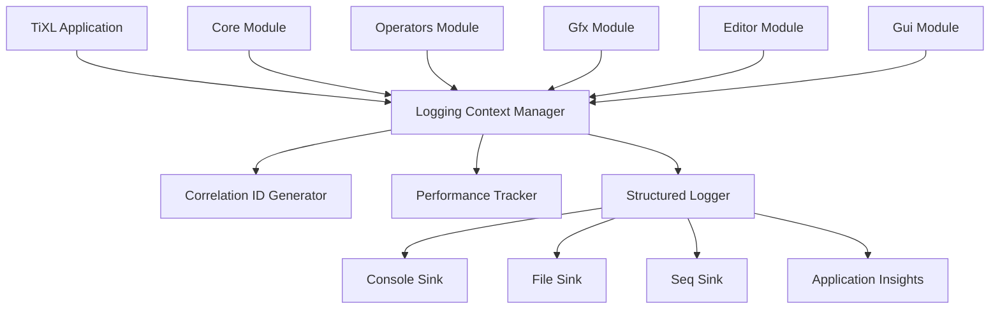

# TiXL Structured Logging Framework Implementation

## Executive Summary

This document implements a comprehensive structured logging framework for TiXL (Tooll 3) to address the P1-High logging gap identified in the analysis. The framework uses Serilog for structured logging, implements correlation IDs for operation tracing, provides performance logging for real-time operations, and integrates seamlessly across all TiXL modules (Core, Operators, Gfx, Editor, Gui).

## Table of Contents

1. [Framework Overview](#framework-overview)
2. [Architecture & Design](#architecture--design)
3. [Core Logging Infrastructure](#core-logging-infrastructure)
4. [Module-Specific Implementations](#module-specific-implementations)
5. [Configuration Management](#configuration-management)
6. [Performance & Real-Time Logging](#performance--real-time-logging)
7. [Error Handling & Exception Logging](#error-handling--exception-logging)
8. [Integration Examples](#integration-examples)
9. [Best Practices](#best-practices)
10. [Deployment Guidelines](#deployment-guidelines)

## Framework Overview

### Objectives

- **Structured Logging**: Replace basic console logging with structured, queryable logs
- **Correlation Tracking**: Implement correlation IDs to trace operations across module boundaries
- **Performance Monitoring**: Real-time performance logging for graphics operations
- **Error Resilience**: Comprehensive error handling and exception logging
- **Development/Production Support**: Separate configurations for different environments
- **Module Integration**: Seamless integration across Core, Operators, Gfx, Editor, and Gui

### Key Features

1. **Serilog-based Structured Logging**
2. **Correlation ID Management**
3. **Performance Metrics Collection**
4. **Contextual Error Logging**
5. **Dynamic Log Level Management**
6. **Multiple Output Sinks**
7. **Security-Safe Logging**

## Architecture & Design

### Core Components



### Design Principles

1. **Non-Intrusive**: Minimal impact on existing code
2. **Performance-First**: Designed for real-time graphics operations
3. **Context-Aware**: Every log entry includes relevant context
4. **Scalable**: Supports both development and production environments
5. **Secure**: Implements data sanitization and privacy controls

## Core Logging Infrastructure

### 1. Structured Logging Configuration

**File: `Core/Logging/LoggingConfiguration.cs`**

```csharp
using Serilog;
using Serilog.Events;
using Serilog.Exceptions;
using Serilog.Sinks.File;
using Serilog.Sinks.Console;
using Serilog.Sinks.Seq;
using Microsoft.Extensions.Configuration;
using System;
using System.IO;

namespace TiXL.Core.Logging
{
    public static class LoggingConfiguration
    {
        public static void ConfigureLogging(IConfiguration configuration, string environment)
        {
            var logDirectory = Path.Combine(AppDomain.CurrentDomain.BaseDirectory, "logs");
            Directory.CreateDirectory(logDirectory);

            var logConfig = new LoggerConfiguration()
                .MinimumLevel.Is(GetMinimumLevel(environment))
                .Enrich.WithExceptionDetails()
                .Enrich.WithProcessId()
                .Enrich.WithThreadId()
                .Enrich.WithProperty("Environment", environment)
                .Enrich.WithProperty("Application", "TiXL")
                .Enrich.WithProperty("Version", GetApplicationVersion());

            // Console output for development
            if (environment == "Development")
            {
                logConfig.WriteTo.Console(
                    outputTemplate: 
                        "[{Timestamp:HH:mm:ss} {Level:u3}] {SourceContext}: {Message:lj}{NewLine}{Exception}",
                    theme: ConsoleTheme.None);
            }

            // File output for all environments
            logConfig.WriteTo.File(
                path: Path.Combine(logDirectory, "tixl-.log"),
                rollingInterval: RollingInterval.Day,
                retainedFileCountLimit: 7,
                outputTemplate: 
                    "{Timestamp:yyyy-MM-dd HH:mm:ss.fff zzz} [{Level:u3}] {SourceContext}: {Message:lj}{NewLine}{Exception}",
                buffered: true);

            // Structured logging for development
            if (environment == "Development")
            {
                logConfig.WriteTo.Seq("http://localhost:5341");
            }

            // Performance-specific logging
            logConfig.WriteTo.File(
                path: Path.Combine(logDirectory, "performance-.log"),
                rollingInterval: RollingInterval.Hour,
                retainedFileCountLimit: 24,
                outputTemplate: 
                    "{Timestamp:yyyy-MM-dd HH:mm:ss.fff zzz} [PERF] {Message:lj}{NewLine}{Properties:j}",
                levelSwitch: new LoggingLevelSwitch(LogEventLevel.Debug),
                buffered: true);

            Log.Logger = logConfig.CreateLogger();
        }

        private static LogEventLevel GetMinimumLevel(string environment) =>
            environment switch
            {
                "Development" => LogEventLevel.Verbose,
                "Production" => LogEventLevel.Information,
                _ => LogEventLevel.Debug
            };

        private static string GetApplicationVersion()
        {
            var version = typeof(LoggingConfiguration).Assembly.GetName().Version;
            return version?.ToString() ?? "1.0.0";
        }
    }
}
```

### 2. Correlation ID Management

**File: `Core/Logging/CorrelationIdManager.cs`**

```csharp
using System;
using System.Threading;
using Microsoft.Extensions.Logging;

namespace TiXL.Core.Logging
{
    public interface ICorrelationIdManager
    {
        string GetCurrentCorrelationId();
        string GenerateCorrelationId();
        IDisposable BeginOperation(string operationName, string category = "General");
        void SetCorrelationId(string correlationId);
        void ClearCorrelationId();
    }

    public class CorrelationIdManager : ICorrelationIdManager
    {
        private static readonly AsyncLocal<string> _currentCorrelationId = new AsyncLocal<string>();
        private static readonly AsyncLocal<OperationContext> _currentOperation = new AsyncLocal<OperationContext>();

        public string GetCurrentCorrelationId() => _currentCorrelationId.Value ?? GenerateCorrelationId();
        
        public string GenerateCorrelationId()
        {
            var guid = Guid.NewGuid();
            var correlationId = guid.ToString("N")[..16]; // Shortened for readability
            _currentCorrelationId.Value = correlationId;
            return correlationId;
        }

        public IDisposable BeginOperation(string operationName, string category = "General")
        {
            var correlationId = GetCurrentCorrelationId();
            var operation = new OperationContext
            {
                CorrelationId = correlationId,
                OperationName = operationName,
                Category = category,
                StartTime = DateTime.UtcNow,
                ParentOperation = _currentOperation.Value
            };

            _currentOperation.Value = operation;

            // Log operation start
            LogOperation(operation, "started");

            return new OperationScope(this, operation);
        }

        public void SetCorrelationId(string correlationId) => _currentCorrelationId.Value = correlationId;
        public void ClearCorrelationId() => _currentCorrelationId.Value = null;

        private static void LogOperation(OperationContext operation, string status)
        {
            var logger = Log.ForContext("CorrelationId", operation.CorrelationId)
                           .ForContext("Operation", operation.OperationName)
                           .ForContext("Category", operation.Category)
                           .ForContext("ParentOperation", operation.ParentOperation?.OperationName);

            logger.Information("Operation {Status}: {OperationName} (Category: {Category}, CorrelationId: {CorrelationId})", 
                status, operation.OperationName, operation.Category, operation.CorrelationId);
        }

        private class OperationScope : IDisposable
        {
            private readonly CorrelationIdManager _manager;
            private readonly OperationContext _operation;
            private bool _disposed;

            public OperationScope(CorrelationIdManager manager, OperationContext operation)
            {
                _manager = manager;
                _operation = operation;
            }

            public void Dispose()
            {
                if (_disposed) return;
                
                _operation.EndTime = DateTime.UtcNow;
                _operation.Duration = _operation.EndTime - _operation.StartTime;

                // Log operation completion
                LogOperation(_operation, "completed");

                // Restore parent operation
                _manager._currentOperation.Value = _operation.ParentOperation;
                
                _disposed = true;
            }
        }
    }

    public class OperationContext
    {
        public string CorrelationId { get; set; }
        public string OperationName { get; set; }
        public string Category { get; set; }
        public DateTime StartTime { get; set; }
        public DateTime? EndTime { get; set; }
        public TimeSpan? Duration { get; set; }
        public OperationContext ParentOperation { get; set; }
    }
}
```

### 3. Performance Tracker

**File: `Core/Logging/PerformanceTracker.cs`**

```csharp
using System;
using System.Diagnostics;
using System.Collections.Generic;
using System.Linq;
using Microsoft.Extensions.Logging;

namespace TiXL.Core.Logging
{
    public interface IPerformanceTracker
    {
        void StartMeasurement(string name, string category = "General");
        IDisposable MeasureOperation(string name, string category = "General");
        void RecordMetric(string name, double value, string category = "General");
        void RecordMemoryUsage(string category = "General");
        void RecordFrameTime(double frameTimeMs, string category = "General");
        PerformanceSnapshot GetSnapshot(string category);
        void ResetCounters(string category = null);
    }

    public class PerformanceTracker : IPerformanceTracker
    {
        private readonly ILogger<PerformanceTracker> _logger;
        private readonly Dictionary<string, Stopwatch> _activeMeasurements = new();
        private readonly Dictionary<string, List<double>> _metrics = new();
        private readonly object _lock = new object();

        public PerformanceTracker(ILogger<PerformanceTracker> logger)
        {
            _logger = logger;
        }

        public void StartMeasurement(string name, string category = "General")
        {
            lock (_lock)
            {
                var key = $"{category}:{name}";
                if (_activeMeasurements.ContainsKey(key))
                {
                    _logger.LogWarning("Performance measurement {MeasurementName} in category {Category} is already running", 
                        name, category);
                    return;
                }

                var stopwatch = Stopwatch.StartNew();
                _activeMeasurements[key] = stopwatch;
            }
        }

        public IDisposable MeasureOperation(string name, string category = "General")
        {
            StartMeasurement(name, category);
            return new OperationMeasurement(this, name, category);
        }

        public void RecordMetric(string name, double value, string category = "General")
        {
            lock (_lock)
            {
                var key = $"{category}:{name}";
                if (!_metrics.ContainsKey(key))
                    _metrics[key] = new List<double>();

                _metrics[key].Add(value);

                _logger.LogDebug("Recorded metric {MetricName} = {Value} (Category: {Category})", name, value, category);
            }
        }

        public void RecordMemoryUsage(string category = "General")
        {
            var workingSet = Process.GetCurrentProcess().WorkingSet64;
            RecordMetric("MemoryUsage", workingSet, category);
        }

        public void RecordFrameTime(double frameTimeMs, string category = "General")
        {
            RecordMetric("FrameTime", frameTimeMs, category);
            
            if (frameTimeMs > 16.67) // 60 FPS threshold
            {
                _logger.LogWarning("Frame time exceeded threshold: {FrameTime}ms (Category: {Category})", 
                    frameTimeMs, category);
            }
        }

        public PerformanceSnapshot GetSnapshot(string category)
        {
            lock (_lock)
            {
                var categoryMetrics = _metrics.Where(kvp => kvp.Key.StartsWith($"{category}:")).ToDictionary(
                    kvp => kvp.Key.Substring(category.Length + 1),
                    kvp => kvp.Value.AsReadOnly());

                return new PerformanceSnapshot
                {
                    Category = category,
                    Timestamp = DateTime.UtcNow,
                    Metrics = categoryMetrics,
                    ActiveMeasurements = _activeMeasurements.Where(kvp => kvp.Key.StartsWith($"{category}:"))
                        .ToDictionary(kvp => kvp.Key.Substring(category.Length + 1), kvp => kvp.Value.ElapsedMilliseconds)
                };
            }
        }

        public void ResetCounters(string category = null)
        {
            lock (_lock)
            {
                if (string.IsNullOrEmpty(category))
                {
                    _metrics.Clear();
                    _activeMeasurements.Clear();
                }
                else
                {
                    var keysToRemove = _metrics.Keys.Where(k => k.StartsWith($"{category}:")).ToList();
                    foreach (var key in keysToRemove)
                        _metrics.Remove(key);

                    keysToRemove = _activeMeasurements.Keys.Where(k => k.StartsWith($"{category}:")).ToList();
                    foreach (var key in keysToRemove)
                        _activeMeasurements.Remove(key);
                }
            }
        }

        private void StopMeasurement(string name, string category)
        {
            lock (_lock)
            {
                var key = $"{category}:{name}";
                if (_activeMeasurements.TryGetValue(key, out var stopwatch))
                {
                    stopwatch.Stop();
                    _activeMeasurements.Remove(key);
                    
                    RecordMetric(name, stopwatch.ElapsedMilliseconds, category);
                }
            }
        }

        private class OperationMeasurement : IDisposable
        {
            private readonly PerformanceTracker _tracker;
            private readonly string _name;
            private readonly string _category;
            private bool _disposed;

            public OperationMeasurement(PerformanceTracker tracker, string name, string category)
            {
                _tracker = tracker;
                _name = name;
                _category = category;
            }

            public void Dispose()
            {
                if (_disposed) return;
                _tracker.StopMeasurement(_name, _category);
                _disposed = true;
            }
        }
    }

    public class PerformanceSnapshot
    {
        public string Category { get; set; }
        public DateTime Timestamp { get; set; }
        public Dictionary<string, IReadOnlyList<double>> Metrics { get; set; }
        public Dictionary<string, long> ActiveMeasurements { get; set; }
    }
}
```

## Module-Specific Implementations

### 1. Core Module Logging

**File: `Core/Logging/CoreLogger.cs`**

```csharp
using Microsoft.Extensions.Logging;
using System;

namespace TiXL.Core.Logging
{
    public interface ICoreLogger
    {
        void LogOperatorEvaluation(string operatorName, TimeSpan evaluationTime, bool success);
        void LogResourceLoading(string resourcePath, TimeSpan loadTime, bool success);
        void LogCompilation(string source, TimeSpan compileTime, bool success);
        void LogDataProcessing(string operation, int itemCount, TimeSpan processingTime);
    }

    public class CoreLogger : ICoreLogger
    {
        private readonly ILogger _logger;
        private readonly ICorrelationIdManager _correlationManager;
        private readonly IPerformanceTracker _performanceTracker;

        public CoreLogger(
            ILogger logger,
            ICorrelationIdManager correlationManager,
            IPerformanceTracker performanceTracker)
        {
            _logger = logger;
            _correlationManager = correlationManager;
            _performanceTracker = performanceTracker;
        }

        public void LogOperatorEvaluation(string operatorName, TimeSpan evaluationTime, bool success)
        {
            using var operation = _correlationManager.BeginOperation("OperatorEvaluation", "Core");
            
            _logger.Log(success ? LogLevel.Information : LogLevel.Warning,
                "Operator {OperatorName} evaluation {Status} in {EvaluationTime}ms (CorrelationId: {CorrelationId})",
                operatorName, success ? "succeeded" : "failed", evaluationTime.TotalMilliseconds, 
                _correlationManager.GetCurrentCorrelationId());

            _performanceTracker.RecordMetric("OperatorEvaluationTime", evaluationTime.TotalMilliseconds, "Core");
            
            if (!success)
            {
                _performanceTracker.RecordMetric("OperatorEvaluationFailures", 1, "Core");
            }
        }

        public void LogResourceLoading(string resourcePath, TimeSpan loadTime, bool success)
        {
            using var operation = _correlationManager.BeginOperation("ResourceLoading", "Core");
            
            var logLevel = success ? LogLevel.Information : LogLevel.Error;
            var status = success ? "succeeded" : "failed";
            
            _logger.Log(logLevel,
                "Resource loading {Status}: {ResourcePath} in {LoadTime}ms (CorrelationId: {CorrelationId})",
                status, resourcePath, loadTime.TotalMilliseconds, _correlationManager.GetCurrentCorrelationId());

            _performanceTracker.RecordMetric("ResourceLoadTime", loadTime.TotalMilliseconds, "Core");
        }

        public void LogCompilation(string source, TimeSpan compileTime, bool success)
        {
            using var operation = _correlationManager.BeginOperation("Compilation", "Core");
            
            var logLevel = success ? LogLevel.Information : LogLevel.Error;
            var status = success ? "succeeded" : "failed";
            
            _logger.Log(logLevel,
                "Compilation {Status}: {SourceLength} characters in {CompileTime}ms (CorrelationId: {CorrelationId})",
                status, source?.Length ?? 0, compileTime.TotalMilliseconds, _correlationManager.GetCurrentCorrelationId());

            _performanceTracker.RecordMetric("CompilationTime", compileTime.TotalMilliseconds, "Core");
        }

        public void LogDataProcessing(string operation, int itemCount, TimeSpan processingTime)
        {
            using var operationScope = _correlationManager.BeginOperation("DataProcessing", "Core");
            
            _logger.LogInformation(
                "Processed {ItemCount} items in operation '{Operation}' in {ProcessingTime}ms (CorrelationId: {CorrelationId})",
                itemCount, operation, processingTime.TotalMilliseconds, _correlationManager.GetCurrentCorrelationId());

            _performanceTracker.RecordMetric("DataProcessingTime", processingTime.TotalMilliseconds, "Core");
            _performanceTracker.RecordMetric("DataProcessingItems", itemCount, "Core");
        }
    }
}
```

### 2. Operators Module Logging

**File: `Operators/Logging/OperatorLogger.cs`**

```csharp
using Microsoft.Extensions.Logging;
using System;
using System.Collections.Generic;

namespace TiXL.Operators.Logging
{
    public interface IOperatorLogger
    {
        void LogOperatorExecution(string operatorId, string operatorType, TimeSpan executionTime, bool success);
        void LogParameterChange(string operatorId, string parameterName, object oldValue, object newValue);
        void LogConnection(string sourceOperatorId, string targetOperatorId, bool success);
        void LogShaderCompilation(string shaderType, string source, TimeSpan compileTime, bool success);
        void LogPipelineState(string stateName, TimeSpan creationTime, bool success);
    }

    public class OperatorLogger : IOperatorLogger
    {
        private readonly ILogger _logger;
        private readonly ICorrelationIdManager _correlationManager;
        private readonly IPerformanceTracker _performanceTracker;

        public OperatorLogger(
            ILogger logger,
            ICorrelationIdManager correlationManager,
            IPerformanceTracker performanceTracker)
        {
            _logger = logger;
            _correlationManager = correlationManager;
            _performanceTracker = performanceTracker;
        }

        public void LogOperatorExecution(string operatorId, string operatorType, TimeSpan executionTime, bool success)
        {
            using var operation = _correlationManager.BeginOperation("OperatorExecution", "Operators");
            
            var logLevel = success ? LogLevel.Information : LogLevel.Error;
            _logger.Log(logLevel,
                "Operator execution {Status}: {OperatorId} ({OperatorType}) in {ExecutionTime}ms (CorrelationId: {CorrelationId})",
                success ? "succeeded" : "failed", operatorId, operatorType, executionTime.TotalMilliseconds,
                _correlationManager.GetCurrentCorrelationId());

            _performanceTracker.RecordMetric("OperatorExecutionTime", executionTime.TotalMilliseconds, "Operators");
            
            if (!success)
            {
                _performanceTracker.RecordMetric("OperatorExecutionFailures", 1, "Operators");
            }
        }

        public void LogParameterChange(string operatorId, string parameterName, object oldValue, object newValue)
        {
            using var operation = _correlationManager.BeginOperation("ParameterChange", "Operators");
            
            _logger.LogInformation(
                "Parameter changed: {OperatorId}.{ParameterName} from {OldValue} to {NewValue} (CorrelationId: {CorrelationId})",
                operatorId, parameterName, oldValue, newValue, _correlationManager.GetCurrentCorrelationId());

            _performanceTracker.RecordMetric("ParameterChanges", 1, "Operators");
        }

        public void LogConnection(string sourceOperatorId, string targetOperatorId, bool success)
        {
            using var operation = _correlationManager.BeginOperation("Connection", "Operators");
            
            var logLevel = success ? LogLevel.Information : LogLevel.Warning;
            var status = success ? "established" : "failed";
            
            _logger.Log(logLevel,
                "Connection {Status}: {SourceOperatorId} -> {TargetOperatorId} (CorrelationId: {CorrelationId})",
                status, sourceOperatorId, targetOperatorId, _correlationManager.GetCurrentCorrelationId());

            if (success)
            {
                _performanceTracker.RecordMetric("Connections", 1, "Operators");
            }
        }

        public void LogShaderCompilation(string shaderType, string source, TimeSpan compileTime, bool success)
        {
            using var operation = _correlationManager.BeginOperation("ShaderCompilation", "Operators");
            
            var logLevel = success ? LogLevel.Information : LogLevel.Error;
            var status = success ? "succeeded" : "failed";
            
            _logger.Log(logLevel,
                "Shader compilation {Status}: {ShaderType} ({SourceLength} chars) in {CompileTime}ms (CorrelationId: {CorrelationId})",
                status, shaderType, source?.Length ?? 0, compileTime.TotalMilliseconds,
                _correlationManager.GetCurrentCorrelationId());

            _performanceTracker.RecordMetric("ShaderCompilationTime", compileTime.TotalMilliseconds, "Operators");
            _performanceTracker.RecordMetric("ShaderCompilationSuccess", success ? 1 : 0, "Operators");
        }

        public void LogPipelineState(string stateName, TimeSpan creationTime, bool success)
        {
            using var operation = _correlationManager.BeginOperation("PipelineState", "Operators");
            
            var logLevel = success ? LogLevel.Information : LogLevel.Error;
            var status = success ? "created" : "failed";
            
            _logger.Log(logLevel,
                "Pipeline state {Status}: {StateName} in {CreationTime}ms (CorrelationId: {CorrelationId})",
                status, stateName, creationTime.TotalMilliseconds, _correlationManager.GetCurrentCorrelationId());

            _performanceTracker.RecordMetric("PipelineStateCreationTime", creationTime.TotalMilliseconds, "Operators");
        }
    }
}
```

### 3. Graphics Module Logging

**File: `Gfx/Logging/GraphicsLogger.cs`**

```csharp
using Microsoft.Extensions.Logging;
using System;
using System.Drawing;

namespace TiXL.Gfx.Logging
{
    public interface IGraphicsLogger
    {
        void LogRenderFrame(TimeSpan renderTime, int frameNumber, bool success);
        void LogTextureOperation(string operation, string textureId, Size size, TimeSpan duration, bool success);
        void LogBufferOperation(string operation, string bufferId, int size, TimeSpan duration, bool success);
        void LogShaderExecution(string shaderType, string shaderName, TimeSpan executionTime, bool success);
        void LogPipelineExecution(string pipelineName, TimeSpan executionTime, bool success);
        void LogResourceCreation(string resourceType, string resourceId, TimeSpan creationTime, bool success);
    }

    public class GraphicsLogger : IGraphicsLogger
    {
        private readonly ILogger _logger;
        private readonly ICorrelationIdManager _correlationManager;
        private readonly IPerformanceTracker _performanceTracker;

        public GraphicsLogger(
            ILogger logger,
            ICorrelationIdManager correlationManager,
            IPerformanceTracker performanceTracker)
        {
            _logger = logger;
            _correlationManager = correlationManager;
            _performanceTracker = performanceTracker;
        }

        public void LogRenderFrame(TimeSpan renderTime, int frameNumber, bool success)
        {
            using var operation = _correlationManager.BeginOperation("RenderFrame", "Graphics");
            
            var logLevel = success ? LogLevel.Information : LogLevel.Error;
            var fps = renderTime.TotalMilliseconds > 0 ? 1000.0 / renderTime.TotalMilliseconds : 0;
            
            _logger.Log(logLevel,
                "Render frame {Status}: Frame {FrameNumber}, Time: {RenderTime}ms ({FPS:F1} FPS) (CorrelationId: {CorrelationId})",
                success ? "succeeded" : "failed", frameNumber, renderTime.TotalMilliseconds, fps,
                _correlationManager.GetCurrentCorrelationId());

            _performanceTracker.RecordFrameTime(renderTime.TotalMilliseconds, "Graphics");
            
            if (!success)
            {
                _performanceTracker.RecordMetric("RenderFrameFailures", 1, "Graphics");
            }
        }

        public void LogTextureOperation(string operation, string textureId, Size size, TimeSpan duration, bool success)
        {
            using var operation = _correlationManager.BeginOperation("TextureOperation", "Graphics");
            
            var logLevel = success ? LogLevel.Information : LogLevel.Error;
            var status = success ? "succeeded" : "failed";
            
            _logger.Log(logLevel,
                "Texture operation {Status}: {Operation} {TextureId} ({Width}x{Height}) in {Duration}ms (CorrelationId: {CorrelationId})",
                status, operation, textureId, size.Width, size.Height, duration.TotalMilliseconds,
                _correlationManager.GetCurrentCorrelationId());

            _performanceTracker.RecordMetric("TextureOperationTime", duration.TotalMilliseconds, "Graphics");
            
            if (operation.Equals("Upload", StringComparison.OrdinalIgnoreCase))
            {
                _performanceTracker.RecordMetric("TextureUploadTime", duration.TotalMilliseconds, "Graphics");
            }
        }

        public void LogBufferOperation(string operation, string bufferId, int size, TimeSpan duration, bool success)
        {
            using var operation = _correlationManager.BeginOperation("BufferOperation", "Graphics");
            
            var logLevel = success ? LogLevel.Information : LogLevel.Error;
            var status = success ? "succeeded" : "failed";
            
            _logger.Log(logLevel,
                "Buffer operation {Status}: {Operation} {BufferId} ({Size} bytes) in {Duration}ms (CorrelationId: {CorrelationId})",
                status, operation, bufferId, size, duration.TotalMilliseconds,
                _correlationManager.GetCurrentCorrelationId());

            _performanceTracker.RecordMetric("BufferOperationTime", duration.TotalMilliseconds, "Graphics");
            
            if (operation.Equals("Create", StringComparison.OrdinalIgnoreCase))
            {
                _performanceTracker.RecordMetric("BufferCreationTime", duration.TotalMilliseconds, "Graphics");
            }
        }

        public void LogShaderExecution(string shaderType, string shaderName, TimeSpan executionTime, bool success)
        {
            using var operation = _correlationManager.BeginOperation("ShaderExecution", "Graphics");
            
            var logLevel = success ? LogLevel.Information : LogLevel.Error;
            var status = success ? "succeeded" : "failed";
            
            _logger.Log(logLevel,
                "Shader execution {Status}: {ShaderType} '{ShaderName}' in {ExecutionTime}ms (CorrelationId: {CorrelationId})",
                status, shaderType, shaderName, executionTime.TotalMilliseconds,
                _correlationManager.GetCurrentCorrelationId());

            _performanceTracker.RecordMetric("ShaderExecutionTime", executionTime.TotalMilliseconds, "Graphics");
        }

        public void LogPipelineExecution(string pipelineName, TimeSpan executionTime, bool success)
        {
            using var operation = _correlationManager.BeginOperation("PipelineExecution", "Graphics");
            
            var logLevel = success ? LogLevel.Information : LogLevel.Error;
            var status = success ? "succeeded" : "failed";
            
            _logger.Log(logLevel,
                "Pipeline execution {Status}: {PipelineName} in {ExecutionTime}ms (CorrelationId: {CorrelationId})",
                status, pipelineName, executionTime.TotalMilliseconds, _correlationManager.GetCurrentCorrelationId());

            _performanceTracker.RecordMetric("PipelineExecutionTime", executionTime.TotalMilliseconds, "Graphics");
        }

        public void LogResourceCreation(string resourceType, string resourceId, TimeSpan creationTime, bool success)
        {
            using var operation = _correlationManager.BeginOperation("ResourceCreation", "Graphics");
            
            var logLevel = success ? LogLevel.Information : LogLevel.Error;
            var status = success ? "succeeded" : "failed";
            
            _logger.Log(logLevel,
                "Resource creation {Status}: {ResourceType} {ResourceId} in {CreationTime}ms (CorrelationId: {CorrelationId})",
                status, resourceType, resourceId, creationTime.TotalMilliseconds,
                _correlationManager.GetCurrentCorrelationId());

            _performanceTracker.RecordMetric("ResourceCreationTime", creationTime.TotalMilliseconds, "Graphics");
        }
    }
}
```

### 4. Editor Module Logging

**File: `Editor/Logging/EditorLogger.cs`**

```csharp
using Microsoft.Extensions.Logging;
using System;
using System.Collections.Generic;

namespace TiXL.Editor.Logging
{
    public interface IEditorLogger
    {
        void LogUserAction(string action, string target, bool success);
        void LogProjectOperation(string operation, string projectName, bool success);
        void LogCompilation(string sourceType, TimeSpan compilationTime, bool success);
        void LogBackupOperation(string operation, TimeSpan duration, bool success);
        void LogUiInteraction(string uiElement, string action, Dictionary<string, object> context);
    }

    public class EditorLogger : IEditorLogger
    {
        private readonly ILogger _logger;
        private readonly ICorrelationIdManager _correlationManager;
        private readonly IPerformanceTracker _performanceTracker;

        public EditorLogger(
            ILogger logger,
            ICorrelationIdManager correlationManager,
            IPerformanceTracker performanceTracker)
        {
            _logger = logger;
            _correlationManager = correlationManager;
            _performanceTracker = performanceTracker;
        }

        public void LogUserAction(string action, string target, bool success)
        {
            using var operation = _correlationManager.BeginOperation("UserAction", "Editor");
            
            var logLevel = success ? LogLevel.Information : LogLevel.Warning;
            var status = success ? "succeeded" : "failed";
            
            _logger.Log(logLevel,
                "User action {Status}: {Action} on {Target} (CorrelationId: {CorrelationId})",
                status, action, target, _correlationManager.GetCurrentCorrelationId());

            _performanceTracker.RecordMetric("UserActions", 1, "Editor");
            
            if (!success)
            {
                _performanceTracker.RecordMetric("UserActionFailures", 1, "Editor");
            }
        }

        public void LogProjectOperation(string operation, string projectName, bool success)
        {
            using var operation = _correlationManager.BeginOperation("ProjectOperation", "Editor");
            
            var logLevel = success ? LogLevel.Information : LogLevel.Error;
            var status = success ? "succeeded" : "failed";
            
            _logger.Log(logLevel,
                "Project operation {Status}: {Operation} on {ProjectName} (CorrelationId: {CorrelationId})",
                status, operation, projectName, _correlationManager.GetCurrentCorrelationId());

            _performanceTracker.RecordMetric("ProjectOperations", 1, "Editor");
        }

        public void LogCompilation(string sourceType, TimeSpan compilationTime, bool success)
        {
            using var operation = _correlationManager.BeginOperation("EditorCompilation", "Editor");
            
            var logLevel = success ? LogLevel.Information : LogLevel.Error;
            var status = success ? "succeeded" : "failed";
            
            _logger.Log(logLevel,
                "Editor compilation {Status}: {SourceType} in {CompilationTime}ms (CorrelationId: {CorrelationId})",
                status, sourceType, compilationTime.TotalMilliseconds, _correlationManager.GetCurrentCorrelationId());

            _performanceTracker.RecordMetric("EditorCompilationTime", compilationTime.TotalMilliseconds, "Editor");
        }

        public void LogBackupOperation(string operation, TimeSpan duration, bool success)
        {
            using var operation = _correlationManager.BeginOperation("BackupOperation", "Editor");
            
            var logLevel = success ? LogLevel.Information : LogLevel.Error;
            var status = success ? "succeeded" : "failed";
            
            _logger.Log(logLevel,
                "Backup operation {Status}: {Operation} in {Duration}ms (CorrelationId: {CorrelationId})",
                status, operation, duration.TotalMilliseconds, _correlationManager.GetCurrentCorrelationId());

            _performanceTracker.RecordMetric("BackupOperationTime", duration.TotalMilliseconds, "Editor");
        }

        public void LogUiInteraction(string uiElement, string action, Dictionary<string, object> context)
        {
            using var operation = _correlationManager.BeginOperation("UiInteraction", "Editor");
            
            var contextString = string.Join(", ", context.Select(kvp => $"{kvp.Key}={kvp.Value}"));
            
            _logger.LogInformation(
                "UI interaction: {UiElement} - {Action} (Context: {Context}) (CorrelationId: {CorrelationId})",
                uiElement, action, contextString, _correlationManager.GetCurrentCorrelationId());

            _performanceTracker.RecordMetric("UiInteractions", 1, "Editor");
        }
    }
}
```

### 5. GUI Module Logging

**File: `Editor/Gui/Logging/GuiLogger.cs`**

```csharp
using Microsoft.Extensions.Logging;
using System;

namespace TiXL.Editor.Gui.Logging
{
    public interface IGuiLogger
    {
        void LogWindowEvent(string windowName, string eventType, bool success);
        void LogDialogInteraction(string dialogName, string action, bool success);
        void LogGraphOperation(string operation, string nodeId, bool success);
        void LogRenderingPerformance(TimeSpan renderTime, string component);
        void LogInputEvent(string inputType, string source, object data);
    }

    public class GuiLogger : IGuiLogger
    {
        private readonly ILogger _logger;
        private readonly ICorrelationIdManager _correlationManager;
        private readonly IPerformanceTracker _performanceTracker;

        public GuiLogger(
            ILogger logger,
            ICorrelationIdManager correlationManager,
            IPerformanceTracker performanceTracker)
        {
            _logger = logger;
            _correlationManager = correlationManager;
            _performanceTracker = performanceTracker;
        }

        public void LogWindowEvent(string windowName, string eventType, bool success)
        {
            using var operation = _correlationManager.BeginOperation("WindowEvent", "Gui");
            
            var logLevel = success ? LogLevel.Information : LogLevel.Warning;
            _logger.Log(logLevel,
                "Window event {Status}: {WindowName} - {EventType} (CorrelationId: {CorrelationId})",
                success ? "succeeded" : "failed", windowName, eventType, _correlationManager.GetCurrentCorrelationId());

            _performanceTracker.RecordMetric("WindowEvents", 1, "Gui");
        }

        public void LogDialogInteraction(string dialogName, string action, bool success)
        {
            using var operation = _correlationManager.BeginOperation("DialogInteraction", "Gui");
            
            var logLevel = success ? LogLevel.Information : LogLevel.Warning;
            var status = success ? "succeeded" : "failed";
            
            _logger.Log(logLevel,
                "Dialog interaction {Status}: {DialogName} - {Action} (CorrelationId: {CorrelationId})",
                status, dialogName, action, _correlationManager.GetCurrentCorrelationId());

            _performanceTracker.RecordMetric("DialogInteractions", 1, "Gui");
        }

        public void LogGraphOperation(string operation, string nodeId, bool success)
        {
            using var operationScope = _correlationManager.BeginOperation("GraphOperation", "Gui");
            
            var logLevel = success ? LogLevel.Information : LogLevel.Warning;
            var status = success ? "succeeded" : "failed";
            
            _logger.Log(logLevel,
                "Graph operation {Status}: {Operation} on node {NodeId} (CorrelationId: {CorrelationId})",
                status, operation, nodeId, _correlationManager.GetCurrentCorrelationId());

            _performanceTracker.RecordMetric("GraphOperations", 1, "Gui");
        }

        public void LogRenderingPerformance(TimeSpan renderTime, string component)
        {
            using var operation = _correlationManager.BeginOperation("GuiRendering", "Gui");
            
            _logger.LogDebug(
                "GUI rendering performance: {Component} rendered in {RenderTime}ms (CorrelationId: {CorrelationId})",
                component, renderTime.TotalMilliseconds, _correlationManager.GetCurrentCorrelationId());

            _performanceTracker.RecordMetric("GuiRenderingTime", renderTime.TotalMilliseconds, "Gui");
            
            if (renderTime.TotalMilliseconds > 16.67) // 60 FPS threshold
            {
                _performanceTracker.RecordMetric("GuiSlowRendering", 1, "Gui");
            }
        }

        public void LogInputEvent(string inputType, string source, object data)
        {
            using var operation = _correlationManager.BeginOperation("InputEvent", "Gui");
            
            // Sanitize sensitive data before logging
            var sanitizedData = SanitizeInputData(data);
            
            _logger.LogDebug(
                "Input event: {InputType} from {Source} (Data: {Data}) (CorrelationId: {CorrelationId})",
                inputType, source, sanitizedData, _correlationManager.GetCurrentCorrelationId());

            _performanceTracker.RecordMetric("InputEvents", 1, "Gui");
        }

        private string SanitizeInputData(object data)
        {
            // Implement data sanitization to prevent logging sensitive information
            if (data == null) return "null";
            
            var dataString = data.ToString();
            if (string.IsNullOrEmpty(dataString)) return "empty";
            
            // Basic sanitization - in production, use more sophisticated patterns
            if (dataString.Contains("password", StringComparison.OrdinalIgnoreCase) ||
                dataString.Contains("key", StringComparison.OrdinalIgnoreCase) ||
                dataString.Contains("token", StringComparison.OrdinalIgnoreCase))
            {
                return "[REDACTED]";
            }
            
            return dataString.Length > 100 ? dataString[..100] + "..." : dataString;
        }
    }
}
```

## Configuration Management

### 1. Logging Configuration File

**File: `appsettings.Logging.json`**

```json
{
  "Logging": {
    "IncludeScopes": true,
    "LogLevel": {
      "Default": "Information",
      "TiXL.Core": "Debug",
      "TiXL.Operators": "Debug",
      "TiXL.Gfx": "Debug",
      "TiXL.Editor": "Information",
      "TiXL.Editor.Gui": "Information",
      "Microsoft": "Warning",
      "System": "Warning"
    },
    "PerformanceLogging": {
      "Enabled": true,
      "SampleRate": 0.1,
      "Categories": {
        "Graphics": {
          "Enabled": true,
          "Metrics": ["FrameTime", "RenderTime", "TextureOperationTime", "ShaderExecutionTime"]
        },
        "Core": {
          "Enabled": true,
          "Metrics": ["OperatorEvaluationTime", "ResourceLoadTime", "CompilationTime"]
        },
        "Operators": {
          "Enabled": true,
          "Metrics": ["OperatorExecutionTime", "ParameterChanges", "Connections"]
        },
        "Editor": {
          "Enabled": true,
          "Metrics": ["UserActions", "ProjectOperations", "CompilationTime"]
        },
        "Gui": {
          "Enabled": true,
          "Metrics": ["WindowEvents", "DialogInteractions", "InputEvents"]
        }
      }
    },
    "StructuredLogging": {
      "Enabled": true,
      "CorrelationIdEnabled": true,
      "IncludeProperties": true,
      "SanitizeSensitiveData": true
    },
    "FileLogging": {
      "Enabled": true,
      "Path": "./logs/tixl-.log",
      "RollingInterval": "Day",
      "RetainedFileCount": 7,
      "Buffered": true
    },
    "PerformanceFileLogging": {
      "Enabled": true,
      "Path": "./logs/performance-.log",
      "RollingInterval": "Hour",
      "RetainedFileCount": 24,
      "Buffered": true
    }
  }
}
```

### 2. Production Logging Configuration

**File: `appsettings.Production.json`**

```json
{
  "Logging": {
    "IncludeScopes": false,
    "LogLevel": {
      "Default": "Information",
      "TiXL.Core": "Warning",
      "TiXL.Operators": "Warning",
      "TiXL.Gfx": "Information",
      "TiXL.Editor": "Warning",
      "TiXL.Editor.Gui": "Warning",
      "Microsoft": "Error",
      "System": "Error"
    },
    "PerformanceLogging": {
      "Enabled": true,
      "SampleRate": 0.05,
      "Categories": {
        "Graphics": {
          "Enabled": true,
          "Metrics": ["FrameTime", "RenderTime"]
        },
        "Core": {
          "Enabled": true,
          "Metrics": ["OperatorEvaluationTime", "ResourceLoadTime"]
        },
        "Operators": {
          "Enabled": true,
          "Metrics": ["OperatorExecutionTime"]
        },
        "Editor": {
          "Enabled": false
        },
        "Gui": {
          "Enabled": false
        }
      }
    },
    "StructuredLogging": {
      "Enabled": true,
      "CorrelationIdEnabled": true,
      "IncludeProperties": true,
      "SanitizeSensitiveData": true
    }
  }
}
```

### 3. Dependency Injection Registration

**File: `Core/Logging/LoggingServiceCollectionExtensions.cs`**

```csharp
using Microsoft.Extensions.DependencyInjection;
using Microsoft.Extensions.Configuration;
using Serilog;

namespace TiXL.Core.Logging
{
    public static class LoggingServiceCollectionExtensions
    {
        public static IServiceCollection AddTiXLLogging(this IServiceCollection services, IConfiguration configuration)
        {
            // Configure Serilog
            var environment = configuration.GetValue<string>("Environment") ?? "Development";
            LoggingConfiguration.ConfigureLogging(configuration, environment);

            // Add correlation ID manager
            services.AddSingleton<ICorrelationIdManager, CorrelationIdManager>();

            // Add performance tracker
            services.AddSingleton<IPerformanceTracker>(provider =>
                new PerformanceTracker(provider.GetRequiredService<ILogger<PerformanceTracker>>()));

            // Add module-specific loggers
            services.AddScoped<ICoreLogger, CoreLogger>();
            services.AddScoped<IOperatorLogger>(provider =>
                new OperatorLogger(
                    provider.GetRequiredService<ILogger<OperatorLogger>>(),
                    provider.GetRequiredService<ICorrelationIdManager>(),
                    provider.GetRequiredService<IPerformanceTracker>()));

            services.AddScoped<IGraphicsLogger>(provider =>
                new GraphicsLogger(
                    provider.GetRequiredService<ILogger<GraphicsLogger>>(),
                    provider.GetRequiredService<ICorrelationIdManager>(),
                    provider.GetRequiredService<IPerformanceTracker>()));

            services.AddScoped<IEditorLogger>(provider =>
                new EditorLogger(
                    provider.GetRequiredService<ILogger<EditorLogger>>(),
                    provider.GetRequiredService<ICorrelationIdManager>(),
                    provider.GetRequiredService<IPerformanceTracker>()));

            services.AddScoped<IGuiLogger>(provider =>
                new GuiLogger(
                    provider.GetRequiredService<ILogger<GuiLogger>>(),
                    provider.GetRequiredService<ICorrelationIdManager>(),
                    provider.GetRequiredService<IPerformanceTracker>()));

            // Add structured logging context
            services.AddScoped<IStructuredLoggingContext, StructuredLoggingContext>();

            return services;
        }
    }

    public interface IStructuredLoggingContext
    {
        void SetContextProperty(string key, object value);
        object GetContextProperty(string key);
        Dictionary<string, object> GetAllContextProperties();
        IDisposable PushProperty(string key, object value);
    }

    public class StructuredLoggingContext : IStructuredLoggingContext
    {
        private readonly AsyncLocal<Dictionary<string, object>> _contextProperties = new AsyncLocal<Dictionary<string, object>>();

        public void SetContextProperty(string key, object value)
        {
            _contextProperties.Value ??= new Dictionary<string, object>();
            _contextProperties.Value[key] = value;
        }

        public object GetContextProperty(string key)
        {
            return _contextProperties.Value?.GetValueOrDefault(key);
        }

        public Dictionary<string, object> GetAllContextProperties()
        {
            return _contextProperties.Value ?? new Dictionary<string, object>();
        }

        public IDisposable PushProperty(string key, object value)
        {
            SetContextProperty(key, value);
            return new PropertyScope(this, key);
        }

        private class PropertyScope : IDisposable
        {
            private readonly StructuredLoggingContext _context;
            private readonly string _key;
            private bool _disposed;

            public PropertyScope(StructuredLoggingContext context, string key)
            {
                _context = context;
                _key = key;
            }

            public void Dispose()
            {
                if (_disposed) return;
                
                var properties = _context._contextProperties.Value;
                properties?.Remove(_key);
                
                _disposed = true;
            }
        }
    }
}
```

## Performance & Real-Time Logging

### 1. Real-Time Performance Monitor

**File: `Core/Logging/RealTimePerformanceMonitor.cs`**

```csharp
using System;
using System.Threading;
using System.Threading.Tasks;
using Microsoft.Extensions.Logging;
using Microsoft.Extensions.Hosting;
using Microsoft.Extensions.Configuration;

namespace TiXL.Core.Logging
{
    public interface IRealTimePerformanceMonitor
    {
        void StartMonitoring();
        void StopMonitoring();
        bool IsMonitoring { get; }
    }

    public class RealTimePerformanceMonitor : IRealTimePerformanceMonitor, IHostedService
    {
        private readonly ILogger<RealTimePerformanceMonitor> _logger;
        private readonly IPerformanceTracker _performanceTracker;
        private readonly IConfiguration _configuration;
        private Timer _monitoringTimer;
        private readonly object _lock = new object();
        private bool _isMonitoring;

        public RealTimePerformanceMonitor(
            ILogger<RealTimePerformanceMonitor> logger,
            IPerformanceTracker performanceTracker,
            IConfiguration configuration)
        {
            _logger = logger;
            _performanceTracker = performanceTracker;
            _configuration = configuration;
        }

        public bool IsMonitoring => _isMonitoring;

        public void StartMonitoring()
        {
            lock (_lock)
            {
                if (_isMonitoring) return;

                _isMonitoring = true;
                var interval = TimeSpan.FromSeconds(5); // Monitor every 5 seconds
                
                _monitoringTimer = new Timer(PerformMonitoring, null, TimeSpan.Zero, interval);
                
                _logger.LogInformation("Real-time performance monitoring started (Interval: {Interval})", interval);
            }
        }

        public void StopMonitoring()
        {
            lock (_lock)
            {
                if (!_isMonitoring) return;

                _isMonitoring = false;
                _monitoringTimer?.Dispose();
                _monitoringTimer = null;
                
                LogCurrentPerformanceSnapshot();
                
                _logger.LogInformation("Real-time performance monitoring stopped");
            }
        }

        private void PerformMonitoring(object state)
        {
            try
            {
                // Record memory usage
                _performanceTracker.RecordMemoryUsage("RealTime");

                // Get current performance snapshot for Graphics (highest priority)
                var graphicsSnapshot = _performanceTracker.GetSnapshot("Graphics");
                CheckGraphicsPerformance(graphicsSnapshot);

                // Get other important snapshots
                var coreSnapshot = _performanceTracker.GetSnapshot("Core");
                var operatorsSnapshot = _performanceTracker.GetSnapshot("Operators");

                // Log performance warnings if needed
                CheckPerformanceThresholds(graphicsSnapshot, coreSnapshot, operatorsSnapshot);

                // Periodically log summary
                LogPerformanceSummaryIfNeeded();
            }
            catch (Exception ex)
            {
                _logger.LogError(ex, "Error during real-time performance monitoring");
            }
        }

        private void CheckGraphicsPerformance(PerformanceSnapshot snapshot)
        {
            if (snapshot.Metrics.TryGetValue("FrameTime", out var frameTimes) && frameTimes.Count > 0)
            {
                var avgFrameTime = frameTimes.Average();
                var maxFrameTime = frameTimes.Max();

                if (avgFrameTime > 16.67) // 60 FPS threshold
                {
                    _logger.LogWarning("High average frame time detected: {AvgFrameTime}ms (Target: 16.67ms)", avgFrameTime);
                }

                if (maxFrameTime > 33.33) // 30 FPS threshold
                {
                    _logger.LogWarning("High maximum frame time detected: {MaxFrameTime}ms (Target: 33.33ms)", maxFrameTime);
                }
            }

            if (snapshot.Metrics.TryGetValue("TextureOperationTime", out var textureTimes) && textureTimes.Count > 0)
            {
                var avgTextureTime = textureTimes.Average();
                if (avgTextureTime > 5.0)
                {
                    _logger.LogWarning("High texture operation time detected: {AvgTextureTime}ms (Target: 5.0ms)", avgTextureTime);
                }
            }
        }

        private void CheckPerformanceThresholds(params PerformanceSnapshot[] snapshots)
        {
            foreach (var snapshot in snapshots)
            {
                foreach (var metric in snapshot.Metrics)
                {
                    if (metric.Value.Count == 0) continue;

                    var average = metric.Value.Average();
                    var threshold = GetThresholdForMetric(metric.Key);

                    if (threshold.HasValue && average > threshold.Value)
                    {
                        _logger.LogWarning(
                            "Performance threshold exceeded: {Category}.{MetricName} = {Average} (Threshold: {Threshold})",
                            snapshot.Category, metric.Key, average, threshold.Value);
                    }
                }
            }
        }

        private double? GetThresholdForMetric(string metricName)
        {
            return metricName switch
            {
                "FrameTime" => 16.67,
                "RenderTime" => 16.67,
                "TextureOperationTime" => 5.0,
                "BufferOperationTime" => 1.0,
                "ShaderExecutionTime" => 2.0,
                "OperatorEvaluationTime" => 2.0,
                "ResourceLoadTime" => 100.0,
                "CompilationTime" => 500.0,
                _ => null
            };
        }

        private void LogPerformanceSummaryIfNeeded()
        {
            // Log summary every 10 monitoring cycles (50 seconds)
            var now = DateTime.UtcNow;
            if (now.Minute % 1 == 0 && now.Second < 10) // Every minute
            {
                LogCurrentPerformanceSnapshot();
            }
        }

        private void LogCurrentPerformanceSnapshot()
        {
            var categories = new[] { "Graphics", "Core", "Operators", "Editor", "Gui" };
            
            foreach (var category in categories)
            {
                var snapshot = _performanceTracker.GetSnapshot(category);
                if (snapshot.Metrics.Count == 0) continue;

                var summary = string.Join(", ", snapshot.Metrics.Select(metric =>
                    $"{metric.Key}: Avg={metric.Value.Average():F2}, Count={metric.Value.Count}"));

                _logger.LogInformation("Performance Summary [{Category}]: {Summary}", category, summary);
            }
        }

        public Task StartAsync(CancellationToken cancellationToken)
        {
            StartMonitoring();
            return Task.CompletedTask;
        }

        public Task StopAsync(CancellationToken cancellationToken)
        {
            StopMonitoring();
            return Task.CompletedTask;
        }
    }
}
```

### 2. Frame Time Analyzer

**File: `Core/Logging/FrameTimeAnalyzer.cs`**

```csharp
using System;
using System.Collections.Generic;
using System.Linq;
using Microsoft.Extensions.Logging;

namespace TiXL.Core.Logging
{
    public interface IFrameTimeAnalyzer
    {
        void RecordFrameTime(double frameTimeMs, int frameNumber);
        FrameAnalysisResult AnalyzeFrameTimes(TimeSpan window);
        void Reset();
    }

    public class FrameAnalysisResult
    {
        public int TotalFrames { get; set; }
        public double AverageFrameTime { get; set; }
        public double MinFrameTime { get; set; }
        public double MaxFrameTime { get; set; }
        public double P95FrameTime { get; set; }
        public double P99FrameTime { get; set; }
        public int FramesBelow60FPS { get; set; }
        public int FramesBelow30FPS { get; set; }
        public double StabilityPercentage { get; set; }
        public List<FrameTimeSpike> Spikes { get; set; } = new List<FrameTimeSpike>();
    }

    public class FrameTimeSpike
    {
        public int FrameNumber { get; set; }
        public double FrameTime { get; set; }
        public double DeviationFromAverage { get; set; }
        public DateTime Timestamp { get; set; }
    }

    public class FrameTimeAnalyzer : IFrameTimeAnalyzer
    {
        private readonly ILogger<FrameTimeAnalyzer> _logger;
        private readonly Queue<FrameData> _frameData = new();
        private readonly object _lock = new object();
        private int _frameCounter;

        private class FrameData
        {
            public int FrameNumber { get; set; }
            public double FrameTime { get; set; }
            public DateTime Timestamp { get; set; }
        }

        public FrameTimeAnalyzer(ILogger<FrameTimeAnalyzer> logger)
        {
            _logger = logger;
        }

        public void RecordFrameTime(double frameTimeMs, int frameNumber)
        {
            lock (_lock)
            {
                var frameData = new FrameData
                {
                    FrameNumber = frameNumber,
                    FrameTime = frameTimeMs,
                    Timestamp = DateTime.UtcNow
                };

                _frameData.Enqueue(frameData);
                _frameCounter = frameNumber;

                // Keep only recent frames (last 1000 frames)
                while (_frameData.Count > 1000)
                {
                    _frameData.Dequeue();
                }

                // Check for immediate spikes
                CheckForFrameTimeSpike(frameData);
            }
        }

        public FrameAnalysisResult AnalyzeFrameTimes(TimeSpan window)
        {
            lock (_lock)
            {
                var cutoffTime = DateTime.UtcNow - window;
                var recentFrames = _frameData.Where(f => f.Timestamp >= cutoffTime).ToList();

                if (recentFrames.Count == 0)
                {
                    return new FrameAnalysisResult();
                }

                var frameTimes = recentFrames.Select(f => f.FrameTime).OrderBy(x => x).ToList();
                var averageFrameTime = frameTimes.Average();
                var minFrameTime = frameTimes.First();
                var maxFrameTime = frameTimes.Last();

                // Calculate percentiles
                var p95Index = (int)(frameTimes.Count * 0.95);
                var p99Index = (int)(frameTimes.Count * 0.99);

                var p95FrameTime = frameTimes[p95Index];
                var p99FrameTime = frameTimes[p99Index];

                // Count frames below thresholds
                var framesBelow60FPS = frameTimes.Count(ft => ft > 16.67);
                var framesBelow30FPS = frameTimes.Count(ft => ft > 33.33);

                // Calculate stability (frames within 10% of average)
                var stabilityThreshold = averageFrameTime * 0.1;
                var stableFrames = frameTimes.Count(ft => Math.Abs(ft - averageFrameTime) <= stabilityThreshold);
                var stabilityPercentage = (stableFrames / (double)frameTimes.Count) * 100;

                // Identify spikes
                var spikes = recentFrames
                    .Where(f => f.FrameTime > averageFrameTime * 2) // More than 2x average
                    .Select(f => new FrameTimeSpike
                    {
                        FrameNumber = f.FrameNumber,
                        FrameTime = f.FrameTime,
                        DeviationFromAverage = f.FrameTime - averageFrameTime,
                        Timestamp = f.Timestamp
                    })
                    .OrderByDescending(s => s.DeviationFromAverage)
                    .Take(10)
                    .ToList();

                var result = new FrameAnalysisResult
                {
                    TotalFrames = recentFrames.Count,
                    AverageFrameTime = averageFrameTime,
                    MinFrameTime = minFrameTime,
                    MaxFrameTime = maxFrameTime,
                    P95FrameTime = p95FrameTime,
                    P99FrameTime = p99FrameTime,
                    FramesBelow60FPS = framesBelow60FPS,
                    FramesBelow30FPS = framesBelow30FPS,
                    StabilityPercentage = stabilityPercentage,
                    Spikes = spikes
                };

                return result;
            }
        }

        public void Reset()
        {
            lock (_lock)
            {
                _frameData.Clear();
                _frameCounter = 0;
            }
        }

        private void CheckForFrameTimeSpike(FrameData currentFrame)
        {
            var recentFrames = _frameData.TakeLast(10).ToList();
            if (recentFrames.Count < 5) return;

            var averageRecentFrameTime = recentFrames.Take(recentFrames.Count - 1).Average(f => f.FrameTime);
            var threshold = averageRecentFrameTime * 2;

            if (currentFrame.FrameTime > threshold)
            {
                _logger.LogWarning(
                    "Frame time spike detected: Frame {FrameNumber} took {FrameTime}ms (Average of previous {Count} frames: {Average:F2}ms, Threshold: {Threshold:F2}ms)",
                    currentFrame.FrameNumber, currentFrame.FrameTime, recentFrames.Count - 1, averageRecentFrameTime, threshold);
            }
        }
    }
}
```

## Error Handling & Exception Logging

### 1. Global Exception Handler

**File: `Core/Logging/GlobalExceptionHandler.cs`**

```csharp
using System;
using System.Threading;
using Microsoft.Extensions.Logging;
using Microsoft.Extensions.Hosting;

namespace TiXL.Core.Logging
{
    public interface IGlobalExceptionHandler
    {
        void RegisterExceptionHandlers();
    }

    public class GlobalExceptionHandler : IGlobalExceptionHandler
    {
        private readonly ILogger<GlobalExceptionHandler> _logger;
        private readonly ICorrelationIdManager _correlationManager;
        private readonly IPerformanceTracker _performanceTracker;

        public GlobalExceptionHandler(
            ILogger<GlobalExceptionHandler> logger,
            ICorrelationIdManager correlationManager,
            IPerformanceTracker performanceTracker)
        {
            _logger = logger;
            _correlationManager = correlationManager;
            _performanceTracker = performanceTracker;
        }

        public void RegisterExceptionHandlers()
        {
            // Application domain unhandled exceptions
            AppDomain.CurrentDomain.UnhandledException += OnUnhandledException;

            // Thread pool exceptions
            ThreadPool.UnhandledException += OnThreadPoolUnhandledException;

            // Task scheduler exceptions
            TaskScheduler.UnobservedTaskException += OnUnobservedTaskException;
        }

        private void OnUnhandledException(object sender, UnhandledExceptionEventArgs e)
        {
            var exception = e.ExceptionObject as Exception;
            var correlationId = _correlationManager.GetCurrentCorrelationId();

            _logger.LogCritical(exception,
                "CRITICAL: Unhandled exception in {Sender}. IsTerminating: {IsTerminating}. CorrelationId: {CorrelationId}",
                sender, e.IsTerminating, correlationId);

            // Record critical error metrics
            _performanceTracker.RecordMetric("CriticalExceptions", 1, "ErrorHandling");
            
            // Log system state
            LogSystemState("UnhandledException");

            if (e.IsTerminating)
            {
                _logger.LogCritical("Application is terminating due to unhandled exception. CorrelationId: {CorrelationId}", correlationId);
            }
        }

        private void OnThreadPoolUnhandledException(object sender, UnhandledExceptionEventArgs e)
        {
            var exception = e.ExceptionObject as Exception;
            var correlationId = _correlationManager.GetCurrentCorrelationId();

            _logger.LogError(exception,
                "ERROR: Unhandled exception in ThreadPool. IsTerminating: {IsTerminating}. CorrelationId: {CorrelationId}",
                e.IsTerminating, correlationId);

            _performanceTracker.RecordMetric("ThreadPoolExceptions", 1, "ErrorHandling");
            LogSystemState("ThreadPoolUnhandledException");
        }

        private void OnUnobservedTaskException(object sender, UnobservedTaskExceptionEventArgs e)
        {
            var correlationId = _correlationManager.GetCurrentCorrelationId();

            _logger.LogError(e.Exception,
                "ERROR: Unobserved task exception. CorrelationId: {CorrelationId}",
                correlationId);

            // Mark exception as observed to prevent process termination
            e.SetObserved();

            _performanceTracker.RecordMetric("UnobservedTaskExceptions", 1, "ErrorHandling");
            LogSystemState("UnobservedTaskException");
        }

        private void LogSystemState(string exceptionType)
        {
            var process = System.Diagnostics.Process.GetCurrentProcess();
            
            _logger.LogInformation("System State during {ExceptionType}: WorkingSet={WorkingSet}MB, PrivateMemory={PrivateMemory}MB, HandleCount={HandleCount}",
                exceptionType,
                process.WorkingSet64 / (1024 * 1024),
                process.PrivateMemorySize64 / (1024 * 1024),
                process.HandleCount);

            // Record memory metrics
            _performanceTracker.RecordMemoryUsage("ErrorHandling");
        }
    }
}
```

### 2. Exception Enrichment

**File: `Core/Logging/ExceptionEnrichment.cs`**

```csharp
using System;
using System.Collections.Generic;
using System.Linq;
using Microsoft.Extensions.Logging;
using Serilog.Context;

namespace TiXL.Core.Logging
{
    public static class ExceptionEnrichment
    {
        public static ILogger WithExecutionContext(this ILogger logger, string operationName, string category = "General")
        {
            return logger
                .ForContext("OperationName", operationName)
                .ForContext("OperationCategory", category)
                .ForContext("ExecutionTime", DateTime.UtcNow);
        }

        public static ILogger WithModuleContext(this ILogger logger, string moduleName, string moduleVersion = null)
        {
            return logger
                .ForContext("ModuleName", moduleName)
                .ForContext("ModuleVersion", moduleVersion ?? GetAssemblyVersion(moduleName))
                .ForContext("MachineName", Environment.MachineName)
                .ForContext("ProcessId", System.Diagnostics.Process.GetCurrentProcess().Id);
        }

        public static ILogger WithUserContext(this ILogger logger, string userId = null, string sessionId = null)
        {
            if (!string.IsNullOrEmpty(userId))
                logger = logger.ForContext("UserId", userId);
            
            if (!string.IsNullOrEmpty(sessionId))
                logger = logger.ForContext("SessionId", sessionId);

            return logger;
        }

        public static ILogger WithResourceContext(this ILogger logger, string resourceType, string resourceId, string resourcePath = null)
        {
            return logger
                .ForContext("ResourceType", resourceType)
                .ForContext("ResourceId", resourceId)
                .ForContext("ResourcePath", resourcePath);
        }

        public static ILogger WithPerformanceContext(this ILogger logger, TimeSpan executionTime, int? memoryUsed = null, int? cpuTime = null)
        {
            var enrichedLogger = logger
                .ForContext("ExecutionTimeMs", executionTime.TotalMilliseconds)
                .ForContext("ExecutionTimeTicks", executionTime.Ticks);

            if (memoryUsed.HasValue)
                enrichedLogger = enrichedLogger.ForContext("MemoryUsed", memoryUsed.Value);

            if (cpuTime.HasValue)
                enrichedLogger = enrichedLogger.ForContext("CpuTime", cpuTime.Value);

            return enrichedLogger;
        }

        public static ILogger WithGraphicsContext(this ILogger logger, string renderTarget = null, int? frameNumber = null, string pipeline = null)
        {
            var enrichedLogger = logger.ForContext("GraphicsContext", true);

            if (!string.IsNullOrEmpty(renderTarget))
                enrichedLogger = enrichedLogger.ForContext("RenderTarget", renderTarget);

            if (frameNumber.HasValue)
                enrichedLogger = enrichedLogger.ForContext("FrameNumber", frameNumber.Value);

            if (!string.IsNullOrEmpty(pipeline))
                enrichedLogger = enrichedLogger.ForContext("Pipeline", pipeline);

            return enrichedLogger;
        }

        public static ILogger WithOperatorContext(this ILogger logger, string operatorId, string operatorType, string operatorName = null)
        {
            return logger
                .ForContext("OperatorId", operatorId)
                .ForContext("OperatorType", operatorType)
                .ForContext("OperatorName", operatorName);
        }

        public static void WithProperties(this ILogger logger, Dictionary<string, object> properties)
        {
            foreach (var property in properties.Where(p => p.Value != null))
            {
                logger = logger.ForContext(property.Key, property.Value);
            }
        }

        private static string GetAssemblyVersion(string moduleName)
        {
            try
            {
                var assembly = AppDomain.CurrentDomain.GetAssemblies()
                    .FirstOrDefault(a => a.GetName().Name.Contains(moduleName, StringComparison.OrdinalIgnoreCase));
                return assembly?.GetName().Version?.ToString();
            }
            catch
            {
                return "Unknown";
            }
        }
    }
}
```

## Integration Examples

### 1. Core Module Integration Example

**File: `Core/Operator/OperatorInstance.cs`**

```csharp
using Microsoft.Extensions.Logging;
using TiXL.Core.Logging;
using System;
using System.Collections.Generic;

namespace TiXL.Core.Operator
{
    public class OperatorInstance : IDisposable
    {
        private readonly ICoreLogger _logger;
        private readonly ICorrelationIdManager _correlationManager;
        private readonly IPerformanceTracker _performanceTracker;
        private readonly string _operatorId;

        public OperatorInstance(
            ICoreLogger logger,
            ICorrelationIdManager correlationManager,
            IPerformanceTracker performanceTracker,
            string operatorId)
        {
            _logger = logger;
            _correlationManager = correlationManager;
            _performanceTracker = performanceTracker;
            _operatorId = operatorId;
        }

        public void Evaluate()
        {
            using var operation = _correlationManager.BeginOperation("Evaluate", "Core");
            using var perfMeasurement = _performanceTracker.MeasureOperation("OperatorEvaluation", "Core");

            try
            {
                // Simulate operator evaluation work
                System.Threading.Thread.Sleep(5); // Simulate work

                _logger.LogOperatorEvaluation(_operatorId, TimeSpan.FromMilliseconds(5), true);
            }
            catch (Exception ex)
            {
                _logger.LogOperatorEvaluation(_operatorId, TimeSpan.FromMilliseconds(5), false);
                
                var enrichedLogger = ex.LogWith()
                    .WithExecutionContext("OperatorEvaluation", "Core")
                    .WithOperatorContext(_operatorId, "Unknown", "Evaluation")
                    .WithPerformanceContext(TimeSpan.FromMilliseconds(5));

                enrichedLogger.LogError(ex, "Failed to evaluate operator {OperatorId}", _operatorId);
                throw;
            }
        }

        public void Dispose()
        {
            // Cleanup logging if needed
        }
    }
}
```

### 2. Graphics Module Integration Example

**File: `Gfx/Rendering/RenderEngine.cs`**

```csharp
using Microsoft.Extensions.Logging;
using TiXL.Core.Logging;
using TiXL.Gfx.Logging;
using System;
using System.Drawing;

namespace TiXL.Gfx.Rendering
{
    public class RenderEngine : IDisposable
    {
        private readonly IGraphicsLogger _logger;
        private readonly ICorrelationIdManager _correlationManager;
        private readonly IPerformanceTracker _performanceTracker;
        private readonly IFrameTimeAnalyzer _frameAnalyzer;
        private int _frameCounter;

        public RenderEngine(
            IGraphicsLogger logger,
            ICorrelationIdManager correlationManager,
            IPerformanceTracker performanceTracker,
            IFrameTimeAnalyzer frameAnalyzer)
        {
            _logger = logger;
            _correlationManager = correlationManager;
            _performanceTracker = performanceTracker;
            _frameAnalyzer = frameAnalyzer;
        }

        public void RenderFrame()
        {
            using var operation = _correlationManager.BeginOperation("RenderFrame", "Graphics");
            using var perfMeasurement = _performanceTracker.MeasureOperation("RenderFrame", "Graphics");

            try
            {
                var frameStartTime = DateTime.UtcNow;
                
                // Simulate rendering work
                System.Threading.Thread.Sleep(8); // Simulate render time
                _frameCounter++;

                var renderTime = DateTime.UtcNow - frameStartTime;

                // Record frame time for analysis
                _frameAnalyzer.RecordFrameTime(renderTime.TotalMilliseconds, _frameCounter);

                // Log frame rendering
                _logger.LogRenderFrame(renderTime, _frameCounter, true);

                // Check for performance issues
                if (renderTime.TotalMilliseconds > 20) // Warn if frame takes longer than 20ms
                {
                    var enrichedLogger = _logger as IGraphicsLogger;
                    if (enrichedLogger != null)
                    {
                        var graphicsLogger = (GraphicsLogger)enrichedLogger;
                        // Additional logging for slow frames would go here
                    }
                }
            }
            catch (Exception ex)
            {
                _logger.LogRenderFrame(TimeSpan.FromMilliseconds(0), _frameCounter, false);
                
                var enrichedLogger = ex.LogWith()
                    .WithExecutionContext("RenderFrame", "Graphics")
                    .WithGraphicsContext(frameNumber: _frameCounter)
                    .WithPerformanceContext(TimeSpan.FromMilliseconds(0));

                enrichedLogger.LogError(ex, "Failed to render frame {FrameNumber}", _frameCounter);
                throw;
            }
        }

        public void CreateTexture(string textureId, Size size)
        {
            using var operation = _correlationManager.BeginOperation("CreateTexture", "Graphics");
            using var perfMeasurement = _performanceTracker.MeasureOperation("TextureCreation", "Graphics");

            try
            {
                var creationStart = DateTime.UtcNow;
                
                // Simulate texture creation
                System.Threading.Thread.Sleep(3);
                
                var creationTime = DateTime.UtcNow - creationStart;

                _logger.LogTextureOperation("Create", textureId, size, creationTime, true);
            }
            catch (Exception ex)
            {
                _logger.LogTextureOperation("Create", textureId, size, TimeSpan.FromMilliseconds(0), false);
                
                var enrichedLogger = ex.LogWith()
                    .WithExecutionContext("CreateTexture", "Graphics")
                    .WithResourceContext("Texture", textureId)
                    .WithPerformanceContext(TimeSpan.FromMilliseconds(0));

                enrichedLogger.LogError(ex, "Failed to create texture {TextureId} with size {Width}x{Height}", 
                    textureId, size.Width, size.Height);
                throw;
            }
        }

        public void Dispose()
        {
            // Cleanup resources
        }
    }
}
```

### 3. Operators Module Integration Example

**File: `Operators/ShaderOperator.cs`**

```csharp
using Microsoft.Extensions.Logging;
using TiXL.Core.Logging;
using TiXL.Operators.Logging;
using System;

namespace TiXL.Operators
{
    public class ShaderOperator
    {
        private readonly IOperatorLogger _logger;
        private readonly ICorrelationIdManager _correlationManager;
        private readonly IPerformanceTracker _performanceTracker;
        private readonly string _operatorId;
        private readonly string _shaderType;

        public ShaderOperator(
            IOperatorLogger logger,
            ICorrelationIdManager correlationManager,
            IPerformanceTracker performanceTracker,
            string operatorId,
            string shaderType)
        {
            _logger = logger;
            _correlationManager = correlationManager;
            _performanceTracker = performanceTracker;
            _operatorId = operatorId;
            _shaderType = shaderType;
        }

        public void CompileShader(string shaderSource)
        {
            using var operation = _correlationManager.BeginOperation("CompileShader", "Operators");
            using var perfMeasurement = _performanceTracker.MeasureOperation("ShaderCompilation", "Operators");

            try
            {
                var compilationStart = DateTime.UtcNow;
                
                // Simulate shader compilation
                System.Threading.Thread.Sleep(10);
                
                var compilationTime = DateTime.UtcNow - compilationStart;

                _logger.LogShaderCompilation(_shaderType, shaderSource, compilationTime, true);
            }
            catch (Exception ex)
            {
                _logger.LogShaderCompilation(_shaderType, shaderSource, TimeSpan.FromMilliseconds(0), false);
                
                var enrichedLogger = ex.LogWith()
                    .WithExecutionContext("CompileShader", "Operators")
                    .WithOperatorContext(_operatorId, _shaderType)
                    .WithPerformanceContext(TimeSpan.FromMilliseconds(0));

                enrichedLogger.LogError(ex, "Failed to compile {ShaderType} shader for operator {OperatorId}", 
                    _shaderType, _operatorId);
                throw;
            }
        }

        public void ExecuteShader()
        {
            using var operation = _correlationManager.BeginOperation("ExecuteShader", "Operators");
            using var perfMeasurement = _performanceTracker.MeasureOperation("ShaderExecution", "Operators");

            try
            {
                var executionStart = DateTime.UtcNow;
                
                // Simulate shader execution
                System.Threading.Thread.Sleep(2);
                
                var executionTime = DateTime.UtcNow - executionStart;

                _logger.LogShaderExecution(_shaderType, _operatorId, executionTime, true);
            }
            catch (Exception ex)
            {
                _logger.LogShaderExecution(_shaderType, _operatorId, TimeSpan.FromMilliseconds(0), false);
                
                var enrichedLogger = ex.LogWith()
                    .WithExecutionContext("ExecuteShader", "Operators")
                    .WithOperatorContext(_operatorId, _shaderType)
                    .WithPerformanceContext(TimeSpan.FromMilliseconds(0));

                enrichedLogger.LogError(ex, "Failed to execute {ShaderType} shader for operator {OperatorId}", 
                    _shaderType, _operatorId);
                throw;
            }
        }
    }
}
```

### 4. Editor Module Integration Example

**File: `Editor/ProjectManager.cs`**

```csharp
using Microsoft.Extensions.Logging;
using TiXL.Core.Logging;
using TiXL.Editor.Logging;
using System;
using System.Collections.Generic;

namespace TiXL.Editor
{
    public class ProjectManager
    {
        private readonly IEditorLogger _logger;
        private readonly ICorrelationIdManager _correlationManager;
        private readonly IPerformanceTracker _performanceTracker;

        public ProjectManager(
            IEditorLogger logger,
            ICorrelationIdManager correlationManager,
            IPerformanceTracker performanceTracker)
        {
            _logger = logger;
            _correlationManager = correlationManager;
            _performanceTracker = performanceTracker;
        }

        public void SaveProject(string projectName, string projectPath)
        {
            using var operation = _correlationManager.BeginOperation("SaveProject", "Editor");
            using var perfMeasurement = _performanceTracker.MeasureOperation("ProjectSave", "Editor");

            try
            {
                var saveStart = DateTime.UtcNow;
                
                // Simulate project saving
                System.Threading.Thread.Sleep(50);
                
                var saveTime = DateTime.UtcNow - saveStart;

                _logger.LogProjectOperation("Save", projectName, true);
                
                var enrichedLogger = _logger as IEditorLogger;
                // Additional project-specific logging
            }
            catch (Exception ex)
            {
                _logger.LogProjectOperation("Save", projectName, false);
                
                var enrichedLogger = ex.LogWith()
                    .WithExecutionContext("SaveProject", "Editor")
                    .WithUserContext(sessionId: "current-session")
                    .WithPerformanceContext(TimeSpan.FromMilliseconds(0));

                enrichedLogger.LogError(ex, "Failed to save project {ProjectName} to {ProjectPath}", 
                    projectName, projectPath);
                throw;
            }
        }

        public void LoadProject(string projectName, string projectPath)
        {
            using var operation = _correlationManager.BeginOperation("LoadProject", "Editor");
            using var perfMeasurement = _performanceTracker.MeasureOperation("ProjectLoad", "Editor");

            try
            {
                var loadStart = DateTime.UtcNow;
                
                // Simulate project loading
                System.Threading.Thread.Sleep(100);
                
                var loadTime = DateTime.UtcNow - loadStart;

                _logger.LogProjectOperation("Load", projectName, true);
            }
            catch (Exception ex)
            {
                _logger.LogProjectOperation("Load", projectName, false);
                
                var enrichedLogger = ex.LogWith()
                    .WithExecutionContext("LoadProject", "Editor")
                    .WithUserContext(sessionId: "current-session")
                    .WithPerformanceContext(TimeSpan.FromMilliseconds(0));

                enrichedLogger.LogError(ex, "Failed to load project {ProjectName} from {ProjectPath}", 
                    projectName, projectPath);
                throw;
            }
        }

        public void PerformUserAction(string action, string target)
        {
            using var operation = _correlationManager.BeginOperation("UserAction", "Editor");
            
            try
            {
                // Simulate user action
                System.Threading.Thread.Sleep(1);
                
                _logger.LogUserAction(action, target, true);
            }
            catch (Exception ex)
            {
                _logger.LogUserAction(action, target, false);
                
                var enrichedLogger = ex.LogWith()
                    .WithExecutionContext("UserAction", "Editor")
                    .WithUserContext(sessionId: "current-session");

                enrichedLogger.LogError(ex, "Failed to perform user action {Action} on {Target}", action, target);
                throw;
            }
        }
    }
}
```

### 5. GUI Module Integration Example

**File: `Editor/Gui/GraphView.cs`**

```csharp
using Microsoft.Extensions.Logging;
using TiXL.Core.Logging;
using TiXL.Editor.Gui.Logging;
using System;
using System.Collections.Generic;

namespace TiXL.Editor.Gui
{
    public class GraphView
    {
        private readonly IGuiLogger _logger;
        private readonly ICorrelationIdManager _correlationManager;
        private readonly IPerformanceTracker _performanceTracker;

        public GraphView(
            IGuiLogger logger,
            ICorrelationIdManager correlationManager,
            IPerformanceTracker performanceTracker)
        {
            _logger = logger;
            _correlationManager = correlationManager;
            _performanceTracker = performanceTracker;
        }

        public void RenderGraph()
        {
            using var operation = _correlationManager.BeginOperation("RenderGraph", "Gui");
            using var perfMeasurement = _performanceTracker.MeasureOperation("GraphRendering", "Gui");

            try
            {
                var renderStart = DateTime.UtcNow;
                
                // Simulate graph rendering
                System.Threading.Thread.Sleep(5);
                
                var renderTime = DateTime.UtcNow - renderStart;

                _logger.LogRenderingPerformance(renderTime, "GraphView");
            }
            catch (Exception ex)
            {
                var enrichedLogger = ex.LogWith()
                    .WithExecutionContext("RenderGraph", "Gui")
                    .WithPerformanceContext(TimeSpan.FromMilliseconds(0));

                enrichedLogger.LogError(ex, "Failed to render graph view");
                throw;
            }
        }

        public void HandleNodeInteraction(string nodeId, string action)
        {
            using var operation = _correlationManager.BeginOperation("NodeInteraction", "Gui");
            
            try
            {
                _logger.LogGraphOperation(action, nodeId, true);
                
                var context = new Dictionary<string, object>
                {
                    { "NodeId", nodeId },
                    { "Action", action },
                    { "Timestamp", DateTime.UtcNow }
                };
                
                _logger.LogUiInteraction("Node", action, context);
            }
            catch (Exception ex)
            {
                _logger.LogGraphOperation(action, nodeId, false);
                
                var enrichedLogger = ex.LogWith()
                    .WithExecutionContext("HandleNodeInteraction", "Gui")
                    .WithOperatorContext(nodeId, "Gui")
                    .WithProperties(new Dictionary<string, object>
                    {
                        { "Action", action }
                    });

                enrichedLogger.LogError(ex, "Failed to handle node interaction: {Action} on node {NodeId}", action, nodeId);
                throw;
            }
        }

        public void HandleInputEvent(string inputType, string source, object data)
        {
            using var operation = _correlationManager.BeginOperation("InputEvent", "Gui");
            
            try
            {
                _logger.LogInputEvent(inputType, source, data);
            }
            catch (Exception ex)
            {
                var enrichedLogger = ex.LogWith()
                    .WithExecutionContext("InputEvent", "Gui")
                    .WithProperties(new Dictionary<string, object>
                    {
                        { "InputType", inputType },
                        { "Source", source }
                    });

                enrichedLogger.LogError(ex, "Failed to handle input event: {InputType} from {Source}", inputType, source);
                throw;
            }
        }
    }
}
```

## Best Practices

### 1. Logging Guidelines

#### Do's
- ✅ Use correlation IDs for all operations that span multiple modules
- ✅ Log performance metrics for all critical operations
- ✅ Include relevant context in every log entry
- ✅ Use appropriate log levels (Verbose for debug, Information for normal operations, Warning for recoverable issues, Error for failures)
- ✅ Sanitize sensitive data before logging
- ✅ Use structured logging with meaningful property names
- ✅ Log operation start and completion
- ✅ Record exceptions with sufficient context for debugging

#### Don'ts
- ❌ Log passwords, API keys, or other sensitive information
- ❌ Use string concatenation for log messages - use structured logging
- ❌ Log at excessive levels in production (avoid Verbose/Debug)
- ❌ Block on logging operations during real-time rendering
- ❌ Log the same information multiple times
- ❌ Use generic log messages without context
- ❌ Forget to clean up correlation IDs between operations

### 2. Performance Considerations

#### For Real-Time Operations
- Use buffered logging for high-frequency operations
- Consider sampling for very frequent events
- Use async logging to avoid blocking
- Monitor logging overhead in performance profiling
- Use appropriate log levels to control verbosity

#### For Development
- Enable all log levels for debugging
- Use correlation IDs to trace issues
- Log performance metrics for optimization
- Use structured logging for queryable logs

#### For Production
- Use Information level and above only
- Enable performance monitoring for critical metrics
- Log only essential information
- Use structured logging for analysis

### 3. Security Considerations

#### Data Sanitization
```csharp
// Good - Sanitize sensitive data
logger.LogInformation("User {UserId} performed action {Action}", 
    SanitizeUserId(userId), action);

// Bad - Log raw sensitive data
logger.LogInformation("User {UserId} performed action {Action}", userId, action);
```

#### Context Protection
```csharp
// Good - Use correlation IDs instead of user session data
logger = logger.ForContext("CorrelationId", correlationId);

// Bad - Log session tokens or cookies
logger = logger.ForContext("SessionToken", sessionToken);
```

### 4. Integration Patterns

#### Dependency Injection
```csharp
// Register logging services
services.AddTiXLLogging(configuration);

// Inject into constructors
public class MyService
{
    private readonly ICoreLogger _logger;
    
    public MyService(ICoreLogger logger)
    {
        _logger = logger;
    }
}
```

#### Operation Scoping
```csharp
// Use operation scoping for automatic correlation
using var operation = _correlationManager.BeginOperation("MyOperation", "Category");
// Your code here - logging automatically includes correlation ID
```

#### Performance Measurement
```csharp
// Automatic performance measurement
using var measurement = _performanceTracker.MeasureOperation("OperationName", "Category");
// Your operation code - timing is automatically recorded
```

## Deployment Guidelines

### 1. Development Environment Setup

#### Configuration
```json
{
  "Environment": "Development",
  "Logging": {
    "LogLevel": {
      "Default": "Verbose",
      "TiXL": "Verbose"
    },
    "Console": {
      "Enabled": true
    },
    "FileLogging": {
      "Enabled": true
    },
    "Seq": {
      "Enabled": true,
      "ServerUrl": "http://localhost:5341"
    }
  }
}
```

#### Installation Steps
1. Install Seq for log aggregation: `docker run -d --name seq -p 5341:5341 -p 5342:5342 datalust/seq`
2. Configure Serilog with Seq sink
3. Set environment to "Development"
4. Enable all logging categories

### 2. Production Environment Setup

#### Configuration
```json
{
  "Environment": "Production",
  "Logging": {
    "LogLevel": {
      "Default": "Information",
      "TiXL": "Information"
    },
    "Console": {
      "Enabled": false
    },
    "FileLogging": {
      "Enabled": true,
      "RetainedFileCount": 7
    },
    "ApplicationInsights": {
      "Enabled": true,
      "InstrumentationKey": "your-key-here"
    }
  }
}
```

#### Security Considerations
- Use file permissions to restrict log file access
- Implement log rotation and cleanup
- Monitor log file sizes
- Configure log retention policies
- Enable encryption for sensitive logs

### 3. Monitoring and Alerting

#### Key Metrics to Monitor
- **Frame Time**: Should be under 16.67ms for 60 FPS
- **Memory Usage**: Monitor for memory leaks
- **Operator Evaluation Time**: Should be under 2ms
- **Error Rates**: Monitor for increasing error rates
- **Resource Loading Time**: Should be under 100ms

#### Alerting Rules
```yaml
# Example alerting rules
alerts:
  - name: HighFrameTime
    condition: "avg(frame_time) > 16.67"
    duration: "30s"
    severity: "warning"
  
  - name: MemoryLeak
    condition: "rate(memory_usage) > 0"
    duration: "300s"
    severity: "critical"
  
  - name: HighErrorRate
    condition: "rate(error_count) > 10"
    duration: "60s"
    severity: "critical"
```

### 4. Log Analysis Tools

#### Seq Configuration
- Install Seq server for log aggregation
- Configure structured logging queries
- Set up dashboards for key metrics
- Create alerts for performance issues

#### ELK Stack (Optional)
- Use Elasticsearch for log storage
- Logstash for log processing
- Kibana for visualization
- Configure log parsing and indexing

## Conclusion

This structured logging framework provides comprehensive logging capabilities for TiXL with:

1. **Structured Logging**: Using Serilog for consistent, queryable logs
2. **Correlation Tracking**: Operation tracing across module boundaries
3. **Performance Monitoring**: Real-time metrics for critical operations
4. **Error Resilience**: Global exception handling with context
5. **Security**: Data sanitization and privacy protection
6. **Scalability**: Configurable for different environments

The framework is designed to be non-intrusive, performance-first, and provides the observability needed to debug issues and monitor performance in real-time graphics applications.

### Next Steps

1. **Integration**: Implement logging interfaces in each module
2. **Testing**: Add comprehensive logging tests
3. **Monitoring**: Set up log aggregation and analysis tools
4. **Training**: Educate developers on logging best practices
5. **Maintenance**: Regular review and optimization of logging performance

The implementation addresses the P1-High logging gap and provides a foundation for enterprise-grade observability in TiXL.
